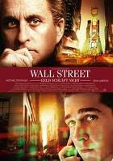

# Wall Street: Again

Oliver Stone has done it again; he somehow managed to add another item
to the list of my favorite Stone movies. Wall Street, Any Given
Sunday, and now, WS Money Never Sleeps.Some things have changed since
Wall Street Part I, and some things haven't. 1987 movie was painting
trader Gordon Gekko as a kind of a gunslinger, a maverick of sorts,
like.. Pick a movie from the era, uh, say..  Top Gun. In Wall Street
instead of fighter pilots, we had traders, instead fighter planes, we
had junk bonds. Gordon Gekko barked buy orders into his phone with the
same intensity as Maverick would yank on the controls of his plane in
a dogfight. But the result was the same; Gekko was in a system, and he
knew how to work it.And this is the point where the first movie starts
diverging from the second; In WS the financial structure, "the system"
was big, all encompassing, and essentially.. working. We liked Gekko
because he could do more than any mortal could do in that system. Bud
Fox was planted in there to be our eyes, he was the regular guy, and
we looked at Gekko through him. We admired that person, wished to be
as ruthless and opportunistic as he (maybe), even if we never could
be. This is why even though Stone tried to paint Gekko as the bad guy,
it never worked, as countless of traders walking up to Michael Douglas
after the movie proves, telling him he was their inspiration.But that
was 1987.

In 2008, it seemed we reached, and surpassed Gekko. He was a
gunslinger in a world of other gunslingers, when you had distant towns
(economies), and less a connected globe. This point is driven home by
Stone at the first scene; Gekko collects his belongings while leaving
prison and one of his old items is a humangus cell phone that looks
more like a brick than a phone. Clearly this technology and its owner
is out of place in today's 24/7, subsecond, Wi-Fi, click-and-buy,
snooze-you-lose silicon world.Today's crooks, if Gekko was ever one,
are way above the system. They not only exploit it, they now run
it. Even when they sink, there is someone to save them; otherwise they
happily spread rumors, falsify records, and trade big. Everything is
just bigger in WS Part II. We don't have gunslingers in this world any
more, we have people showing up to duel at high noon with a fucking
machine gun and a nuclear weapon. It's not fun, not as it used to
be. Not anymore.And Oliver Stone deliveres that message very
well. While doing this, he still manages to give us a new hero through
Gordon Gekko who now doubles as a fortune teller, and through his
predictions we can see how different our new world truly is. On top of
all that, we get a third story with a Bud Fox II, who is tempted by
the semi-evil of a now older Gekko, but this is just the closing of
the same storyline from Part I.

It is a redemption of sorts, and it's very nice to have. We see Bud
Fox 2 to become successful with his green energy plans, and Gekko
become a grandfather, there is hope, and somethings do get better, a
storyline ends. Stone probably figured he had to do that to balance
out the obscenely negative parts of the story which unfortunately
became much, much worse, due to events in real life. But the partial
optimism of Part II has also rings of truth in it; People keep on
living, keep on working. WS II ends on a high note.Job well done.

