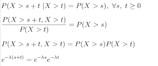

# How long will America last?

Samuel Arbesman
[Web](https://www.tampabay.com/archive/2011/11/13/by-the-numbers-doomed/),
[Paper](https://pdodds.w3.uvm.edu/files/papers/others/2011/arbesman2011a.pdf)

Using a data set of empires that spans over 3,000 years, I wanted to
create a model that could show us, statistically, what the lifetimes
of empires look like. There are many more complex and intricate models
of how civilizations grow and decay, but perhaps something could be
gained by creating a very simple model that looks only at life
span.This data set is expansive, including everything from the
Babylonian Empire of ancient Mesopotomia - known for such
contributions as Hammurabi’s Code - to the Byzantine Empire, which has
provided us with the eponymous word for red tape [..]

But there is a more interesting way to look at it than simply taking
an average. By putting all the life spans together, we can see a
pattern that statisticians call a distribution - the underlying shape
of the "density" of the life spans.

Distributions give us a much better sense than the average because,
just as with incomes, life spans needn’t be distributed like a
bell-shaped curve. They can be skewed towards one end or the other.In
the case of empires, their life spans seem to follow what’s called an
exponential distribution. The exponential distribution is special for
a particular reason: Of all the different types of probability
distribution, it is the only one that is “memoryless.” This means that
if something’s life span adheres to an exponential distribution, the
likelihood of it ending next year - or even tomorrow - is the same no
matter how long it has lasted. It has no “memory.” If something has
lasted for a hundred years, it is no more or less likely to go extinct
next year than something that has only lasted a single decade. This is
quite unlike, for example, human life span, where the older you get,
the more likely you are to die. An empire’s chance of death is the
same each year.Right you areExponential distribution is truly
memoryless.First eqn above states the conditions for such a
distribution, second is after applying the conditional rule, third is
simply rearranging it. The only way Eq #3 can work is with an
exponential distribution as seen in Eqn #4. So average time at a bank
is 10 mins, what is the prob of waiting 15 mins? $exp^{-15*1/10} = 0.223$.
What is the prob of waiting 15 minutes given you waited 10
minutes? It dont matter how long you waited, you simply take remaining
5 mins and ax the distribution, $exp^{-5*1/10} = 0.60$.

Note: The model we referenced is based on exponential distribution
that says an empire's life (time spent) does not effect the
probability of its continued existence. Notice tho the model only
takes into consideration one kind of variable -- time. If you stand on
a street corner and record arrival times of all the cars passing that
corner, and prepare an histogram for these arrival times, you would
see an exponential distribution. But, if you followed that one car,
tried to understand it in terms of variables other than just time,
than maybe you could predict its complete journey, i.e. when it would
pass your street corner, when or if it would get stuck in dead-end,
crash, etc. IOW better models can provide better results. The article
we referenced was interesting, sure, it used a concept from industrial
engineering and it went one step beyond taking an average, which is
truly the simplest thing you can do. But the model is just that -- one
step beyond a simple average.

