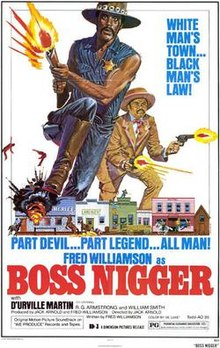

# Blaxploitation

The train of thought started while I was listening to J. J. Johnson's
song Willie Chase (great funk) -- I looked up the song, and started
reading about blaxploitation movies. There are subgenres, and one
subgenre is .. Westerns!  An example is titled (I kid you not) "Boss
Ni...r", released in 1974. Ex-football player Fred Williamson plays a
sheriff, and the movie's slogan: "White Man's Town.. Black Man's Law"
(in blue below).

About the N word; Richard Pryor was using it during 70s, he was both
pissing off some people, but he wasnt really aware that he was... So I
guess the society took some time deciding the issue.

