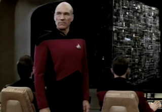

# Resistance Is Futile

It was interesting throughout the run of Star Trek Next Generation
(TNG), when the creators of the show needed an enemy so vicious, so
bad, and so opposite of the Federation, conciously or subconciously
they ended up creating an enemy like the Borg. If TNG was supposed to
be our future, or at least how we thought our future was going to be,
then we perhaps understand ourselves little better by inspecting this
mhytical Federation and its greatest enemy, the Borg.

What were the main features of the TNG universe? Surely Roddenberry
peppered his creation with lots of anti-capitalist messages. There is
no money in TNG universe, there is no poverty, no widespread
disease. Energy is abundant, and manufacturing items are painless. In
a way actually the show had both anti-capitalist and a Third Wave
message. If you can literally create things out of thin air, you do
not have a blue collar workforce, everyone is white collar, the only
thing that remains is knowledge and artistic work. "We only live to
better ourselves now" advertises the Captain in one episode. 

However, past the thin anti-modern, anti-capitalist layer, the
organization of a spaceship is still very hierarchical. The bridge of
Enterprise is very similar to a hierarchical office, 50s style, there
is still the "corner office", literally a place in a corner somewhere
that the captain goes to when he wants to chill. There is still the
senior staff. People take greeeaaat care to use their rank along their
names. Federation has Earth at its center (sector 0-0-1). Starfleet
Headquarters is very centralized, in one episode we find out they can
take out any of their own ships when they want, using codes keps
centrally.

Does this mirror our current state of affairs, or in a way, America
(Roddenberry hailed from there after all). I remember reading
somewhere that US education and workplace is elitist. Some could say
it is meritocratic. Maybe it is both. At US workplaces there is always
this issue of being a "rockstar"; a mix of elitism and meritocracy. It
is something you "attain" at least, not born into, but has this weird
aura of status attached to it. After many years of observing it, I
decided I do not like it. It creates too much pressure on people
involved and actually does not leave much room for error.

Other TNG signs the show saw itself as centralist, modernist,
hierarchical; Before "the big battle" with the Borg, the captain
wonders around in the ship, trying to clear his mind, and starts
confiding in a friend, and says: "I wonder if the emperor Honorious
watching the Visigoths coming over the 7th hill truly realized the
Roman Empire was about to fall". Wait a minute.. All of a sudden the
Federation is Rome, and the Borg are the Visigoth? Hmm.. And when the
Enterprise is attacked by the Borg, "the voice" comes on the
viewscreen and starts bitchslapping everyone saying "your archaic
cultures are authority driven" etc,  and other words to the effect of
"we will kick your ass", and "give up now".

The rest / the conclusion of the story is also interesting. The Borg
captures Captain Pickard, the authority figure, nice move since single
authority figure was the weakness after all, then he is "assimilated"
and he becomes part of the Borg. Our strength / weakness become Borg's
strength. But, of course we had to beat this enemy, and had to feel
good about ourselves at the end (an unwritten Trek rule), so
Enterprise's first officer "Number One" steps up, becomes the new
Captain, takes Pickard back (hence his knowledge of Borg) and beats
the enemy and his old captain. So yes, we are hierarchical, but people
can move up in that hierarchy sooo easily, u see, we are upwordly
mobile, seemed to be the message, in a way "the hierarchy is there but
does not matter" -huh?-. That seemed to be the feel-good
conclusion. We have a little stick up our ass, but we are also
pesky. Agile. Dont f--k with us, alien people.

The more I think about it though, the more I conclude, in Trek
universe that the Borg should have won. They are designed to be bad
looking in a vampire kind of way, turn people into ghosts, but beyond
this dramatization, they are connected through a superfast networking
structure (WiFi in the brain!), and they are highly
decentralized. Their ship looks one of those Google, Facebook server
farm structures with 99.999% uptime, high degree of failover and load
balancing. High local peer-to-peer connectivity, tech empowered
individual also happens to be a main factor of our postmodern age. How
can you beat that?

Looking at the larger trend, it seems dealing with issues around
authority, centralization, decentralization is a major factor of the
sea change present in recent TV shows. Lost went to one extreme, its
people were running around like chicken with their head cut-off, there
was no authority, but no ideas for the future either; they were
literally "lost". Battlestar Galactica authority figures and
characters were all dysfunctional. In Game of Thrones almost all
"rockstar" figures died, and at times quite horribly, by the end of
Season 1. TNG apparently itself went through a generational change
internally. We find out from TNG writer (later BSG creator) Ron Moore
that Roddenberry wanted TNG characters to be "flawless". Younger
writers rebelled, there was lots of friction, and after Roddenberry's
death this generation of writers started getting their way. Hence we
had the Borg, a great tool TNG used to criticize itself while still
maintaining its feel-good attitude.

[1] Of recent creations, it seems Avengers was able to pull off the
rockstar concept, but 1) it needed lots of them 2) we have one tech
augmented, one chemically altered, and a beast in the mix. 3) the big
enemy happens to be a demigod -- the manifestation of the ultimate
rockstar. There is also the mandatory central "bad" figure, the
government, and an tacit acknowledgement of the ridicolousness of the
whole shabang -- "Heroes [read: rockstars].. It is an old fashioned
concept".

[2] None of what we say obviously means individuality and skill should
be deemphasized. What we are suggesting is that the pressure around
being "always on" needs to be lessened, and expectations around what
people can deliver, and when, needs to be readjusted. Especially
undeserving rockstars (almost all them, falling off like flies each
day around us due to the turbulent nature of our age) need to get out
of an individual's way.

