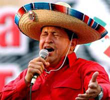

# Narcissist Leninist

He was a character - and we all liked it when he was bitchslapping
Bush II, that's for sure. He apparently read The Third Wave while he
was in jail, and his providing laptops for Venezuelan kids for free
proves that. It wasn't clear however if Chavez grokked the entire
message of 3W, the polemic didn't distinquish between free market and
capitalism, and he never talked about the defunct core that is at the
center of the latter and socialism; his heroes were all the wrong
people. Fidel, Che, etc.

According to MBTI he is listed as an ENFP. And this is interesting -
Che Guevara, Fidel Castro, Muammar Gaddafi are (were) all ENFPs.

Well anyway.. RIP. 
