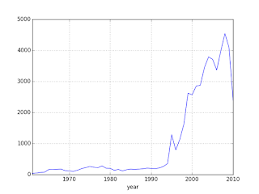

# UFOs

Do UFOs exist? In one case data did not allow easy refutation of a UFO
hypothesis. In most other cases, nothing jumps out that will trigger a
'aha!'. 

<a name='nuforc'></a>

### NUFORC Dataset

This dataset [3] contains over 80,000 reports of UFO sightings over
the last century. Original data from [1]. The scrubbed version is
below, 

[Code](ufo.py)

[Output](ufo-doc.html)

Code filters out sightings before 2010, then downsamples to reduce the
plotted points. 

### US Per State Analysis, Ratio Comparison

In this analysis, per state sightings ratio was compared to state's
population ratio (to US total). A lot of people report a lot of
sightings, but do some states report *more* sightings disproportionate
to their population, indicating something mysterious..? Proportion
ratio z-test was used to determine significance. For significant
states, then calculated per-state sightings midpoint. Also plotted are
known US nuclear missile bases (red circles).

[Code](ufo.py)

[Output](ufo-sig-doc.html)

### The Alaska Triangle

AT is claimed to be a spot where a lot of "abductions" happen.  The
"triangle" corners are Utqiagvik, Anchorage, and Juneau.

```python
u.get_sm().plot_countries(57, -130,zoom=3.0)
dfa = df[df['box'] == 1]; plt.plot(dfa['longitude'],dfa['latitude'],'c.')
dfa = df[df['alaska'] == 1]; plt.plot(dfa['longitude'],dfa['latitude'],'r.')
```


```python
from pygeodesy.sphericalNvector import LatLon
import pandas as pd

alaska = LatLon(71.3523639355, -156.8902618143), # Utqiagvik \
         LatLon(61.2156587607, -149.9961202934), # Anchorage \
         LatLon(58.2841500903, -134.3658221788)  # Juneau

box = LatLon(40.920145037, -157.44286897), LatLon(49.681668976, -119.43107343), LatLon(74.504662641, -112.24847310), LatLon(63.043026402, 173.142850255)

df =  pd.read_csv('/opt/Downloads/ufo/scrubbed.csv')
df['alaska'] = df.apply(lambda x: LatLon(float(x['latitude']),float(x['longitude'])).isenclosedBy(alaska), axis=1).astype(int)
df['box'] = df.apply(lambda x: LatLon(float(x['latitude']),float(x['longitude'])).isenclosedBy(box), axis=1).astype(int)
df = df[df.box == 1]
```

Do these look like have a seperate pattern? The lower left corner of
the triangle is part of the sighting density in that small region,
same is true for lower right. If there is a "triangle" why not a
"rectangle" around 50,-135?

### Sightings Data

One good dataset [2] on UFO reportings, some code for a plot,

```
import pandas as pd, zipfile

with zipfile.ZipFile('ufo.csv.zip', 'r') as z:
   d = pd.read_csv(z.open('ufo.csv'),sep=',',parse_dates=['DateOccurred'])
d = d.sort_index(by=['DateOccurred'])
d = d[pd.isnull(d['DateOccurred']) == False]
dates = d.DateOccurred.astype(str)
dates = dates[dates!='nan']
d['year'] = dates.apply(lambda x: datetime.strptime(x, '%Y-%m-%d').year)
g = d.groupby('year').size()
g[g.index>1960].plot()
```

The plot is for yearly count of UFO reports,



The dataset has UFO reports that go back to 1400s, with long
descriptions of what people said when they reported the event. One
sighting was recorded by a Confederate soldier during the Civil
War. He thought it was a Union balloon but the thing he reported was
moving too fast for a balloon. He must have thought "those damn
Yankies and their tech!". I read all that with a general skepticism;
One hypothesis I had was "UFO sightings increase with scifi becoming
more accessible through media, people project their scifi fantasies
onto the real world". Then the graph should've shown huge increase
after the 60s/70s, it did not. There is a huge increase, but it is
after 1992. What happened that year? Bill Clinton is elected as
President. I don't know. Did the aliens start finding Earth more
interesting because of Bill Clinton?  Weird.

There is a drop at 2008 - well, Barack Obama is elected as
President. Aliens lose interest after this time? ;) I urge readers the
test their own hypothesis'. Some more: Let's say UFO delusion effects
a certain percent of the population, then with more people we'd have
more sightings. Then why is there a fall after 2008?  Or why isn't
there an exponential rise (in parallel to population growth which is
exponential) much earlier than 1992? Or, if UFO sightings are actually
sightings of Air Force weirdo toys mistaken for UFOs, then why is
there a fall during Reagan years? He would've loved to fund that kind
of tech.

References

[1] [NUFORC](https://www.kaggle.com/NUFORC/ufo-sightings)

[2] [UFO](https://drive.google.com/uc?export=view&id=16bC7IoJIE0VDqt2rt9wUW6e4MgLz1Q7w)

[3] [NUFORC](https://drive.google.com/uc?export=view&id=1Jho5cLnKqdwfooY9j_GuEj2tf3oO-LPT)
