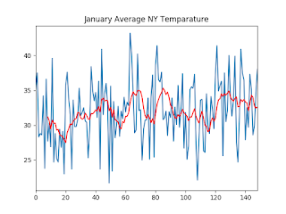

# January Temperatures

"But there is snow, it is really cold in New York, climate change is
not real".

Let's look at the overall trend. Pick January in New York - here is a
[doc](https://www.weather.gov/media/okx/Climate/CentralPark/monthlyannualtemp.pdf)
with data captured since 1879. [Data](nytemp.csv),
[Code](nytemp.html). Result

I see an upward trend.

We did the global one already. 

