# Steve Keen's Macroeconomic Model, Derivation, Code

Based on papers, code seen in the References section below. 

Terms

$\alpha$: productivity growth rate, $\frac{d a}{d t} = \alpha a$

$\beta$: population growth rate, $\frac{d N}{d t} = \beta N$

The level of capital stock K determines the level of output per annum
$Y$ via the accelerator $K = v \cdot Y$

The level of output determines the level of employment $L$ via labor
productivity $a$: $L = Y/a$

$w$: the rate of change of real wages, all wages $W = w \cdot L$.

The employment rate determines the rate of change of real wages

$\dot{w} = \Phi(\lambda) \cdot w$: via Philips curve

$$
\Phi(\lambda) = \frac{\phi_1}{(1-\lambda)^2}-\phi_0
$$

$\omega$: the wage share of the economy $\omega=\frac{w\cdot L}{a
\cdot L} = \frac{w}{a}$

$\Pi = (1-\omega-rd)Y$, Profit share is a residual after workers and
debt repayment (to bankers)

Profit determines investment I, all profits are invested, $I=\Pi$.

Investment minus depreciation determines the rate of change of capital
stock $K$. So $\dot{K} = I - \delta K =\kappa(1 - \omega - rd) Y -
\delta K$:

$\delta K$. $\kappa(x)$ is a nonlinear function such as $\kappa(x) = \kappa_0 + \kappa_1 \exp(\kappa_2 x)$.

$\frac{d D}{d t} = \dot{D} = I - \Pi$: the rate of change of debt
D is investment minus profits (where profits are now net of interest
payments, which equal the interest rate r times the debt level.

Core Definitions

1) The employment rate: the number of people with a job (L) divided by the total
population (N). $\lambda = L/N$.

2) The wages share of output: the total wage bill (W) divided by GDP (Y). 
$\omega = W/Y$.

3) The private debt to GDP ratio: Private Debt (D) divided by GDP (Y). $d =
D/Y$.

Differentiate them with respect to time. Since the definitions are
true by definition, so are these dynamic re-statements of them:

1) The (percentage) employment rate will grow if the (percentage) rate
of real (inflation-adjusted) economic growth exceeds the sum of the
rate of population growth plus the rate of growth of labour
productivity (after log differentiation)

$$\frac{\dot{\omega}}{\omega} = \frac{\dot{W}}{W} - \frac{\dot{Y}}{Y}$$

2) The wages share of output will grow if wage growth exceeds the
growth in labour productivity; and

$$\frac{\dot{d}}{d} = \frac{\dot{D}}{D} - \frac{\dot{Y}}{Y}$$

3) The private debt to GDP ratio will rise if debt rises faster than
the rate of economic growth.

$$\frac{\dot{\lambda}}{\lambda} =  \frac{\dot{L}}{L} - \frac{\dot{N}}{N}$$

Note:

Log differentiation is used a lot, which in general form is,

$$f(x) = \frac{g(x)}{h(x)}$$

$$
\ln (f(x)) = \ln \bigg( \frac{g(x)}{h(x)} \bigg) =  \ln(g(x)) - \ln(f(x)) 
$$

$$\frac{f'(x)}{f(x)} = \frac{g'(x)}{g(x)} - \frac{h'(x)}{h(x)}$$

Moving on, trying to reach an ODE

1)

$$= \frac{\dot{w}}{w} + \frac{\dot{L}}{L} - \frac{\dot{Y}}{Y}$$

$$= \frac{\dot{w}}{w} + \frac{\dot{L}}{L} - \frac{\dot{L}}{L} - \alpha$$

$$\frac{\dot{\omega}}{\omega} = \frac{\dot{w}}{w} - \alpha = \Phi(\lambda)-\alpha$$

2)

$$\dot{D} = I - \Pi = \kappa(1 - \omega - rd) Y - (1-\omega-rd)Y$$

3)

$$
\frac{\dot{D}}{D} = \frac{ \kappa(1 - \omega - rd)}{d} 
- \frac{(1-\omega-rd)}{d}
$$

$$
= \frac{ \kappa(1 - \omega - rd) - (1-\omega-rd) }{d} 
$$

Calculate $\dot{Y}/Y$, bcz $\dot{Y}/Y = \dot{K}/K$

$$
\dot{Y}/Y = \dot{K}/K = \frac{\kappa(1 - \omega - rd) Y - \delta K}{K}
$$

$$
 = \frac{\kappa(1 - \omega - rd) }{v}- \delta 
(1)
$$

$$
\scriptstyle
\frac{\dot{D}}{D} - \frac{\dot{Y}}{Y} =
\frac{ \kappa(1 - \omega - rd) - (1-\omega-rd) }{d} 
- \frac{\kappa(1 - \omega - rd) }{v} + \delta
$$

3)

$$
= \frac{\dot{L}}{L} - \frac{\dot{a}}{a} = \frac{\dot{L}}{L} - \beta
$$

$$Y = L \cdot a$$

$$
\frac{\dot{Y}}{Y} = \frac{\dot{L}}{L} + \frac{\dot{a}}{a}
= \frac{\dot{L}}{L} + \alpha
$$

$$
\frac{\dot{\lambda}}{\lambda} = \frac{\dot{Y}}{Y} - \alpha - \beta
$$

Use (1) $\dot{Y}/Y$

$$
\frac{\dot{\lambda}}{\lambda} = 
\frac{\kappa(1-\omega-rd)}{v} - \alpha - \beta - \delta
$$

So we reach ODE

$$\dot{\omega} = \omega [ \Phi(\lambda)-\alpha ]  (2)$$

$$
\dot{\lambda}=  \lambda \bigg[ 
\frac{\kappa(1-\omega-rd)}{v} - \alpha - \beta - \delta
\bigg]
(3)
$$

$$
\scriptstyle
\dot{d} = d \bigg[
r - \frac{\kappa(1-\omega-rd)}{v} + \alpha 
\bigg] + \kappa(1-\omega-rd) - (1-\omega)
(4)
$$

Some constants, funcs, will be used later

```python
import numpy as np
import matplotlib.pyplot as plt

alpha = 0.025
beta = 0.02
delta = 0.01
v = 3.0
k0 = -0.0065
k1 = np.exp(-5.0)
k2 = 20.0
r = 0.03
phi0 = 0.04 / (1.0-(0.04**2))
phi1 = 0.04**3.0 / (1.0-(0.04**2))

def kappa(x,k0,k1,k2): return k0 + (k1*np.exp(k2*x))

def philips(lam,phi0,phi1): return ( (phi1 / (1.0-lam)**2) - phi0)
```

## Stable points

(0,0,0) economically meaningless. For meaningful pts for (2) set to
zero, $\Phi(\lambda)=\alpha$ or $\lambda=\Phi^{-1}(\alpha)$, we r
looking for inverse so that $\Phi^{-1}(\Phi(\lambda)) = \lambda$, then

$$ \Phi(\lambda) = \alpha = \frac{\phi_1}{(1-\lambda)^2}-\phi_0$$

Rearrange

$$ \alpha + \phi_0 = \frac{\phi_1}{(1-\lambda)^2}$$

$$   (1-\lambda)^2 = \frac{\phi_1}{ \alpha + \phi_0} $$

$$  \lambda^2 - 2\lambda + 1 - \frac{\phi_1}{ \alpha + \phi_0} =0$$

Find roots

```python
res = np.roots([1, -2, 1-(phi1/(alpha+phi0))])
lambda1 = res[1]
print (res)
```

```text
[1.03138824 0.96861176]
```
  
Moving on, set (3) to zero, nontrivial sol, start with

$$ \kappa(1-\omega-rd)= v (\alpha + \beta + \delta)$$ (5)

Inverse

$$\overline{\pi}_1 = 1-\omega-rd= \kappa^{-1}(v (\alpha - \beta - \delta))$$

Very useful, bcz $\overline{\pi}_1$ depends only on constants. Let's calculate

```python
tmp = v*(alpha+beta+delta) - k0
pi1 = 1.0/k2 * np.log(np.abs(tmp/k1))
print ('pi1', pi1)
```

```text
pi1 0.1618413993811929
```

For $\overline{\omega}_1$ rearran (5)

$$d = \frac{1-\overline{\pi}_1-\omega}{r}$$

Plug into (4), 

$$ 
\scriptstyle
0 =  \frac{1-\overline{\pi}_1-\omega}{r} \bigg[
r - \frac{v (\alpha + \beta + \delta)}{v} + \delta
\bigg] + v (\alpha + \beta + \delta)- 1+\omega
$$

$$ 
\scriptstyle
-\omega =  \bigg(\frac{1}{r}-\frac{\overline{\pi}_1}{r}-\frac{\omega}{r}\bigg) \bigg(
r - \alpha - \beta 
\bigg) + v (\alpha + \beta + \delta)- 1
$$

skipping some algebra

$$
\overline{\omega}_1 = \frac{c_1 - c_1\overline{\pi}_1 + rc_2 - r}{c_1 - r}
$$

```python
c1 = r-alpha-beta
c2 = v*(alpha+beta+delta)
omega1 = (c1 - c1*pi1+r*c2-r) / (c1-r)
print (omega1)
```

```text
0.8360528668729358
```

For $d$ take $\overline{\pi}_1$ formula, plug in known vals

$$ \overline{\pi}_1 = 1-\omega-rd => 
d = (1-\overline{\omega}_1 -\overline{\pi}_1) / r
$$

```python
d1 =  (1-omega1-pi1) / r
print (d1)
```

```text
0.07019112486237693
```

Fixed point

```python
fp1 = (lambda1,omega1,d1)
print (np.round(fp1,4))
```

```text
[0.9686 0.8361 0.0702]
```

Solve ODE

```python
import scipy as sp
from scipy.integrate.odepack import odeint

def rhs(u,t,alpha,beta,delta,r,k0,k1,k2,v,phi0,phi1):
    omega, lam, d, a, N = u
    tmp = kappa(1.0-omega-r*d,k0,k1,k2) 
    res = [omega*(philips(lam,phi0,phi1)-alpha), \
           lam*(tmp/v - alpha - beta - delta), \
           d * ( r - tmp/v + alpha ) + tmp - (1.0-omega), \
           alpha*a, \
           beta*N]
    return res
```

First start from values close to fixed point

```python
omega0 = 0.80
lam0 = 0.80
d0 = 0.1
a0 = 0.5
N0 = 300.

t=np.linspace(0.0,300.0,10000)
args = (alpha,beta,delta,r,k0,k1,k2,v,phi0,phi1)
res=odeint(rhs,[omega0, lam0, d0, a0, N0],t,args=args)
omega1, lam1, d1, a1, N1=res[:, 0],res[:, 1],res[:, 2],res[:, 3],res[:, 4]

Y = lam1*N1

plt.figure()
plt.plot(t,omega1)
plt.ylabel('Omega')
plt.savefig('out_01.png')
plt.figure()
plt.plot(t,lam1)
plt.ylabel('Lambda')
plt.savefig('out_02.png')
plt.figure()
plt.plot(t,d1)
plt.ylabel('d')
plt.savefig('out_03.png')
plt.figure()
plt.plot(t,Y)
plt.ylabel('Y')
plt.savefig('out_04.png')
```

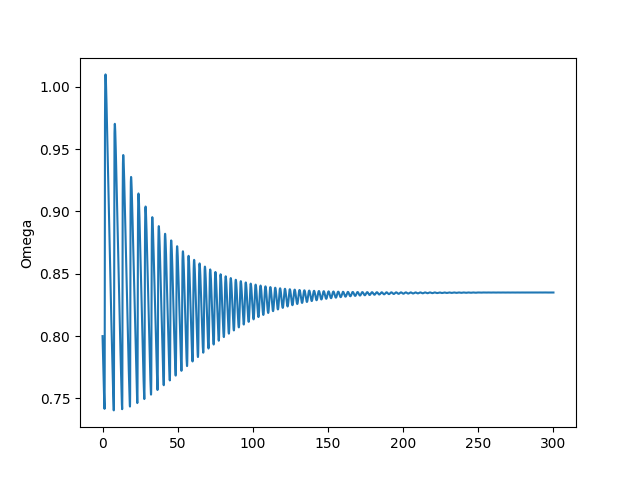

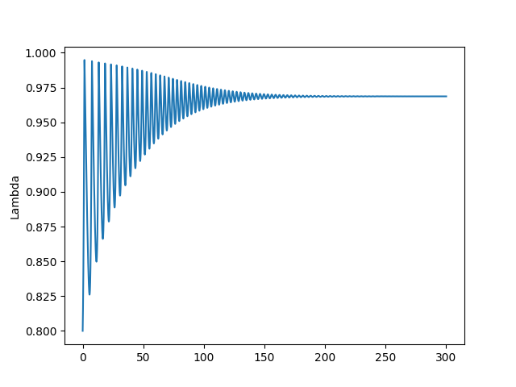

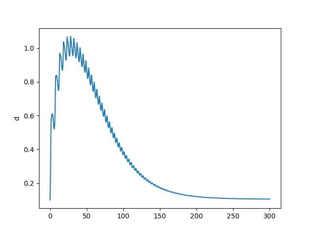

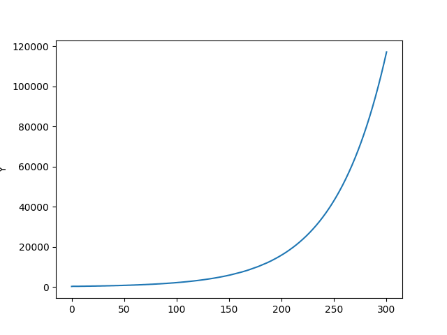


Now try starting little away from the fixed point - graph shows we end
up in purgatory.

```python
omega0 = 0.70
lam0 = 0.70
d0 = 0.1
a0 = 0.5
N0 = 300.

t=np.linspace(0.0,300.0,1000)
args = (alpha,beta,delta,r,k0,k1,k2,v,phi0,phi1)
res=odeint(rhs,[omega0, lam0, d0, a0, N0],t,args=args)
omega2, lam2, d2, a2, N2=res[:, 0],res[:, 1],res[:, 2],res[:, 3],res[:, 4]

Y = lam2*N2

plt.figure()
plt.plot(t,omega2)
plt.ylabel('Omega')
plt.savefig('out_05.png')
plt.figure()
plt.plot(t,lam2)
plt.ylabel('Lambda')
plt.savefig('out_06.png')
plt.figure()
plt.plot(t,d2)
plt.ylabel('d')
plt.savefig('out_07.png')
plt.figure()
plt.plot(t,Y)
plt.ylabel('Y')
plt.savefig('out_08.png')
```

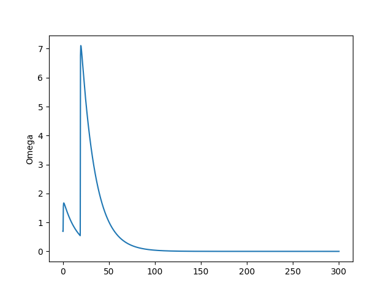

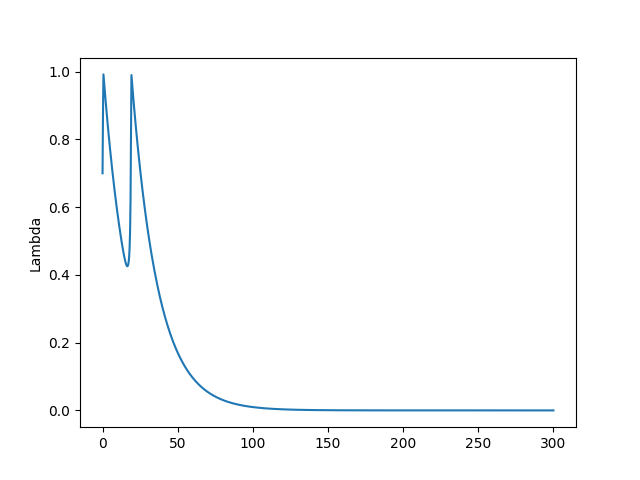

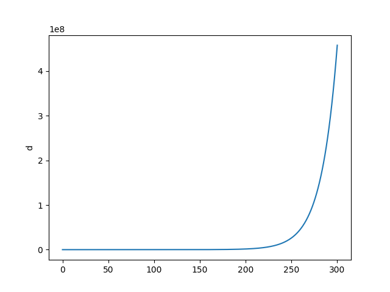

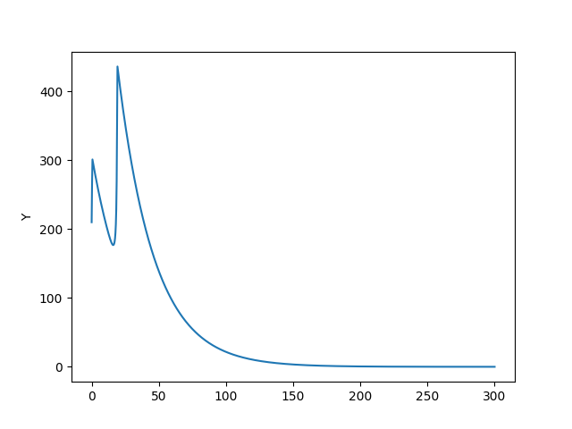


<hr/>

Inflation [3,4]

$g$ is the real growth rate, which is determined by the rate of investment
and depreciation, $I_{fn}$ is non-linear investment function,

$$ g = \frac{I_{fn}(\pi_r)}{v} - \delta_{Kr} $$

$$ 
\frac{\dot{\lambda}}{\lambda} =
\left( 
  \underbrace{ g }_{A} - 
  \underbrace{ (\alpha + \beta) }_{B}
\right)
$$

A: Growth Rate

B: Labor productivity and population growth

"Employment rises if the growth rate exceeds population growth and labor productivity."

$$ 
\frac{\dot{\omega}}{\omega} = 
\left( 
(\underbrace{w_{fn}(\lambda)}_{A} - \underbrace{\alpha}_{B}) + \frac{1}{\tau_p}
\underbrace{\left( 1-\frac{1}{1-s} \cdot \omega \right)}_{C}
\right)
$$

A: Wage share 

B: Labor productivity

C: Inflation

"Wage share rises if money wage demands greater than labor productivity and
the inflation rate"

$$
\scriptstyle
\frac{\dot{d}}{d} = 
\underbrace{\frac{\left( \frac{I_{fn}(\pi_r)}{v} \right) - \pi_s }{d}}_{A} - 
\left[ 
\underbrace{g }_{B}+ 
\underbrace{\frac{1}{\tau_p} \left(1 - \frac{1}{1-s} \omega\right)}_{C}
\right]
$$

A: Debt growth rate

B: Real growth rate

C: Inflation

"Debt ratio will rise if debt growth rate is greater than real growth rate plus inlation"

For price level we look into supply/demand in equilibrium. The
derivative of $P$ according to time is inflation, change in price
level. Production $Q$ equals physical demand $D$. $Q = a \cdot L$,
productivity times labor. For $L$ we divide wage money flow with indiv
wage.

$$ 
L = (1-s) \frac{F_D / \tau_s}{W}
$$

$F_D/\tau_s$ is GDP, $F_D$ is company's money, $\tau_s$ is the turnover of
that money, multiply that by $1-s$ to find worker's share. Divide that by
unit wage $W$, we find labor force. Then production is 

$$ Q = a \cdot (1-s) \frac{F_D / \tau_s}{W} $$

Physical demand is money flow towards demand divided by price level,
expenditure divided by $P$, so $(F_D / \tau_s) / P$. There is no $1-s$ now,
labor and corp demand added. 

Equate $D$ and $Q$ and solve for $P$, 

$$  a \cdot (1-s) \frac{F_D / \tau_s}{W} = \frac{(F_D / \tau_s)}{P} $$

$F_D,\tau_s$ cancels out, rearrange,

$$ P = \frac{1}{1-s} \frac{W}{a}$$

This is price level in equilibrium, we need a dynamic version, first-order
approx. converging to RHS above,

$$ 
\frac{d P}{d t} = 
\frac{-1}{\tau_p} \left( P - \frac{1}{1-s} \frac{W}{a} \right)
$$

$\tau_p$ might be familiar from ODE's, ex, 

$$ \frac{d x}{d t} = k(10-x)$$

is solved by $x = 10 - C e^{-kt}$, $k$ controls convergence. $t=0,x=0$
gives $C=10$,  $x = 10 (1 - e^{-kt})$. In general

$$ x = x_{max} (1-e^{-t/\tau}) $$ 

For $t=\tau,x_{max}=1$ we get  $1-e^{-1}$

```python
print (1-np.exp(-1))
```

```text
0.6321205588285577
```

$\tau$ could be seen as approximately how many time steps it takes to
reach 63\% of the target val.

Final equations

$$ 
\frac{\dot{\lambda}}{\lambda} =
  g - (\alpha + \beta)
$$

$$ 
\frac{\dot{\omega}}{\omega} = 
\left( 
(w_{fn}(\lambda) - \alpha) + \frac{1}{\tau_p} \left( 1-\frac{1}{1-s} \cdot \omega\right)
\right)
$$

$$ 
\frac{\dot{d}}{d} = 
\frac{\left( \frac{I_{fn}(\pi_r)}{v} \right) - \pi_s }{d} - 
\left[ 
g + \frac{1}{\tau_p} \left(1 - \frac{1}{1-s} \omega\right)
\right]
$$

$$ g = \frac{I_{fn}(\pi_r)}{v} - \delta_{Kr} $$

Compute,

```python
import scipy as sp
from scipy.integrate.odepack import odeint

def rhs(u,t,alpha, beta, delta, nu, r_b, s, tau_p, tau_i, x_i, y_i, s_i, m_i, x_w, y_w, s_w, m_w):
    lam, omega, d, i = u
    r=r_b;
    if i>0: r=r+i; 
    p=1.0-omega-r*d;
    f=-(1.0/tau_p)*(1.0-omega/(1.0-s));
    I=(y_i-m_i)*np.exp(s_i*((p/nu)-x_i)/(y_i-m_i))+m_i;
    W=(y_w-m_w)*np.exp(s_w*(lam-x_w)/(y_w-m_w))+m_w;
    return [( ((1.0/nu)*I-delta) -(alpha + beta) )*lam, \
            ( W - (alpha+f) )*omega, \
            ( I-p ) -( (1/nu)*I - delta + f )*d,\
            -(1.0/tau_i)*(i-f)]
    

alpha=0.025;     
beta=0.015;      
delta=0.07;      
nu=3.0;
r_b=0.04;        
s=0.3;
tau_p=1.0;
tau_i=0.5;
x_i=0.03;
y_i=0.03;
s_i=2.25;
m_i=0;
x_w=0.6;
y_w=0.0;
s_w=1.0;
m_w=-0.04;

# initial values
lambda0=0.65; # employment
omega0=0.82; # wage share of gdp
d0=0.5; # debt
i0=0.1; # inflation

arg0 = (alpha, beta, delta, nu, r_b, s, tau_p, tau_i, x_i, y_i, s_i, m_i, x_w, y_w, s_w, m_w)

T=80.0
t=np.linspace(0.0,T,1000)

res=odeint(rhs,[lambda0, omega0, d0, i0],t,args=arg0)
lambda1,omega1,d1,i1=res[:, 0],res[:, 1],res[:, 2],res[:, 3]
```

```python
plt.plot(t, 100.0*i1)
plt.xlabel(u'Year')
plt.ylabel(u'Annual Inflation')
plt.savefig('inf_01.png')
```

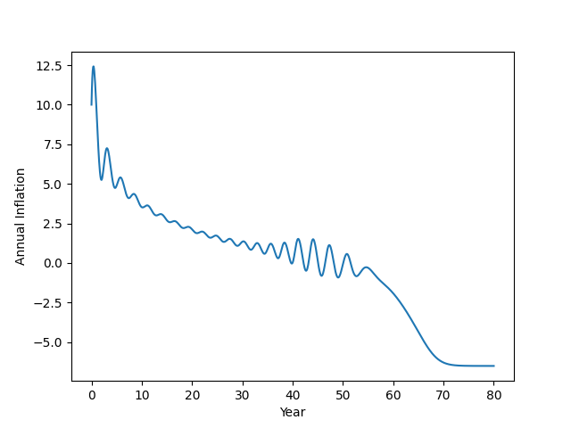

```python
plt.plot(t, 100.0*d1)
plt.xlabel(u'Time')
plt.ylabel(u'Debt to GDP')
plt.savefig('inf_02.png')
```

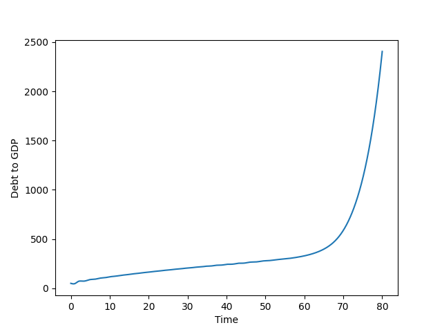

```python
last=500;
x1=100.0*(1.0-lambda1[:last]);
x2=100.0*i1[:last];
x3=100.0*d1[:last];

from mpl_toolkits.mplot3d import Axes3D
from matplotlib import cm
fig = plt.figure()
ax = Axes3D(fig)
ax.plot(x1,x2,x3,'.')
ax.set_xlabel(u'Unemployment Rate')
ax.set_ylabel(u'Inflation')
ax.set_zlabel(u'Debt')
ax.view_init(elev=5, azim=250)
plt.savefig('inf_03.png')
```

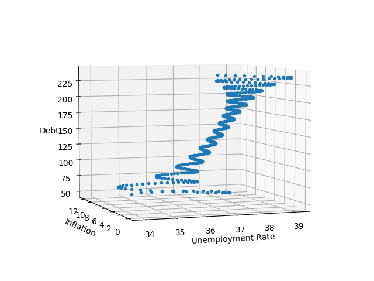

References

[1] Keen, On Macroeconomic modelling, http://www.profstevekeen.com/crisis/models

[2] <a href="https://ms.mcmaster.ca/~grasselli/GrasselliCostaLima_MAFE_online.pdf">Grasselli</a>, An analysis of the Keen model for credit expansion, asset price bubbles and financial fragility, 

[3] Keen, A monetary Minsky model of the Great Moderation and the Great Recession

[4] Keen, Greenwich-Kingston PhD students lecture: the logic  maths of modelling Minsky (2), http://youtu.be/0Do05hV_Iqo?t=1200

[5] Octave [Code](minsky-keen-octave.zip) (based on [this](https://warwick.ac.uk/fac/soc/economics/current/modules/rm/notes1/research_methods_matlab_3.pdf) link).


