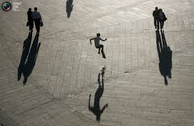

# Quantum Theory as a Theory of Shadows

It seems like Cop QM people developed "a theory of shadows". What do I
mean by that? Let's imagine for a moment weird dimensional aliens
discover us from afar, and start observing us with a telescope. But
let's also imagine that all they can see is our shadows, nothing else,
and they have no concept of 3D people, etc.

If you wanted to model people based on this data, you could model
movement perhaps, the base of the shadow moves like a person after
all, but anything about shape, orientation would be grossly
distorted. Shadows can grow while walking depending on the position of
the light, I can imagine an alien scientist going "these people can
change shape while moving!", going agog the way we are shocked
thinking an electron goes through both slits in a double-slit
experiment. If they saw someone's shadow [on a
wall](https://muratk3n.github.io/thirdwave/en/2019/08/shadowwall.jpg),
they'd be like "they can bend themselves to an amazing degree!".  Or
they see football players on the field who can "multiply themselves"
(due to powerful light coming from many different directions). 

This is IMO what orthodox quantum mechanics is doing right now. They
modeled the data exactly, as they saw it, and in so doing, developed a
theory of shadows. The mechanism behind those shadows are yet to be
discovered.

