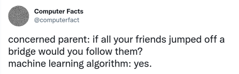

# AI Collated Comments

<iframe width="340" src="https://www.youtube.com/embed/ro130m-f_yk?start=1&end=1083" title="A.I. is B.S." frameborder="0" allow="accelerometer; autoplay; clipboard-write; encrypted-media; gyroscope; picture-in-picture; web-share" allowfullscreen></iframe>

[On the Dangers of Stochastic Parrots](https://dl.acm.org/doi/pdf/10.1145/3442188.3445922)

[One] category of risk involves bad actors taking advantage of the
ability of large [neural-net based language models -LM-]s to produce
large quantities of seemingly coherent texts on specific topics on
demand in cases where those deploying the LM have no investment in the
truth of the generated text. These include prosaic cases, such as
services set up to ‘automatically’ write term papers or interact on
social media..

Yet another risk connected to seeming coherence and fluency involves
machine translation (MT) and the way that increased fluency of MT
output changes the perceived adequacy of that output. This differs
somewhat from the cases above in that there was an initial human
communicative intent, by the author of the source language
text. However, MT systems can (and frequently do) produce output that
is inaccurate yet both fluent and (again, seemingly) coherent in its
own right to a consumer who either doesn’t see the source text or
cannot understand the source text on their own”

"Debunking the great AI lie - Noam Chomsky, Gary Marcus, Jeremy Kahn"

[[-]](https://youtu.be/PBdZi_JtV4c?t=169)

[Paper](https://arxiv.org/abs/2210.12889)

Machine intelligence is increasingly being linked to claims about
sentience, language processing, and an ability to comprehend and
transform natural language into a range of stimuli. We systematically
analyze the ability of [an "AI" NLP system] DALL·E 2 to capture 8
grammatical phenomena pertaining to compositionality that are widely
discussed in linguistics and pervasive in human language: binding
principles and coreference, passives, word order, coordination,
comparatives, negation, ellipsis, and structural ambiguity. Whereas
young children routinely master these phenomena, learning systematic
mappings between syntax and semantics, DALL·E 2 is unable to reliably
infer meanings that are consistent with the syntax of the prompts

[Stochastic Parrots](https://towardsdatascience.com/yet-another-largest-neural-network-but-why-f48d231972a9)

"It has happened again. Microsoft and Nvidia have built [NN] three
times the size of GPT-3, the former holder of the title. However, in
contrast with GPT-3, this new model hasn’t caused any commotion,
neither in the press nor in the AI community. And there’s a reason for
that...

Do we really need yet another biggest neural network?.. What are the
consequences of following the path of scaling models ad infinitum —
for the AI community in particular, and the world in general? Wouldn’t
it be better if we gave more space to other approaches to AI and
artificial general intelligence (AGI)?..

[NN based Large language model] LLMs have been recently entitled
'foundation models' by dozens of Stanford researchers. They argue that
these ever-larger neural networks comprise “an emerging paradigm for
building artificial intelligence systems.” But not all AI experts
agree with this fancy title.

Jitendra Malik, a professor of computer science at Berkeley says that
'the term ‘foundation’ is horribly wrong.' Adding, 'The language we
have in these models is not grounded, there is this fakeness, there is
no real understanding.' Mark Riedl, a professor at the Georgia Tech
School said on Twitter that “branding very large pre-trained neural
language models as 'foundation' models is a brilliant .. PR stunt.”..

But 'foundation models' isn’t the only title the AI community has
given to LLMs. In a paper dating March 2021 Emily M. Bender, Timnit
Gebru, and others called these models 'stochastic parrots.'"

[Article](https://boingboing.net/2017/11/24/brute-force-vs-comprehension.html)

AlphaGo Zero shows that corporate R&D has starved basic research in
favor of safe bets and tinkering at the margins. Deepmind's AlphaGo
Zero — which taught itself to play a remarkable game of Go in just 72
hours — is an ironic poster child for this phenomenon. AlphaGo is part
of a long-term shift in AI research from generating machine
comprehension to "machine learning" that is just a fancy form of
statistical analysis, a brute-force approach that relies on ingesting
lots of human decisions and making statistical observations that can
be used as predictions about the future

[Article](https://hackaday.com/2021/08/02/github-copilot-and-the-unfulfilled-promises-of-an-artificial-intelligence-future/)

"Despite the hopeful attitude during the 1950s and 1960s, it was soon
acknowledged that Artificial Intelligence was a much harder problem
than initially assumed. Today, AI capable of thinking like a human is
referred to as artificial general intelligence (AGI) and still firmly
the realm of science-fiction. Much of what we call ‘AI’ today is in
fact artificial narrow intelligence (ANI, or Narrow AI)"

Andrew Ng, Wired

Andrew Ng builds [ML] systems for a living. He taught.. at Stanford,
built .. at Google, and then moved to the Chinese search engine giant,
Baidu, to continue his work at the forefront of applying artificial
intelligence to real-world problems [..].

“For those of us shipping AI technology, working to build these 
technologies now,” he told me, wearily, yesterday, “I don’t see any 
realistic path from the stuff we work on today—which is amazing and 
creating tons of value— [..] for the software [..] to turn evil.”

The bigger worry, he noted, was the effect that increasingly smart 
machines might have on the job market, displacing workers in all kinds 
of fields much faster than even industrialization displaced agricultural
workers or automation displaced factory workers...

There’s been a lot of fear about the future of artificial
intelligence. [Some] worry that AI-powered computers might one day
become uncontrollable super-intelligent demons [..] But Baidu chief
scientist Andrew Ng—one of the world’s best-known AI researchers and a
guy who’s building out what is likely one of the world’s largest
applied AI projects—says we really ought to worry more about robot
truck drivers than the Terminator.

[Melanie Mitchell](https://www.youtube.com/watch?v=4QBvSVYotVc&feature=youtu.be&t=1897)

One of the big problems I see is that, over the years, we've seen not only
the periodic collapse and growth of AI, but also the collapse of the *science*
of AI - the collapse of AI as a science. Eric Horvitz who is the head of
Microsoft Research said what he thinks ML is is not a science but a kind of
alchemy, that is, try stuff, see if it works on the benchmark datasets, if it
does you are good. End of story.

A lot of this comes from money; I heard the following comment at a conference,
alchemy brings in a lot of money. Harry Shum is the head of AI products at
Microsoft, he said "if a kid knows how to train five layers of neural networks,
the kid can demand five figures. If the kid knows how to train fifty layers, the
kid can demand seven figures".

This is what all my graduate students are doing now. They are tuning parameters
on neural networks, and they are not doing science, but getting seven figures. But
I think that's been very harmful for science.

[Data, Data](https://towardsdatascience.com/5-reasons-why-i-left-the-ai-industry-2c88ea183cdd)

"If you work in AI you are most likely collecting data, cleaning
data..  evaluating with data. Data, data, data. All for a model to
say: It’s a cat. The marketing power of AI is such that many companies
use it without knowing why. Everyone wanted to get on the AI
bandwagon. I liked the magical world AI promised and I’ve found a
shadow of what could’ve been [he quit since]. We’re not even aiming at
creating general intelligence anymore. We’ve settled for stupid
software that knows how to do extremely specific tasks very well"

Alive

The reason AI come alive story is used more in movies these days is
not bcz Holywood necessarily knows what the phuck is going on on the
tech side.. They are basically repurposing the Pinoccio story for a
new domain. The "inanimate object coming alive" angle.. that's
all. Pinoccio for the good side, [Frankenstein](../../2020/07/robot-frankenstein.html)
for the bad. Old story adapted to something new, wout any change in semantics.

Storyline preference becomes clear around the issue of identity. They
usually portray AI as a unique, non-copyable thing... When it is
sent somewhere it ceases to exist at the source. Why? That's not how
software works!

Spoon

Cld say around topics which under weak AI category (speech recog,
computer vision -basic pattern recognition-) some milesones were
reached, sure. Such tech could be used in negative ways, of course,
but factory automation has been killing people for centuries now. Any
tool can have adverse effects. A spoon could kill you. If you fall on
it certain way, it is standing pointing up, on the ground.. That's not
what the phuckers are talking about. Phuckers are all about strong AI,
singularity. That is the big delusion.

TIME article

"Independent of whether you believe progress is slowing or not,
increases in the speed and performance of computers do not necessarily
imply that we will attain strong AI soon"

Memes

[Peter Parker](../../mbl/2021/twimg/E4dN9xbVgA46Bz5.jpg)

[[Up]](ai.html)
