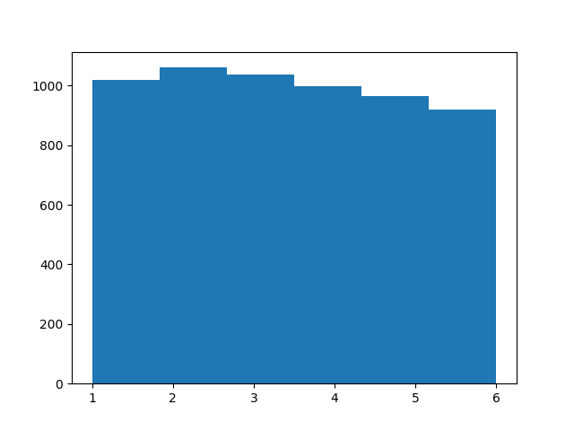
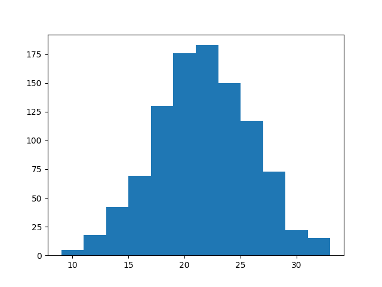

# Crowd Wisdom

[Link](https://en.wikipedia.org/wiki/Wisdom_of_the_crowd)

"At a country fair .. 800 people participated in a contest to estimate
the weight of a slaughtered and dressed ox. Statistician Francis
Galton observed that the median guess, 1207 pounds, was accurate
within 1% of the true weight of 1198 pound". It sounds magical, a
group of people seemingly throwing out numbers, and their average is
close to the true measurement. How?

Humans already have built-in knowledge about the visual-look-weight
connection on many items, so their guesses will be already close
enough to the real thing, with *plus noise*. That noise is the key
part. The distribution of that noise is bell-shaped (Gaussian), white
noise is Gaussian with zero mean. This is important, while averaging,
we also take the average of white noise, whose mean is zero. The noise
disappears, we are left with a good estimate.

This technique even works internally sometimes, it is called "the
wisdom of the crowd within". "[Researchers] asked participants for
point estimates of continuous quantities associated with general world
knowledge, such as '[w]hat percentage of the world's airports are in
the United States?' [then] half of the participants were immediately
asked to make a second, different guess in response to the same
question [..t]he average of a participant's two guesses was more
accurate than either individual guess"

We need to stress however, for standard normal noise to exist, the
base has to be a domain where guessors have an expertise. That is the
only way guesses are close to reality, and there is no bias one way or
another.

"Can we use the same idea for policy, like millions making policy, direct democracy?"

In most policy issues regular people have no expertise. For judging
the weight of something, we already have perhaps inborn, at the very
least life-long experience there... During our lives we have handled,
touched, carried things, so looking at an object we can make weight
guesses. The estimate will have noise but it won't be far off from the
truth which can be corrected statistically. Policy is not something
people are engaged in daily. Which makes it a speciality.

But averaging among specialists will work.

<a name='average'></a>

The Mechanism of Averaging

Normal distribution is odd; it shows up everywhere. Take a group of
ppl, their height dist is normal. Have someone shoot at a target,
measure distance from each hit to bulls eye, dist is normal. Whenever
many factors *contribute* to a thing, normality occurs.. bcz sums of
anything (random) approaches normal. And there are many things like
that in nature.

Throw a 6-sided die 1000 times (numbers below are from software
generator), histogram rolls,

```python
import random
n = 1000; b = 6
rolls = [random.randint(1,6) for i in range(b*n)]
rolls = np.array(rolls)
plt.hist(rolls,bins=6)
plt.savefig('dice2.png')
```



Nearly uniform (not normal), all equal chance,

But if I sum every 6 die throws and histogram,

```python
rolls = [random.randint(1,6) for i in range(b*n)]
rolls = np.array(rolls).reshape(n,b)
s = np.sum(rolls,axis=1)
plt.hist(s,bins=12)
plt.savefig('dice1.png')
```



Bell shaped. Normal.

Why? Bcz more sums result in a 6 than 2. I can get 6 with
4+2,2+4,1+5,3+3,etc.. More chance to hit it. Very low, very high nums
are harder. Easy sums form the bulk in the middle.

Height frequency is normal.. many factors contribute to height. Some
ppl might have a fat ass, small back, others large back, skinny
ass. Large or small head.. All cld lead to same height.

Note that both shooting, and weight guessing involves knowledge /
skill. Good "standard" noise around bullseye means person knows how to
shoot.  Judging weight by naked eye we have skill in through
evolution, and part of growing up. Stat ppl know this, when they apply
a model to data, they determine whether "the fit" is good by looking
at its mistake, its "residual" (diff between model prediction, and
real data). If resid is gaussian, that's a good sign. Bad models leave
patterns in data. When unskilled (or dumb) people screw up you know
why. There is pattern in their muck ups (usually due to some bias).

