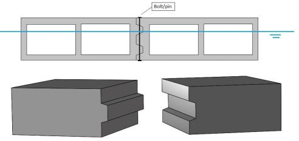
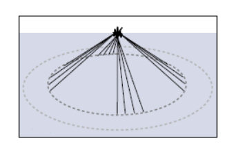
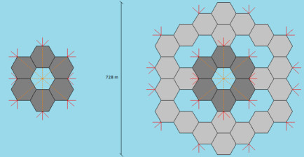

# Floating City Design

Kelvin Ko

Master's Thesis, Technical University of Delft Hydraulic Engineering
Program

[PDF](http://resolver.tudelft.nl/uuid:cb4bddef-1eb8-49ec-9ff9-670a30dd4b72)

A design of the floating city is chosen in the form of modular
hexagonal shaped platforms. The design with the hexagonal shaped
platforms is very straightforward and the growth of this floating
community is simply achieved by adding more platforms in all ways
possible. Hexagonal shaped platforms are symmetric from all sides, so
it is easier to configure the floating community in different ways
without worrying about whether the platforms are going to fit to each
other. Also, the more sides the platform has, the more sides there are
to build houses near the water which is a plus for the criterion of
water experience. A hexagonal shaped platform with sides of 60 m is
the optimal size. The starting floating community consists of 60
platforms each with an area of 9353 m 2 to accommodate 15000
inhabitants in total...

Because of the large surface area of the platform ...  the platform is
statically very stable. The moment due to buoyancy is far greater than
the other moments because of the large metacentric height.  The
platform will quickly restore itself to its initial position when it
is forced in tilting. Even in extreme cases; like hurricanes and when
the high rise building is placed near the edge of the platform
(eccentric load), the platform still remains statically stable. There
is no absolute value of the maximum building height one can place on
the platform. It always depends on the shape and dimensions of the
platform and the building. In this case, for a hexagonal platform with
sides of 60 m, the maximum acceptable building height would be 120 m

Mooring

The taut-leg mooring system is chosen because this system handles both
horizontal and vertical forces well. And on a significant scale, the
taut-leg mooring system uses less mooring line per meter which reduces
the costs a bit. And as the floating city is not permitted to displace
during use, a spread mooring system is preferred. ...

In the offshore engineering, most floating platforms/vessels are
moored with 12 mooring lines if the spread mooring system is applied,
see Figure 79. But this applies to only one floating
platform/vessel. It would require too much mooring lines if each
single platform in the floating city has 12 mooring lines. ...

As the mooring lines of one platform also have effect for the adjacent
platforms, it can be opted to apply less mooring lines per
platform. The 12 mooring lines that are applied to one platform in the
offshore engineering can likewise be applied to a set of coupled
platforms. The difference is that a set of coupled platforms are
larger in dimension compared to a single floating platform/vessel in
the offshore engineering, so there are more mooring lines needed to
withstand the larger loads and displacements.

