# Economy, Calculations, Data

```python
import impl as u
import pandas as pd
pd.set_option('display.max_columns', None)
```

<a name='gdp'></a>

## GDP

GDP calc seen below is computed as annualized quarterly growth rate,
quarter growth compared to previous quarter,
[annualized](https://www.fool.com/knowledge-center/how-to-calculate-the-annual-growth-rate-for-real-g.aspx).


```python
df = u.get_fred(1945,'GDPC1')
df['growann'] = (  (  (1+df.pct_change())**4  )-1.0  )*100.0
print (df['growann'].tail(5))
```

```text
DATE
2024-07-01    3.340153
2024-10-01    1.852227
2025-01-01   -0.648483
2025-04-01    3.838033
2025-07-01    4.375396
Name: growann, dtype: float64
```

```python
df = u.get_fred(1970,'GDPC1')
df['gdpyoy'] = (df.GDPC1 - df.GDPC1.shift(4)) / df.GDPC1.shift(4) * 100.0
df = u.get_fred(1970,'CPIAUCNS')
df['inf'] = (df.CPIAUCNS - df.CPIAUCNS.shift(12)) / df.CPIAUCNS.shift(12) * 100.0
df['inf'] = df['inf'].interpolate()
print (df[['inf']].tail(6))            
```

```text
              gdpyoy
DATE                
2024-04-01  3.126632
2024-07-01  2.791390
2024-10-01  2.399788
2025-01-01  2.019273
2025-04-01  2.080467
2025-07-01  2.335168
                 inf
DATE                
2025-07-01  2.704902
2025-08-01  2.916174
2025-09-01  3.012677
2025-10-01  2.873881
2025-11-01  2.735084
2025-12-01  2.677081
```

<a name='taylor'></a>

## Wages and Unemployment

<a name='quits'></a>

Job Quits, Resignations

```python
df = u.get_fred(2010,['JTSQUR'])
print (df.JTSQUR.tail(5))
df.JTSQUR.plot()
plt.axvspan('01-09-1990', '01-07-1991', color='y', alpha=0.5, lw=0)
plt.axvspan('01-03-2001', '27-10-2001', color='y', alpha=0.5, lw=0)
plt.axvspan('22-12-2007', '09-05-2009', color='y', alpha=0.5, lw=0)
plt.title('Resignations')
plt.savefig('quits.png')
```

```text
DATE
2025-07-01    2.0
2025-08-01    1.9
2025-09-01    2.0
2025-10-01    1.9
2025-11-01    2.0
Name: JTSQUR, dtype: float64
```

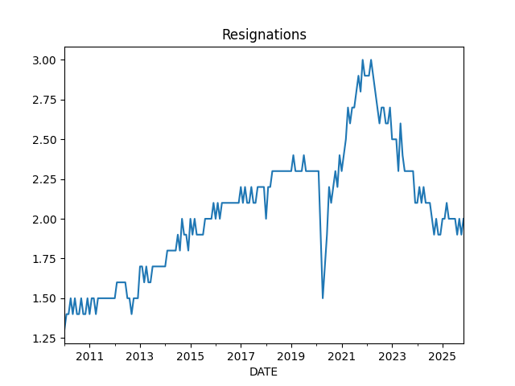

<a name='wages'></a>

Wages

```python
df3 = u.get_fred(1950,['ECIWAG'])
df3 = df3.dropna()
df3['ECIWAG2'] = df3.shift(4).ECIWAG
df3['wagegrowth'] = (df3.ECIWAG-df3.ECIWAG2) / df3.ECIWAG2 * 100.
print (df3['wagegrowth'].tail(4))
df3['wagegrowth'].plot(title='Wage Growth')
plt.savefig('wages.png')
```

```text
DATE
2024-10-01    3.710462
2025-01-01    3.369434
2025-04-01    3.559666
2025-07-01    3.584369
Name: wagegrowth, dtype: float64
```

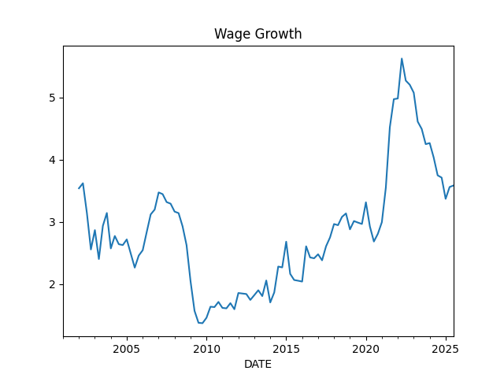

<a name='wagepayroll'></a>

Difference Between Wage Growth YoY and Total Payrolls, see [5]

```python
df = u.get_fred(1986,['PAYEMS','AHETPI'])
df['nfpyoy'] = (df.PAYEMS - df.PAYEMS.shift(12)) / df.PAYEMS.shift(12) * 100.0
df['wageyoy'] = (df.AHETPI - df.AHETPI.shift(12)) / df.AHETPI.shift(12) * 100.0
df[['wageyoy','nfpyoy']].plot()
plt.axvspan('01-09-1990', '01-07-1991', color='y', alpha=0.5, lw=0)
plt.axvspan('01-03-2001', '27-10-2001', color='y', alpha=0.5, lw=0)
plt.axvspan('22-12-2007', '09-05-2009', color='y', alpha=0.5, lw=0)
plt.axvspan('03-01-2020', '09-01-2020', color='y', alpha=0.5, lw=0)
plt.title('Wage Growth YoY and Total Payrolls')
print (df['wageyoy'].tail(5))
print (df['nfpyoy'].tail(5))
plt.savefig('pay-wage.png')
```

```text
DATE
2025-08-01    3.898249
2025-09-01    3.752469
2025-10-01    3.706133
2025-11-01    3.760628
2025-12-01    3.553962
Name: wageyoy, dtype: float64
DATE
2025-08-01    0.892620
2025-09-01    0.807888
2025-10-01    0.670632
2025-11-01    0.540288
2025-12-01    0.367430
Name: nfpyoy, dtype: float64
```

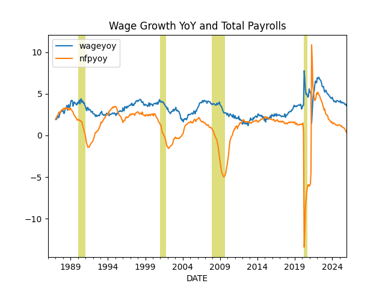

<a name='compprof'></a>

Compensation and Profits Comparison [5]

1) US Employee Compensation as a % of GVA of Domestic Corporations 

2) US Corporate Profits as a % of GDP

```python
df = u.get_fred(1965, ['A442RC1A027NBEA','A451RC1Q027SBEA','CP','GDP']).interpolate()
df['profgdp'] = (df.CP / df.GDP)*100.0
df['compgva'] = (df.A442RC1A027NBEA / df.A451RC1Q027SBEA)*100.0
u.two_plot(df, 'profgdp','compgva')
print (df[['profgdp','compgva']].tail(5))
plt.axvspan('01-12-1969', '01-11-1970', color='y', alpha=0.5, lw=0)
plt.axvspan('01-11-1973', '01-03-1975', color='y', alpha=0.5, lw=0)
plt.axvspan('01-01-1980', '01-11-1982', color='y', alpha=0.5, lw=0)
plt.axvspan('01-09-1990', '01-07-1991', color='y', alpha=0.5, lw=0)
plt.axvspan('01-03-2001', '27-10-2001', color='y', alpha=0.5, lw=0)
plt.axvspan('22-12-2007', '09-05-2009', color='y', alpha=0.5, lw=0)
plt.savefig('compprof.png')
```

```text
              profgdp    compgva
DATE                            
2024-07-01  11.669942  55.635119
2024-10-01  12.370285  54.699962
2025-01-01  11.103680  54.156237
2025-04-01  11.008092  53.442139
2025-07-01  11.548463  52.437017
```

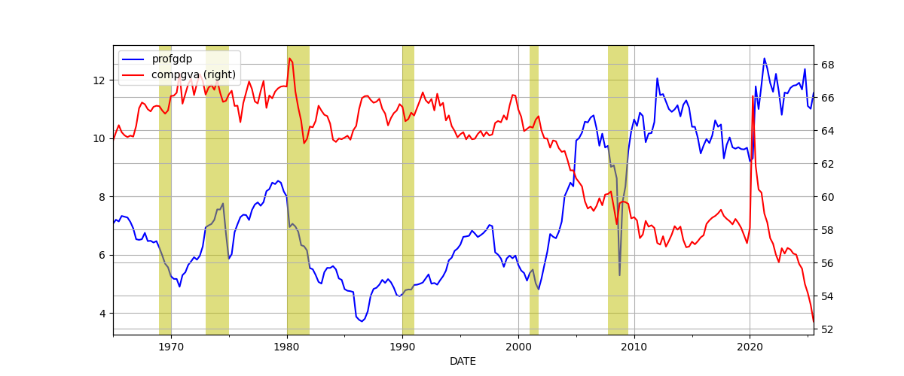

<a name='unempl'></a>

Unemployment

Calculation is based on [2]

```python
cols = ['LNS12032194','UNEMPLOY','NILFWJN','LNS12600000','CLF16OV','UNRATE','U6RATE']
df = u.get_fred(1986,cols)
df['REAL_UNEMP_LEVEL'] = df.LNS12032194*0.5 + df.UNEMPLOY + df.NILFWJN
df['REAL_UNRATE'] = (df.REAL_UNEMP_LEVEL / df.CLF16OV) * 100.0
pd.set_option('display.max_columns', None)
df1 = df.loc[df.index > '2005-01-01']
df1 = df1.interpolate()
df1[['UNRATE','U6RATE','REAL_UNRATE']].plot()
plt.title('Unemployment Rate')
print (df1[['UNRATE','U6RATE','REAL_UNRATE','REAL_UNEMP_LEVEL']].tail(5))
plt.savefig('unemploy.png')
```

```text
            UNRATE  U6RATE  REAL_UNRATE  REAL_UNEMP_LEVEL
DATE                                                     
2025-08-01    4.30     8.1     9.431625          16104.50
2025-09-01    4.40     8.1     9.251960          15845.00
2025-10-01    4.45     8.4     9.482982          16254.25
2025-11-01    4.50     8.7     9.714004          16663.50
2025-12-01    4.40     8.4     9.552174          16381.50
```

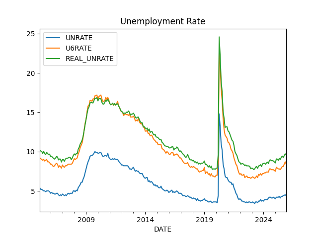

<a name='vacrate'></a>

Vacancy rate, job openings divided by unemployed people

```python
df = u.get_fred(2000, ['JTSJOL','UNEMPLOY'])
df = df.dropna()
df['VRATE'] = df.JTSJOL / df.UNEMPLOY
df.VRATE.plot()
print (df.VRATE.tail(3))
plt.savefig('vrate.png')
```

```text
DATE
2025-08-01    0.979268
2025-09-01    1.006969
2025-11-01    0.918391
Name: VRATE, dtype: float64
```

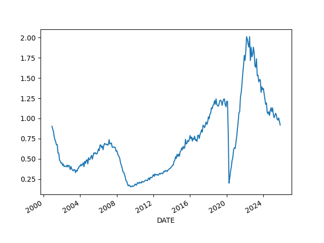

## Companies

<a name='pm'></a>

Profit Margins

Divide (1) by (2) as suggested in [4],

(1) Corporate Profits After Tax (without IVA and CCAdj) (CP)

(2) Real Final Sales of Domestic Product (FINSLC1)


```python
df = u.get_fred(1980, ['CP','FINSLC1']); df = df.interpolate()
df = df.dropna()
df['PM'] = df['CP'] / df['FINSLC1'] * 100.0
df.PM.plot()
print (df.tail(4))
plt.savefig('profitmargin.png')
```

```text
                  CP    FINSLC1         PM
DATE                                      
2024-10-01  3689.460  23530.836  15.679256
2025-01-01  3335.780  23340.500  14.291810
2025-04-01  3355.897  23765.563  14.120839
2025-07-01  3591.344  24029.136  14.945789
```

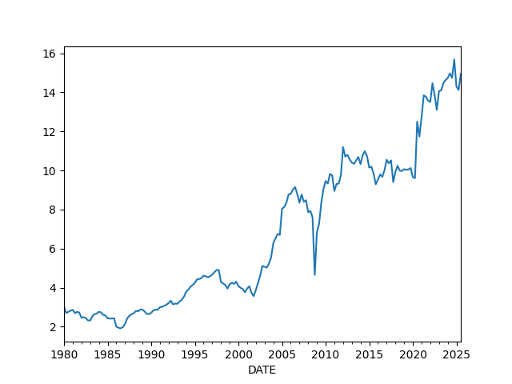


## Finance

Dollar

<a name='dollar'></a>

```python
df = u.get_yahoo_ticker2(1980, "DX-Y.NYB").interpolate()
print (df.tail(4))
m,s = df.mean(),df.std()
print (np.array([m-s,m+s]).T)
df.tail(1000).plot()
plt.grid(True)
plt.savefig('dollar.png')
```

```text
             DX-Y.NYB
2026-01-22  98.360001
2026-01-23  97.599998
2026-01-25  97.380001
2026-01-26  97.160004
[[ 81.82592111 111.54519299]]
```

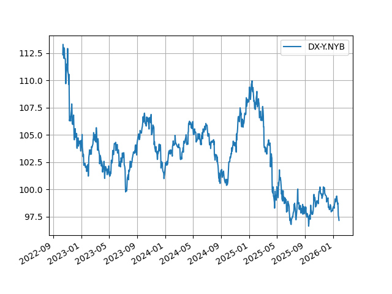

Schiller P/E

Overlay Schiller's P/E ratio on top SP 500 10-year returns [1] since
1920s. Lows and highs arrive 10 years after the market is most
expensive and cheapest, respectively. The two graphs should show
perfect reverse correlation. 

```python
df = pd.read_csv('../../mbl/2024/sp500.csv',index_col='Date',parse_dates=True)
df['schiller'] = pd.read_csv('../../mbl/2024/schiller.csv',index_col='Date',parse_dates=True)['Schiller']
df = df[df.index > '1940-01-01']
df['SPY10'] = df.SPY.shift(-12*10)
df['chg'] = ((df.SPY10 - df.SPY) / df.SPY)*100
u.two_plot2(df.chg, 'spy', df['schiller'], 'schiller')
plt.savefig('schiller.jpg')
```

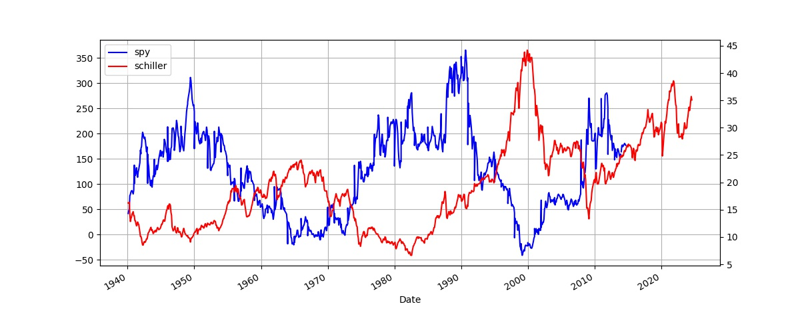

<a name='junkbond'></a>

Junk Bond Yields

```python
df = u.get_fred(1980,['BAMLH0A2HYBEY'])
print (df.tail(6))
df.plot()
plt.axvspan('2001-03-03', '2001-10-27', color='y', alpha=0.5, lw=0)
plt.axvspan('2007-12-22', '2009-05-09', color='y', alpha=0.5, lw=0)
df.BAMLH0A2HYBEY.tail(1).plot(style='r.',markersize=10)
plt.savefig('junkbond.png')
```

```text
            BAMLH0A2HYBEY
DATE                     
2026-01-15           6.62
2026-01-16           6.58
2026-01-19           6.58
2026-01-20           6.70
2026-01-21           6.62
2026-01-22           6.60
```

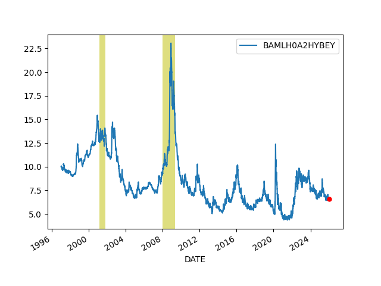

<a name='treas'></a>

3 Month, 2 and 10 Year Treasury Rates

```python
df = u.get_fred(2020,['DGS3MO','DGS2','DGS10','FEDFUNDS'])
df = df.interpolate()
df.plot()
#plt.axvspan('01-09-1990', '01-07-1991', color='y', alpha=0.5, lw=0)
#plt.axvspan('01-03-2001', '27-10-2001', color='y', alpha=0.5, lw=0)
#plt.axvspan('22-12-2007', '09-05-2009', color='y', alpha=0.5, lw=0)
print (df.tail(3))
plt.savefig('treasuries.png')
```

```text
            DGS3MO  DGS2  DGS10  FEDFUNDS
DATE                                     
2026-01-20    3.70  3.60   4.30      3.72
2026-01-21    3.70  3.60   4.26      3.72
2026-01-22    3.71  3.61   4.26      3.72
```


<a name='tcurve'></a>

Treasury Curve

```python
df = u.get_fred(1980,['DGS2','DGS10'])
df = df.interpolate()
df['inv'] = df.DGS10 - df.DGS2
df['inv'].plot(grid=True)
print (df['inv'].tail(4))
plt.axvspan('01-09-1990', '01-07-1991', color='y', alpha=0.5, lw=0)
plt.axvspan('01-03-2001', '27-10-2001', color='y', alpha=0.5, lw=0)
plt.axvspan('22-12-2007', '09-05-2009', color='y', alpha=0.5, lw=0)
plt.savefig('tcurve.jpg')
```

```text
DATE
2026-01-19    0.675
2026-01-20    0.700
2026-01-21    0.660
2026-01-22    0.650
Name: inv, dtype: float64
```

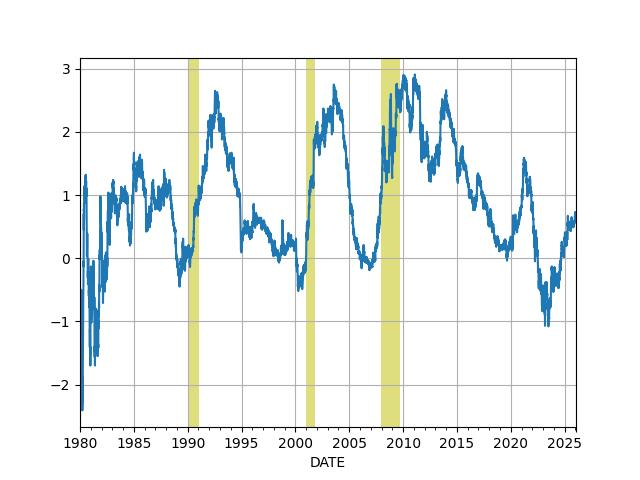

```python
df = u.get_fred(2008,['DGS2','DGS10'])
df = df.interpolate()
df['inv'] = df.DGS10 - df.DGS2
df['inv'].plot(grid=True)
print (df.inv.tail(4))
plt.savefig('tcurve2.jpg')
```

```text
DATE
2026-01-19    0.675
2026-01-20    0.700
2026-01-21    0.660
2026-01-22    0.650
Name: inv, dtype: float64
```

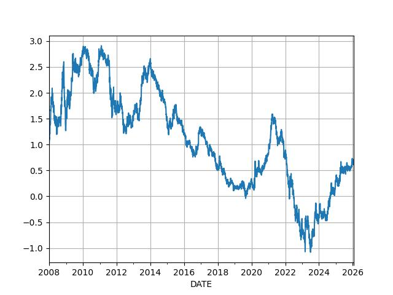

<a name='vix'></a>

VIX

```python
df = u.get_yahoo_ticker2(2000,"^VIX")
df.plot()
plt.axvspan('22-12-2007', '09-05-2009', color='y', alpha=0.5, lw=0)
print (df.tail(7))
plt.savefig('vix.png')
```

```text
             ^VIX
2026-01-14  16.75
2026-01-15  15.84
2026-01-16  15.86
2026-01-20  20.09
2026-01-21  16.90
2026-01-22  15.64
2026-01-23  16.09
```

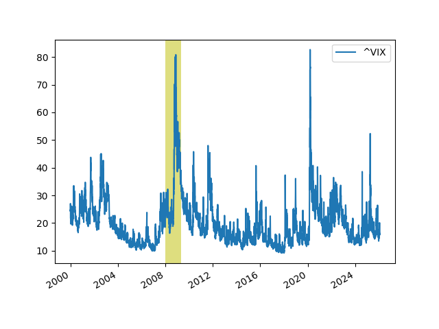

## Wealth, Debt

<a name='credit'></a>

Private Debt to GDP Ratio

```python
df = u.get_fred(1960,['GDPC1','QUSPAMUSDA'])
df = df.interpolate()
df['Credit to GDP'] = (df.QUSPAMUSDA / df.GDPC1)*100.0
df['Credit to GDP'].plot()
plt.axvspan('01-09-1990', '01-07-1991', color='y', alpha=0.5, lw=0)
plt.axvspan('01-03-2001', '27-10-2001', color='y', alpha=0.5, lw=0)
plt.axvspan('22-12-2007', '09-05-2009', color='y', alpha=0.5, lw=0)
plt.axvspan('2020-02-01', '2020-05-01', color='y', alpha=0.5, lw=0)
plt.savefig('creditgdp.png')
print (df['Credit to GDP'].tail(4))
```

```text
DATE
2024-10-01    177.039165
2025-01-01    178.115572
2025-04-01    177.673874
2025-07-01    175.781853
Freq: QS-OCT, Name: Credit to GDP, dtype: float64
```

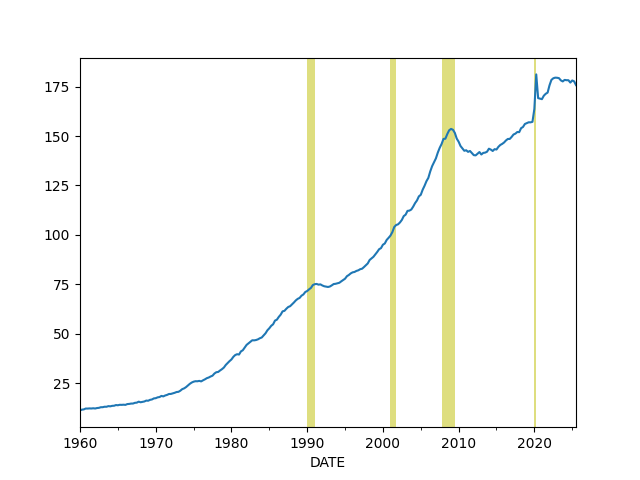

<a name='debt'></a>

Total Consumer Credit Outstanding as % of GDP

```python
df = u.get_fred(1980,['TOTALSL','GDP'])
df = df.interpolate(method='linear')
df['debt'] =   df.TOTALSL / df.GDP * 100.0
print (df.debt.tail(4))
df.debt.plot()
plt.axvspan('01-09-1990', '01-07-1991', color='y', alpha=0.5, lw=0)
plt.axvspan('01-03-2001', '27-10-2001', color='y', alpha=0.5, lw=0)
plt.axvspan('22-12-2007', '09-05-2009', color='y', alpha=0.5, lw=0)
plt.axvspan('2020-02-01', '2020-05-01', color='y', alpha=0.5, lw=0)
plt.savefig('debt.png')
```

```text
DATE
2025-08-01    16270.795507
2025-09-01    16307.677622
2025-10-01    16337.376870
2025-11-01    16350.976993
Freq: MS, Name: debt, dtype: float64
```

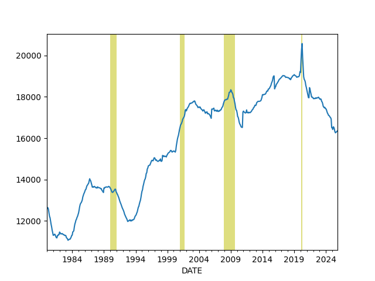

<a name='gini'></a>

Wealth Inequality - GINI Index

Code taken from [3]

```python
def gini(pop,val):
    pop = list(pop); pop.insert(0,0.0)
    val = list(val); val.insert(0,0.0)        
    poparg = np.array(pop)
    valarg = np.array(val)
    z = valarg * poparg;
    ord = np.argsort(val)
    poparg    = poparg[ord]
    z = z[ord]
    poparg    = np.cumsum(poparg)
    z    = np.cumsum(z)
    relpop = poparg/poparg[-1]
    relz = z/z[-1]    
    g = 1 - np.sum((relz[0:-1]+relz[1:]) * np.diff(relpop))
    return np.round(g,3)

cols = ['WFRBLT01026', 'WFRBLN09053','WFRBLN40080','WFRBLB50107']
df = u.get_fred(1989,cols)
df = df.interpolate()
p = [0.01, 0.09, 0.40, 0.50]
g = df.apply(lambda x: gini(p,x),axis=1)
print (g.tail(4))
g.plot()
plt.xlim('1990-01-01','2026-01-01')
plt.axvspan('1993-01-01','1993-01-01',color='y')
plt.axvspan('2001-01-01','2001-01-01',color='y')
plt.axvspan('2009-01-01','2009-01-01',color='y')
plt.axvspan('2017-01-01','2017-01-01',color='y')
plt.axvspan('2021-01-01','2021-01-01',color='y')
plt.axvspan('2025-01-01','2025-01-01',color='y')
plt.text('1990-07-01',0.44,'HW')
plt.text('1994-10-01',0.46,'Clinton')
plt.text('2003-12-01',0.47,'W')
plt.text('2011-01-01',0.44,'Obama')
plt.text('2018-01-01',0.42,'DJT')
plt.text('2020-03-01',0.48,'Biden')
plt.text('2023-06-01',0.42,'DJT')
plt.savefig('gini.png')
```

```text
DATE
2024-10-01    0.440
2025-01-01    0.440
2025-04-01    0.440
2025-07-01    0.442
dtype: float64
```

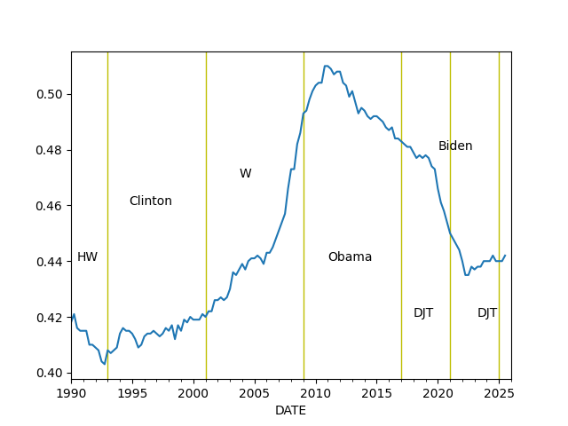

<a name='top10'></a>

Percentage of Wealth Held by Top 10%

```python
cols = ['WFRBLT01026', 'WFRBLN09053','WFRBLN40080','WFRBLB50107']
df = u.get_fred(1970,cols)
df = df.interpolate()

df['Total'] =  df['WFRBLT01026'] + df['WFRBLN09053'] + df['WFRBLB50107'] + df['WFRBLN40080']
df['Top 10%'] = (df['WFRBLT01026'] + df['WFRBLN09053']) * 100 / df.Total 
df['Bottom 50%'] = (df['WFRBLB50107'] * 100) / df.Total 

print (df[['Top 10%','Bottom 50%']].tail(4))
df[['Top 10%']].plot()
plt.ylim(50,100)
plt.savefig('top10-2.jpg')
```

```text
              Top 10%  Bottom 50%
DATE                             
2024-10-01  67.410590    2.480988
2025-01-01  67.182930    2.490884
2025-04-01  67.506484    2.482505
2025-07-01  68.139687    2.458570
```

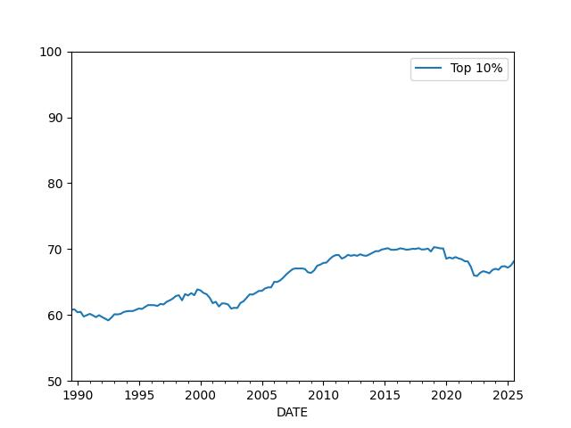

<a name='household'></a>

## Household Income

```python
df = u.get_fred(1980, ['MEHOINUSA646N','TDSP','CPIAUCSL'])
df = df.interpolate()
df = df.dropna()

cpi = float(df.tail(1).CPIAUCSL)
df['cpi2'] = cpi / df.CPIAUCSL 
df['household income'] = df.MEHOINUSA646N * df.cpi2 
df['household income'].plot()
t1 = float(df.head(1)['household income'])
t2 = float(df.tail(1)['household income'])
print ("Perc change since the 80s = %0.2f" % ((t2-t1) / t2 * 100))
plt.savefig('household.jpg')
```

```text
Perc change since the 80s = 5.85
```

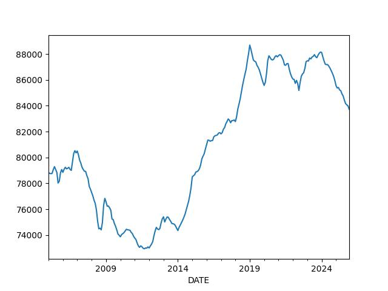

## Real Estate

<a name='medhouse'></a>

Median house prices

```python
df = u.get_fred(1992,"MSPUS")
df.plot()
print (df.tail(3))
plt.savefig('medhouse.jpg')
```

```text
             MSPUS
DATE              
2024-10-01  419300
2025-01-01  423100
2025-04-01  410800
```

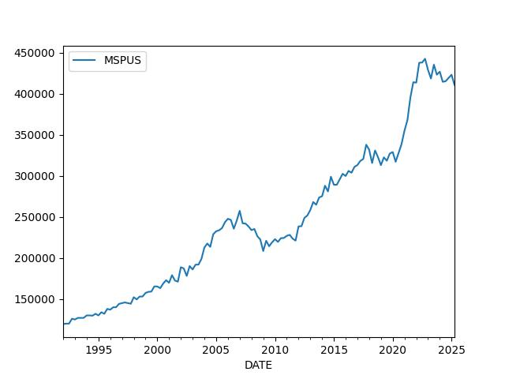

<a name='chex'></a>

## Foreign

Chinese Exports

```python
df = u.get_fred(2010,['XTEXVA01CNM667S']); df.plot()
plt.savefig('exchina.jpg')
print (df.tail(5))
```

```text
            XTEXVA01CNM667S
DATE                       
2025-07-01     3.117593e+11
2025-08-01     3.184701e+11
2025-09-01     3.143941e+11
2025-10-01     3.019760e+11
2025-11-01     3.245657e+11
```

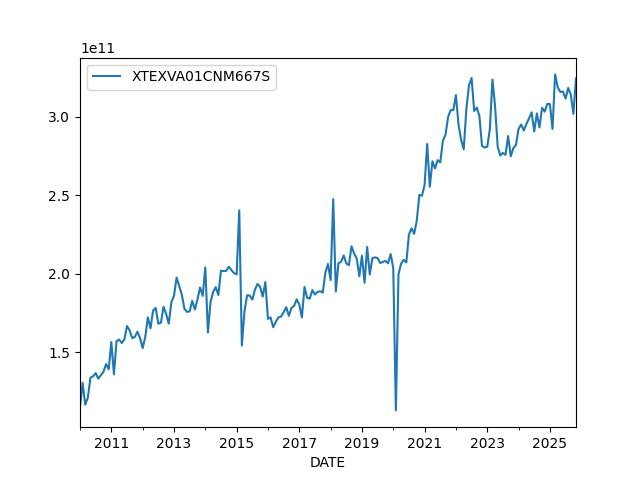

---

References, Notes

[1] [Schiller](http://www.econ.yale.edu/~shiller/data.htm)

[2] [Komlos](https://www.longfinance.net/news/pamphleteers/true-us-unemployment-rate-march-2019/)

[3] [Mathworks](https://www.mathworks.com/matlabcentral/mlc-downloads/downloads/submissions/28080/versions/1/previews/gini.m/index.html)

[4] [Philosophical Economics](https://www.philosophicaleconomics.com/2014/03/foreignpm/)

[5] [Hedgeye](https://app.hedgeye.com/mu/he_qio_4q19_10-3-2019?encoded_data=ft9F,6yjgJ3+iFdaasKwdMTJVgzgnZlI=,)

