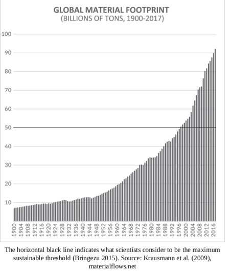

# Less Is More

Jason Hickel

Imagine you’re an investor. You want returns of, say, 5% per year, so
you decide to invest in Facebook. Remember, this is an exponential
function. So if Facebook keeps churning out the same profits year
after year (i.e., 0% growth), it will be able to repay your initial
investment but it won’t be able to pay you any interest on it. The
only way to generate enough surplus for investor returns is to
generate more profit each year than the year before.

This is why when investors assess the ‘health’ of a firm, they don’t
look at net profits; they look at the rate of profit – in other words,
how much the firm’s profits grow each year. From the perspective of
capital, profit alone doesn’t count. It is meaningless. All that
counts is growth.  Investors – people who hold accumulated capital –
scour the globe in desperate search of anything that smells like
growth. If Facebook’s growth shows signs of slowing down, they’ll pump
their money into Exxon instead, or into tobacco companies, or into
student loans – wherever the growth is at.  This restless movement of
capital puts companies under enormous pressure to do whatever they can
to grow... 

In the nineteenth century the global economy was worth a little more
than 1 trillion dollars, in today’s money. That means each year
capital needed to find new investments worth about 30 billion – a
significant sum. This required a huge effort on the part of capital,
including the colonial expansion that characterised the nineteenth
century. Today the global economy is worth over 80 trillion, so to
maintain an acceptable rate of growth capital needs to find outlets
for new investments worth another 2.5 trillion dollars next
year. That’s the size of the entire British economy – one of the
biggest in the world...

Where can this quantity of growth possibly be found? The pressures
become enormous. It’s what is driving the pharmaceutical companies
behind the opioid crisis in the United States; the beef companies that
are burning down the Amazon; the arms companies that lobby against gun
control; the oil companies that bankroll climate denialism; and the
retail firms that are invading our lives with ever-more sophisticated
advertising techniques to get us to buy things we don’t actually
want. These are not ‘bad apples’ – they are obeying the iron law of
capital... 

When we look at the impact that growthism has had on our planet since
the 1980s, it makes the period of enclosure and colonisation seem
quaint by comparison. All of the land and resources that colonisers
appropriated across multiple continents and pulled into the juggernaut
of capital – all of that has been dwarfed many times over.

We can see this playing out in the statistics on raw material
consumption.  This metric tallies up the total weight of all the stuff
humans extract and consume each year, including biomass, metals,
minerals, fossil fuels and construction materials. These figures tell
an astonishing story. They show a steady rise of material use in the
first half of the 1900s, doubling from 7 billion tons per year to 14
billion tons per year.

But then, in the decades after 1945, something truly bewildering
happens. As GDP growth becomes entrenched as a core political
objective around the world, and as economic expansion starts to
accelerate, material use explodes: it reaches 35 billion tons by 1980,
hits 50 billion tons by 2000, and then screams up to an eye-watering
92 billion tons by 2017.

The graph [below] is almost breathtaking to look at. Of course, some
of this increase represents important improvements in people’s access
to necessary goods (in other words, use-value), particularly in poorer
parts of the world; and we should celebrate that. But most of it does
not. Scientists estimate that the planet can handle a total material
footprint of up to about 50 billion tons per year. That’s considered
to be a maximum safe boundary.  Today we’re exceeding that boundary
twice over...

This increase in material use tracks more or less exactly with the
rise of global GDP. The two have grown together in lockstep. Every
additional unit of GDP means roughly an additional unit of material
extraction. There were times, such as during the 1990s, when GDP grew
at a slightly faster rate than material use, prompting some to hope we
were on our way to decoupling GDP from material use altogether. But
those hopes have been dashed in the decades since. In fact, exactly
the opposite has happened. Since 2000, the growth of material use has
outpaced the growth of GDP. Instead of gradually dematerialising, the
global economy has been rematerialising...

Lithium [used in batteries] is another ecological disaster. It takes
500,000 gallons of water to produce a single ton of lithium. Even at
present levels of extraction this is causing real problems. In the
Andes, where most of the world’s lithium is located, mining companies
are burning through the water tables and leaving farmers with nothing
to irrigate their crops. Many have had no choice but to abandon their
land altogether. Meanwhile, chemical leaks from lithium mines have
poisoned rivers from Chile to Argentina, Nevada to Tibet, killing off
whole freshwater ecosystems. The lithium boom has barely started, and
it’s already a catastrophe.
