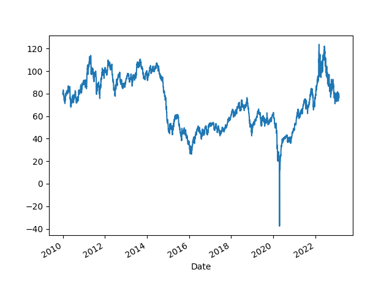
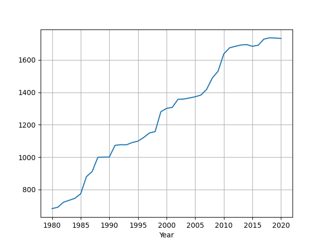
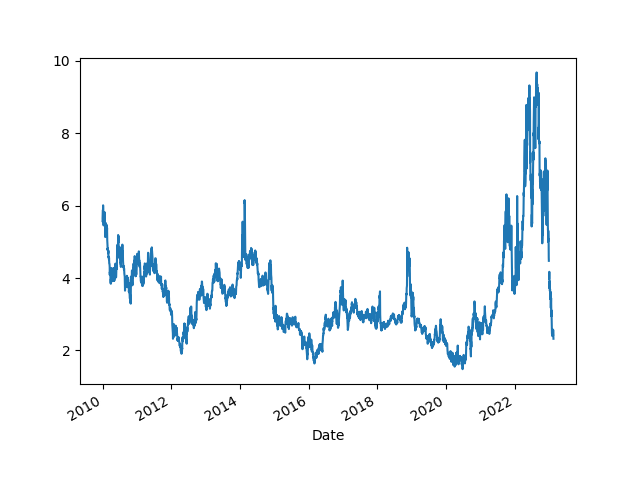
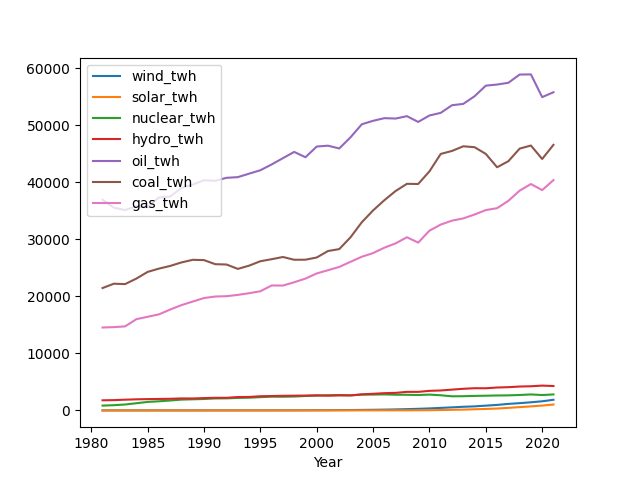
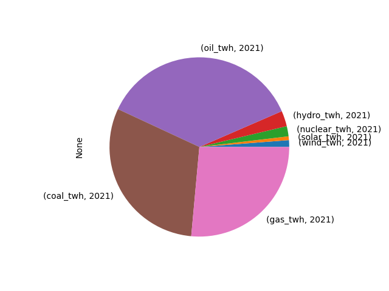
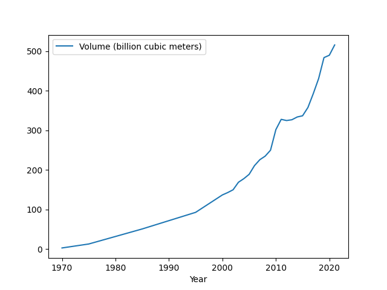
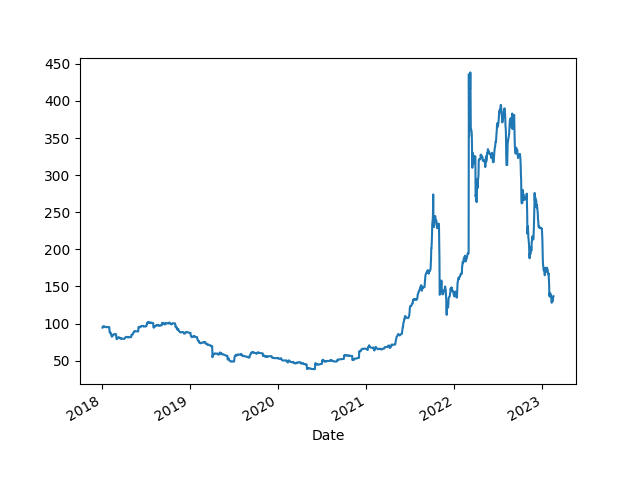
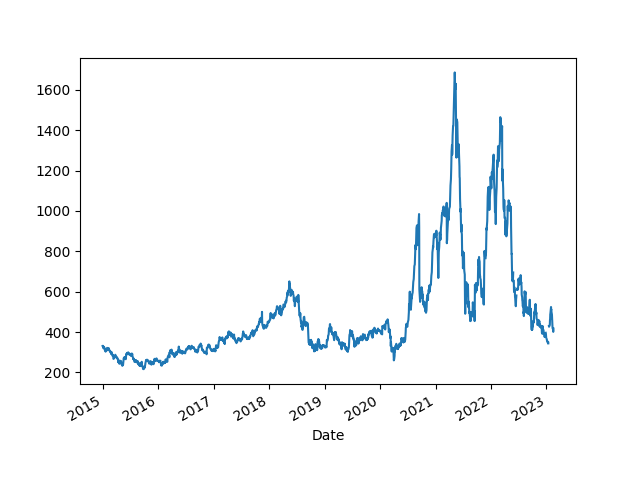

# Energy Stats

### Oil Price (Futures, Continuous Contract, Front Month)

```python
import pandas as pd
import impl as u
fbp = 'bp-stats-review-2022-consolidated-dataset-panel-format.csv'
```

```python
df = u.get_yahoofin(2010,"CL=F")
print (df.tail(5))
df.plot(); plt.savefig('oil.png')
```

```text
Date
2023-02-13    80.139999
2023-02-14    79.059998
2023-02-15    78.589996
2023-02-16    78.489998
2023-02-17    76.500000
Name: Close, dtype: float64
```



### World Oil Reserves

Data from [BP](https://www.bp.com/en/global/corporate/energy-economics/statistical-review-of-world-energy/downloads.html).
Unit is billion barrels. 

```python
df = pd.read_csv(fbp)
df = df[df.Country == 'Total World']
df = df.set_index('Year')
print (df.oilreserves_bbl.tail(4))
df.oilreserves_bbl.plot(grid=True)
plt.savefig('oilreserves.png')
```

```text
Year
2018    1736.144020
2019    1734.810537
2020    1732.366175
2021            NaN
Name: oilreserves_bbl, dtype: float64
```



<a name="natgas"></a>

### Natural Gas Price

```python
df = u.get_yahoofin(2010,"NG=F")
print (df.tail(7))
df.plot(); plt.savefig('natgas.png')
```

```text
Date
2023-02-09    2.430
2023-02-10    2.514
2023-02-13    2.405
2023-02-14    2.567
2023-02-15    2.471
2023-02-16    2.389
2023-02-17    2.322
Name: Close, dtype: float64
```



### Energy Production by Source

<a name='sources'></a>

[Data](https://www.bp.com/en/global/corporate/energy-economics/statistical-review-of-world-energy/downloads.html)

Global production, units terrawatt hours

kbd Thousand of Barrels Per Day

Ej = Exajoules = 277.778 TWh

```python
pd.set_option('display.max_columns', None)
fbp = 'bp-stats-review-2022-consolidated-dataset-panel-format.csv'
df = pd.read_csv(fbp)
df = df[df.Country == 'Total World']
df = df.set_index('Year')
df = df[df.index > 1980]
df = df[['wind_twh','solar_twh','oilprod_kbd','nuclear_twh','hydro_twh','gasprod_ej','coalprod_ej']]
df['oil_twh'] = df.oilprod_kbd * 365 * 1700 * 1000 / 1e9
df['coal_twh'] = df.coalprod_ej * 277.778 
df['gas_twh'] = df.gasprod_ej * 277.778
cols = [x for x in df.columns if '_twh' in x]
df[cols].plot()
plt.savefig('energy-sources.png')
print (df[cols].tail(3))
```

```text
         wind_twh    solar_twh  nuclear_twh    hydro_twh       oil_twh  \
Year                                                                     
2019  1420.544110   703.949763  2796.354063  4231.376747  58895.185992   
2020  1596.428212   846.229368  2693.978613  4345.990451  54910.671018   
2021  1861.939824  1032.501231  2800.267792  4273.827522  55768.604518   

          coal_twh       gas_twh  
Year                              
2019  46428.036448  39677.369853  
2020  44068.508171  38615.184559  
2021  46550.642074  40368.860045  
```



```python
df2 = df[cols].tail(1).unstack()
df2 = (df2 / df2.sum())*100.0
df2.plot(kind="pie")
plt.savefig('source-pie.png')
df2
```

```text
Out[1]: 
             Year
wind_twh     2021     1.219691
solar_twh    2021     0.676355
nuclear_twh  2021     1.834357
hydro_twh    2021     2.799634
oil_twh      2021    36.532052
coal_twh     2021    30.493689
gas_twh      2021    26.444221
dtype: float64
```



<a name='primary'></a>

### Global Primary Energy Consumption

In terrawatt hours. 'Primary energy comprises commercially-traded
fuels, including modern renewables. Energy from all sources of
non-fossil power generation is accounted for on an input-equivalent
basis'.

```python
df = pd.read_csv(fbp)
df = df[df.Country == 'Total World']
df = df.set_index('Year')
df = df[['primary_ej']]
df['primary_twh'] = df.primary_ej * 277.778
df['primary_gw'] = df['primary_twh']*1000 / (365*24)
print (df[['primary_twh','primary_gw']].tail(4))
df.primary_twh.plot()
plt.savefig('world-energy-combined.png')
```

```text
        primary_twh    primary_gw
Year                             
2018  161772.761640  18467.210233
2019  163174.086345  18627.178806
2020  156670.066530  17884.710791
2021  165319.812784  18872.124747
```


<a name='primcountry'></a>

### Energy Consumption Per Country

For 2021. Units are Gigawatts (not GWh or TWh, shows the necessary
power input required at each instant).

```python
df = pd.read_csv('bp-stats-review-2022-consolidated-dataset-panel-format.csv')
year = df.Year.max()
df = df[df.Year == year]
df = df.set_index('Country')
df = df[['primary_ej']]
df['primary_twh'] = df.primary_ej * 277.778
df = df['primary_twh'].sort_values(ascending=False).dropna()
df = df[df.index.str.contains('Total')==False]
df = (df*1000 / (365*24)).astype(int)
df.head(20)
```

```text
Out[1]: 
Country
China                 4998
US                    2948
India                 1123
Russian Federation     992
Japan                  562
Canada                 441
Germany                400
South Korea            398
Brazil                 398
Iran                   386
Saudi Arabia           343
France                 298
Indonesia              263
Other Africa           247
United Kingdom         227
Turkey                 216
Mexico                 215
Italy                  201
Australia              181
Spain                  177
Name: primary_twh, dtype: int64
```

<a name='usgasoline'></a>

### Individual Countries

<a name='usenergy'/>

```python
u.country_bp("US")
```

```text
             Year
wind_twh     2021     1.654620
solar_twh    2021     0.713243
nuclear_twh  2021     3.533104
hydro_twh    2021     1.111511
oil_twh      2021    42.327231
gas_twh      2021    35.659344
coal_twh     2021    12.666405
biogeo_twh   2021     0.989210
ethanol_twh  2021     1.345333
dtype: float64

Production As Percentage of Consumption

     Perc Commodity
0  104.87       Oil
1  113.00       Gas
2  110.18      Coal

Electricity 17.06 %

Total

2646.55 GW
```

<a name='lng'></a>

### LNG Traffic per Year

In billion cubic meters 

```python
df = pd.read_csv('lng.csv',sep=';',index_col=0)
df.plot(); plt.savefig('lng.png')
```



<a name='coal'></a>

### Coal Price

```python
df = u.get_yahoofin(2018,"MTF=F").interpolate();
print (df.tail(4))
df.plot(); plt.savefig('coal.png')
```

```text
Date
2023-02-13    130.000000
2023-02-14    134.000000
2023-02-15    136.399994
2023-02-16    136.850006
Name: Close, dtype: float64
```



### Lumber

```python
df = u.get_yahoofin(2015,"LBS=F"); df.plot(); plt.savefig('lumber.png')
```



