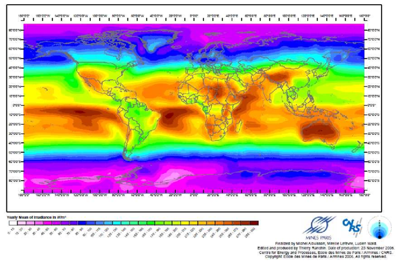
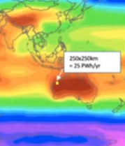

# The Sunshine Map

See the [presentation](https://youtu.be/gtmWGPaDkoI?t=367) by a reputable
scientist in the area, Dr. McFarlane, who is an expert on green ammonia
generation (which can be exported, and turned into hydrogen at the point of use).

According to McFarlane, that patch of 250 km by 250 km can generate 25
Petawatt-hours in a year. More than enough for the entire world. See
[video](https://youtu.be/gtmWGPaDkoI?t=417).

