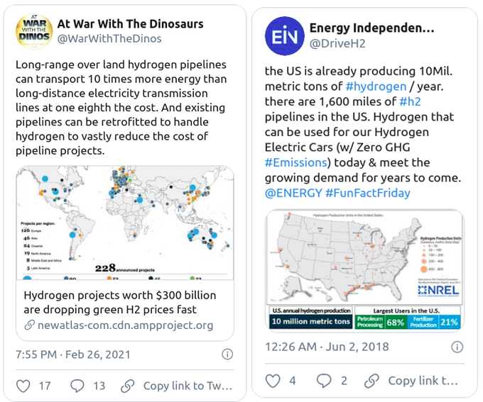

# Wires vs Pipes

[Link](https://physicsworld.com/a/rethinking-power-pipes-versus-wires/)

"Underlying the policy debate on energy is a fault line – a chasm
between two basically different approaches. Not the usual one between
big centralized and small decentralized energy, although that is part
of it. This goes deeper. It concerns the basic, often unspoken,
assumption that electricity is the key energy vector. We have the idea
that electrification is modernization. It’s not just Lenin who said
that, it’s everyone ever since, everywhere. It made sense. Electricity
was clean, fast, controllable, and it has become increasingly valuable
[..].

However, there is another viewpoint from which these possible new
electric-power-demand-boosting developments do not look such good
news. It’s based on a rival assessment of what makes sense in terms of
meeting energy needs — the use of gas as an energy vector. This option
is claimed to be more efficient and less costly than electricity for
heating, and possibly for other purposes [..].

It is certainly easier to transmit gas with lower energy losses. And
it can be stored, unlike electricity. In the UK gas is the main source
of heat. With heating demand being high at times, the UK gas grid
carries about four times more energy than the electric power
grid. That is why some say it is foolish to try to switch over to
electric heating — the power grid could not cope without massive
expansion [..]



We have a polarity of views – essentially between backers of 'pipes
and 'wires'. Moving the context to the climate debate, the electric
wire lobby says the energy system can best be decarbonized by sending
power from wind, solar and other renewables to energy users down
wires, including for heating and for charging electric vehicles
(EVs). The pipe lobby says that, for heating, it makes more sense to
stay with the gas grid and standard appliances but switch over to
green gas. That way, you don’t have to make many changes whereas to
use electricity efficiently you would have to install expensive heat
pumps in every house. Green gas can also be used for vehicles, as
compressed natural gas already is"

[Hydrogen Council - PDF](https://web.archive.org/web/20220408113147/https://hydrogencouncil.com/wp-content/uploads/2021/02/Hydrogen-Insights-2021-Report.pdf)

"Longer-term, a hydrogen pipeline network offers the most
cost-efficient means of distribution. For example, pipelines can
transmit 10 times the energy at one-eighth the costs associated with
electricity transmission lines and have capex costs similar to those
for natural gas. The industry can partially reuse existing gas
infrastructure, but even newly constructed pipelines would not be cost
prohibitive (assuming leakage and other safety risks are properly
addressed). For example, we estimate the cost to transport hydrogen
from North Africa to central Germany via pipeline could amount to
about USD 0.5 per kg of H2 – less than the cost difference of domestic
renewable hydrogen production in these two regions"

<a name='10calc'></a>

Verification of the 10x tranmission; take 10 m/s gas flow, at 350 bars
density H2 is 28 kg/m3, assuming a pipe output area of 1 m2, energy
density of 33.6 kWh/kg. Compare it with a standard tower [1] a 765 kV
line which can reliably transmit 2200-2400 MW [2].

```python
dens = 33.6 # kWh/kg
kg_vol = 28 # kg/m^3 at 350 bars
v = 10 # m/s, conservative flow speed
A = 1 # m^2, pipe crosssection area
kg_1h = v*A*kg_vol*60*60 # in one hour
print (kg_1h*dens / 1000.0, 'MW')
```

```text
33868.8 MW
```

This is the power carried by gas pipeline compared to 2400 MW by
typical 765 kV electrical tower.

<a name='doe'></a>

[US Department of Energy](https://www.energy.gov/eere/fuelcells/hydrogen-pipelines)

"Approximately 1,600 miles of hydrogen pipelines are currently
operating in the United States. Owned by merchant hydrogen producers,
these pipelines are located where large hydrogen users, such as
petroleum refineries and chemical plants, are concentrated such as the
Gulf Coast region. Transporting gaseous hydrogen via existing
pipelines is a low-cost option for delivering large volumes of
hydrogen"

This paper [4] also verifies the efficiency of gas transmission over electricity.

References

[1] Typical Elec Tower [Pic](https://pbs.twimg.com/media/EvasTd_XEAAQ86Q?format=jpg&name=small)

[2] US Electical Power, [Transmission Facts](https://web.ecs.baylor.edu/faculty/grady/_13_EE392J_2_Spring11_AEP_Transmission_Facts.pdf)

[3] [H2 Pipelines Capacity](https://pbs.twimg.com/media/EvdKNhvXAAE9Rr2?format=png&name=small)

[4] [Cost of long-distance energy transmission by different carriers](https://www.ncbi.nlm.nih.gov/pmc/articles/PMC8661478/)