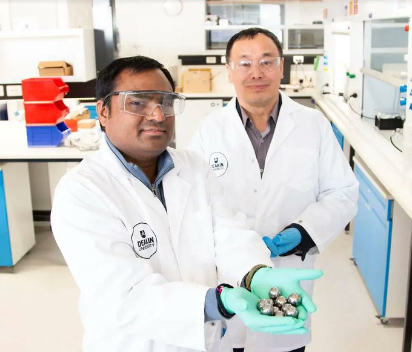

# Boron Nitrade Powder

[Link](https://reneweconomy.com.au/eureka-moment-as-australian-researchers-make-hydrogen-storage-breakthrough)

'Eureka moment' as Australian researchers make hydrogen storage
breakthrough.. A team from Deakin University’s Institute for Frontier
Materials (IFM) in Melbourne says it has found a new mechanochemical
way of separating and storing gases, which is safe, uses a tiny
fraction of the energy compared to traditional methods and creates
zero waste.

The hero ingredient in the breakthrough is boron nitride powder, which
is has a knack for absorbing substances, being small, but with a large
amount of surface area. It’s also classed as a “level-0 chemical,”
something that is deemed perfectly safe to have in your house.

The researchers put boron nitride powder into a ball mill – a type of
grinder containing small stainless-steel balls in a chamber – along
with the gases that need to be separated.

As the chamber rotates at a higher and higher speed, the balls collide
with the powder and the wall of the chamber triggers a mechanochemical
reaction resulting in gas being absorbed into the powder.

One type of gas is absorbed quicker, separating it out from the
others, and allowing it to be easily removed from the mill. The
process can be repeated over several stages to separate the gases one
by one.

All up, the process consumes 76.8 KJ/s to store and separate 1000L of
gases, which means it uses at least 90 per cent less than the current
gas separation process commonly used in the petroluem industry...

Even more significantly, once the gas is absorbed into the powder it
gas can be transported safely and easily. When the gas is needed, the
powder can be simply heated in a vacuum to release the gas unchanged...

[The team shows] there’s mechanochemical alternative, using ball
milling to store gas in the nanomaterial at room temperature. It
doesn’t require high pressure or low temperatures, so it would offer a
much cheaper and safer way to develop things like hydrogen powered
vehicles.

The next step for the IFM team is to gather industry support and scale
the process up to a full pilot. A provisional patent application has
been submitted for the process"

[[⇪Up]](h2-storage.html)
