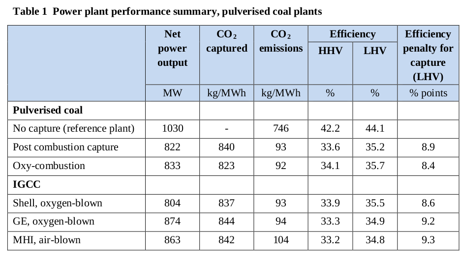
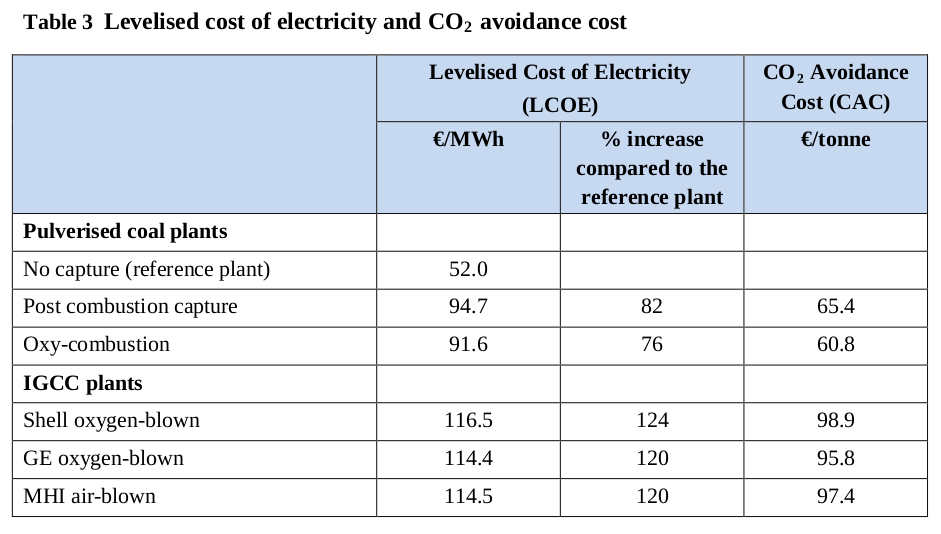

# H2 Production From Coal / CCS

IEAGHG Report - [PDF](https://ieaghg.org/docs/General_Docs/Reports/2014-03.pdf)

*The IEA Greenhouse Gas R&D Programme (IEAGHG) was formed in 1991,
constitutes an autonomous and independent framework within the
International Energy Agency (IEA) network*

In recent years IEAGHG has undertaken a series of studies on the
performance and costs of plants incorporating the three leading CO2
capture technologies: post combustion, oxy-combustion and
pre-combustion capture...

The study also assesses the following hydrogen production plants, all
based on GE oxygen blown gasification and Selexol solvent scrubbing:

* Plant with high net electricity co-production, including two
  130MW.. gas turbines

* Plant with intermediate net electricity co-production, including two
77MW.. gas turbines

* Plant with low electricity co-production, including a PSA off-gas
fired boiler.  All of these baseline plants have 90% CO2 capture...

This study assessed the technical feasibility and costs of achieving a
higher level of CO2 capture (around 98%) in oxy-combustion and IGCC
plants. In the oxy-combustion case this was achieved by passing the
vent gas from CO2 purification through a membrane separation unit. For
gasification based plants an additional MDEA solvent scrubbing stage
was added after the Selexol scrubber...

A summary of the performance of the baseline power plants with and
without capture is given in [table below]

CO2 capture almost eliminates SOx emissions and also reduces NOx emissions..

Levelised costs of electricity (LCOE) and CO2 avoidance cost (CAC) are
shown [below]. The costs of the IGCC plants are higher than those of
the pulverised coal combustion plants, mainly because of higher
capital costs and higher fixed operating and maintenance (O+M) costs,
particularly maintenance costs...

The thermal efficiencies of power plants with CCS based on pulverised
coal combustion with post combustion capture, oxy-combustion and IGCC
with pre-combustion capture are 34.8 - 35.7% LHV basis, which is
around 9 percentage points lower than a reference pulverised coal
plant without capture.

The levelised cost of base load electricity generation is about 92
€/MWh for boiler-based plants with oxy-combustion or post combustion
capture and 115 €/MWh for IGCC plants with pre-combustion
capture. This is about 75-125% higher than the reference pulverised
coal plant without CCS...

The net efficiency of producing hydrogen by coal gasification with CCS
is 57.8% on an LHV basis (65.5% HHV basis) and the levelised cost of
hydrogen is 16.1 €/GJ LHV basis (13.6 €/GJ HHV). 

[PDF](https://www.researchgate.net/publication/228537942_Prospects_for_building_a_hydrogen_energy_infrastructure)

Researcher (Private Communication)

"[T]hrough gasification (H2 + CO), then water gas shift
(H2O + CO --> H2 + CO2) so then what you have at the end is H2 + CO2.
You can either capture the CO2 with an amine leaving H2 with some CO2 in it,
or you use pressure swing adsorption to capture H2 at high purity, leaving
CO2 with H2 in it"

Also see the doc [carbon capture](h2-co2-capture.html)

[[Up]](h2-production.html)
