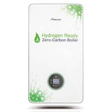
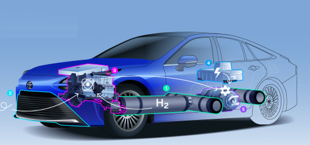

# Application Domains for H2

Along with the ease of storage, transport, and generation advantages
clean fuels enjoy, they are also attractive due to the fact they can
be applied anywhere, e.g. in combustion engines for motor vehicles,
creating power in turbines or fuel-cells, heating, or making steel.

### Steel Production

There is already no other option for green steel production other
other than hydrogen. In traditional steel production, reduction of
iron ore is achieved by heating it together with coal, utilizing a
chemical reaction that separates the oxygen from the iron, forming and
emitting CO2. In H2 based production, hydrogen reacts with iron ore
similarly to carbon, resulting in the extraction of oxygen. But
instead of creating CO2, the main by-product is just water [1].

Euractiv: "Industry sectors like steelmaking traditionally rely on
dirty fuels to produce the intense heat and feed the chemical process
needed to smelt iron ore. But switching from coking coal to a cleaner
feedstock like hydrogen offers a solution that produces only harmless
steam emissions"

### Heating

Wherever natural gas is fed into homes and buildings for heating
purposes, H2 can replace it, sometimes through dual-use boilers. A
boiler sold by Worcester Bosch is such a solution [2]

Bosch: "By developing a hydrogen-compatible boiler, the developers at
Bosch Thermotechnology are proving that boilers can be converted
quickly and easily from the currently used natural gas to 100 percent
hydrogen. A first demonstration boiler of the H2-ready boiler with a
rated heat output of 30 kW has been in operation on a test stand since 2017. 
The H2-ready boiler can initially run on conventional natural gas or
a hydrogen admixture of up to 20 percent. As soon as the local network
has been switched over to hydrogen, the boiler can be
converted to full use of the green gas within an hour by making just a
few adjustments...

Most of the existing natural gas pipelines are almost ready to
transport hydrogen, which means that existing infrastructures can be
used when switching to the green gas. The operation of the H2-ready
boiler is similar to that of an ordinary gas condensing boiler. The
important difference lies in the energy source. Hydrogen can be stored
indefinitely, thus ensuring constant availability for users. Green
hydrogen is climate-neutral and therefore has the potential to lead
the heating sector into a green future"

H2 based heating is efficient as H2 high-heating value is more than
twice that of natgas.

Boiler Hut: "1kg of hydrogen releases the same energy as 2.8kg of
natural gas." [5]

Burning hydrogen releases no carbon - it only creates water. This
means that pure hydrogen would produce no waste products while it is
burning, making the material itself almost 100% efficient [8].

Heat By-Product from Fuel-Cell

Fuel-cells generate heat as a by-product as they generate electricity
from H2. This heat can be harnessed to heat homes, businesses,
through a method called CHP, combined heat and power. From a [product](https://www.inhouse-engineering.de/en/fuel-cell/chp/) flyer:
"[We can] use a combined heat and power unit with a fuel cell to
supply you with electrical and thermal energy. Our combined heat and
power station (CHP) inhouse5000+ based on a PEM fuel cell is such a
solution for the simultaneous supply of buildings with electricity and
heat"

Heat By-Product from LOHC Hydrogeneation

The process of generating H2 from LOHC carrier, the so-called
hydrogeneation generates heat as by product. This process can easily
be used to heat homes, in fact a demo in Erlangen Germany shows 55 C
heat is supplied to a nearby school that can heat a swimming pool [4,
pg. 30]

### Power via Fuel-Cells

[DOE](https://www.energy.gov/eere/fuelcells/fuel-cells)

'[Fuel-cells] produce electricity and heat as long as fuel is
supplied. A fuel cell consists of two electrodes—a negative electrode
(or anode) and a positive electrode (or cathode)—sandwiched around an
electrolyte. A fuel, such as hydrogen, is fed to the anode, and air is
fed to the cathode. In a hydrogen fuel cell, a catalyst at the anode
separates hydrogen molecules into protons and electrons, which take
different paths to the cathode. The electrons go through an external
circuit, creating a flow of electricity"

As H2 is weight efficient, there are applications for it through
fuel-cells anywhere from powering cars to powering freight ships, or
trains. The famous Hyundai Nexo vehicle is powered by 120 KW FC, its
fuel is stored in three high-pressure fuel tanks packaged in the rear,
with a combined 156-litre capacity and the ability to hold up to
6.33kg of hydrogen at a pressure of 700 bar.

A planned cargo ship [6] will have 2.5 MW fuel-cells supplied by
liquid hydrogen tanks of 70 tons, will carry 240 TEUs with deadweight
of 5,000 tons.

Entire trains can run on fuel-cells.  On Sep 15 2022 the hydrogen
train Alstom Coradia iLint broke world record to travel 1125
kilometers on a single filling of hydrogen tank. The thread on the
entire trip is chronicled [here](https://twitter.com/Alstom/status/1570255996299378691).
The Coradia iLint is fitted with two roof-mounted hydrogen tanks, one
on each car, each with a maximum capacity of 94 kg. The hydrogen is
contained in 24 pressurised canisters in each tank. There is one fuel
cell mounted on the roof of each car. Both provide electricity for the
two main traction motors, each rated at 314 kW.

Homes can utilize H2 based fuel-cells to power entire households.  A 2
KW fuel-cell system will use up 80 kg of H2 annually, and is more than
enough to power home devices. Note that as a by-product fuel-cells
also generate heat which can be used as winter time heating. H2 fuel
can be suplied in seperate canisters bought regularly, or through
pipelines. H2 can even be generated from rooftop solar to be converted
into hydrogen. Tanks can be compressed H2, or as with a product by
Lavo [7] in metallic hydride.

### Combustion Engines

One of the many uses of hydrogen is through combustion. Just like
there are gasoline powered engines, there can be hydrogen powered
combustion engines. Toyota built one for racing seen below.

"At the end of April 2021, Toyota announced it would be testing the
performance of a new hydrogen-fuelled internal combustion engine by
installing it in a racecar that would compete in one of Japan’s
toughest motorsports events: The NAPAC Fuji Super TEC 24 Hours"

<iframe width="340" src="https://www.youtube.com/embed/2dgzKW8EKMc" title="YouTube video player" frameborder="0" allow="accelerometer; autoplay; clipboard-write; encrypted-media; gyroscope; picture-in-picture" allowfullscreen></iframe>

Motor Authority: "Ford Patents Hydrogen-Fueled Combustion Engine"

Reuters: "Cummins, Tata Motors team up for hydrogen-powered engines"

### Power via Turbines

Combustion can be used inside an engine or in a turbine to generate
power. There is technology that can use partial H2 along with natural
gas, or purely H2. GE has working technology in this space.

H2 Fuel News: "Mitsubishi Power, Georgia Power and EPRI have completed
the largest H2 carbon reduction mix...  The hydrogen fuel blending
took place at the Plant McDonough-Atkinson owned by Georgia Power, in
Smyrna, Georgia. The combination took place as a part of a
demonstration project. It was the first to have validated a 20 percent
H2 blending on an advanced class gas turbine in North
America. Moreover, it also represents the largest of its kind to date,
with a 20 percent mix, which reduces the carbon emissions by 7 percent
when compared with natural gas alone"

H2 View: "GE commences assessment to introduce.. hydrogen blends into
Uniper’s Kent power station.. [the] plant assessment..  will seek to
develop detailed solutions to enable the 1,365MW combined-cycle gas
turbine (CCGT) plant to use blends of hydrogen up to 40% by volume"

H2 Fuel News: "[New York power authority] may have found a feasible
way to lower carbon emissions... A recent hydrogen blending study
found that carbon dioxide emissions (CO2) lowered by approximately 14
percent when 35 percent of hydrogen by volume was mixed with natural
gas to produce electricity.. blending project was carried out on an
LM6000 GE gas turbine"

### Space

Hydrogen is energy efficient therefore perfectly suited for propelling
rockets into space.

Blue Origin

"Building a road to space starts with reusable vehicles and New
Shepard is the first step in realizing that mission. The entire New
Shepard system has been designed for operational reusability and
minimal maintenance between flights from day one to decrease the cost
of access to space and reduce waste. Nearly 99% of New Shepard’s dry
mass is reused, including the booster, capsule, ring fin, engine,
landing gear, and parachutes. New Shepard’s BE-3PM engine is fueled by
highly efficient and clean liquid oxygen and hydrogen. During flight,
the only byproduct of New Shepard’s engine combustion is water vapor
with no carbon emissions"

NASA

"For decades, NASA has relied upon hydrogen gas as rocket fuel to
deliver crew and cargo to space. With the Centaur, Apollo and space
shuttle vehicles, NASA has developed extensive experience in the safe
and effective handling of hydrogen. For example, the rocket engines of
each shuttle flight burn about 500,000 gallons of cold liquid hydrogen
with another 239,000 gallons depleted by storage boil off and transfer
operations"

The SLS, a key piece of hardware for NASA's Artemis moon program, is
now the most powerful rocket ever to launch successfully, and it uses
liquid hydrogen.

References

[1] [H2 Green Steel](https://www.h2greensteel.com/)

[2] [Bosch](https://www.bosch-presse.de/pressportal/de/en/der-energiewende-einen-schritt-naeher-220800.html)

[3] [Euroactive](https://www.euractiv.com/section/energy-environment/infographic/how-hydrogen-can-decarbonize-the-steel-industry-and-what-it-will-take)

[4] [Hydrogenious, PDF](https://arpa-e.energy.gov/sites/default/files/Schneider_HydrogeniousTechnologies_TransportationFuels_Workshop_FINAL.pdf)

[5] [Boiler Hut](https://boilerhut.co.uk/boiler-guides/hydrogen-boiler-explained/)

[6] [Energy Observer 2](https://www.offshore-energy.biz/energy-observer-unveils-lh2-powered-cargo-ship-concept/)

[7] [LAVO](https://www.h2networks.com.au/pdf/Small-Scale-LAVO-Residential-Unit-Brochure.pdf)

[8] [iHeat](https://iheat.co.uk/boiler-help/best-hydrogen-boilers)

