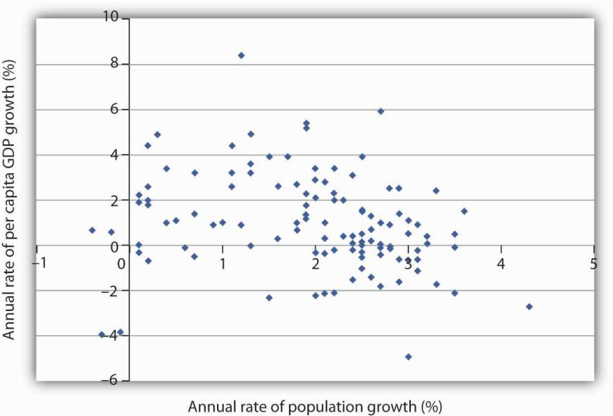
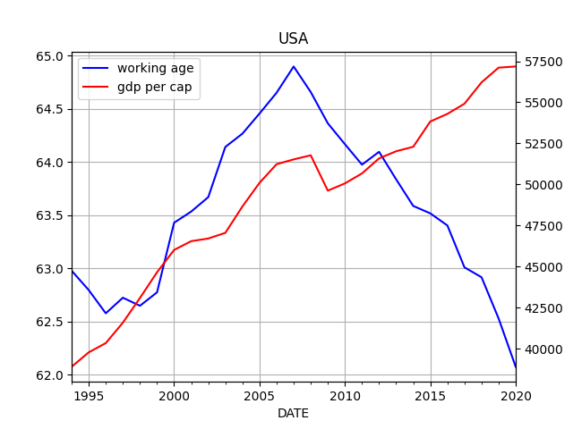
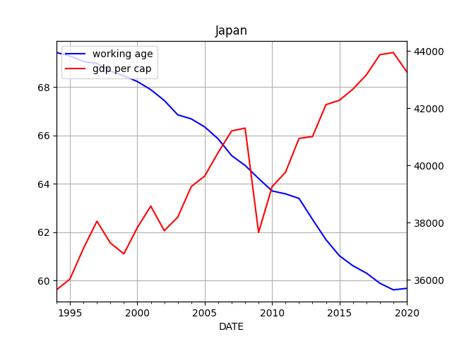
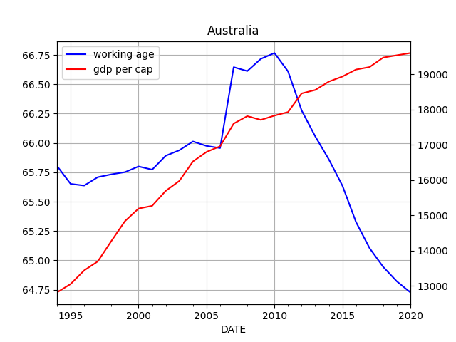

# Population Growth, Demographics, Economics

[Link](https://open.lib.umn.edu/principleseconomics/chapter/33-2-population-growth-and-economic-development)

"[Graph below] plots growth rates in population versus growth rates in
per capita GDP from 1975 to 2005 for more than 100 developing
countries. We do not see a simple relationship. Many countries
experienced both rapid population growth and negative changes in real
per capita GDP. But still others had relatively rapid population
growth, yet they had a rapid increase in per capita GDP. Clearly,
there is more to achieving gains in per capita income than a simple
slowing in population growth"



Data

I did some data wrangling below, for US, JP, Oz. I fetched working age
population, total population, and GDP; then I plot working age pop
ratio, against GDP per capita.

```python    
# FRED 'LFWA64TTUSM647S','POPTHM','GDPC1','LFWA64TTJPM647S','POPTOTJPA647NWDB',
# 'JPNRGDPEXP','LFWA64TTAUM647N','POPTOTAUA647NWDB','NGDPRSAXDCAUQ']

import pandas as pd
df = pd.read_csv('pop_wage_gdp.csv',index_col=0,parse_dates=True)

plt.clf()
df['us_wa'] = df.us_wapop / (df.us_pop*10)
df['us_gdpcap'] = df.us_rgdp*1000000 / df.us_pop
ax1 = df.us_wa.plot(color='blue', grid=True, label='working age')
ax2 = df.us_gdpcap.plot(color='red', grid=True, label='gdp per cap',secondary_y=True)
h1, l1 = ax1.get_legend_handles_labels()
h2, l2 = ax2.get_legend_handles_labels()
plt.title('USA')
plt.legend(h1+h2, l1+l2, loc=2)

plt.clf()
df['jp_wa'] = df.jp_wapop*100 / (df.jp_pop)
df['jp_gdpcap'] = df.jp_rgdp*10000000 / df.jp_pop
ax1 = df.jp_wa.plot(color='blue', grid=True, label='working age')
ax2 = df.jp_gdpcap.plot(color='red', grid=True, label='gdp per cap',secondary_y=True)
h1, l1 = ax1.get_legend_handles_labels()
h2, l2 = ax2.get_legend_handles_labels()
plt.legend(h1+h2, l1+l2, loc=2)
plt.title('Japan')

plt.clf()
df['au_wa'] = df.au_wapop*100 / (df.au_pop)
df['au_gdpcap'] = df.au_rgdp*1000000 / df.au_pop
ax1 = df.au_wa.plot(color='blue', grid=True, label='working age')
ax2 = df.au_gdpcap.plot(color='red', grid=True, label='gdp per cap',secondary_y=True)
h1, l1 = ax1.get_legend_handles_labels()
h2, l2 = ax2.get_legend_handles_labels()
plt.title('Australia')
plt.legend(h1+h2, l1+l2, loc=2)
```







The graphs above did not seem to display any meaningful correlation.


