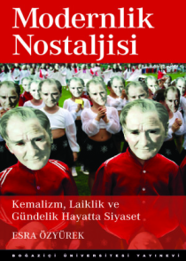

# A Nostalgia for Modernism

The title is taken from a book written about the mood of post 90s
secular citizens of the Turkish Republic. The fascist coup of 80 had
created the Islamoturkist ideology but it also wanted to balance it
with its internal bizarre constituents, so the leaders made sure to
alert the followers of the existing Turkist ideology to be "on guard"
against the new newcomers, just in case they behaved too Islamist for
their own good.. This act ushered in a resurgence of all things
related to Kemal, a remembarence of the man through symbols, displays
of devotion, protests. The author Ozyurek chose one photograph from
such a protest where hard-core adherents put on masks with the
founders face creating an eerie display, likely causing an effect
opposite than was intented.

These riled-up followers, gazing through the dead-looking eyes of the
founder's picture, were clearly trying too hard.. This was culture
war, as in US it around useless issues to hide away the abnormalities
of the uniparty, this one was pitting one group against another, while
hiding away its own abnormalities. The nostalgia aimed for an 1920s
spirit, when the only ideology was Kemal's, centered around a nomadic
pure Turk who was the bringer of civilization at the same time
forgotten (until Kemal reminded everyone). The ideology, and the
nostalgia for it later had many uses, one of which was to cement
relations with the Anglo alliance, another historical amnesia, yet
another to explain away lost territories with conjured up
animosities. The remembarences, and nostalgia ritual was more comical
than anything else the flow of history having gone past tragedy, and
comedy at this point. That is how I remembered them and wondered when
these followers would wake up and find out what was done to them, and
to others in their name.
