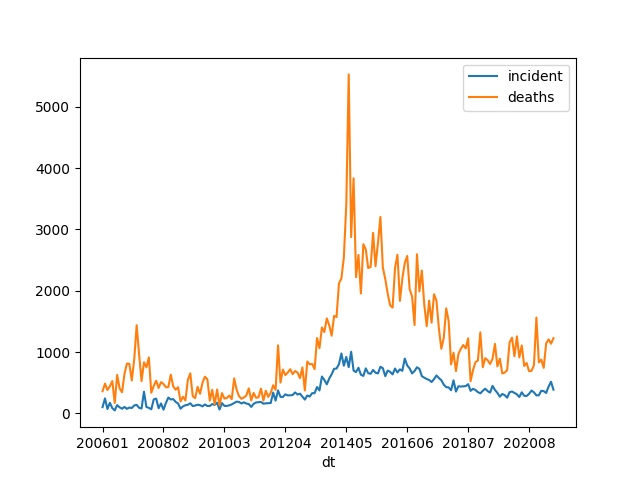

# Conflict Statistics

### UCDP/PRIO Armed Conflict Dataset

[Data](https://ucdp.uu.se/downloads/)

Deaths, Incidences, Globally

```python
import pandas as pd

def overall_deaths(mon):
   url = 'https://ucdp.uu.se/downloads/candidateged/GEDEvent_v22_0_%d.csv' % mon
   df = pd.read_csv(url)
   g = df[['country','deaths_b']].\
       groupby(['country']).\
       agg({'country':'count', 'deaths_b': 'sum'})
   g.columns = ['incidents','deaths']
   return g.sort_values('deaths',ascending=False)

print (overall_deaths(mon=6).head(20))
```

```text
                          incidents  deaths
country                                    
Nigeria                          90     180
Ukraine                         408     128
Somalia                          17     116
Iraq                             25     109
Ethiopia                         11      73
Myanmar (Burma)                 117      71
Mali                             34      67
Burkina Faso                     20      57
Afghanistan                      48      54
India                            38      43
Niger                             7      42
DR Congo (Zaire)                102      39
Pakistan                         25      32
Central African Republic         11      28
Syria                            36      24
Yemen (North Yemen)              30      24
Philippines                      12      18
Egypt                            15      16
Cameroon                         33      13
Mozambique                       34      10
```

Details for Specific Country

```python
import pandas as pd

def country_attacked(mon, country):
   url = 'https://ucdp.uu.se/downloads/candidateged/GEDEvent_v21_0_%d.csv' % mon
   df = pd.read_csv(url)
   df1 = df[df.country == country]
   g = df1[['country','deaths_b','side_b']].\
       groupby(['side_b','country']).\
       agg({'side_b':'count', 'deaths_b': 'sum'})
   g.columns = ['incidents','deaths']
   return g.sort_values('deaths',ascending=False)

print (country_attacked(6, 'Syria'))
```

```text
                              incidents  deaths
side_b               country                   
Syrian insurgents    Syria           22      27
SDF                  Syria           16       8
Civilians            Syria            8       0
Government of Israel Syria            1       0
Government of Syria  Syria            1       0
IS                   Syria           15       0
```

<a name='gtdafrica'></a>

### GTD Africa

Global Terrorism Database focuses solely on terrorist attacks. Below
is code for Africa, btw 2005 and June 2020. 


```python
import pandas as pd

df = pd.read_csv('gld.csv',sep='|')
df1 = df[(df.region_txt.str.contains('Africa')) & (df.iyear > 2005)]
df1['dt'] = df.apply(lambda x: "%d%02d" % (x.iyear,x.imonth), axis=1)

g1 = df1.groupby(['dt']).size()
g2 = df1.groupby(['dt'])['nkill'].sum()
g = pd.concat([g1,g2],axis=1)
g.columns = ['incident','deaths']
plt.savefig('gtdafrica.png')
```



[Data](https://www.start.umd.edu/gtd/contact/download)

<a name='ukraine'></a>

