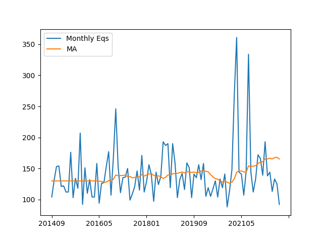

# Natural Disasters

<a name='fires'></a>

### Fires

Data comes from [FIRMS](https://firms.modaps.eosdis.nasa.gov/active_fire/),
Fire Information for Resource Management System,  I read their MODIS
CSV dataset for the world, for all fires within last 7 days and filter
out fires below a certain brightness threshold. MODIS works through
satellite images, it scans for certain brighness, color on all Earth
images.

```python
import impl as u

u.modis_fire(0,0,18)
plt.savefig('fires.jpg',quality=40)
```


History

Annual count for worldwide fires; based on FIRMS [data](https://firms.modaps.eosdis.nasa.gov/country/),
go to Country Yearly Summary [.csv] page and download.. modis_[year]_all_countries.zip 
for the year you are interested in. Based on select years, the code below scans
all countries, counts number of fire (pixels) above a certain brightness threshold.

```python
import pandas as pd, zipfile, datetime
THRESHOLD = 450.0
count = 0
for y in [2000,2005,2010,2015,2020]:
    with zipfile.ZipFile('modis_%d_all_countries.zip' % y, 'r') as z:
          zfiles =  z.namelist()
          for zf in zfiles:
              if ".csv" not in zf: continue
              df =  pd.read_csv(z.open(zf))
              df = df[df.brightness > THRESHOLD]
              count += len(df)          
    print (y, ":", count)
```

```
2000 : 144
2005 : 4100
2010 : 7533
2015 : 11607
2020 : 16365
2021 : 23078
```

<a name='equakes'></a>

### Earthquake Stats

Global Fault Lines

[Data](https://github.com/GEMScienceTools/gem-global-active-faults)

[Code](eqfaults.py)

Output - [Download HTML](https://drive.google.com/uc?export=view&id=1ON81DXx_ZBxdfd2ak6MjbkkL6aXmKIAc)

Monthly Report

Monthly earthquake counts (greater than 5.0 in mag) since 2013.

```python
import equake, pandas as pd

df = equake.get_eq_all()
df['YM'] = df.apply(lambda x: "%d%02.0f" % (x.name.year,x.name.month), axis=1)
grp = df.groupby("YM").size()
dfp = pd.DataFrame()
dfp['monc'] = grp
dfp['ma'] = grp.rolling(window=20).mean()
dfp = dfp.interpolate(method ='linear', limit_direction ='backward')
dfp.columns = ['Monthly Eqs','MA']
dfp.plot()
plt.savefig('moneq.png')
```



Region

```python
import equake; equake.eq_region(34,35)
```

[Output](equake-out.html)

