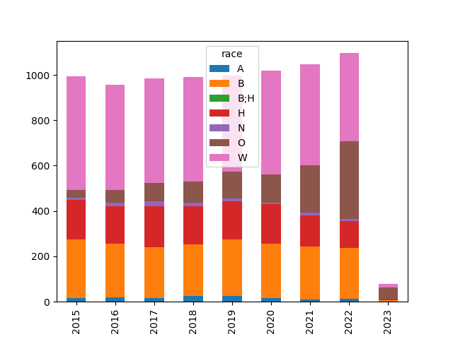
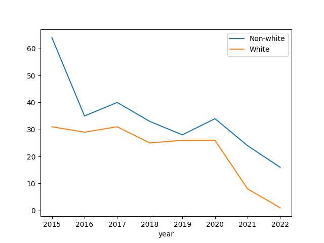
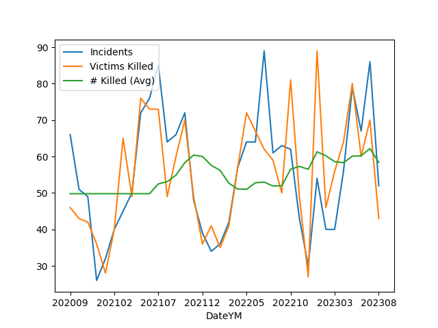
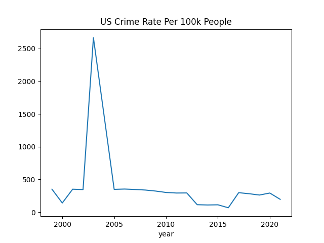
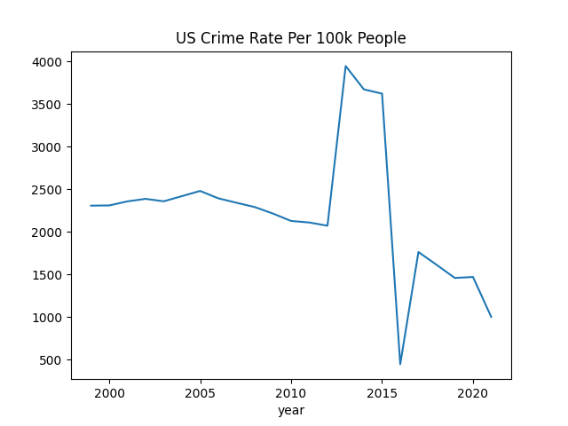

# Police, Crime in US

<a name='allshoot'></a>

### People Shot By the Police

Data is from WaPo Github [repo](https://github.com/washingtonpost/data-police-shootings).

All Deaths by Police Shootings, by Race

```python
import pandas as pd

f = 'https://raw.githubusercontent.com/washingtonpost/data-police-shootings/master/v2/fatal-police-shootings-data.csv'
df = pd.read_csv(f)
df['year'] = pd.to_datetime(df['date']).dt.year
df['race'] = df['race'].fillna('O')
g = df.groupby(['year','race']).size().reset_index()
g = g.set_index(['year','race']).unstack(level=1)[0]
g.plot.bar(stacked=True)
plt.savefig('allshoot.png')
```

A: Asian, B: Black, H: Hispanic, N: Native Am, O: Other, W: White



<a name='unarmed'></a>

Unarmed People Shot by the Police

```python
df = pd.read_csv(f)
df['year'] = pd.to_datetime(df['date']).dt.year
df1 = df[(df.race != 'W') & (df.armed == 'unarmed')]
df1.groupby('year').size().plot()
df2 = df[(df.race == 'W') & (df.armed == 'unarmed')]
df2.groupby('year').size().plot()
plt.legend(['Non-white','White'])
plt.savefig('unarmed.png')
```



<a name='usgun'></a>

### US Gun Violence

Data came from the [Gun Violence Archive](https://www.gunviolencearchive.org/reports),
see data for "mass shootings - all years". Plot is monthly incidents and deaths.


```python
import pandas as pd, zipfile
pd.set_option('display.max_columns', None)
df =  pd.read_csv('us-mass-shootings.csv')
df['Date'] = df.apply(lambda x: pd.to_datetime(x['Incident Date']), axis=1)
df['DateYM'] = df.apply(lambda x: "%d%02d" % (x['Date'].year, x['Date'].month), axis=1)
g = df.groupby('DateYM').agg({'Incident ID':'count', 'Victims Killed': 'sum'})
g['# Killed (Avg)'] = g['Victims Killed'].rolling(10).mean()
g = g.interpolate(limit_direction='both')
g = g.rename(columns={"Incident ID": "Incidents"})
print (g.tail(5))
g.plot()
plt.savefig('gunvio.png')
```

```text
        Incidents  Victims Killed  # Killed (Avg)
DateYM                                           
202304         56              64            58.3
202305         79              80            60.1
202306         67              60            60.2
202307         86              70            62.2
202308         52              43            58.4
```



<a name='fbi'></a>

### FBI Crime Data, UCR

The FBI site [4] and data.gov API publishes crime data. Data from the
first the so-called "Table 8" is for 1999-2019. The rest from the API,
see the zip below [3]. The xls to csv conversion code is in `util.py`.

In order to retrieve an entire year from the API data is retrieved for
each agency (PDs), the master list is in `agencies.csv`. Sign-up and
get the key [2].

Example,

```python
import requests, json

agency = "AL0010100" # Bessemer Police Department
year = 2019

key = open("../../0119/2019/05/.key/.datagov").read()
url = "https://api.usa.gov/crime/fbi/sapi/api/summarized/agencies/%s/offenses/%d/%d?api_key=%s" % (agency,year,year,key)
response = requests.get(url)
res = json.loads(response.text)
res['results'][0]
```

```text
Out[1]: 
{'ori': 'AL0010100',
 'data_year': 2019,
 'offense': 'aggravated-assault',
 'state_abbr': 'AL',
 'cleared': 3,
 'actual': 319,
 'data_range': None}
```

```python
res['results'][1]
```

```text
Out[1]: 
{'ori': 'AL0010100',
 'data_year': 2019,
 'offense': 'arson',
 'state_abbr': 'AL',
 'cleared': 0,
 'actual': 0,
 'data_range': None}
```

Crime Rates

```python
import fbi
df = fbi.crime_annual_summary(['homicide','rape','robbery','aggravated-assault'])
df.rate.plot(title='US Crime Rate Per 100k People')
plt.savefig('rate1.png')
```




```python
df = fbi.crime_annual_summary(['burglary','larceny','motor-vehicle-theft','arson'])
df.rate.plot(title='US Crime Rate Per 100k People')
plt.savefig('rate2.png')
```




References

[1] [FBI](https://crime-data-explorer.fr.cloud.gov/pages/docApi)

[2] [Data.gov signup](https://api.data.gov/signup/)

[3] [Data](https://drive.google.com/uc?export=view&id=1v1oYTeH7wQpnB-Cy1XxEKie72hpqv6GS) (zip, 10 MB)

[4] [FBI, Crime in the US](https://ucr.fbi.gov/crime-in-the-u.s/)

