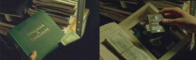

# Week 36

The key word is "planification" :) This word is definitely added to my regular-use dictionary along with "strategery" :) which was popularized in Saturday Night Live timeless sketch. Enjoy,

---

After watching all three seasons of Lost, I could not help but feel a distinct tinge of unsatisfied confusion of a good kind. I am sure that is by design and I will talk about this and some conclusions later on. I did some searching online, stumbled upon articles discussing "philosophy of Lost", and references to books such as "Lost: Why are we all stuck on that island", and many other rumblings that I decided it's time to say few words about this TV land phenamenon.

I am not going to blabber about namesake connections between John Locke in the island and the philosopher John Locke, who in my view, are similar as night and day. John Locke of Lost is the believer, the hunter and a mystic. John Locke of England thought up the idea of limited government, checks and balances, the representative body (the parliament). This Locke was friends with Isaac Newton, Lost Locke is friends with dead people and drug addicts. How's that relate? You guessed right. It doesn't. OK, there is some mad Russian in Lost who is named after a true Russian anarchist, but, c'mon. Is the Island Russian dude really an anarchist? He is an automaton who interestingly never seems to die. So the philosopher and historical connection angle to Lost is very weak, IMHO.

No - if a show captures the imagination of this many people, from all walks of life who have no idea of the philosophers and philosophies, then we must look deeper, perhaps subconcious connections that people are makng with this show and their life. SUch connections can only come from psychotic events that scarred US psyche, that are fueling its growth, that formed its foundation and backbone. We must relate Lost to how people LIVE, and work and think. Daily. We need to show how the twists and turns and the basis of Lost is connected to the times we are living right now, not to dead philosophers and other characters hundred years past. And terein lies the connection and the appeal of Lost.

Let's us start with the land:

The island of Lost represents United States of America. Any objections? The plane crashes, and people who are mostly Americans "land" on the island "by accident" - wasn't that how America was discovered if I am not mistaken? The (new) Americans are isolated for a long time from events and issues of the outside world, just like first Americans were when they founded their new country.

The people:

.. are a very mixed bunch which symbolizes a well-known US ideal of melting pot (or tomatoe soup) - people from diverse backgrounds unite in a common goal, which, for the first 3 seasons seems to be getting off the island. But by the end of season 3 finale, we saw that "getting out" was not supposed to happen, and this story line seemed to punish the people who did get out. On top of this, Lost island scenes, especially at the beach, are filmed in an almost paradiseseque fashion to make the island look very appealing, somewhere you would want to be at; White sand, blue, very blue sea, beatiful women and cool friends, characters of all stripes - who would not want to be there! Sign me up man! That's the feeling they want you to have.

Plus, I am sorry but the outside world seems to suck for most characters of Lost. John Locke had lost his kidney to his dad who was a con artist, Jack was divorced, Sawyer was in the slammer, Kate was on her way to prison, Koreans were unhappy, could not conceive, the black lady was nearing certain death. While I aggree certain amount of angst is these people's lives necessary as a dramatic tool, it is apparent that there is lots of it here which signals me all the passangers are better off on the island than not - on the island Locke can walk, black lady is cured, Koreans are happy and having a baby and Jack is acting as a leader while still practicing his craft, saving people's lives. Hence, the message is the island, therefore America IS GOOD. We are BETTER OFF HERE.

"The others" symbolize not only the natives of America, but at same time, also the indust-real mentality who is battling (and losing) with newly developing third wave society in America. You see, "the others" always capture, abuse, limit movement, hide information of/from the new arrivees of the island. In other words, they are practising high levels of second wave-jutsu on our characters. Remember Jack when he was captured in 3rd season and keeps asking information? Where am I? Who are you? But he gets no satisfying answers for a long time. Limiting the flow of information and freedom and manipulating people through these is a typical integrator elite occupation of this passe world. We of Third Wave still do remember this mentality and do not like it even if we encounter it subconciously - in this case, in a TV show. We do like however our heroes in Lost because they are on our side. They have skills, they are independent and they are good at forming a network. What is the motto of the show? Live together, die alone. It is the first speech Jack made asking people to hang together (or hang seperately -another pearl of wisdom from American history).

What's another interesting dramatic twist is that as much as "the others" try to limit the flow of information, these "island Americans" do get information through other channels. Just like in a Third Wave society information starts flowing around, over, under the integrator elite which weakens their hold on the ruled people, new islanders, or John Locke for instance, seems to get his information directly from the island. This is such an excellent dramatic tool that deserves a mention. Talking to the island so TW, I mean, he could have plugged his brain to some Matrix like observation machine for all I care, the result would have been the same - people figure things out in Lost, or, are on their way to.

In the beginning of the post, I mentioned events that scarred US psyche. This event is none other than September 11, obviously. Crashing plane, dying people, etc. Lost is dealing with this emotional scar as well as other Holywood productions - if you remember, the crashing plane happened to be the first thing that got saved when "Superman Returned" to our humble planet in its newest reincarnation "Superman Returns". Through this action the filmmaker answered a subconcious question/worry that "if man of steel was around, he would have saved us all" maintaining the heroes status and "saving the plane" in the process. The scene where Sman tells the passangers "flying is still the safest way to travel" after the rescue made me roar in laughter for this very reason. During Sep 11, Sman seemed to be conveniently far, far away, on a vacation under the red sun, not being able to save us, bcz after all, he can't be at two places at once.

Back to Lost, "the plane" in Lost is a symbol, a vehicle that brings people "to the island" saving them from their miserable lives and giving them a newer, better life with newer, better friends. Hence, the negative feelings associated with plane crash is battled through this symbolism, turning it on its head and making it something good. This was done to such a point that in S3 finale, Jack was eagerly trying to find a plane which would crash, yes you heard right, he wanted to be in a crashing plane so that he would be back on his beloved island.

This, in a nutshell, is the basis of the appeal of Lost. The island life, as in current life, is ever-changing full of surprises, dangerous and confusing, the bad guys are well known to our psyche in the form of industrealists, integrator elites who see people as "things" to be studied, proded and jailed, and "back to basics" and concepts like network, communicating and knowing people is very important in the society we are living in. Also, "do it yourself" approach is showcased heavily in the show which mirrors its coming back in TW society as well. I would like to add this does not make the islanders "go to nature" hippies who, scared from TW changes, went into another extreme and devolved into 1st wave and started to shun all forms of technology - no, Lost islanders like techology, in the form of Said, or others, they actively use, repair, seek it when they can.

Before I close: I think making an Iraqi a torturer and having him torture Americans is the best liberal revenge I've seen in TV so far, and if that's not a jab in second wave Bushies' eyes, I don't know what is. Taking a representative of a country abused by US and turning him into a hero is a kind of storytelling twist which still makes me watch US TV that shows, at the same time, progressive people are still alive and well in United States of America.

How much do I like the show? While I am not madly into it, it definitely has its moments (except the flashbacks, the lives are too regular for my taste) and it does make a pleasant and fun entertainment. My main entertainment meal happens to be "real" scifi with less confused people and more technology but I do enjoy an occasional foray into mystery, sea, sunshine and friendship of which Lost seems to have lots of. I will keep watching and posting my thoughts here.

Live together, die alone!

---

Time of My Life

I am lovin' the show called How I Met Your Mother! I guess stars aligned just right so people at my age at the peak of their "single" spending power get a show geared towards directly at them. It must have been time.. I mean, who else can enjoy the through dress down exercised on Dirty Dancing? All the Patrick Swayze references? I am so really enjoying (part of) Holywood and the showland at this point. I used to read Spiderman, now I have the movie with all bells and whistles. I used to watch Simpsons, now I have two hours worth of it! Cool^2 bro!

Back to HIMYM. In episode "First Time In New York". Everyone recounts their "first time" doing "you know what". The person who is least expected to have his first time beyond his 20s happens to be Barney, the womenizer/player-in-chief who tries to hide that fact and whenever asked, starts telling story of the movie Dirty Dancing - "we were in love, but his dad would not approve. I would say it was the time of our lives" [here they play the soundtrack Time of Our Lives]. I mean , I was on the floor laughing. It doesn't get any better than this. Why does 80s get me cracking up so bad? Secretly, I miss those times I guess. It was so plastic. You know, like shiny, plastic, and fake. Like shiny robots (see Slap Bet of HIMYM). It was innocent, stupid and fun. It was part of my generation's history..

But in any case, all Holywood, TVland, direct-to-DVD productions. Hear this: Do whatever you do, just keep'em coming as fast as you can. When the time comes you make nostalgic movies about Ashlee's, Paris' and whatever other skanks there are - I will stop watching then. By that time, I will probably have my own VR gaming company who lets people enjoy their dream world through an interface hooked up through their brain - which will make art production irrelevant and hence any acting useless, but until then, please keep doing whatever you are doing.

Plus, just in case this civilization goes defunct, you gotta have some place to have all your social references stored. Come on. Gotta think long term.

---

Here is the comment I've posted on onegoodmove.org on
postmodernism:There are some well-known postmodern stances one which
is their "disdain of science". Because everything is relative, nothing
can be known -or so the thinking goes- hence it's all unnecessary and
futile to theorize, prove anything. In big questions, they might very
well be right, but they are throwing the baby with the bathwater. We
don't need to know all curvatures of space/time to go to the moon, or
write prove a mathematical theorem. I remember first time I studied
post-modernism, I thought "this sounds so anti-everything that it
stinks of French". And voila! It was a French invention. Even in art
there was this fool called Duchamp who put a pot (for peeing) on
display and said "this is art". Why? "Just because I said so". That is
a common thread in postmodernist thinking by the way. Another biggie
in the field is/was the late Jean Baudrillard. Yes, that Baudrillard
the inspiration for the Matrix movies - look closer in a scene where
Neo holds a book it says "Simulation and Simulacra" on the
cover. That's the Baudrillard book that supposedly inspired the
Wachowski brothers. However, the movie became something other than
postmodernist movie on the way, it slammed industrialization in its
own way not the way Baudrillard intended -and that's good-. :) I
believe there is a lot of Toffler in Matrix, who, by the way despises
postmodernism.

---

Man of Steel.. And the Third Wave?

Changes that happen organically, as most big changes do, can make
their effect be seen, felt, sensed beforehand, to a certain degree,
through various channels in human activity.  I believe we are already
seeing this subliminal ripples of the Third Wave in many places. Most
prominently in art.Which should not be surprising. Art, being a free
form, the channel for free expression, would be the perfect place for
humanity's vision to consciously or subconsciously come out. And of
course by art, I don't necessarily mean some pompous art, painting,
classical music what not. By art, I mean, movies and TV shows.Check
out Smallville for example. Nothing more than 30s Superman story acted
out in 2000 context - right? Not quite. Let's ask this question.. What
makes this story still so compelling? OK, now let's look at the bad
guy... Lex Luthor.What is he? A rich man. He owns a corporation. He
wants power. Money. He doesn't exactly enjoy his work. He was driven
to it by necessity, environment, his father, etc.  But he is part of a
SYSTEM. Ladies and gents who have read Toffler's work.. What does that
sound like?Yes.

The bad guy in Superman story is a Second Wave industrialist.There are
million other clues that he is painted this way. Check this out. He
lives in a mansion (industrialist European style), he plays the piano,
enjoys classical works which, we know by now, are perfect vehicles for
an "industrialist" take on art. In a symphony orchestra, there are
work divisions (instruments), a chain of command (conductor,
instrument lead, instrument) where the music is played to a precise
specification which is the perfect recipe for an industrialist. So Lex
Luthor is a solid Second Waver.And then, look at Superman. Yes,
granted that he embodies all the abilities that Second Waver would
salivate for... Strong, fast, smart. But, look carefully to his
daytime persona: Clark Kent is a reporter which means he is a seeks,
stores and manipulates information. That is, he is a knowledge
worker. This works perfectly for Superman persona too in fact, because
even with all his powers Sman still lacks the ability to be everywhere
at once - hence he needs to prioritize, choose, and that's where
information comes in.Clark Kent as Third Waver knowledge worker view
is even more true for the modern reincarnation of the Superman story,
Smallville, where we are now accustomed seeing Clark in regular
clothes, dealing with computers, "borrowing" them for at superspeed,
talking on cell phone with his band of energetic
technophile/hacker/photographer friends while trying to take down Lex
Luther's next evil plan for humanity... and doing this using mostly
information.

In a typical Smallville story, the use of a superpower is usually the
last thing that happens.It is my belief that that's exactly why this
particular story can still capture our imagination at this day and
age. Because setting aside all the childhood fantasies where we want
to be a man of steel, run faster than a speeding bullet, story of
Superman and the universe it resides in still contains the most basic
ingredients that we find similar in our longings for a better
future. We don't want to be Second Waver industrialists and we would
like to move on to the Third Wave.In short, we would like to be Third
Wave Supermen.

---

