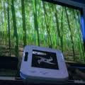
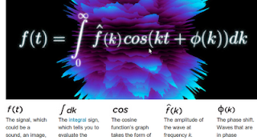
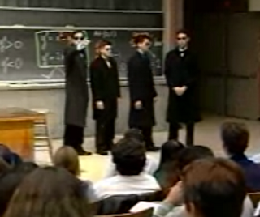

# Week 24

Physically walking into a bookstore, looking at a magazine stand could
translate into the Information Age.

Here is the idea: we could incorporate some "localness" to our
existing IT services. We do this simply by utilizing the existing Wifi
structure. Wifi already allows connection to a hotspot, and over this,
one can serve local HTML pages to any browser w/out any need for
larger, outside Internet connectivity. So bookstores have their own
hotspots, on which they run their own local apps (with their local
server in-house). When a customer is in the bookstore, mags or digital
pictures of their covers are displayed in the stand where they usually
are. You point your tablet, smartphone, etc. to one of these, take a
photo, and the bookstore app that was just served to you which
determines the mag, downloads it to your tablet, and you start
reading.

All of this happens locally, w/out outisde Internet connectivity, but
we are utilizing Internet tech. Time you spent reading could be
tallied, and some payment scheme can be worked out between customer
and the "bookstore". Tablets could be customer's or ones that belong
to the bookstore. When customer steps out, s/he is outside the range
of the local Wifi zone. The app stops working.

Why such a system? Paper based solutions are dying, but walking into a
store, browsing, looking at things still has value. It's a chance to
walk out, walk around, read through some stuff, and maybe even
socialize. This action is not currently monetized.

There are lots of opportunities, lifestyle actions like this that are
ripe for monetization. Such locality aware apps can be a boon for
bookstores, coffeeshops, even supermarkets. Location awareness has
already produced some successful apps such as Foursquare. The approach
outlined above is even more local, it is in a sense "hyperlocal", with
zero central servers.

---

Here is the new Wii U controller showcased in the gaming event,
E3. See that ninja star shape on the tablet? You hold it sideways
toward the game, brush your hand on the tablet controller, towards the
TV and it throws a ninja star for you inside the game. Very cool.

---

Good idea. I like it. 

Fast Company: "The Obama administration is leading a global effort to
deploy “shadow” Internet and mobile phone systems that dissidents can
use to undermine repressive governments that seek to silence them by
censoring or shutting down telecommunications networks.

The effort includes secretive projects to create independent cellphone
networks inside foreign countries, as well as one operation out of a
spy novel in a fifth-floor shop on L Street in Washington, where a
group of young entrepreneurs who look as if they could be in a garage
band are fitting deceptively innocent-looking hardware into a
prototype “Internet in a suitcase.”

Financed with a $2 million State Department grant, the suitcase could
be secreted across a border and quickly set up to allow wireless
communication over a wide area with a link to the global Internet"

---

"Much of “science” today is not so much scientific as scientistic. That
means that the forms and behaviors of science are used, but the
underlying logic is missing. Scientism is very much like the
phenomenon of cargo cults, in which Pacific islanders built airports
and control towers out of wood in order to bring back the planes that
came with World War II. They didn’t realize that air traffic control
panels actually did something, so they simply built facsimiles out of
wood.

We can see scientism in every aspect of published research today. We
see it in papers that think that theory is a set of interconnected
hypotheses, rather than as the reason why X leads to Y. We see it in
work in which each hypothesis is justified by a collection of
independent, even mutually contradictory, reasons why the hypothesis
must be true. Instead of the hypotheses being tests of an underlying
theory, the hypotheses are the principal claims of the theory, and the
justifications for these hypothesis can be a smorgasbord of ideas that
embody entirely different theories.

Another aspect of scientism is the belief that there are universal
best practices in research that are independent of the research
question and the research setting. As a result, there is a great deal
of argumentation from authority. E.g., we use this measure because so
and so did. We even see it used to justify hypothesis: we expect X to
lead to Y because so-and-so said it would"

---

Very nice. Wired talks about the formula used in noise cancelling
headphones; this is the kind of thing I'd like to see more in
Wired. Programs do stuff, but mathematical statements are about
relationships. They dont do, they say what is.

---

[Link](http://www.independent.co.uk/news/uk/home-news/ninety-gaffes-in-ninety-years-2290148.html)

Famous gaffes from Prince Philip. They are all good, but #18 really
cracked me up.

"If it has four legs and it is not a chair, if it has got two wings
and it flies but is not an aeroplane and if it swims and it is not a
submarine, the Cantonese will eat it." Said to a World Wildlife Fund
meeting in 1986.

----

Here is something weird from one Massachussets Institute of Technology
lecture. In the middle of a mathematics lecture, four guys dressed up
like gangsters a la Reservoir Dogs walk in the classroom, and in
unison go "[clap, clap] dont be late", and the dude on the left points
to someone and adds "that means you pretty boy". Just weird man...  I
like pranks, I like movies, and I have no problems with comedy. But
this is just an odd display of common thugs.In Western terms, inside
that classroom, it is Greece.These fuckers are from Rome.Not cool.

---

Interesting point: before building his jetpack technology, Glenn
Martin spent years studying the mathematics behind flying. He didn't
just whoop out some powertool and started cutting shit. That's what
you usually see in movies though when inventors are involved in a
"I-am-building-something-cool" scene. There might be some kind of
"mission music" in the background, dude dances, and goes
"yes!". Surely this appeals to an Artisan's "tactile" view of living
in the now, to a "do it" inclination, but the real work for such
inventions go on silently, in the inventor's head.

Story about Martin Jetpack:

"As a five-year-old boy in the 1960s, I grew up thinking that we’d
have holidays on the moon and flying cars and jet packs," [Glenn
Martin] says. "But when I turned 21, I was quite disappointed to find
that we hadn’t gotten them yet."

Without as much as a second thought, Martin went about changing that.

As a student at the University of Otago in New Zealand, Martin would
spend a fair amount of time in the library—especially as a way to stay
warm during the winter—and during those prolonged library visits he
began to study existing jet pack technology. Unimpressed that
then-current examples could fly only for 26 seconds and carry a pilot
weighing less than 160 pounds, Martin set out to create a better
version. After three and a half years studying the mathematics behind
it, Martin [..] built, in his garage, a jet pack that could carry a
220-pound pilot for 30 minutes"

---

Ryan Tate, Gawker: "If you want Facebook to spend millions of dollars
hiring you, it helps to be a talented engineer, as the New York Times
today suggests. But it also helps to carouse with Facebook honchos,
invite them to your dad's Mediterranean party palace, and get them
introduced to your father's venture capital pals, like Sam Lessin did
[..]

We'll let you in on a few things the Times left out: Lessin is not an
engineer, but a Harvard social studies major and a former Bain
consultant. His file-sharing startup drop.io was an also-ran
competitor to the much more popular Dropbox, and was funded by a chum
from Lessin's very rich childhood. Lessin's wealthy investment banker
dad provided Facebook founder Mark Zuckerberg crucial access to
venture capitalists in Facebook's early days. And Lessin had made a
habit of wining and dining with Facebook executives for years before
he finally scored a deal, including at a famous party he threw at his
father's vacation home in Cyprus with girlfriend and Wall Street
Journal tech reporter Jessica Vascellaro. (Lessin is well connected in
media, too.) Facebook platform chief Dave Morin was at that one, and
at another exclusive party with Lessin in Cancun, which also featured
Facebook co-founder Dustin Moskowitz [..]

We mention all this not to begrudge Lessin his wealth but to use him
as an educational case study, and a much fuller one that the Times
presented this morning. With the right connections, some face time at
the right parties, and perhaps the right father, maybe you too can
unload your unprofitable startup, get a sexy new job at Facebook, and
even somehow become a national newspaper's poster child for "talent"
along the way"

---

Quora: "For quite a while we've been at a stage of technological
evolution where most people don't have to work. The reason we're not
living that life of leisure, trying to come up with fun and meaningful
things to do, is not technological. We could say that it is economic,
but really it is a large scale scam, perpetuated through a symbiotic
relationship between big business and big government. This economy is
based on keeping most people busy, so they can make money, so they can
buy products. Most jobs are busy work. People do what they're expected
to do, more or less, but in the bigger picture most of makes no
sense. It only makes sense in response to the work of others, doing
stuff that doesn't really make sense either. Advertising is big
business, needed to get people to buy other stuff than they would if
they were well informed. Lawyers get paid well for writing the small
print in contracts or on product packaging which nobody reads. Tax
accountants earn their living by being very fluent in a labyrinth of
rules that change every year. Law makers earn their keep by coming up
with more rules, or changing the ones that are there. The actual
production is a very small percentage of all of it.

The system will resist its transformation into a more sane and
efficient arrangement. Right now, if more of the human work gets done
by machines, there will be increased unemployment and a crisis. Then
somebody will invent some more busy work, or start a war, or loan out
more money, and make it look like everything is buzzing. No, the whole
thing would have to be changed, so the economy no longer even pretends
to be based on human work and hourly wages. It needs to be based on
measuring actual value, and maximizing it for all of us.

Then, what would we do, if we had a different kind of economy and we
no longer had to do that kind of work? We'd become free to discover
how to really add value. How to do something actually worthwhile. That
has never been to be an accountant all your life. The real stuff to do
in life is the stuff you're burning for. That won't just be idle
entertainment. Most people, if they really, really had a choice, would
choose to do something good and constructive, not just for themselves,
but for their family, their community and for the world. The things to
do would no longer be just mechanical work functions, doing what
you're told, showing up for 8 hours per day. No, we're talking about
more creative stuff. And, even if there are machines that can do all
the heavy lifting, there's still plenty to do, to design things, to
make them more enjoyable, more useful, more fun. There's art, there is
science, there's certainly no lack of things to do that are
worthwhile. There are many problems to solve. We'd be working on
those, instead of living fake work lives for the sake of the economy"

---

\#fascinating

In his memoir I Am Spock, Leonard Nimoy writes about his "trek", about
how he came to know, and developed Spock -- the famous character on TV
show Star Trek OS. He mentions one day he has a Eureka moment, then,
he claims he finally "gets" his character. It happens in a scene where
Spock is looking at some space anomaly on the viewscreen and in awe of
what he is seeing, he mumbles himself: "Fascinating".

At this moment Nimoy says he truly understood the soul of his
character. But what was Spock's soul?

First off, he was a scientist. It should be fitting than that a lot of
science's essence is captured in this single word. If someone is
fascinated with new knowledge, new data, this means that person is
able to be fascinated, he is able to say and think "I did not know
everything about what I am witnessing, I did not even expect what I am
seeing, but here it is... And it is fascinating". Hence the word
indicates a person who knows what she does not know. A prerequisite
for science.

Second, this word is most likely uttered by someone who appreciates
knowledge, almost at an aesthetic level. It is like a painter enjoying
a painting, a composer in awe with a brilliant composition. Third,
this person goes after, wants, welcomes new knowledge. Also
prerequisites for good science.

---

In 2004, a Taiwanese electronics firm named MediaTek unveiled its
latest product--a cell-phone-in-a-box aimed at manufacturers, equipped
with everything they needed to make the guts of a working phone on one
chipset. Write some software, add features, and snap a plastic case on
the front and you've produced a new model. It was an immediate hit
with China’s notorious counterfeiters, the shanzhai [..]

The key to the cheap phones was the combination of MediaTek’s chipsets
and the vast component bazaars of Shenzhen. While MediaTek’s engineers
focused on adding software features such as touchscreen recognition
and instant messaging to their chips, shanzhai tricked out basic
models with speakers, telescopic photo lenses, and flashlight-strength
LEDs. Before long, “Nckias” and “Blockberrys” began appearing across
Shenzhen and Shanghai.

With their tiny production runs, shanzhai could manufacture a thousand
phones, seed the local markets, see if they caught on, and then crank
out some more [..]

Today, the shanzhai market has moved beyond China, and even India
[.. L]ast fall, The National--the state-financed newspaper of the
United Arab Emirates--warned “some analysts believe China’s bandit
phone makers may now be targeting the GCC region,” referring to the
Gulf Cooperation Council and its members: the UAE; Qatar; Kuwait,
Saudi Arabia, Oman, and Bahrain.

A few months later, half its members were embroiled in the turmoil of
the Arab Spring. Although no one has drawn a straight line between the
appearance of shanzhai phones in the region and the protests that
followed, The National presciently noted at the time that “these
cut-price clones are not only saturating markets such as India [..]
and are thought to be being targeted at the Middle East region, too,
which has large numbers of consumers in cities such as Cairo as well
as high-end users in countries such as the UAE.”

And while they’re not equipped to run Facebook or Twitter, the current
list of features for MediaTek’s phone includes everything else a
budding revolutionary needs to evade or expose government repression,
including video cameras, Skype, and Bluetooth--just the thing for
sharing government crackdown videos over your State
Department-sponsored mesh network--all for as little as $50.

---

A lot of mathematical modeling is really about being smart about the
algebraic statements, their transformations so that we do not have to
compute everything.

Let's take calculating the slope of x^2 at point x=5.

We could use the brute force approach, and *start coding* right away,
just *do it*, we'd come up with a numerical solution like this: We
pick a step size for x, and calculate x^2 before and after steps, then
get the difference and divide by step size (for the slope).

( ((5+0.01)**2) - 5**2 ) / 0.01

This gives 10.01. Right there however, we have some questions. What is
the right step size? Even if we know an approximate good step size,
let's count the operations the computer had to use: one addition, two
exponentiation, and one division. 4 operations in total.

But Calculus gave us the derivative. The derivative works
algebraically. Under the hood, it was formulated using limits, the
black art of infinity; and that gave us the algebraic transformation
we enjoy today. It was an algebraic shortcut, not a numerical one. And
the derivative of x^2 is 2x. Let's calculate it:

2*5 = 10

In total: One operation. That is what using straight algebra gives
us. Not only it is more accurate, it saves us computation time. In
their modeling efforts modelers jump through many hoops, simplify,
transform, hoping that with the right move, that'll make swaths of
computational tasks unnecessary, and the result more accurate.

The Fourier Transform shown in the previous Wired article uses that
kind of sophisticated algebra-fu. In order to reach that final
statement, the inventor used many algebraic tricks such as
integration, the knowledge of how cosine and sine behaves under
integration so that he could reach that final, clean, concise
statement. Some of these moves are ingenious, some are downright
devious. G. H. Hardy was right. "[There is no other] subject in which
truth plays such odd pranks. [Math] has the most elaborate and the
most fascinating technique, and gives unrivalled openings for the
display of sheer professional skill".

---

