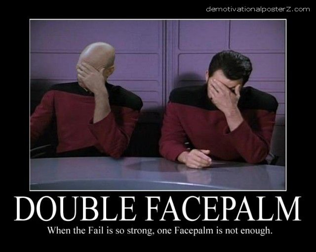

# Week 44

If due to increased efficiencies in the economy people are out of
work, the solution cannot be "reduced work hours" -- this would be a
modernist, industrial (therefore backward) solution to the problem;
reduced work hours are another standard, another potential restriction
for business. Instead, government giving out 1K, 2K $ per month to
everyone is better; this gives people the freedom to do whatever they
want with that money, so supply / demand signals still work. The
extraordinary wealth that is created due to high-tech production --
which inherently favors the few -- is shared by everyone.

I repeat: the originator of this idea is not Karl Marx, but Milton
Friedman. Marx, the idealist moron that he was, went to a completely
different (read: wrong) direction.

Another reason why such a distribution mechanism is important: in a
3rd Wave economy is that the outcome of projects become less and less
predictable. It is not a coincidence most recent management advice in
business is the so-called "Trystorming" approach which advocates
failing fast, quick while trying many solutions. But "trystorming"
requires trying and failing many times, and such risk taking will work
best in society with a wide social net.

---

It is interesting to note that one of the giants of computer science
and programming, Donald Knuth is also the creator of the typesetting
system TeX which forms the backbone of scientific publishing (I
personally use a variant called LaTeX that lets me quickly prepare a
document, using special codes for different types of structures). If
the printing press gave the spark of renaissance, reformation, then
one of the pioneers of what I consider a digital renaissance also
enjoys a similar figure, this time being a creator of a digital
publishing system. We have a digital Gutenberg and Galilei embodied in
Knuth.

The benefits of this digital publishing system cannot be
overstated. For my work I have all kinds of shortcuts, templates that
let me write a scientific document almost as fast as I can think
it. When I am done, with another script the whole thing goes to the
Net, one piece is added to a tracking system, generated PDF file is
appended to another master file. The whole thing grows, becomes
searchable, can be watched, downloaded by others as soon as I make put
this material "out there".

If this is not revolutionary, I don't know what is.

---

"A comment posted to London’s Guardian newspaper said it best:
“Censorship, like everything else in the West, has been privatized.”
The writer [was ..] referring to news that Wikileaks — the online
whistleblower that has been embarrassing governments and corporations
worldwide by disclosing their secrets — was suspending operations.

Why? Had its leader, the mercurial Julian Assange, been indicted? Had
the black choppers swooped in and taken him out? No, nothing that
cinematic. It was the bankers. A handful of big money handlers decided
they wouldn’t process donations to Wikileaks, it had exhausted its
reserves, and it was going broke.

The fund cutoff started in December 2010. That’s when Visa,
MasterCard, PayPal, Western Union, Amazon and Bank of America
discovered their patriotic duty"

---

"Jeremy Rifkin, Der Spiegel, 2005

No one is dealing with the real employment problem in Europe. They're
afraid to have the real conversation. These jobs are never coming
back.[..] Outsourcing counts for about 5 percent or less of the jobs
that are disappearing. [..] The fact is that we're ending mass wage
labor. This is what's going on with all the companies I've been
working with.

The last great structural shift in labor occurred at the beginning of
the industrial revolution. We ended slave labor and that was a great
structural shift. For 10,000 years people held each other as
slaves. From an economic point of view, it became cheaper to feed coal
to the steam engine than to feed the mouth of a slave. The new high-
tech revolutions of the 21st century end mass wage labor -- meaning
the cheapest worker in the world is more expensive than the
intelligent technology coming online to replace them."

---

Continuous Rules

Longnow.org: "One day when I was having lunch with Richard Feynman, I
mentioned to him that I was planning to start a company to build a
parallel computer with a million processors. His reaction was
unequivocal, "That is positively the dopiest idea I ever heard." For
Richard a crazy idea was an opportunity to either prove it wrong or
prove it right. Either way, he was interested. By the end of lunch he
had agreed to spend the summer working at the company [..]

The technical side of the project was definitely stretching our
capacities. We had decided to simplify things by starting with only
64,000 processors, but even then the amount of work to do was
overwhelming [..]

Feynman's insistence on looking at the details helped us discover the
potential of the machine for numerical computing and physical
simulation. We had convinced ourselves at the time that the Connection
Machine would not be efficient at "number-crunching," because the
first prototype had no special hardware for vectors or floating point
arithmetic. Both of these were "known" to be requirements for
number-crunching. Feynman decided to test this assumption on a problem
that he was familiar with in detail: quantum chromodynamics [..]
According to Feynman's calculations, the Connection Machine, even
without any special hardware for floating point arithmetic, would
outperform a machine that CalTech was building for doing QCD
calculations.By the end of that summer of 1983, Richard had completed
his analysis of the behavior of the router, and much to our surprise
and amusement, he presented his answer in the form of a set of partial
differential equations. To a physicist this may seem natural, but to a
computer designer, treating a set of boolean circuits as a continuous,
differentiable system is a bit strange. Feynman's router equations
were in terms of variables representing continuous quantities such as
"the average number of 1 bits in a message address." I was much more
accustomed to seeing analysis in terms of inductive proof and case
analysis than taking the derivative of "the number of 1's" with
respect to time. Our discrete analysis said we needed seven buffers
per chip; Feynman's equations suggested that we only needed five. We
decided to play it safe and ignore Feynman.

The decision to ignore Feynman's analysis was made in September, but
by next spring we were up against a wall. The chips that we had
designed were slightly too big to manufacture and the only way to
solve the problem was to cut the number of buffers per chip back to
five. Since Feynman's equations claimed we could do this safely, his
unconventional methods of analysis started looking better and better
to us. We decided to go ahead and make the chips with the smaller
number of buffers.

Fortunately, he was right. When we put together the chips the machine
worked"

---

---

There is a new breed of software developer / analyst who call
themselves "data scientists" who are mostly bunch of ex-IT programmers
with shoddy mathematics skills that managed to learn some statistics,
but all they really do is throwing some tools at an analysis problem.

Kaggle.com is a place where the these "scientists" meet. For those who
dont know, clients go to Kaggle with analysis problems and they
typically attach an award to the best analysis. Kaggle "crowdsources"
these problems to anyone who is interested, records, tracks
submissions, and selects a winner.

Recently there was a traffic flow analysis problem on this
site. There's been decades of research on traffic flow analysis, the
area in general is very similar to fluid flow -- you could easily view
traffic as a function u(x,y,t) at time t and position x,y, and build
from there. But no "scientist" has knowledge about partial
differential equations, so they go nuts using bunch of black box
methods that somehow identifies "patterns". The winner? Two dudes who
report a success rate "within 1 minute of real travel time" (and get
this, it is the best part) %73 percent of the time.

How would you feel if the plane you fly in obeyed the laws of physics
%73 of the time? Or your pressure cooker was only built to contain its
food %73 of the time? OK, these are high-risk, high-annoyance
situations, but still, there is something missing here. This data
science crap is middle-class scientism at its worst. Do we call Isaac
Newton an "apple scientist"? Wasn't he also analyzing data? So the
label sucks.

It seems we are failing to teach in schools, in literature what it
means to mathematically model things. Schools give students lots of
rote for solving neat problems that are all cooked up, but noone shows
how wave equation can be derived starting from few key assumptions.

There can be noise in the data. That's not a problem. What we try in
modeling is coming up with the best model so that the noise is
"normal" or Gaussian. Once you have that model, there are many fitting
tools that can fit the data, but there are no shortcuts while defining
that model.

These models are very challenging, smart, we should be teaching how
they are created, but instead, we give rise to monkeys that try to
circumvent "the noise" but are ironically slapped down by the same
statistics that they supposedly respect. We shared a post earlier
about funding way more physicists than necessary. Many of these
physicists research particle physics and any of them could enter that
competition at Kaggle and it would be a slapfest. But they dont. Why?
Because they are trying to uncover the mysteries of particles, while
data monkeys are busy looking for magic wands. Supply is not meeting
the demand here.

Watch for buzzwords in this space. People go nuts on stochastic blah,
or Monte Carlo methods. Well, Monte Carlo methods are great for
calculating intractable integrals, but for that, you have to know what
an integral is. Right Mr. G? Oh, and this method was invented during
the Manhattan project by physicists, and is deeply mathematical
itself. There are no shortcuts.

---

"People have come to see copyright as a tool of punishment, Europe's
technology chief has said in her strongest-yet attack on the current
copyright system.

Digital agenda commissioner Neelie Kroes said on Saturday that the
creative industries had to embrace rather than resist new
technological ways of distributing artistic works [..] "Citizens
increasingly hear the word copyright and hate what is behind
it. Sadly, many see the current system as a tool to punish and
withhold, not a tool to recognise and reward" [Kroes said].

The commissioner said online distribution and cloud computing offered
a "totally new way of purchasing, delivering and consuming cultural
works", and suggested that the existing legal framework around
copyright was not flexible enough to take advantage of this evolution"

---

A freely accessible index of 5 billion web pages, their page rank,
their link graphs and other metadata, hosted on Amazon EC2, was
announced today by the Common Crawl Foundation. "It is crucial [in]
our information-based society that Web crawl data be open and
accessible to anyone who desires to utilize it," writes Foundation
director Lisa Green on the organization's blog.

---

The US culture code for technology is FUEL. People eat not to taste,
but to "fuel up". The drive-in restaurant / concept is directly
related to this, these places look like fuel stations, and for all
intents and purposes, they are. You drive in, get fuel, just like you
drive in the gas station to buy gas for your car.

BTW -- we mentioned the US code for the car which is IDENTITY. Thus,
the comic book, movie Transformers is on code, because there are
walking, talking cars who have identities. German code for car
ENGINEERING, the guy who coded up those Google cars is interestingly
from Germany.

AB: "Americans seem to be eating constantly: in the car, at the movie
theater, at work, while watching TV."

---

The US culture code for technology is IT WORKS. People dont seem to
want perfection (the code for which, is DEAD). As long as something
works, it is fine.

Axel Boldt: "I am constantly amazed by the poor quality and
backwardedness of many technologies routinely employed in the US."

---

Agree 100%. For me 3D now is a negative that needs to be weighed
against potential positives of a movie. If a movie has a good
director, one great, two average actors, I might just see it. If this
movie is in 3D however, then the negatives outweigh the positivies,
and I'll pass.

"[..] 3-D for "Avatar" was absolutely stunning. Using 3-D technology
not to have things fly out at us from the screen, but instead to
create a realistic depth to what we were watching, was how 3-D was
always meant to be.

The interesting part was that the studios didn't pay attention to why
those buying tickets to "Avatar" were willing to spend more for
3-D. They were only paying attention to the fact that people were
spending more to watch a movie in 3-D.

Instead of Cameron leading a new evolution of filmmaking, we instead
got movies -- especially those already heavy in special effects -- to
get 3-D converted. Not filmed in 3-D ... converted in 3-D.

It was head-slapping. Hollywood had a hold of some excellent
technology, modernized by the genius of Cameron as a filmmaker, and
somehow smashed it into the ground. Audiences at first didn't know the
difference. They felt that the 3-D had to be as good as "Avatar," so
they would snatch up 3-D tickets, paying a premium for the privilege.

However, they would walk out disappointed. The 3-D experience in a
film like "Clash of the Titans" was not the same as what they saw in
"Avatar." And slowly but surely, people at the ticket counter decided
to stick with 2-D, and opt out of 3-D.

Yet, Hollywood sees that only as a negative blip on the overall radar,
and feel 3-D is going to come back"

---
