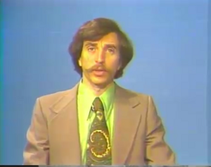

# Week 24

Saw this in Berlin -- very cool. There isn't a single controller,
"master of puppets", but multiple controllers working in tandem.

[[-]](https://youtu.be/cgQa8dbvEWI)

---

I think the colors on this man's outfit permanently blinded me.. My
God.. I took the snapshot while I was watching the lecture video for
MIT OCW Signal Processing class, taped back in 70s. I had to watch it
to find out more something, but I am not able to focus, the colors on
the teacher literally lull your mind.

Joking aside this is Alan V. Oppenheim, who wrote the book on signal
processing.. But.. what is up with that tie ? This is messed up stuff
right there. I fear the kind of fashion wave that can make a man wear
this, I am not kidding. Forget WWI and II man, we left some scarily
ridicolous period of time behind. Wheew.

---

Instead of simply censoring topics critical of the government or that
make China look bad, the study finds, the country’s human censors
specifically target posts that could lead to protests or other forms
of collective action, leaving ample room for China’s web users to
criticize its government [..].  

“This is an enormous program. Hundreds of thousands of people are
involved to help the government keep secrets…and the interesting
paradox is an enormous program like that, designed to keep people from
seeing things, actually exposes itself,” Mr. King said in an
interview. “An elephant leaves big footprints.” [..]

“Negative posts do not accidentally slip through a leaky or imperfect
system,” the paper notes. “The evidence indicates that the censors
have no intention of stopping them, instead they are focused on
removing posts that have collective action potential, regardless of
whether or not they cast the Chinese leadership and their policies in
a favorable light.” [..]

The average Chinese netizen can use clever wordplay and wit to skirt
these first two mechanisms, Mr. King says [..]

---

With IP addresses now depleted, the Internet Society is leading the
launch of IPv6 to allow the web to continue growing.

Without adopting IPv6, people surfing the web will have to go through
a transitional gateway before entering a non-updated site using IPv4,
making the experience slower. On launch day Wednesday, website owners
are encouraged to permanently enable IPv6 — the next generation of
Internet protocol.

“World IPv6 Launch Day is a lot larger than people understand,” John
Curran, president and CEO of the American Registry for Internet
Numbers, told Mashable in an email. “IPv6 is the single largest
upgrade in the history of the Internet. It’s not a small decision for
the major content providers to turn on IPv6 and leave it on.

“Going forward, Internet users will be forced to go through transition
gateways to reach businesses that do not similarly upgrade by adding
IPv6 connectivity, with the result being slower connections and
services for their customers,” Curran added.” The good news is that
done properly, Internet users globally will not notice any significant
difference in their daily lives.”

---

It is no secret fans, fanboys of the Star Wars saga (of the first
three.. err - last three movies), hated Lucas' approach to the
prequels. I've been following the feud for a while now. At first Lucas
was welcoming criticism, happily noding, chalking it off to fans who
were older now and SW always containing little childish fun, he
thought the criticism would eventually go away. It didnt. Lucas was
still unmoved for a good while about this tho, even fighting back on
talk shows, interviews. That pissed off the fans, and Lucas' apparent
stubborness started to rub all fans the wrong way, it seems.

Now things got to such a point that the backlash even managed to seep
into shows like Chuck, where one of the characters, a die-hard SW fan,
loses his memory and wants to remember his old likes, habits, his
jokster friend (trying to be mean) tells him  to watch Star Wars
movies, starting with Phantom Menace -- the most universally hated
episode of all 6 installments. #slam! Hillarious scene.

So - did SW "first" three episodes suck?

I guess it was good to see some sort of story (or backstory in this
case) taking place in the same universe as SW.

Did fanboys expect too much? From a blockbuster movie, I dont think
so. Fans seem to have expected heroism, a grand big space opera with
bad-ass Darth Vader showing up again, instead what they got was a
subpar action movie featuring some flappy eared creature, lots of
teenage angst coupled with shoddy romance. The movies could do more to
satisfy fans' expectations.

My belief is that the Star Wars franchise suffered from too much
centralized control. Just as second wave mentality is bad in all walks
of life starting from politics to business, it is also bad in movie
making. iPhone is hacked and extended by its users, whether Apple
likes it or not, in the same vain, SW could have used some
outsourcing, some crowdsourcing of its creation and its future
direction. At least choosing another director, letting go of all SW
related copyrights would be a good start. Maybe then, Lucas would be
making mere millions, instead of billions, but is the alternative
worth to being remembered as a joke, the man who destroyed the
franchise he himself created?

Artistic creations which are universally liked are few, and are a
nice-to-have. But they involve ingredients from earlier efforts,
earlier experiments which might have failed, and are themselves
experiments in some weird, untried direction. They owe too much to the
creativity of the well they spring from to be shut off to outside and
declared off limits. It is a good thing Lucas finally got the
message. Maybe he'll practice some of that Zen Buddhism that he seems
to love now -- learning to let go.

---

Then I guess the largest software ever written by humanity, the Linux
OS, could also not have been written unless there was a company behind
it. Oh wait.. There wasnt a big company behind Linux. Whatup!

The story behind Kinect is a little more complicated than this
confused article reports. MS wants marketshare in gaming so badly they
offer things like this, cheaply, so they swallow costs either
up-front, or per unit sale. Mass production, mass consumption at work?
Partly. In services we see M$ consultants runnin around offering to
build Web sites for free, all the time.

So it is not true that a hardware like Kinect could never come into
being any other way. There is a weird interplay between mass market,
non-market forces here (who paid for Christopher Bishop's checks
during his tenure in academy I wonder) which still is not being taken
into account properly in many walks of life. A mother teaches a kid to
eat, walk, talk, and  take a shit, and the workforce takes this
finished product and puts him to work. Who did most of the work on the
kid? Are all actors responsible to prepare someone for the workforce
compensated for all their hard work?

Back to Kinect: Hackability, ahem, tinkerability (is that a word?) of
a platform, tool is a bonus, yes. Same is true for opening up APIs of
your site to outside world so your tool  / site can be
customized. Just as in Linux case, connection to the ideas "out there"
is important. This is not a one-size-fits-all age. People want to
play, modify, customize things, tinker with your products. 

"Kinect hackers may not have cared about video games, but what they
wanted — a device containing specific high-tech components for just
$150 — was achievable specifically because of its connection to
something with the scale of the Xbox system. Only a company the size
of Microsoft could afford the massive research-and-development costs,
and only mass-market appeal could make such a product financially
viable"

---

Continuum. It's a nice little scifi show; but the future it paints is
entirely out of the realm of possibility. A corporation takes over the
Congress, and hi-tech toys, weapons, etc are used to maintain control
over the citizens. There are freedom fighters of course, and they come
back in time to "change" things. Blah blah. Unending conversations
ensue about if science is bad or good, which plays into US cultural
fault line between "prohibition (containing, controlling something)"
vs "freedom (as in letting go)", but the fault line is pretty "odd" to
begin with, which makes any discussion viewed through its lense even
more so.

New generation hi-tech will rip centralized forces apart. Noone will
be able to stop this. 1984 does not apply here, not anymore. Maybe
Continuum is also trying to give the message the central institutions
still can flex some muscle if they wanted to, but in truth, they
really can't.

Continuum necessarily paints its imaginery future as bad, and its
freedom fighters with their methods of terror even worse. Main
character of the show, a Jodie Foster look-alike who is a cop from the
future and defender of the status quo will probably evolve into seeing
that future as "bad" as well, not sure how many episodes will that
take.

The tech scenes are pretty cool, acting is fine, fighting sequences
are also watchable. Continuum does not take many chances with its
casting though, besides Carlos and the future cop (a Jodie Foster
look-alike as I said before), you keep seeing that guy from Eureka,
that girl from Regenesis, that dude from Stargate SG-1 -- all
established characters from other scifi shows. Lost was a sucky show,
but it at least it was courageous in its casting. It brought some very
new faces to the forefront.

Is science bad or good? This is such a pointless discussion. If your
culture has not entirely gone FUBAR, any sane person can look at the
data and see that science is good. Research into particle physics
might have made the atomic bomb possible, but in countless other ways,
it provided economic advances and improved people's lives. And .. how
many times was The Bomb used? Twice? Which made everyone even more
aware how horrible its uses were and then we get the Cold War, which
was basically a bitch fight in all but a name.

Continuum's approach in creating its universe seems to have been to
take all major events of late and throw them into a big bowl. Take
corporations gone mad, terrorism, freedom fighters, the Congress,
technology, throw them into some mix and stir. What seems to have come
out of this bowl does not entirely makes sense, things do not fit,
hence it does not capture the viewer (well okay, me).

Anyway - I give the show an A on execution, a C- on overall structure.

---

One of the fundamental rules of criticism is to review a work within
the expectations and standards of its genre. I can’t do that with
Prometheus, because it didn’t fit within a genre. And I don’t say that
in a good way.

Some movies bust their genres. “Alien” busted out of the Space Opera
genre by being a monster flick. “Outland” busted out of the Space
Opera genre by being a Western set in space.

But what is Prometheus?  It begins as one of those “Big Vision”
movies, and I immediately thought of “2001” while watching its
prologue scene. Then we find ourselves aboard an expedition travelling
to another world in search of something-or-other, very much like 2001.

But no, as soon as the people get there they begin to behave like
teen-agers in a monster movie. They argue and split up, as if adults
selected to travel across space in a small ship are selected
specifically for their inability to function as a team. Scientists
take their helmets off because the air seems to have the right
proportions of gasses without stopping to wonder if they could be
killed by pathogens or viruses.

I’m ok with this kind of behaviour in a monster movie, that’s part of
the genre's formula, people do stupid things and there are bad
consequences. The point of the movie is to revel in the bad
consequences, and you can’t have them if the characters behave like
intelligent adults who have seen monster movies before.

But Prometheus isn’t a monster movie. There’s some blood and some gore
and some people die pointlessly and others die heroically, but the
movie tries to stay true to its big vision while acting like it's
about monsters. Only without the monsters.  Well, there are fine
special effects and indeed there may or may not be a Creature From
Outer Space in this movie. But I assure you, there is nothing that
inspires the kind of dread that the movie Alien inspired.

In a big vision film, I want to care about the characters. Propping up
an endless series of cardboard clichés only to knock them down
requires making them stupid so that I can feel a little contempt for
them. But how does it work to contrast “big vision” with contemptible
characters?

In the end, I found that I had watched a big vision film diluted by
its diversions into monsterdom. Or perhaps a monster film that was
diluted by the hubris of trying to make us think Big Vision
Thoughts. Either way, it didn’t work for me.

---
