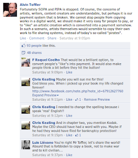

---

"Besides the list’s endearing earnestness — which brings to mind Woody
Guthrie’s 1942 New Year’s resolution list — it also contains
intriguing counter-evidence for the age-old tension between science
vs. religion, standing in particularly stark contrast with modern
scientists’ unabashedly nihilistic attitude towards “God.” And for
those of us who prod organized religion with the rational stick of
skepticism, it’s an intriguing perspective shift to consider that a
groundbreaking scientists could also be a pious man"

[Link](https://www.brainpickings.org/2012/01/04/isaac-newton-list-of-sins/)

---

That was me BTW 

---

Asian Population

We calculated in next 60 years 2 billion people in the world will
sadly lose their lives. Since Asia is a continent with a high
population density, it is likely that most of the projected death
count will come from this continent. Densest countries are the most
vulnerable, i.e. in terms of population India has three times more
people than US living on a third of her landmass. China is a bit
luckier, but overall Asia might witness some hard times.

---

Buying into the Boom, Crises Economics, Roubini

"As it became apparent that the crisis was real, many commentators
tried to make sense of the disaster. Plenty of people invoked Nassim
Nicholas Taleb’s concept of the “black swan” to explain it. Taleb,
whose book of that title came out on the eve of the crisis, defined a
“black swan event” as a game-changing occurrence that is both
extraordinarily rare and well-nigh impossible to predict. By that
definition, the financial crisis was a freak event, albeit an
incredibly important and transformational one. No one could possibly
have seen it coming.

In a perverse way, that idea is comforting. If financial crises are
black swans, comparable to plane crashes—horrific but highly
improbable and impossible to predict—there’s no point in worrying
about them. But the recent disaster was no freak event. It was
probable. It was even predictable, because financial crises generally
follow the same script over and over again. Familiar economic and
financial vulnerabilities build up and eventually reach a tipping
point. For all the chaos they create, crises are creatures of
habit. Most crises begin with a bubble, in which the price of a
particular asset rises far above its underlying fundamental
value. This kind of bubble often goes hand in hand with an excessive
accumulation of debt, as investors borrow money to buy into the boom"

What is described above is a big problem, because money = debt, and
debt is "hoped" to represent new enterprises being formed in which
people create value to pay back their debt. If, instead, a pyramid of
debt is created that has no basis in terms of creating value, then
after the music stops the whole system is in danger of going bust.

---

The CIA, patron of modern art

Frances Saunders reports in the British newspaper The Independent that
modern art, particularly abstract expressionism, was funded by the
C.I.A. as part of its covert war on communism [..].

Why did the CIA support them? Because in the propaganda war with the
Soviet Union, this new artistic movement could be held up as proof of
the creativity, the intellectual freedom, and the cultural power of
the US. Russian art, strapped into the communist ideological
straitjacket, could not compete...

---

Hot damn.. These guys are raking it in! And for what? They are simply
capitalizing on a made-up inefficiency in the "market" that should not
exist in the first place. One of the signs of the new age should be
all such companies going bust.

"The enormous profits of STM scholarly publishers.. As reported in the
Economist (2011): “ Elsevier, the biggest publisher of journals with
almost 2,000 titles, cruised through the recession. Last year it made
£724m (1.1 billion dollars) on revenues of £2 billion—an
operating-profit margin of 36%”. Springer’s Science + Business Media
(2010) reported a return on sales (operating profit) of 33.9% or € 294
million on revenue of € 866 million, an increase of 4% over the profit
of the previous year [..]"

---

Hahahaha

The Onion: "Evangelical Scientists Refute Gravity With New
'Intelligent Falling' Theory.. "Things fall not because they are acted
upon by some gravitational force, but because a higher intelligence,
'God' if you will, is pushing them down," said Gabriel Burdett, who
holds degrees in education, applied Scripture, and physics from Oral
Roberts University"

---

Which general MBTI type does the spirit of the times favor? If the
90s, and most of the 2000s were the age of exubarence, this kind of
fast-moving, hedonistic, transient, expansionist age would favor
Artisans. "No roots, just move forward" attitude suits them most. This
could explain 3 SP Presidents in a row in US and in some of the
developed world.

But the winds change, and now might be time for Americans (and the
rest of the world) to take stock of their situation, reflect, pull
back, and go over what they have. This signals a Guardian. Mitt is
typed as an ESTJ and according to the previous analysis, he would be
the favorite to win the White House.

Interestingly, ESTJs have extraverted intuition (Ne) pretty high up in
their hierarchy (level 3). Most Guardians are not scientist material
-for obvious reasons- but if a scientist does come out of this group
once in a blue moon, chances are that person is an ESTJ. Their Ne can
mull over future possibilities, be concerned with truth, so such a
person who had developed their Ni properly can become a scientist /
and or at least be someone who can consider new concepts, new ideas
for the future.

Note: One of the criticisms directed to Mitt is that he is a
flip-flopper and that can fit the ESTJ pattern. There would be a
pull/push between Si/Te and their Ne; ESTJ in general wants to be a
joiner, follow the rules, but at the same time, Ne will pull them
toward future possibilities, truth (albeit in a weaker, tertiary
level, but still), and conceptualizing new ways of seeing things. It's
not uncommon for an ESTJ to blunder into some situation, make some
wrong moves caused by their instintive need to fit in, but after a
while finding their way towards the truth with the help of their Ni.

Final note: All that said, we've said many times before, the system is
beyond saving. All we are talking about here is the potential results
of another popularity contest and who could be, who will perceived to
be in the context of the representative system (not democracy), a
better band-aid for near future. That person could be a nice surprise
and become a transformational figure, but that is unlikely. That's
all.

---

"Harsh Punishments for Poor Mourning.. Daily NK learned from a source
from North Hamkyung Province on January 10th, “The authorities are
handing down at least six months in a labor-training camp to anybody
who didn’t participate in the organized gatherings during the mourning
period [in North Korea], or who did participate but didn’t cry and
didn't seem genuine.”"

---

How Copyright Industries Con Congress

I’ve yet to encounter a technically clueful person who believes the
Stop Online Piracy Act will actually do anything to meaningfully
reduce—let alone “stop”—online piracy [..] But then I saw the very
astute David Carr’s otherwise excellent column on SOPA’s pitfalls,
which took those inflated numbers more or less as gospel. The bogus
numbers Carr cites [..] represent a substantial retreat from even more
ludicrous statistics the copyright industries long peddled [..].

Intellectual property infringement was supposedly costing the
U.S. economy 200–250 billion dollars per year, and had killed 750,000
American jobs. That certainly sounded dire, but those numbers looked
suspiciously high, and I was having trouble figuring out exactly where
they had originated. I did finally run them down, and wrote up the
results of my investigation in a long piece for Ars. Read the whole
thing for the full, farcical story, but here’s the upshot: The 200–250
billion dollars number had originated in a 1991 sidebar in Forbes, but
it was not a measurement of the cost of “piracy” to the
U.S. economy. It was an unsourced estimate of the total size of the
global market in counterfeit goods.

---

"If Patents Are So Great ..

There were many questions from readers about whether Lotus could
patent [a certain] idea. A senior [Formula-1] engineer has kindly
stepped in to clear up the question of patenting F1 technical ideas
for readers. His explanation is below:

"The lack of patents in F1 is quite simple. It’s because if a team
takes out a patent on a design, that then locks in an advantage the
other teams cannot access. Therefore the other teams will simply vote
it out through the FIA Technical Working Group process by the end of
the season in question.

By keeping a new design in the game, a team can gamble that they can
do a better job on a design than another team. Examples like seamless
shift gearbox & inertia dampers are good ones. If these were patented
by F1 teams, then they would have been wiped out."

Meanwhile it appears that not only does the FIA consider the Lotus
idea legal, but other teams including Ferrari are already working on
their own version. It will be one of the must have gizmos at the start
of the 2012 season.

Lotus has applied for some patents on ideas like using mercury inside
dampers, but this could be in order to sell the technology to a wider
market rather than grab an initiative in F1"

---

INTJ Newton INTP Leibniz

As you probably learned in school, Newton and Gottfried Leibnitz
(INTP) developed the mathematical instrument of calculus
simultaneously. But where Leibnitz was interested in precision and in
isolating and proving the principles of calculus for the sake of the
principle itself (Ti), Newton’s system of calculus was messy and
oriented towards utility – the solving concrete problems at hand (Te)
– rather than towards principle itself. One could almost say that once
Newton was convinced that his principles were true, he wouldn’t bother
proving it true to others [..] As a young student, [Newton] began the
study of geometry … he read the theorems, saw that they were true, and
omitted the proofs. He wondered why anybody should take pains to prove
things so evident.

Every approach has its place of course; We shared in previous post y'
that Leibniz's Calculus notation was more expressive and made certain
additional research possible.

BTW, Te is also about if-then-else style thinking, such as going from
point A to point B, contingency planning, measurement. Te is *very*
adamant on measurement. Newton working as warden of the mint makes
sense from this POV. If-then-else thinking is very suitable for
computer programming, just as a side note.

Newton had lots of fights with fellow scientists, that also fits the
pattern, at least statistically; there is no Fe anywhere on his "top
four" that'd help creating harmony. We dont mean to say an INTJ
automatically means an hard-ass, but introvert Rationals who are, in
general, seem to be coming from this group.

---

Clint Eastwood is typed as an ISTP. To verify, I found his Inside the
Actor's Studio interview with Lipton and watched the whole thing. He
definitely sounded like an SP, plus by his own admission he is an
introvert ("I am not a very talkative person"), so yes, Clint does
sound like an ISTP. Keirsey also says of him that "there is probably
noone more American than he" which I find interesting. I wonder what
that says about America. But let's not get off topic here.

The issue of courage came up a lot, that fits the position of our
previous post; In his younger years as an actor Clint did some own
stunts, and someone asks if he was scared and for a split second he
turns to he audience, starts mocking his own movie persona (it was
hillarious to watch) with his make-my-day-voice says "I ain't scared
of nothin'". Very funny, and as we said before, right on type. Being,
wanting, wishing to be courageous, wanting to be perceived as such
while being tounge-in-cheek about it (since it is so important to them
it can also be a source of humor) fits SP description. The frequency
of the issue coming up was telling.

On the culture code front: Of the famous make-my-day scene, Clint said
that he knew that line would be a hit the moment he uttered it. That
makes sense because the sentence is on code, right on the cultural
fault line, US cultural tug-of-war being between prohibition and
letting go. "Go ahead make my day" captures this feeling
perfectly. Tough guy is holding himself back, he is not "letting go",
but tells the "bad guy" to "just give him the chance to let loose, and
kick some ass"; Wanting to inflict violence (the code for which is
SEX) but not, that dance on the fault line certainly made this scene a
hit on US movie screens.

---

Everytime I want to write something nice about Newt, moth....ka does
something stupid. That has been the pattern for a while now so I gave
up on this guy. It's too bad really, he is Alvin Toffler's politically
most visible student, and Toffler certainly deserves a better
pupil. Newt has been bitchslapped by the futurist himself many times
(for his weird side views), but I guess the punishment did not
take. Noone knows of course if Newt could change his tune if he became
President (good Newt, or bad Newt?), but if his campaigning is any
sign the weirdness can cloud the good stuff.

Palestenians are made up people? C'mon man!

---

Peter Watson, The German Genius, pg 66: "Even by the end of the
seventeenth century [.. there were criticisms directed towards
religion]. The Bible also came under more systematic criticism when it
was shown that the original Old Testament had been written not in
Hebrew but in Aramaic, meaning the old scriptures could not have been
dictated to Moses by God: the Old Testament was not "inspired".

Now that's a big can of whoop-ass, isn't it? The easiest way to verify
this is to carbon date this so-called original OT I guess"

---

I dont care how fast people are connected; nothing moves faster than
information among neurons in one person's brain. Yes to all hi-tech
tools to collect, process information in a pull mode, but no to
always-on constant communication that are essentially jerk circles
rather than idea generating mechanisms. With "pull" we mean
communication being initiated by the creator whenever s/he prefers it.

Susan Cain: "The Rise of the New Groupthink.. Solitude is out of
fashion. Our companies, our schools and our culture are in thrall to
an idea I call the New Groupthink, which holds that creativity and
achievement come from an oddly gregarious place. Most of us now work
in teams, in offices without walls, for managers who prize people
skills above all. Lone geniuses are out. Collaboration is in.

But there’s a problem with this view. Research strongly suggests that
people are more creative when they enjoy privacy and freedom from
interruption. And the most spectacularly creative people in many
fields are often introverted, according to studies by the
psychologists Mihaly Csikszentmihalyi and Gregory Feist. They’re
extroverted enough to exchange and advance ideas, but see themselves
as independent and individualistic. They’re not joiners by nature"

---

That's not a bad idea. Worth looking into.

Robert J. Shiller: "Corporations use a combination of debt and equity
to finance their investments and operations. Nations, in contrast,
rely exclusively on debt. When a nation’s economy stalls and its debt
continues to grow—you may have noticed this happening a lot
recently—disaster looms for the country’s taxpayers. This is why
Europe is in turmoil right now. But things don’t have to work this
way.

Here’s an audacious alternative: Countries should replace much of
their existing national debt with shares of the “earnings” of their
economies. This would allow them to better manage their financial
obligations and could help prevent future financial crises. It might
even lower countries’ borrowing costs in the long run.

National shares would function much like corporate shares traded on
stock exchanges. They would pay dividends regularly. Ideally, they’d
be perpetual, although a country could always buy its shares back on
the open market. The price of a share would fluctuate from day to day
as new information about a country’s economy came out. The opportunity
to participate in the uncertain economic growth of the issuer might
well excite, rather than scare off, investors—just as it does in the
stock market [..].

The advantage of keeping shares equal to a perfect trillionth of the
economy is that people will know exactly what they are getting:
One-trillionth of a country is real and easy to understand. That kind
of clarity encourages trust that governmental shenanigans will not
compromise the obligation."

---

Under Obama, the Freedom of Information Act is Still in Shackles

Three years ago this past weekend, on his first full day in office,
President Barack Obama issued his now infamous memo on transparency
and open government, which was supposed to fulfill his campaign
promise to lead the “most transparent administration in history.”
Instead, his administration has been just as secretive—if not more
so—than his predecessors, and the Freedom of Information Act (FOIA)
has become the prime example of his administration’s lack of progress
[..]

[S]ecrecy won out in the Obama administration almost immediately. In
the early months of his presidency, a court ruled that the
administration would have to turn over photos related to the Abu
Ghraib torture scandal in response to a FOIA request. Knowing they’d
likely lose the appeal, Obama supported a new law that could keep
information secret even when FOIA would otherwise require
disclosure. The bill’s only intention was to create a way to shield
photographs of detainee abuse from public disclosure.

---

Why Gold?

It is suggested in [1] that gold as a currency was part of a
military-slave-minting complex. If one had to continue this pattern,
one could conclude in order for a metal to be currency, its rarity is
not enough. What is truly necessary is that this metal be hard to mine
and rare because only a military complex that can wage wars, get
slaves who can be employed for the mining task can get that
hard-to-dig material. This must be why military rulers preferred gold
for centuries, IOW if say there was a metal on Earth called fartium
just as rare as gold but easy to find, it could not become
currency. No ruler would make it currency, because this metal could be
found by anyone and inserted in the circulation -- by people other
than soldiers who a military wants to support logistically.

Some economists argue we need gold standard, or on some standard based
on any rare metal -- but what Graeber suggests in the above link is
that the rarity of the metal is not the issue. Plus nowadays there are
many companies, individuals who can mine this stuff without owning
slaves, one of the "advantages" of gold as a currency disappears.

No, a third wave solution must be non-concentrated, non-centralized;
individuals should be able to create this stuff. A fork of an
existinng, fast, efficient digital currency with self-printing
capability (periodically new money is created in everyone's account)
could do the job.

References

[1] Graeber, Debt The First 5000 Years

---

---

The same idea keeps coming up; Seth Godin says [paraphrasing] "when it
comes to work generated for a 21st century economy, if you are
measuring it, you are doing something wrong". I add, surely there are
things we should measure, things that are finite (diminishing
resources, food, etc). But creative works increasingly defy any sane
measurement criteria.

This also somewhat ties in with Milton Friedman's "give all citizens X
amount of money, no questions asked" idea. Also, we shared an article
here about funding science. We did not share it entirely, we skipped
the solution, which is "to fund people rather than projects", in other
words, relaxing our success criteria, giving people lots of chances to
fail, and to stop micromanaging which is exactly what
pay-for-performance is.

"Stop Tying Pay to Performance

[A]ll variable-pay-for-performance schemes still suffer from four
inescapable flaws:

1. In a modern economy, where new challenges emerge constantly, it’s
impossible to determine the tasks that will need to be done in the
future precisely enough for variable pay for performance to work well.

2. People subject to variable pay for performance don’t passively
accept the criteria. They spend a lot of time and energy trying to
manipulate the criteria in their favor, helped by the fact that they
often know the specifics of their work better than their superiors do

3. Variable pay for performance often leads employees to focus
exclusively on areas covered by the criteria and neglect other
important tasks. This is known as the “multiple tasking” problem.

4. Variable pay for performance tends to crowd out intrinsic
motivation and thus the joy of fulfilling work. Such motivation is of
great importance to business, because it supports innovation and
encourages beyond-the-ordinary contributions.

The idea that people work only for money has been thrown overboard by
leading scholars. Research has shown that human beings are not
interested solely in material gain. They care for the well-being of
other individuals and value recognition from coworkers. Many employees
apply themselves because they find their work challenging and
worthwhile. These non-material motivations point to better ways to get
results from the members of an organization"

---

"Teaching yourself mathematics

Of all the subjects a student is likely to encounter after elementary
school, mathematics is by far the easiest to teach yourself. With the
appropriate attitude and assumptions, adequate motivation and a simple
and easily mastered set of skills the majority of students can take
themselves from pre-algebra through calculus [..].

[A]t some point all disciplines require the transition from passive to
active and that transition can be challenging. In courses like high
school history and science, the emphasis [is] on passively acquiring
knowledge [..] By comparison, junior high students playing in an
orchestra, writing short stories or solving math problems are almost
entirely focused on processes and those processes are essentially the
same as those engaged in by professional musicians, writers and
mathematicians [..] Unlike music and writing, however, mathematics
starts out as a convergent process [.. for any intro level course]
say, differential equations, most math problems have only one solution
and students are able to quickly and accurately check their work [..].

This unique position of mathematics allows for any number of easy and
effective self-study techniques. One of the simplest is the approach
that got me through a linear algebra section [ is this ..]

All you need is a textbook and a few sheets of scratch paper. You
cover everything below the paragraph you’re reading with the sheet of
paper. When you get to an example, leave the solution covered and try
the problem. After you’ve finished check your work. If you got it
right you continue working your way through the section. If you got it
wrong, you have a few choices. If you feel you basically understood
the solution and see where you made your mistake, you might simply
want to go on; if you’re not quite sure about some of the steps in the
solution, you should probably go back to the beginning of the section;
if you’re really lost, you should go back to the preceding section
and/or the previous sections that introduced the concepts you’re
having trouble with.

Once you’ve worked through all the examples, start on the odd numbered
problems and check your answers as you go. If you’re feeling
confident, you can skip to the difficult problems but if you make a
mistake or get stuck you should probably go back to number 1"

---
