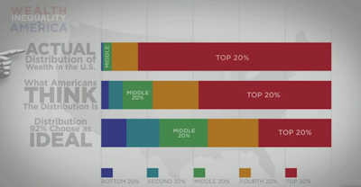

# Week 16

---

---

"Civic Coding

Code for America and Google for Entrepreneurs are partnering to form
an incubator that will support CfA fellows as they try to turn their
ideas into companies. CfA describes itself as “a Peace Corps for
geeks.” Its mission is to improve the way governments work through the
creative and intelligent use of technology [..] The search giant
funded its 2012 programs, including the launch of a civic startup
accelerator program that took on “disruption as a public service.”

This incubator program has the same fundamental goal — to bring
government operations up to date — but it also serves as a bridge for
CfA fellows rather than independent startups tackling this
issue. Sustainability is key here, not only to create businesses and
products that endure, but also to retain talent and creativity within
the civic space"

---
