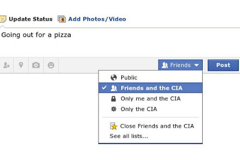

# Week 24

New Facebook privacy settings
 

---

Aw slam...

"Microsoft today unleashed a flood of news, detailing the specifics of
how the machine handles things like internet connectivity and used
game sales.

The news was almost all bad.

Here's a recap:

The console must connect to the internet once every 24 hours in order
for you to play games. For many people, from military personnel to
students, that's an inconvenience, maybe even an impossibility. Never
mind what happens to everybody's console if Microsoft's servers ever
come down.

The Xbox One will allow the sale of used games, at "participating retailers", but only if the publisher allows it. Publishers being the very people opposed most fiercely to used video game sales. 

There are restrictions on how you can "give" and "loan" your games
away. What's more, lending won't be available at launch, with
Microsoft still "exploring the possibilities with our partners".

In response Sony records [this video](https://youtu.be/kWSIFh8ICaA)"

---

---

What is it with today? Lott of hillarious stuff going around..

---

Excellent picture, great job by HuffPost. Seriously, if these two
characters had a child (if that was possible) IMO this is exactly how
he would look like. Scary good.

George W Obama

---

Nice 

BTW metadata does not mean transactional. Meta in this context means
"descriptive", meaning "data that describes data". For instance you
could have a file with thousand lines with one column that says
"temparature". The name of that column, temparature which is its
decription, would be metadata. It is usually expected metadata is
smaller than data itself, and changes less often, and perhaps.. less
important. The story makes much more sense this way because they are
almost trying to say "hey it's just some descriptive stuff on the side
you know, it's not thaaat important". By some word shuffling, they
managed to label the more important data as "supportive", and get
regular updates of it. Sneaky.

"The unlimited nature of the records being handed over to the NSA is
extremely unusual [..] The order directs Verizon to "continue
production on an ongoing daily basis thereafter for the duration of
this order". It specifies that the records to be produced include
"session identifying information", such as "originating and
terminating number", the duration of each call, telephone calling card
numbers, trunk identifiers, International Mobile Subscriber Identity
(IMSI) number, and "comprehensive communication routing information".

The information is classed as "metadata", or transactional
information, rather than communications, and so does not require
individual warrants to access."

---

It is

"Al Gore

Is it just me, or is secret blanket surveillance obscenely outrageous?"

---

