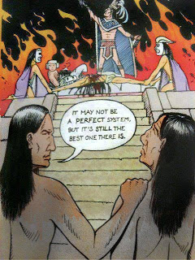
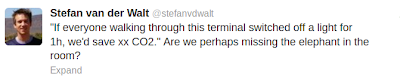
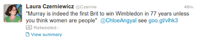

# Week 28

---

\#gezi \#tahrir \#representativesystem

---

"Data compiled by Marinexplore in Sunnyvale, Calif., not only confirm 
previous studies that the world's oceans are simmering, but they also 
bring surprising news: the heating extends beyond the first few meters 
of surface waters, down to 700 meters [notebook]"

---

First of all, one of the main reasons Muslim Brother (MB) had a role,
as visible as it had even before Tahrir 1, was because Mubarak allowed
it.

Mubarak basically put all other credible opposition in jail. But, he
partially allowed MB to be out there, be part of the political
process, be visible (very important), that way he could point to them
when Westerns visited and say "look you may not like me, fine, but
just know that my alternative is these bearded fanatics right
there". And these naive (usually the best and the brightest of US
congresspeople) take a look and go like: "I see bearded people!". WE
ARE WITH YOU MUBARAK.

This was the political make-up Egypt found itself with right after
Tahrir 1.

So there isn't much point to play with percentages in the case of
Egypt. The real numbers, percentages came out on the street in the
millions for Tahrir 2, letting their protest known.

"Morsi and his party received __ percent of the vote, so .."

---

I Think We Are

---

When the Western colonial powers sketched out the borders of the
Middle East after World War I, they installed minority regimes in
three states: the Maronite Christians in Lebanon, the Sunnis in Iraq,
and the Alawites in Syria. The motive behind putting minority groups
in power was to retain influence in the region, as a minority regime
would rely upon outside support from the British or the French.

---

"How to motivate your team.

Indoctrinate them with the big picture. Everybody wants to be part of
something big. They want to know why their work matters. Make it
important to your people by telling them why it's important to
customers.

Hold yourself accountable. Goal-setting in most companies is
ineffective -- executives make big bucks no matter what, or there's
little or no follow-up. When management holds itself accountable, it's
a lot easier to do the same with employees.

Provide genuine, real-time feedback, good and bad. This
is one of the hardest things for any manager to do, especially the 
negative stuff, but it's also one of the most critical and effective 
management tools.

Promote their accomplishments and take the heat for their failures. Period.

Give them what they need to do the job. Provide the tools, training
and support they need to be effective; keep management off their
backs; then get out of the way.

Challenge them with as much responsibility as they can reasonably handle.
It's human nature to want to achieve things. Show you have confidence 
in them by setting a reasonably high bar and allowing them to succeed or
fail on their own.

Communicate. Tell them what's going on as openly as you can within
reason and without unduly burdening them with confidential information
they shouldn't or don't need to know.

Be as flexible as possible without impeding team effectiveness. If the
priority is to get the job done as a team, that doesn't mean everyone
has to operate exactly the same way. People are individuals.  They
need some freedom to do their best.

Be human. Show some empathy, humility and a sense of humor. It'll go a
long way"

---

Actually a more proper definition would be that the researchers found
"cultural blocks"; noone can know for sure these blocks would "clash"
(it does make a flashier title however).

The existence of these blocks confirms what we've been saying for some
time  - technology strengthens internal connections of existing
blocks, and globalization, as a rule, is an inferior method to explain
world events. It is not some unstoppable force that just grows and
grows. In terms of tech, just because you can watch some "bonsai cam"
webcasting from Japan does not mean you will. Are you interested in
bonsai? Is it part of your culture?"

[[-]](../../2018/09/global-e-mail-patterns-reveal-clash-of.html)

---

This term was used by Salman Khan before - instead of "stand and
deliver" style lecturing, teachers take a backseat, kids learn at
their own pace (through technology), individually, and they use the
"adult in the room" only to ask questions, as well as
eachother. Apparently there is a certification now for this kind of
lecturing. Very cool.

Some stats - "85% of teachers who’ve flipped their classroom have seen
improved grades".

---

"Has Europe just discovered a previously unused muscle that can be
flexed a little in the interest of Middle East peace? The leaking of
European Union guidelines barring E.U. support for projects based in
[Israeli] occupied territories has generated high political drama
[..].

Most significantly, however, the reaction suggests that both
supporters and opponents of Israeli policies believe the Europeans
might be on to something — namely that the lack of consequences for
Israel has been a key enabler of the ongoing occupation and denial of
Palestinian rights [..].  Far from derailing peace, Europe’s move [one
day] might be remembered for its contribution to resuscitating the
two-state project"

---

"Amid the Obama administration's crackdown against whistleblowers,
Change.gov, the 2008 website of the Obama transition team laying out
the candidate's promises, has disappeared from the internet.

The Sunlight Foundation notes that it last could be viewed on June 8,
which was two days after the first revelations from Edward Snowden
(who had then not yet revealed himself) about the NSA's phone
surveillance program. One of the promises Obama made on the website
was on "whistleblower protections""

---

---