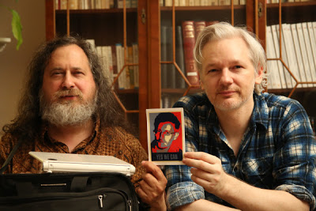

# Week 32

OH I THINK WE ALL KNOW WHY.

\#haha \#NSA

"Tor usage doubles in under a week, and no one knows why.. [T]he
number of Tor users has shot up to about 1.2 million from 600,000 [..]
“And it's not just a fluke in the metrics data—it appears that there
really are twice as many Tor clients running as before,” Dingledine
wrote on Tuesday"

---

"The revelations about the monitoring of phone calls, emails and
Internet traffic by the National Security Agency's Prism program will
cost U.S. cloud suppliers [between] $35 [and] $45 billion [..][A]
recent survey by the Cloud Security Alliance, which found that 56% of
500 respondents said the disclosures by the fugitive NSA systems
administrator would cause them to lose non-U.S. business. Canada, plus
Germany, France and other European countries, have rules that require
companies to guarantee the privacy of data that originates within
their borders. Most comply by keeping the data on storage inside its
country of origin"

---

More often than not, founders, early employees, and investors of the
largest tech companies will tell you that the product that took off
was never part of (at least not fully) the original “plan.” Twitter
spun out of Odeo, Instagram was a Burbn pivot, BuzzFeed evolved from
one of many “for fun” experiments — the  list goes on and on. Heck,
even Facebook was originally Facemash.

By and large, innovative products aren’t strategically imagined ahead
of time – they’re stumbled upon while experimenting on-the-go.

Furthermore, even when the game-changing idea is discovered, the
founders and early employees tend to underestimate its magnitude and
potential. They’ll tell you that they knew the product was special but
did not realize how how special it was or what it would lead to
next. The best example of this: Google was a graduate school project
that Larry and Sergey tried to sell for $1 million. And there’s no way
that Jack, Ev, and Biz could have been predicted from day one that
Twitter, the SMS-based prototype, would eventually enable revolutions
and reinvent news media. But despite initially linear growth, they
knew they had something special on their hands because the product
they had built delighted themselves and a core group of addicted
users. In the early stages of a product’s life, all you can know for
sure is whether or not you’ve built something that delights yourself
and others. The rest — how many others it will delight, and in what
ways — is typically felt out along the way.

In other words, “vision” is a popular industry narrative applied
after-the-fact.

Despite these patterns, investors require conviction and grandiosity
from budding entrepreneurs. As a result, most “dumb” and “small” ideas
never make it to pitch meetings or even prototyping, and instead die
in the heads of talented builders. Unless you’re someone like Kevin
Rose, you can’t walk into an investor meeting and say, “We’re not
really sure what we’re building,” or “We’re not really sure how this
idea evolves and gets really big yet,” and expect to receive
funding. Which is a shame, given that Facebook, Twitter, Airbnb,
Dropbox and the like were all initially “dumb” and “small.”

---

"Power Corrupts. PowerPoint Corrupts Absolutely... [S]lideware
-computer programs for presentations -is everywhere: in corporate
America, in government bureaucracies [..]. Particularly disturbing is
the adoption of the PowerPoint cognitive style in our schools. Rather
than learning to write a report using sentences, children are being
taught how to formulate client pitches and infomercials"

---

Stallman and Assange holding up a photo of Snowden. My favorite people
in one place.

---

Following the most recent trend, the movie Elysium portrays Earth as a
dump which anyone with their right mind already left, long ago. The
movie sadly does not "click" with the audience, and I believe it's
idiotic writing is at fault. There are some gaping holes in there, the
kind you can fit a person in, bigger than even a scifi backdrop can
allow. Here is one (maybe the worst): There are veeery, veeery
advanced robots who can effectively act as soldiers, but then, Matt
Damon's character (our hero) is working on the assembly line building
those robots? Huh? Aren't there any robots who can be assembly line
workers?

But no, the movie had to make the hero "working class", so he could
suffer an accident "at the factory" and Elysium residents as rich,
arrogant types (with healthcare), that's why the sci part of scifi had
to be thrown out the window. Doesn't anyone with an ounce of brain
knows that there will be no assembly line workers in the future?

Plus, if there is a "med bed" techology (some near-magical tech that
cures you no matter what), everyone would have access to that
technology. Why shouldn't they? What does it run on? Gold dust?

Who churns out this shit thinking it's scifi?

---

Damn. Did not know Carter was against the NSA "overreach". 

"Actor Matt Damon says he feels like [..] “[Obama] broke up with me,”
Damon told BET in an interview published on Thursday. The star,
formerly a big supporter of the president, charged that Obama has
“some explaining to do” for his actions in the White House.

“There are a lot of things that I really question – the legality of
the drone strikes, these NSA revelations. Jimmy Carter came out and
said we don’t live in a democracy. That’s a little  intense when an
ex-president says that.”"

---

Holly molly... These things can run at roughly 100 kilometers per hour.

Ridiculous speed.. Cool.

"The fastest cheetah on Earth has done it again, breaking her previous
world record for the 100-meter dash and setting a new best time of
5.95 seconds."

---

About damn time. Toffler famously called the old GDP "Grossly
Distorted Product". Even the recent additions might not be enough, but
it is a good start.

"Yesterday, Alan B. Krueger, the Chairman of the Council of Economic
Advisers, announced that the [..] the past GDP numbers were [..]
adjusted [..] It’s a change that’s partly the result of calculations
that now factor entertainment and innovation. Adding the entertainment
industry to the formula, according to Kreuger, presents a more
accurate picture of the economy:

"The comprehensive revision to the national accounts [..] includes
[..] methodological changes designed to better reflect the evolving
nature of the U.S. economy. For instance, the GDP data  released today
… adopts an expanded definition of business investment that includes
spending on research and development (R&D) and the creation of
original works of art""

---
