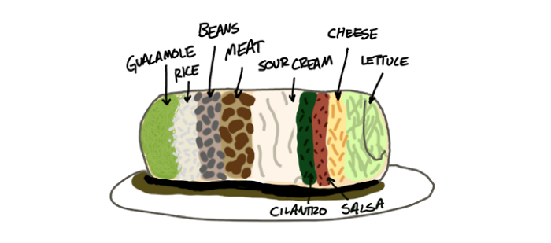

# Week 36

The WMD sensitivity has to do with the new strategy focus of US after
9/11. US has natural protection against invading armies (Mexico being
an exception -which is harmless- and..  there is the military behemoth
called Canada of course), short range navies, the only remaining
dangers can come in in the form of 1) people 2) weapons with
asymmetric effect. That is why post 9/11 two major issues were 1)
immigration 2) wmd. WMD sensitivity requires hunting for this stuff
proactively, anywhere in the world because you never know which
crazy-ass idiot will get his hands on one and take it to somewhere
else. That is the current logic.

This US focus is known to all strategists. After 9/11 some went 'aha,
focus gonna change', and tada. It's that kind of thing. It makes
certain amount of sense too, but whether it makes sense or not, that
is what "ppl in the know" know about US priorities. Hence the red
lines, talk of punishment etc.

"Are we making too much of chemical weapons? Probably less than 1 percent
of those killed in Syria have died of nerve gas attacks. In Syria, a 
principal weapon of mass destruction has been the AK—47."

---

A [..] story tells of a delegation of sailors who went to the tribunal
of the Inquisition in the seventeenth century, when the Catholic
Church had forbidden the use of Galileo's astronomy as an affront to
the Bible's account of creation. The sailors sheepishly confessed that
Galileo's theory had both simplified their journeys and made their
maps more accurate. They hoped that the Inquisitors would exempt
mariners from the church's proscription against it. The Tribunal
considered the problem, consulted with the bishops, and sent an
emissary to the Pope. Finally, they conceded. They said, "OK, if the
theory works, use it. But don't believe it".

---

"Patriot Act author says NSA’s bulk data collection is “unbounded in
its scope”"

[[-]](http://arstechnica.com/tech-policy/2013/09/patriot-act-author-says-nsas-bulk-data-collection-is-unbounded-in-its-scope/)

---

Dear Guy Who Just Made My Burrito

[Link](https://medium.com/comedy-corner/fd08c0babb57)

\#hilarious

---

A treehouse with an elevator? Well, yes, but there's one catch, this 
elevator is made out of a bike. Designer, Ethan Schlussler, shows us 
that getting from the ground to 30-ft up in the trees is just a matter 
of pedaling. Going Up!

---

Commentator Tovarich

WPost response to Putin's NYTimes Op-Ed

Putin says: "The potential strike by the United States against Syria,
despite strong opposition from many countries and major political and
religious leaders, including the pope, will result in more innocent
victims and escalation, potentially spreading the conflict far beyond
Syria’s borders. A strike would increase violence and unleash a new
wave of terrorism. It could undermine multilateral efforts to resolve
the Iranian nuclear problem and the Israeli-Palestinian conflict and
further destabilize the Middle East and North Africa. It could throw
the entire system of international law and order out of balance".

[..W]hat rankles many analysts about this paragraph is that it ignores
Putin's own role in enabling the already quite awful violence, as well
as the extremism it's inspired. Syrian leader Bashar al-Assad's regime
has killed so freely and so wantonly in part because it knows Putin
will protect it from international action. Putin has also been
supplying Assad with heavy weapons. It's a bit rich for him to decry
violence or outside involvement at this point.

"From the outset, Russia has advocated peaceful dialogue enabling
Syrians to develop a compromise plan for their own future".

Russia has certainly espoused dialogue and a compromise plan, but it
has acted instead to stop that from happening, refusing to wield its
considerable power to bring this about. There is no one in the world
better positioned than Vladimir Putin to force Assad to the
negotiating table. Instead, Putin has shown every indication that he
wishes for Assad to defeat the rebels totally and outright, as his
father Hafez al-Assad did in 1982 when he crushed an uprising in Hama.

---
