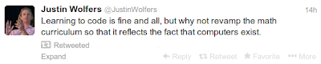

# Week 48

---

---

"Equivalent of 20 classrooms-full of children take up smoking every day
in UK, according to research."

That's a lot

At first I thought this paper was being "sensationalist", using the
image of a classroom (it's big!) and "20 of them!" to increase the
effect of this number. I checked the numbers tho, and with data from
this graph, if we take an annual # of births to be roughly 700,000,
divide by 365, and 30 (size of class?), result is 63 classrooms worth
of people born each day in UK. And if, out of that, 20 "classrooms"
take up smoking, that's bad.

---

"The world needs Nelson Mandelas. Instead, it gets Vladimir Putins. As
the South African hero was being sung to his grave last week, the
Russian president was bullying neighboring Ukraine into a new customs
union that is starting to look a bit like Soviet Union Lite, and
consolidating his control of state-run media by creating a new Kremlin
news agency [..]"

Ha ha ha

So do you want that Putin profile now "dear readers"?

It can be yours.. for $4999! Cooomeee nooow! Show me - da - money.. 

Uh ♫♪ I am fresh, I am fly ♪♫  Get in my Beamer, Benz or Bentley ♪♫ Wear my ring and confetti ♪♫ I am Kobe Bryant ready ♪♫  ♪♫ [yeah yeah!] I'm fresh, I'm fly ♪♫ Got your b...ch waving at me when I roll by ♪♫ Yeah yeah! Uh! That's fly.. ♪♫ My n...a my n...a.

:)

(Lyrics needs some Cristau but that's ok, for now).

---

Matlab Is Losing

"Open source rivals commercial products in terms of quality which
should not be too surprising. This increasing quality has to with the
unstoppable spread of knowledge -- when 10 people know about something
you can package this knowledge make a commercial product, and sell it.
But when a thousand, or ten thousand, ot thousands and thousands of
people know something, one of them is bound to make it public and
release it and attract contributers who are part of the growing number
of people with knowledge. The rest is pure self interest, on the part
of the users/coders. When quality is comparable, I will use open
source because I can take it with me if I move to another job, another
project. In a fast-paced economy where careers are more important then
loyalty, this is the approach that is going to win, especially for
infrastructural stuff"

---

Weird song.. But listenable.. All the singer says sporadically is
"what do you do in the bath" with this very English accent. It cracks
me up, I've no idea why.

https://youtu.be/-ie2kQhv5yg

---

The latest report, this time via Der Spiegel and based on internal NSA
documents, reveals that the NSA, in conjunction with the CIA and FBI,
has begun intercepting laptops purchased online in order to install
(quite literal) spyware and even hardware on the machines. The NSA
terms this “interdiction.” Agents divert shipments to secret
warehouses, carefully open the packages, install the software and/or
hardware, and send them on their way.

---

Clifford Stoll, 1995

http://www.newsweek.com/clifford-stoll-why-web-wont-be-nirvana-185306

After two decades online, I'm perplexed. It's not that I haven't had a
gas of a good time on the Internet. I've met great people and even
caught a hacker or two. But today, I'm uneasy about this most trendy
and oversold community. Visionaries see a future of telecommuting
workers, interactive libraries and multimedia classrooms. They speak
of electronic town meetings and virtual communities. Commerce and
business will shift from offices and malls to networks and modems. And
the freedom of digital networks will make government more
democratic. Baloney.

Ha ha

Yeah.. That dude totally ate crow on that one. What _up_!

---

Link

[Because of Snowden leaks t]he suspension of relations between
Australia and Indonesia, two of the most powerful nations in the
region, was swift and dramatic. And the consequences of this latest
leak from Mr. Snowden’s cache of documents — for politicians, asylum
seekers and, possibly, journalists — have been severe.

The spying story was broken by The Guardian’s Australia edition [..]
The government turned its wrath on the ABC for having exercised what
Mr. Abbott called “very, very poor judgment” in working with the “left
wing” Guardian, and Rupert Murdoch’s broadsheet paper, The Australian,
ran a series of stories about staff wages, alleged bias and need for
reform of the ABC, which it views as a competitor.

A prominent crowd of conservatives, who have long accused the ABC of
having a left-wing slant, immediately began calling for it to be
privatized, split in two and severely admonished [..].

It was as though the ABC, and not Mr. Snowden, was responsible for the
leak.

The ABC is no stranger to attack. But it would be ironic if the work
of a man determined to drag covert — potentially illegal — operations
into the light were to result in the muzzling of an independent,
nonpartisan broadcaster [..]

As we watched Mr. Scott being roasted here, the editor of The
Guardian, Alan Rusbridger, was being grilled by a parliamentary
committee in Britain — also for publishing Snowden stories — with
questions like, “Do you love this country?”

Have you people gone completely mad? 

Seriously. What the frack is going on over there?

---

Hail the fail

"The knowledge society is the first human society where upward mobility
is potentially unlimited. Knowledge differs from all other means of
production in that it cannot be inherited or bequeathed. It has to be
acquired anew by every individual, and everyone starts out with the
same total ignorance [..].

The upward mobility of the knowledge society, however, comes at a high
price: the psychological pressures and emotional traumas of the rat
race. There can be winners only if there are losers. This was not true
of earlier societies.

The son of the landless laborer who became a landless labore himself
was not a failure. In the knowledge society, however, he is not only a
personal failure but a failure of society as well"

---

It appears Elsevier has gone postal. Is this the mob or a company man?
What the f..k?

"I thought Elsevier was already doing all it could to alienate the
authors who freely donate their work to shore up the corporation’s
obscene profits. The thousands of takedown notices sent to
Academia.edu represent at best a grotesque PR mis-step, an idiot
manoeuvre that I thought Elsevier would immediately regret and
certainly avoid repeating.

Which just goes to show that I dramatically underestimated just how
much Elsevier hate it when people read the research they publish, and
the lengths they’re prepared to go to when it comes to ensuring the
work stays unread.

Now, they’re targeting individual universities.

The University of Calgary has just sent this notice to all staff:

The University of Calgary has been contacted by a company representing
the publisher, Elsevier Reed, regarding certain Elsevier journal
articles posted on our publicly accessible university web pages. We
have been provided with examples of these articles and reviewed the
situation.  Elsevier has put the University of Calgary on notice that
these publicly posted Elsevier journal articles are an infringement of
Elsevier Reed’s copyright and must be taken down.  That’s it,
folks. Elsevier have taken the gloves off"

---

I 2nd that motion. The difference is subtle but important. Just talk
to Gilbert Strang from MIT, he will tell you what's up.

We need both obviously, plain vanilla coding and computational
math. Kids are graduating from high school today without having
created a simple friggin histogram using a simple one-liner hist(x)
where x is one dimensional data. It's a damn shame.

---

""Whenever a fellow tells me he is bipartisan," said Harry Truman, "I
know he is going to vote against me." The hosannas to bipartisanship
accompanying the budget deal passed this week should have served as
fair warning to the rest of us that we lost this vote. True,
politicians and commentators vied to hail the sacrifices that had been
made on both sides of the aisle for the greater cause of "restoring
public faith in the budget process" and thereby bolster Congress' poll
ratings.

In reality, there was one clear winner: the bipartisan defense lobby
[..]"

---

China moon landing? There is a specific level of math you need to get
to the moon for instance; u need Kalman Filters which provides a way
to get accurate information out of inaccurate (noisy) data. Without
it, you can fire off to go to the moon, but end up in Idaho.

Congrads,

---

