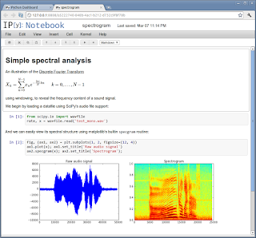
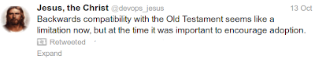

# Week 8

Another huge development: a new technology, iPython Notebooks, are
making waves in research, education and publication.

Notebooks are HTML based documents which can be edited through a
browser (as well as other means) and they can combine math formulas,
rich media, as well as code. By code, we dont just mean only the
"text" of code. We mean actual, running code. Yes, the document can
run a piece of code, in-place, and show its output right there on the
document itself. The author simply needs to enter code in a cell, and
press the key.

Code can be any numerical, scientific computation.

Output could be a string, a table of strings, numbers or entire 2D /
3D graphs (as seen above) - static or animated. Notebook technology is
a first among its kind to allow all content to be combined in one
place, and moreover, do it based on established open source
technologies.

Code is written mainly in language called Python that is fast becoming
the de-facto language of scientific computing. This language's ability
to act as a glue to other languages such as C, Fortran, and its
ease-of-use, expressive syntax made it indispensible in numerical
computing environments, and now in education.

Notebooks require a server which can simply run on a student's
machine, or on a seperate server (even on a cloud) that is shared,
serving many requests. One for general use already exists -
nbviewer.ipython.org

Research can easily be conducted through notebooks. A notebook
in-progress can be shared with a colleague who can view it, copy  it,
modify it, rerun it. Through the new tech, data / numerical
exploration / prototyping, research and final publication are all in
one place, the document is the unit of collaboration.

Education can greatly benefit from this technology. As documents get smarter, transmitting ideas through documents become simpler, hence we take one more step toward teacherless classrooms and 3W education which means good-bye to factory style schools. 

News: Sloan Foundation awarded a $1.15M grant to the iPython
project. The proposal for the grant is here.

--

Actually it was

You are slippin old man..

With blunt instruments typically used by governments, such as this
"rebalancing" etc, can one say military matters cannot, ever be part
of the act and the message? C'mon. At least you'd ruffle some feathers
and hint some stuff.

Well - while we are at it, here are some other things that are
happening at the same time. 1) US of A, through fracking, thinks it
will be self sufficient in natural gas and oil production. 2) And
rebalances towards Asia. Then: does that mean less US involvement in
Middle East? Since US of A produces its own oil, can it now affort to
get out of ME?

Then, is ME being left to EU to "manage"? Are geographically close
regions to EU such as North Africa now officially EU backyard? Case in
point France (and German) involvement in Mali. US inaction in Syria.

Does EU want to strenghten its military involvement in this new
backyard?

Did EU ask Britain to get involved more in that effort since it has a
more experienced in such matters? Did Cameron use this opportunity to
renegotiate his relationship with EU (you need me more, you give me
more)? Is that why Turkey wants more leeway in its progress on EU
membership because it sees it would be an important stepping stone to
manage Middle East, in this brave new world?

Just brainstorming here on some strategery. In the end though, this is
all small-time stuff. Much larger forces are in play now.

But, I do agree we are in a way, in the Post-Hegemonic Age.

Brezinski: "Matters have been not helped by the American media’s
characterization of the Obama administration’s relative rebalancing of
focus toward Asia as a “pivot” (a word never used by the president)"

---

\#softwarehumor

---

Rogue state

"On Monday night, NBC News’s Michael Isikoff published a Justice
Department memo justifying the “targeted killings” — without due
process — of U.S. citizens who are leaders in al-Qaeda or “associated
forces” but are “outside the area of hostile activities,” such as
Afghanistan. The document is based on a still-classified memo on
targeted killings of U.S. citizens prepared by the Justice
Department's Office of Legal Counsel.

The summary memo is a chilling document, full of twisted definitions,
gaping loopholes and hints that the White House still isn’t sharing
its full justification for killing citizens without due process"

---

"Yesterday a bi-partisan group of legislatures [..] introduced
legislation that would require federal agencies that fund scientific
and medical research to make works they fund available to the
public. This bill – known as the Fair Access to Science and Technology
Research Act of 2013, or FASTR, is a better version of legislation
introduced in previous Congresses"

---

I actually remember my first experience with these systems, when I
went back to school and coming from the tech sector, I was
unpleasantly surprised that I wasnt able to search and accesss all the
world's academic knowledge through a simple search engine. JSTOR and
related systems were very cumbersome to use. Universities having to
pay thousands of dollars every year to read their own research online?
This has to be the stupidest system mankind ever devised.

Looking at the recent progress of tech, one can say we are building
the world pictured in Star Trek slowly but surely. Mobile
communication: check, handheld computing devices: check, walking
talking intelligent android: coming along slowly, voice recognition:
check. But, in ST people could also search through shit very easily,
access all the world's knowledge through simple interfaces. In fact
this was the least glamorous part of the show, well, you need to learn
stuff, sure, you just sit down on that machine, and start learning.

Duh!

"Universities have to pay thousands of dollars every year to read their
own research online [..].

Step back and think about this picture. Universities that created this
academic content for free must pay to read it. Step back even
further. The public -- which has indirectly funded this research with
federal and state taxes that support our higher education system --
has virtually no access to this material, since neighborhood libraries
cannot afford to pay those subscription costs. Newspapers and think
tanks, which could help extend research into the public sphere, are
denied free access to the material. Faculty members are rightly bitter
that their years of work reaches an audience of a handful, while every
year, 150 million attempts to read JSTOR content are denied every
year"

---

Why didnt we have decentralized tech, such the Internet, before
centralized tech, such as nuclear weapons? The answer to this question
has to do with the natural progression of tech. There is no way you
can jump from steam engines to microprocessors and AI in a decade. You
need to develop in steps. Along the way, naturally, you will have
half-baked tech which requires manual input at various degrees, hence
you have the second wave factory, assembly-line, single channel TV,
centrally controlled telegraph. There is no way around this. But one
day, you get the transistor, and that changes everything.

---

What a weird co-existence of concepts: the so-called "French
Revolution" brings ideas such as individual rights to the fore, and
what do people do with those rights? Join the military so they die
more.

One cannot say second wave effects were responsible for the inception
of this newfound alligance (at least not for the French -at first-),
but throughout the world, it would be industrial tech which would take
it to its ultimate and ugly conclusion [1]. WWII, with all its
concentrated, centralized war making showed where this weird
alliegance could lead - you can replace the despot monarch with a
centralized bureucracy and put a "man from people" at its head, but
you would get more citizen deaths not less and possibly more
repression.

We keep pointing at the twin-headed development of ideas in the past
three hundred years. Renaissance and second wave were IMO at odds with
eachother; 2W parasite fed off renaissance inspired tech for a good
long while but the integrators were given a rope to hang themselves
with, and they brilliantly succeeded at this task, and now no
centralized organization nowhere can "sell" the old style alligances,
organization methods and social mores - anymore. The parallel,
parasitic development came to an end with the end of WWII.

"Napoleon had disturbed the the European balance of power
fundamentally, and the French ideals of revolution and individual
rights threathened the ancient  regimes everywhere [..]

Battles of Napoleonic era had a higher ratio of casualties than those
of the eighteenth century because the nature of armies had changed. In
the eighteenth century, armies were, in effect, royal possession,
their officers drawn from the aristocracy with a personal alligence to
the monarch. Most wars, therefore, did not involve the great
population combatants hardly at all. Troops were professional
soldiers, mercenaries, and foreigners. Desertion was high.

Then came the French Revolution and Napoleon. After 1789, for France,
war became the "business of people -- a people of thirthy millions,
all of whom considered themselves to be citizens". Because now
Frenchmen identified with the nation, they allowed themselves to be
called to arms in far greater numbers. "Before 1789 an army in the
field rarely exceeded 50,000 men. Within a decade or so conscription
and militia system was able to raise over 100,000 men, and in 1812
France could  assemble 600,000 men for its Russian adventure". With
such supply of troops, major battles could be risked more
often. "Between 1790 and 1820 Europe saw 713 battles, an average of
twenty-three a year compared with eight or nine a year over the
previous three centuries"."

---

"Gov. Jerry Brown wants California’s public institutions to take a hard
look at MOOCs. Along with the Bill & Melinda Gates Foundation, he is
encouraging experimentation with MOOC platforms for introductory and
remedial courses [..].

San Jose State University on Tuesday announced a deal with Udacity, a
major MOOC player, to create a pilot program of three online,
entry-level courses that will cost students $150 to take and lead to
university-awarded academic credits if passed. San Jose State
professors will teach the courses while Udacity contributes the
platform and staff support, including mentors who will help track and
encourage students’ progress."

---
