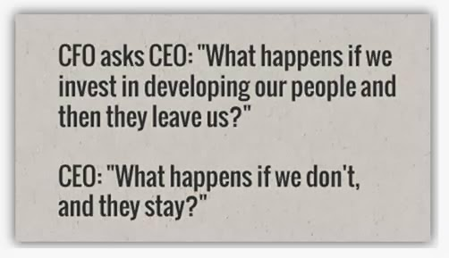
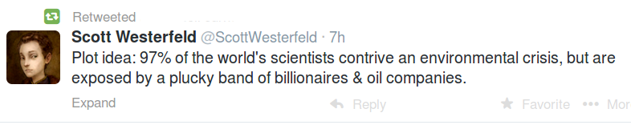

# Week 12

No tax cuts, no tax breaks, no minimum wage increases. Basic income is
the simplest solution that can work. Aging population? Dont
care. Everyone has basic income, if there is less to go around,
everyone gets less. Government controlled health care, medicare? Dont
care. Everyone has basic income, use that to buy health care, and
drugs. Due to the 3rd Wave and white collar style of living, life is
becoming increasingly complicated, we need simplicity. People can go
in and out of work many times througout their life, so a steady basic
income can ward off a lot of unwanted stress in society.

We said this before, this income can simply be "mined" using a proper
digital currency (a new version of Bitcoin), so central mechanisms do
not have to take part in this scheme.

Some talk about a liberterian utopia, or socialist utopia. Actually
through new tech and decentralization, the future can be both.   

---

"In analytics world arguments flare up sometimes around statistics, and
there is a worrying tone in some which seem to talk down, or skip over
the main tenets of the science.. We see words such as "statistics
assumes blah" making it sound like the entire science is based on weak
assumptions"

It is not.

Let's say we are sampling from a crazy-ass distribution which
represents the entirety of whatever data we are looking at. Say.. the
shapes of rocks in 3D. So data is all, and let's say the distribution
that this data came from is freaky. Who created it? For the sake of
the argument, let's say God did. We cant even work with the math of
this distribution, it's that crazy (even if we knew it) but you know
what? God can.

Anyway. Now let's say all we have is small, tiny samples from this
big-ass data coming from the crazy-ass distribution, and we do
something simple with it, like averaging them. We are lowly humans
down here, we have small data, and simple little operations. We have
to make do with what we have.

Here is the kicker though: A theorem says this simple average will
approach the "true" mean of the unknown, crazy-ass distribution that
would need crazy-ass math to compute. So we humans with our simple
little operations and bitchy little data can have a peek at the
creation of God. Like, WOW.

This is not some made-up concoction, or based on weak assumption. It
is Iron Law. In geek, this is a theoretical relation of the small and
the big. Another theorem states the averages will approach the Normal
distribution, but that's another topic. All in all, there is only one
assumption here which is entire data comes from "a" distribution and
that isn't entirely unrealistic. The big / small relation is the
trick, the add-on, the lever here, and based on these theorems (that
are proven), many tools can be developed such as confidence intervals,
p-values etc. These tools are essentially what is called Statistics.

[geek] Intuitively it should make sense even simple average of the
sample approach the true mean because the sample would have been
"generated" closer to that mean, of the true distribution, but it is
good to see this proven mathematically [/geek].

There is no hand-waving necessary while explaining these concepts,
they are as mathematical as any other, such as geometry, calculus
which also create certain axioms and make certain (realistic)
assumptions.

---

BTW, the Wikipedia entry on Namecoin says: 

"The internet activist Aaron Swartz [who commited suicide due to
overzealous US government officials] described a naming system based
on Bitcoin which tries to square Zooko's triangle by employing
Bitcoin's distributed blockchain as a proof-of-work to establish
consensus of domain name ownership. These systems [..] are secure
under Byzantine assumptions. A few months after the proposal, Namecoin
was released which implements the concept".

"On Saturday, I registered [his site] elidourado.bit using Namecoin and
pointed it to the IP address of the webserver that hosts my
website. If you have access to a suitably-configured DNS server (or
know how to use a Namecoin proxy), when you browse to
http://elidourado.bit, it will redirect you to elidourado.com, the
canonical name of the site [..].

For an Internet governance nerd like me, this is exciting. Many of the
political battles over Internet governance have really been about the
Internet Assigned Numbers Authority, which is the function of ICANN
that is nominally overseen by the US Department of Commerce. Although
much of the architecture of the Internet is decentralized, the domain
name system isn’t, and at the top of the hierarchy sit ICANN, IANA,
and the US government.

Actual US oversight of IANA is mostly theoretical—the US didn’t
interfere technically, for instance, when ICANN added .xxx to the list
of top-level domains even though the US opposed the move—but it has
nevertheless become a powerful symbol for other governments, all of
whom have come to rely on a resource that is theoretically under the
control of the US [..].

Namecoin is a fascinating substitute for the domain name system
because, like Bitcoin, it is completely decentralized and
censorship-resistant. Proposed censorship measures like SOPA and PIPA
simply could not apply to Namecoin because it is virtually impossible
to reverse or interfere with name registrations, which are enforced
with strong cryptography. New top-level-domains are added by the
consensus of the miners, just as Bitcoin miners must agree on the rate
of growth of Bitcoin’s money supply [..].

Namecoin is an impressive achievement. Zooko Wilcox-O’Hearn posited in
2001 that identifiers could not be simultaneously secure,
decentralized, and human-meaningful, an idea that came to be
represented in Zooko’s Triangle. With the advent of Namecoin, Zooko’s
Triangle has been broken. It is the first system in history that
achieves all three desirable properties of identifiers"

[[-]](http://theumlaut.com/2014/02/05/namecoin-icann/)

---

More Sy for Fy

"This has to be good news to any fan of Stargate or quality science
fiction: Syfy Channel, the cable network that took a lot of heat for
changing its name and effectively walking away from the genre a few
years ago, wants to get back in the game. The network wants to do
fewer procedurals and B-movies and more traditional, scripted science
fiction drama — be it regular series or high-profile mini-series
events"

---

Graduating from the Slammer

"A recent report found that jailing an inmate in New York City for one
year costs more than four years of tuition at an Ivy League
university. The Independent Budget Office found that in 2012 it cost
the city $167,731 to hold each of its daily average of 12,287 inmates,
or about $460 per inmate per day.

Undergraduate tuition at Harvard University is $38,891 annually, or
$155,564 for a four-year degree. Of those inmates, more than 2,000
were being held for drug offenses, surpassing the number for murders
or robberies"

[[-]](http://america.aljazeera.com/articles/2013/9/30/report-finds-nycinmatecostalmostasmuchasivyleaguetuition.html)

---

---

Extremely likely IMO 😶

---

Land of Kebab is in disarray. There are allegations PM stashed tens of
millions at a home, in cash, which would naturally be as a result of
kickbacks from businessmen; there is a recording between PM and his
son discussing how to move this cash to somewhere else. Are these
recordings genuine? Naturally noone believes the other side's audio
analysis, in this case, individuals with skills and with no axe to
grind can be the best source of information. An audio sound engineer
analyzed it and decided that the conversation is genuine. In that
case, it is bad juju for all involved.

---

Hilarious clip - featuring two Catholic priests.

[Video](https://youtu.be/kpxBgrJFPOA)

---

#I,Teacher

Issac Asimov on computerized education... Watching the interview made
me remember one of his books, Prelude to Foundation in which
mathematician Hari Seldon travels across a planet. At one point, he
meets a poor little kid Raych (I looked this up -I have all Asimov
books electronically-), and gives him a educational computer in return
for some item. "Wanna learn math? Here it is". Hah! In another
conversation, someone asks Seldon,

D: You can program computers, I suppose.”

HS: “Of course.”

D: “I’m talking about teaching computers, you understand, and I’m asking if you can devise programs to teach various phases of contemporary mathematics.”

HS: “Yes, that’s part of my profession. I’m assistant professor of mathematics at the University of Helicon.”

Hear that? It's part of his profession

---

U have to know when big data is good and when it is not. In terms of
modeling (summarizing it) it is good when the dimensionality of your
data is high. By dimensionality I mean the "columns" in a tabular data
format. If I had a table of average temparature per year and country,
dimensions would be country and temparature. If I had the number of
brilliant people in those countries who do not believe global warming,
that would be another dimension (would that column always be zero?
hmm).

Now intuitively it makes sense when these dimensions are in the
thousands, millions or billions, having more data would show more
combinations of them, and increase chances for pattern
matching. Somewhat related to this, there was an argument started by
Norvig of Google who said "more data beats better algorithm". There
were objections. It needs to remembered though Norvig deals a lot with
natural language processing, and in those problems the dimensionality
is naturally high. Every word in a language in essence becomes a
dimension for NLP ppl. With problems with lower dimensions, more data
might not make a difference, as data scientist from Netflix aptly
demonstrated (he also answers Norvig in the presentation). He showed a
graph too, it's like, after 2 mil data points for this particular
model, there is no improvement in accuracy.

And sometimes there are cases when the output of the processing is
big; Google computes a rank for all pages on the Net, in that case the
input is big because the output is big.

"Big data is a big business, even if everyone working in the field 
actually hates the term. Some argue it's too broad, others say it's 
purposely all-encompassing"

---

---