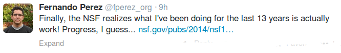
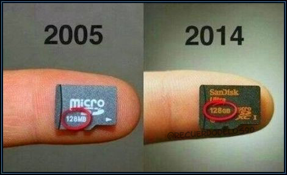

# Week 16

"Russian TV Propagandists Caught Red-Handed: Same Guy, Three Different
People (Spy, Bystander, Heroic Surgeon)... 

The Putin propaganda machine cannot rest. It must provide new footage
daily for a viewing public eager for the next Ukrainian outrage,
growing angrier with each passing day, and asking: When will our great
leader, Vladimir Putin, go in and rescue our poor brethren across the
border in Ukraine? [..]

The Russian propagandists, trapped on a racing assembly line, are
bound to cross wires on occasion. They will make mistakes, which they
hope that viewers will not catch. But they have made a huge blunder,
for which heads are falling in TV studios in Moscow and in Crimea:
Three different channels have featured interviews with one Andrei
Petkov, lying wounded in a hospital in the south Ukrainian city of
Nikolayev. In the three interviews, he is identified by name. He is on
his back in a hospital bed, describing his experiences in the previous
evening’s violence, which left him with serious wounds. Petkov is
dressed in a black outfit, his nose bandaged. In each interview, he
speaks softly, but with earnest conviction. He cuts a sympathetic and
credible figure.

The problem is that Andrei Petkov is a different person in each
interview!"

---

"Dear Colleague:

How scientific research is conducted across all science disciplines is 
changing. One important direction of change is toward more open science,
 often driven by projects in which the output is purely digital, i.e., 
software or data. Scientists and engineers who develop software and 
generate data for their research spend significant time in the initial 
development of software or data frameworks, where they focus on the 
instantiation of a new idea, the widespread use of some infrastructure, 
or the evaluation of concepts for a new standard. Despite the growing 
importance of data and software products the effort required for their 
production is neither recognized nor rewarded. At present there is a 
lack of well-developed metrics with which to assess the impact and 
quality of scientific software and data. Unlike generally accepted 
citation-based metrics for papers, software and data citations are not 
systematically collected or reported.  NSF seeks to explore new norms 
and practices in the research community for software and data citation 
and attribution, so that data producers, software and tool developers, 
and data curators are credited for their contributions.

Note: Perez is the creator of the iPython Notebook technology"

---

---

"@Conversnitch

Meet Kyle McDonald and Brian House: They’re an artist duo who put
Wi-Fi-enabled recording devices in lamps, and installed them in a
McDonalds, a library, Washington Square Park and a private
bedroom. For seven months the lamps picked up and recorded
conversations, which were subsequently sent to Mechanical Turk
workers, who transcribed the conversations and posted them to the
twitter feed @Conversnitch. Wired broke the story this morning, and
the two artists released a video, which can be viewed below:

Watching the video or scrolling through the Twitter feed leaves one
feeling disturbingly exposed and violated — especially in a city where
small apartments mean much of some New Yorkers’ lives are lived in the
public sphere. This feeling of unease was the aim of the project, with
the express goal of making the public think more about the NSA and
mass surveillance"

[[-]](https://player.vimeo.com/video/87564506)

---

---

