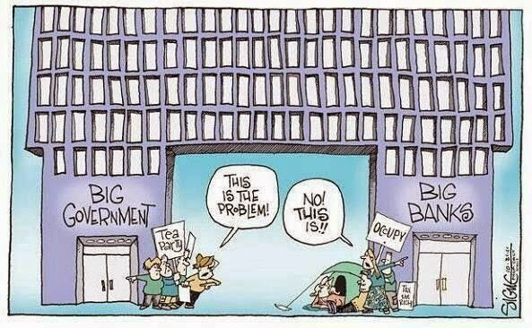

# Week 24

"Nigel Farage's core voters are not EU-obsessed Tories, but
working-class men [..]. To truly understand Ukip's appeal you need to
go much deeper.  The roots of this revolt can be traced back over
decades. Divides in the social and economic experiences of voters have
appeared, their values and priorities have been widening, and a new
electorate of "left behind" voters has grown up. These voters are on
the wrong side of social change, are struggling on stagnant incomes,
feel threatened by the way their communities and country are changing,
and are furious at an established politics that appears not to
understand or even care about their concerns. And it is these
left-behind voters who have finally found a voice in Farage's revolt.

Farage is no catch-all populist; his appeal is concentrated in
 specific groups and is utterly alien to others. Ukip has virtually no
 support among the financially secure and the thirty- and
 fortysomething university graduates who dominate politics and the
 media. Support is weak among women, white-collar professionals and
 the young. Ethnic-minority voters shun the party totally.

[..T]his is a revolt dominated by white faces, blue collars and grey
hair: angry, old, white working-class men who left school at the
earliest opportunity and lack the qualifications to get ahead in
21st-century Britain"

---

To describe Uber's service -- anyone, with any kind of car, can become
an Uber "taxicab". Old system is syncronized, concentrated,
specialized - typical 2nd wave. "Taxi driver", a person with a
predefined job function, waits somewhere or drives around to get
customers to perform that specific function. However Uber software and
cell phones allow asynch cab getting behaviour to occur; Anyone
anywhere can sign-up, anyone can get a cab, people can use their
regular car for carrying customers. Ratings for both driver and
customer are kept,  system is peer-to-peer. Perfect 3rd Wave.

Taxi drivers, unions protest; Check.

"[L]et's take my favorite quote from Manhattan, where Woody Allen's
character pays his date this ultimate compliment in the back of a cab:
"You look so beautiful, I can hardly keep my eyes on the meter."

In a smartphone world, meters have no reason to exist. Here's what I'm
like in the back of an Uber X: relaxed, enjoying the ride, watching
the world go by, enjoying a friendly chat with a friendly
driver. [.. P]aying a few extra dollars is completely worth it for
that joyous moment of getting out of the back of a car without having
to figure out a tip, fiddle with a credit card, or take an utterly
pointless, wasteful paper receipt.

My brain still isn't quite used to it: Are you sure — it asks me at
the end of every Uber trip — are you sure you shouldn't be taking out
your wallet right now? Are we getting away with something here?
Shouldn't we reward that nice driver? [..]

Are Uber and Lyft drivers nicer because they know their riders are
going to rate them out of five stars? Perhaps. But there are other
aspects of the app experience that nudge both of us into good
behavior.  Passengers have star ratings, too, which only drivers see;
this means that when they pick you up, they invariably know you're a
good egg.

Dear [old-style] taxi driver: [..] Your protests against the launch of
these services in major European cities Wednesday, where you clogged
major arteries like bad cholesterol, simply made you look more
petulant, aggressive and luddite [..]"

---

#teaparty #occupy

---

Kruse Kruse is a professor for general and organisational psychology,
his current field of interest is focused on the evolution of
NetSociety. Another video shows Kruse at Bundestag (in
German). Another, a suggestion to Facebook. On questionaires,
networks, network effect

https://youtu.be/sOlfsysVi0I

---

In 2012, Apple won the year's biggest patent verdict—more than $1
billion against Samsung.

The company also lost one of that year's biggest cases when an East
Texas jury ordered it to pay $368 million to a company named VirnetX
for infringing patents related to FaceTime and VPN On Demand functions
used in iPhones, iPads, and Macs. VirnetX is a company some call a
"patent troll" because its only business is now patent
enforcement. Then, in March, US District Judge Leonard Davis ordered
an ongoing royalty to be paid to VirnetX. The number was downright
stunning: 0.98 percent of revenue from iPhones and iPads sold in the
US.

---

"Patent troll on the verge of winning 1 percent of iPhone
revenue;.. Maybe some in US rejoiced when Samsung lost against Apple
in a patent skirmish: foreign company had lost, local company had
won. Sadly for them what goes around comes around - now it's their boy
who is getting spanked. I beieve a categorical ban against software
patents is in order. We all know if Xerox Parc filed and enforced
patents for the ideas it generated back in the day, there would be no
Apple, and there would be no Microsoft. Yet, we now see Apple patents
such as "'163: Enlarging documents by tapping the screen". Is this
what law profession is about now? Who makes money, an entire business
dealing with this shit? Someone actually reads these words, files some
papers, follows-up, shifts around resources, for what? What benefits
do we, the rest of the society get from this kind of structure?"

---

Nice.. starting from 3:20, some solid net neutrality info.

[[-]](https://youtu.be/fpbOEoRrHyU)

---

"Heavy patent litigation scared off about 22 billion dollars in VC
funding over 5 years... Turns out there is a very real, and very
negative, correlation between patent troll lawsuits and the venture
capital funding that startups rely on. A just-released study by
Catherine Tucker, a professor of marketing at MIT's Sloan School of
Business, finds that over the last five years, VC investment "would
have likely been 21.772 billion dollars higher... but for litigation
brought by frequent litigators.""

---

This is a good idea.

"What America could meaningfully do in the Middle East, with its unique
diplomatic convening power, is to support the creation of a genuine
regional security order, one that outlasts America’s commitments in
the region (which should decrease commensurate with the ebbing of its
reliance on Mideast energy supply) and remains robust in the face of
Chinese encroachment. This would require bringing Turkey, Iran, Saudi
Arabia, and Israel into the same institutional fold.This proposal,
known presently as the “Gulf Security Conference”, has been widely
discussed in inter-governmental fora such as the IISS Manama
Dialogue. It has never been taken seriously by U.S. officials,
however, on the grounds that neither Israel nor the Arabs trust
Iran. But the time for these neighbors to pretend they inhabit
different continents has passed. “Balancing” Iran has been code for
attempting to freeze time, yet it has merely meant wasting it—decades
of it. No state should rely permanently on America as a crutch, nor
should America endlessly drain its treasury in the name of an offshore
balancing policy that incentivizes belligerence. Geography is still
destiny. These four regional anchors should be urged to encourage
organic bridges to form across the region [..] But they won’t do it
without American prodding."

---

"In past generations, most people took whatever work was available and,
crucially, learned the necessary skills on the job. From 1945 to
around 1978, amid the postwar boom, work life in America was
especially benign and predictable. The wage gap between rich and poor
shrank to its lowest level on record, and economic growth was widely
shared.

But we now know that, during the '70s, this system was becoming
unhinged. Computer technology and global trade forced manual laborers
to compete with machines at home and with low-wage workers in other
countries. The changes first affected blue-collar workers, but many
white-collar workers performing routine tasks, like office support or
drafting or bookkeeping, were also seeing their job prospects
truncated.

At the same time, these developments were hugely beneficial to elite
earners, who now had access to a larger, global market and
productivity-enhancing technology"

---

Link

Will robots and software eat all the jobs? No. Will robots and
software eat your job? Yes, probably. Eventually. Rejoice!  [.. But]
tomorrow's jobs will increasingly exist in Extremistan, not
Mediocristan.

[For those who arent] familiar with those terms [h]ere's a
primer. Briefly [..] Mediocristan activities is fixed by boundary
constraints - the number of hours worked, the number of clients aided,
the number of widgets manufactured [.. like a hairdresser, cannot cut
two people's hair at the same time]. By contrast, the remuneration for
Extremistan activities - basketball player, musician, messaging-app
co-founder - can scale to an arbitrary amount.

[..B]ut most would-be pro athletes never make it. Most artists never
get to quit their day job. Most startups fail. Few people engaged in
Extremistan activities ever become successful enough to start
referring to what they're doing as a job.

[Then] if more and more people become unemployed - by which I really
mean, fighting to get by in Extremistan - then only one safety-net
option will work: a universal basic income. Marc Andreessen is exactly
right when he says technology can kindle the kind of economic growth
we need; from my perspective, we need it to make a basic income a
viable option. I just hope that happens before too many lives are
ruined because our politics evolve orders of magnitude slower than our
economies, much less our technologies.

Yes

Markets are effective for allocating resources, but markets cannot
"discover and fund talent as they are created". No market can tell
some grad student hacking away in Finland will create the most
influential operating system known to mankind, and fund him the moment
he starts writing this new OS. This is why a safety net is needed, it
will give us both inventions, and money in people's pockets which they
can use to buy necessities on the marketplace. The solution is both
social and capitalist.

---

"On one hand, blockbuster acquisitions [such as the WhatsApp purchase]
inspire millions of Americans to try entrepreneurship every
year. Conversely, WhatsApp and Twitch employ fewer than 200 people
combined, reminding us that entrepreneurs, even when they create
enormous value, do not always create enormous numbers of jobs,
particularly for the middle class.

This reality doesn't square with rhetoric about the crucial link
between entrepreneurship and job creation. Yet Washington is cranking
out legislation, and nearly every state has programs, such as tax
credits for investors, to cultivate entrepreneurship.

Why do politicians and business leaders continue to link
entrepreneurship to employment in the age of Instagram?

There are two reasons: history [that is, second wave] and marketing.

Historically, there was a link between entrepreneurship and
jobs. Early American innovators such as Henry Ford, George
Westinghouse and Thomas Edison created millions of middle-class jobs
through their entrepreneurial efforts.

One key difference is that many of the entrepreneurial success stories
of 2014 are in mobile applications and other kinds of software that
will never require huge production plants or bustling warehouses [..].

One example is Kayak.com, the handy application that allows you to
shop for airline tickets, along with hotels and rental cars [..] Kayak
created tremendous value for its investors, but did it create jobs?
The company had 185 employees in 2012. In fact, Kayak likely destroyed
jobs. By a conservative measure, the number of travel agents declined
by 50 percent from 2000 to 2012. Likewise, companies such as Netflix
contributed to the failure of Blockbuster and the jobs of 60,000
workers. And the advent of e-mail is one important factor in the
expected elimination of more than 100,000 postal worker jobs over the
next few years"

Yes

In our new non-smokestack economy,  if "creative destruction" destroys
jobs in some factory, we do not get another factory that will employ
the same non-skilled blue-collar workers. Nowadays when jobs are
destroyed, they are gone for good.

---

Link

"THE way we’re working isn’t working. Even if you’re lucky enough to
have a job, you’re probably not very excited to get to the office in
the morning, you don’t feel much appreciated while you’re there, you
find it difficult to get your most important work accomplished, amid
all the distractions, and you don’t believe that what you’re doing
makes much of a difference anyway. By the time you get home, you’re
pretty much running on empty, and yet still answering emails until
you fall asleep [..]. Around the world, across 142 countries, the
proportion of employees who feel engaged at work is just 13 percent"

And there is that

I believe the two stories above are somewhat connected.

Govs one day will have to give their citizens basic income because
beyond earning money there is now a fundamental disconnect between
things we thought were always connected: job and earning (good)
income, college education and getting a job, gaining knowledge and
college education, teachers and schools. 

Money is the biggest issue - without it, people cannot survive, so it
needs to be given out (bcz it cannot be safely, consistenly tied to a
job anymore). Either that, or people shift to a new digital currency
that has social features built-in en masse, voting umm.. with their
pockets, or their .. currencies. When can this happen? Well, how long
do we have until the next financial crisis? It happens every 10 years,
so in 4 years right? 2018 then. And this time, when next meltdown
occurs ppl will truly scratch their heads and start grumbling louder.

---

"[Greenspan is] just this gnarly mass of contradictions. He’s an
acolyte of Ayn Rand – believes that no intervention in free markets is
the right approach – and yet he proceeded to spend his entire career,
from 1987 through 2005, with his hands on the levers of Federal
Reserve policy. He manipulated interest rates and money supply in
order to win the love of traders. In 2001 he took rates down to
unprecedented levels – below 2% – and kept them there for three
years. Rates were at 1% for a full year!  That had simply never
occurred before in history. If you look at the late 1950s and early
1960s, rates would dip below 2%, but only for weeks at a time. In the
“Who is to blame?” game Alan Greenspan is number one with the bullet,
he’s top of the list [..]

[If we want to prevent another financial meltdown what needs to be
done is] really simple. Go back through the past 20 years of radical
deregulation and overturn all the rules that were changed. You don’t
need all this Dodd-Frank legislation. Just reinstate Glass-Steagall,
overturn CFMA. Just undo everything that was done in 2003, 2004, 2005
and 2006, remembering that old expression: If it ain’t broke, don’t
fix it"

---

China, the world's biggest emitter of climate-changing greenhouse
gases, will set an absolute cap on its CO2 emissions from 2016, a top
government adviser said on Tuesday.  The target will be written into
China's next five-year plan, which comes into force in 2016, He
Jiankun, chairman of China's Advisory Committee on Climate Change,
told a conference in Beijing."The government will use two ways to
control CO2 emissions in the next five-year plan, by intensity and an
absolute cap," he said. The move will be the first time China puts
absolute limits on its CO2 emissions, which have soared 50 percent
since 2005.

---

World In Transition, Wenger

[[-]](https://youtu.be/NP0P2BT0vTc)

---

Winners/Losers in a Digital Age, Golloway

[[-]](https://youtu.be/EMU8YvOjRXc?t=11m50s)

---

Ahaha. That's hilarious. I dont smoke the stuff, but the illegal
status of weed is causing a lot of problems for US of A IMHO; from
overpopulation of prisons, to growth of crime around the
substance... you name it.

"The FBI Can’t Hire Cyber Security Recruits Because They All Smoke Weed

FBI Director James Comey is starting to think the law enforcement
agency's zero tolerance policy on marijuana might be, like, a total
bummer. According to the Wall Street Journal, Comey discussed how the
bureau's pot prohibition was making it harder to find tech savvy
recruits when he spoke to the annual White Collar Crime Institute
conference Monday"

---

Drucker: "In the developed countries, the dominant factor in the next
society will be something to which most people are only just beginning
to pay attention: the rapid growth in the older population and the
rapid shrinking of the younger generation [..]

The shrinking of the younger population will cause an even greater
upheaval, if only because nothing like this has happened since the
dying centuries of the Roman Empire. In every single developed
country, but also in China and Brazil, the birth rate is now well
below the replacement rate of 2.2 live births per woman of
reproductive age. Politically, this means that immigration will become
an important—and highly divisive—issue in all rich countries. It will
cut across all traditional political alignments. Economically, the
decline in the young population will change markets in fundamental
ways. Growth in family formation has been the driving force of
alldomestic markets in the developed world, but the rate of family
formation is certain to fall steadily unless bolstered by large-scale
immigration of younger people. The homogeneous mass market that
emerged in all rich countries after the Second World War has been
youth-determined from the start. It will now become
middle-age-determined, or perhaps more likely it will split into two:
a middle-age-determined mass market and a much smaller
youth-determined one. And because the supply of young people will
shrink, creating new employment patterns to attract and hold the
growing number of older people (especially older educated people) will
become increasingly important.

All this means that winning the support of older people will become a
political imperative in every developed country [.. hopefully wout
abusing their fears with populist slogans].

The respected DIW research institute in Berlin estimates that by 2020
Germany will have to import one million immigrants of working age each
year simply to maintain its workforce. Other rich European countries
are in the same boat. And in Japan there is talk of admitting 500,000
Koreans each year—and sending them home five years later. For all big
countries but America, immigration on such a scale is unprecedented.

The political implications are already being felt. In 1999 fellow
Europeans were shocked by the electoral success in Austria of a
xenophobic right-wing party whose main plank is no
immigration. Similar movements are growing in Flemish-speaking
Belgium, in traditionally liberal Denmark and in northern Italy. Even
in America, immigration is upsetting long-established political
alignments. American trade unions’ opposition to large-scale
immigration has put them in the anti-globalization camp that organized
violent protests during the Seattle meeting of the World Trade
Organization in 1999. A future Democratic candidate for the American
presidency may have to choose between getting the union vote by
opposing immigration, or getting the vote of Latinos and other
newcomers by supporting it. Equally, a future Republican candidate may
have to choose between the support of business, which is clamoring for
workers, and the vote of a white middle class that increasingly
opposes immigration.

Even so, America ’s experience of immigration should give it a lead in
the developed world for several decades to come. Since the 1970s it
has been admitting large numbers of immigrants, either legally or
illegally. Most immigrants are young, and the birth rates of
first-generation immigrant women tend to be higher than those of their
adopted country. This means that for the next thirty or forty years
America ’s population will continue to grow, albeit slowly, whereas in
some other developed countries it will fall. [US] is culturally
attuned to immigration, and long ago learned to integrate immigrants
into its society and economy. In fact, recent immigrants, whether
Hispanics or Asians, may be integrating faster than ever. [ ..] The
one big obstacle to the full integration of recent immigrants in
America is the poor performance of American public schools"

---

Autonomous Freakin Car Without Even a Freakin Steering Wheel

[[-]](https://youtu.be/CqSDWoAhvLU)

---

