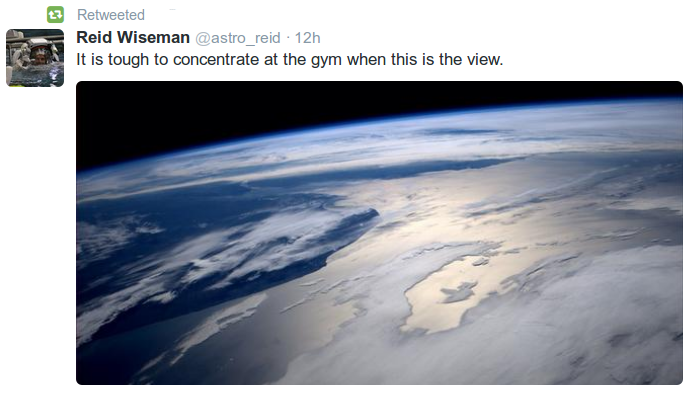

# Week 28

---

Haha.. Very cool.

Good to see soccer is becoming a thing in US.

"Someone briefly changed the Wikipedia entry for the United States
Secretary of Defense from Chuck Hagel to U.S. goalkeeper Tim Howard
[..] The entry was fixed quickly, because \#facts and all, but we still
think Wikipedia could have left it up for a while anyway"

---

🤣 Occulus Rift is the VR headset company recently acquired by
Facebook. Trailer video from the game Elite: Dangerous is here. Looks
good. 

"After a bit of setup and jumping through various Rift demos, the
Elite: Dangerous servers came back online after receiving a major
update; opening their doors to the world (and me) as part of the
Standard Beta. Just moments into the multiplayer game, I realised
it. E:D in the Oculus Rift DK2 is simply the single best gaming
experience I have had to date in my 29 year life. I sat on this
statement this morning, comparing memories which may have been better
in both indie and triple A titles, but E:D plus DK2 beat them all by
comparisons, hands down. So, what floored me and evoked surprise and
emotions I never thought would surface while gaming? Initially, it was
the sight of a rotating space station with a planet far below and
trails of smoke from recent passers by which made the entire scene
electric to me. I just sat there and soaked it in as the small beeps
and sounds of my ship ticking over reminded me that I, too, was alive
and part of it all. As I took a flyby of a floating city and docking
station, something about the detail level and ethereal combination of
elements caused an involuntary tear to roll down my right check in
front of more Twitch viewers than I thought I would ever have. I have
never felt that in a game. I know others will feel this with me, in
time. I realised am no longer waiting for change, in fact. The world
-has- changed. It has changed forever"

---

No More Excel Sheets for That Man

"Some on the Net created a Github project called "Capital in the 21st
Century in R", the contributors are attempting to reproduce all graphs
and computations of Piketty's book in R language (the author
apparently used Excel). To Piketty's credit, his sheets were shared
and data is (somewhat?) accessible; but sharing reproducible code /
data written in a sane programming language, through Github,
preferably displayable in an ipython noteebook (which also allows
running R code BTW) is much better. One post here shows how using
equally spaced x-axis (which is a quite normal thing to do), changes
the shape of the graph"

---

The [death] of three settlers in the West Bank has given Israel the
excuse it was waiting for to set a huge military operation in motion
[..].

Israel has not taken kindly to the Palestinian Authority’s moves to
join international organizations and sign international treaties [..]
This would give the I.C.C. jurisdiction in Palestinian territory and
thus give victims of war crimes, or crimes against humanity, access to
international justice [..]

Israel [also] rejects the recent internal Palestinian political
reconciliation between Fatah and Hamas and the formation of a
Palestinian unity government. Israel was counting on a continuing
schism to promote its own version of a solution to the Palestinian
issue: a state in Gaza and other Palestinian cantons under de facto
Israeli rule in the West Bank. For that plan to come to fruition, the
political separation between the Gaza Strip and the West Bank would
have to continue [..]

All of this worries Israel because it suggests that the unanimous and
unquestioning support the country has grown accustomed to receiving
from Western nations is decreasing. The success of the boycott,
divestment and sanctions movement in countries previously sympathetic
to Israel is a testament to this shift at a grass-roots level. Israel
was desperately seeking a pretext to turn the spotlight away from its
weaknesses. In the disappearance and killing of the three settlers, it
has found one. 

True

Israel has been stirring up trouble even since both governing
authorities in Palestine united. The point we are at is a direct
continuation of that policy.

ISIS victory in Syria could have given Israel another opportunity to
draw parallel among various groups of "bearded people" who we are
expected to assume are equally crazy just because they all have
beards.

---

Tony Blair

[paraphrasing] Iraq War had nothing to do with current ISIS victory

Wrong

Not helping rebels in Syria was the reason [..]

Yes

It was another reason, let's just say, it was a big chain of
missteps. But yes, not helping rebels in Syria was a big mistake. We
were against the Iraq War and we repeatedly called for helping rebels
in Syria. 

---

Commentator

Government of Turkey (GOT) does not want a seperate Kurdish state [..]

Well..

It is a bit unclear what it wants but in the mind of GOT, it needs
oil, and wants to get it from "the guy next door" (pure tactics, zero
strategy). Davutoglu and his team are too delusional to figure out
that this oil is critically important for Iraq, and belongs to all of
Iraq, and that alone would be a reason for this country to remain
united (and the central authority would fight to keep this resource in
Iraq). IMO, the policies GOT pursued have always been aimed at causing
a break-up of Iraq. We said before - Ankara needs to play nice with
the Iraqi central government, no matter their misgivings. 

---

News

The Kurds have been unable to sell much of the oil that they have
managed to transport to the Turkish port of Ceyhan, on the
Mediterranean coast, as buyers have been scared off by potential legal
challenges.

At least four tankers, including the one lingering off the coast of
Morocco, have been loaded with Kurdish oil at the port in Ceyhan, but
only one, oil industry executives say, has found a buyer — an
unidentified Israeli entity. Even before the current crisis, the
United States opposed the Kurds’ exporting their own oil, fearing that
could lead to the breakup of Iraq.

And this is the result

---

News

Assad helped ISIS in the past.

He probably did

Again: another Mideast dictator letting some bearded idiots roam about
so he can scare off the rest of the world about them in order to
solidify his position. This is what Mubarak did with Muslim
Brotherhood. So yes, that means MB was artificially inflated and
therefore illegitimate. Just like ISIS is today.

For any form of sanity to ever return to this region, we need two
things: a united Syria without Assad, and a united Iraq which means
ISIS needs to go. Like, away.

"Well, but current borders are artificially drawn". Yes they are, but
that can be a starting point for an exercise in practicing tolerence
and learning to rule through consensus. If two big sects of the same
religion cannot live together in the same country, would they be able
to live side-by-side in the same region?

---

Dick Cheney

[paraphrasing] US left Iraq too early and prematurely. That's why ISIS
has grown.

Maybe

But today was a good time as any for a withdrawal, as what happened
today would surely have happened later.

---
