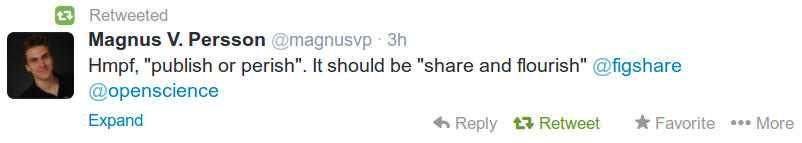
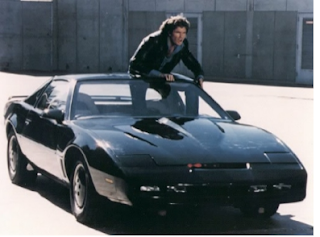
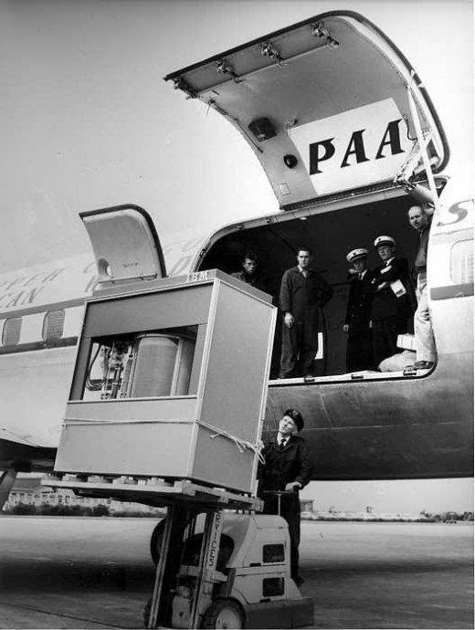

# Week 4

---

---

That's all fine but, will I be able to do this?

The Hoff!

(That's how the actor is known in Germany, where he is still quite
popular, even though, as his last name might suggest he is not of
German descent -that's what he claims anyway according to his
autobiography, but again, you never know-).

"This year will mark another key milestone in self-driving 
technology. The National Highway Traffic Safety Administration (NHTSA) 
is widely expected to announce standards and mandates for car-borne 
beacons that will broadcast location information to other vehicles on 
the road. The beacons will warn drivers when a collision seems 
imminent—when the car ahead breaks hard, for example, or another vehicle
 swerves erratically into traffic. Automakers may then use this 
information to take the next step: program automated responses"

---

A 5 megabyte IBM hard disk is loaded into an airplane. It weighed over
1000kg, year 1956.

5 Megabytes! 

People wonder where the jobs have gone. If we bring back 5 MB hard drive that weighs a ton, maybe we could create more jobs. There are 6 people standing around right there while that thing is being loaded onto the plane. 

---

