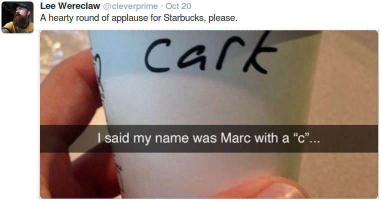

# Week 40

Would it be better if Israel disappeared from Middle East?

No

It would be better if they stayed.  Maybe that is a punishment of
sorts, I dont know.. But, here is a country with an educated
middle-class who possesses scientific / technological expertise -
great.  Spread some of that European science, that which you took from
the continent before your unfortunate departure.  It would help Middle
East in a major way.

---

Question

Are you for two-state solution in Israel?

No

We are for a one-state solution in Israel. A solution that includes
all Palestenians and Jews in the same country. Just the same way we'd
like to see countries not breaking up, we'd like to see a contiguous
landmass for Israel that has Palestenians as first-class
citizens. Current situation in terms of territory does not look
manageable to me. Just take a look at the recent borders: this map
looks like crap. Seriously, it looks like someone rolled down their
pants, took a shit, and the patterns on the floor would look like
this. How did things degenerate so badly?

Here is an article describing the days not long ago:

During the 1980s and ’90s, tens of thousands of Palestinians from the
West Bank and Gaza Strip worked in Israel. They learned Hebrew and
built relations with their Israeli employers. They watched Israeli
television (there was little else available), and many developed a
cautious but unmistakable admiration for Israeli politics and public
accountability. When Palestinians talked of building a state, it was
not uncommon to hear members of their elite refer to Israel as a
model. They witnessed the robust (sometimes brutal) nature of public
discourse in Israel, and many liked what they saw.

In turn, Israelis would venture on weekends into the West Bank, where
they would get their cars fixed, shop for vegetables and snack on
plates of unparalleled hummus. They attended weddings of their
Palestinian employees and their children. Some Israelis and
Palestinians even went into business together.

The relationship between the two peoples was hardly that of equals. It
had a colonial quality not unlike that along much of the American
border with Mexico. But when the guy repairing your balcony did not
show up for work because of a closure of the West Bank and could not
earn his pay, his deprivation meant something to you, as an
Israeli. You knew him; you trusted him; you knew about his family. And
when you, a Palestinian worker, saw your Israeli employer’s mother
growing ill, you understood his anguish. You knew the woman; you liked
her.

When the Oslo peace process fell apart in 2000 and a Palestinian
uprising erupted, the common wisdom that quickly developed was that
the two nations needed not greater intimacy but complete separation.

Then terror attacks in Israel started, but instead of deepening
integration making Israel into a non-Jewish non-nationalist state,
Israeli elite got scared, and built a wall. As a result the bombs are
now coming over the wall into Israeli homes instead of a random attack
at a cafe. The problem was shifted but not solved.

---

Shouldnt coutries aspire to become effective / forceful / as they were
used to be / as they want to be?

Why?

Russians had the U.S.S.R, India had its empire, China had the Middle
Kingdom, Italians had Rome. There are nationalists in power in the
first three - and they all want to be "powerful", whatever that
means... Newly arrived powers, drunk off oil money, want to make
"waves" as well such as Qatar.

But, is being effective and controlling for the sake of being
effective and controlling the optimal way to behave? People will want
what they want, and in the 21st century they dont care which distant
capital wants them to want. No matter what Putin does, he cant seem to
stop Ukraine from moing away from his orbit. Qatar wants to be
"effective", so they flex some muscle trying to exert influence, I
guarantee you, just for the sake of doing so -- they finance peasant
Islam all over the globe, i.e. in Libya they are funding Ansar
al-Sharia contributing to the instability in that country (surely
their arch rival Saudis havent been saints either). What is the
purpose of this? Just so you can get your guy in there, and feel all
good about it, because you have some sort of control in a distant
country? What happens to the people living in that country? Even
worse, what happens if you fail, and people of that country hold you
responsible for the mayhem you caused them? What happens to your
influence then?

Shouldnt influence be a natural result of how much a country can help
another? This is true soft-power; maybe it is the absence of it that
makes it even better... that ppl want the counsel, friendship of a
another country, because they have something to gain.

Creating win/win situations, not for just one segment of another
country, but the totality of it, is key.

---

Democrats are divided on whom to support for prez elections.

Get Gore

This guy is one the most knowledgeable politicians on technology and
related policy. When the NSA s..tstorm started, he came out of the
shadows and bslapped, hard. No questions, no ifs and buts. None of
that "on one hand.. but on the other hand" business.  This is the guy
u need for a painless transition to 3rd Wave structures and
policies. Plus he can win an election... Hell, he has already done it
once! 

The only problem is Gore can come across as unnatural. But.. here is
the thing on that; G. is typed as INTJ, and coincidentally (!) two of
the most well-known artificial lifeforms portrayed  on TV and movies,
Brent Spiner (Data) and my man Ahhnuld (T1000) have been INTJs
themselves in real life. This type always get a bad-rep in US, one way
or another. Out of the two Silicon Valley movies that came out
recently for example, The Social Network and The Internship, on
Facebook and Google respectively, it was Facebook and its founder who
came out looking like a weirdo. Google got off easy. Why? Both Google
founders are P types, they can flow better with their surroundings
(i.e. reporters, public), fit in social situations easier, and even
though they are introverts, they do not come accross as weirdos.
Zuckerberg.. is the robot. I remember one reporter's comment after an
interview with him, she was like, "his eyebrows do not move", as if
reporting on some freak show.  Does everyone need to be like everyone
else? What's with the constant judging? 

Gore: okay he comes across as some kind of Southern Terminator. But
that's how they are supposed to look, man. He is not a natural, on
stage, on whereever; then The Integrators make sure he is out on
front, he is preselected, not some other loser. No he did not invent
the Internet, but he found the funding that made Mosaic browser
possible. U make sure this is known. This kind of stuff, experience,
has to count for something.

US elections became a kind of high-school popularity contest, and the
system is paying the price for it, especially these days because the
times when your average NY Times reader could become a president and
still make the right shots is ovah. Now countries need effin maestros
in the big chair. The lower ranks of the Integrators might bitch and
moan because 'oh he knows the workings of the state really well and he
is gonna bslap us every day'; But it's better for you, in the long
run, as well as everyone else.

---

Question

Oil production problems?.. But oil production numbers seem to be
fine. And OPEC says...

OPEC Lies

OPEC countries have the incentive to inflate their numbers. And
unsurprisingly, they do.

---

\#you \#go \#guy

---

I watched a TED talk once where a "1 percenter" commented on this
income inequality problem. He said something like "I have billions of
dollars, but we are only 4 people (in his family) and we cannot
possibly buy more than 3-4 cars, and a few houses, and eat few meals a
day". This is a simple observation but points to the root of the
problem; Even a thousand people with a fraction of his wealth could
buy thousands of cars, lots of clothing, food, what not. Hence the
conclusion - more concentrated wealth hurts the economy.

This, of course, is a (temporary) side effect of knowledge-based
production; We dont yet have the digital money system, "3W aware
wealth spread" that could equalize wealth as a nature of its design,
or God knows what else made possible through technology /
Internet. What is happening now is on top of existing second wave shit
infrastructure there is crazy knowledge production at the private
sector, which compounds imbalances.

That is why, as a short-term solution, we keep saying basic income
should be considered. Not minimum wage (a solution that would not help
the 21% unemployed people in US for example).

"[The realisation on income inequality] has now spread to institutions
that would not normally be accused of socialism [..] According to the
Federal Reserve, the upper 3 per cent of the income distribution
received 30.5 per cent of total incomes in 2013. The next 7 per cent
received just 16.8 per cent. This left barely over half of total
incomes to the remaining 90 per cent. The upper 3 per cent was also
the only group to have enjoyed a rising share in incomes since the
early 1990s. Since 2010, median family incomes fell, while the mean
rose. Inequality keeps rising. The Morgan Stanley study lists among
causes of the rise in inequality: the growing proportion of poorly
paid and insecure low-skilled jobs; the rising wage premium for
educated people; and the fact that tax and spending policies are less
redistributive than they used to be a few decades ago"

---

The Empire Strikes Out

Good stuff..

[[-]](https://youtu.be/TiAPvuMDB0c)

---

\#ouch \#icebucket challange

---

---

Some in Germany wanted to try this new oil exploration thingy, but
then the beermakers came out and said: No you are not. And the whole
thing stopped dead in its tracks. That was very cool. Thanks to
beermakers.

"After California state regulators shut down 11 fracking wastewater
injection wells last July over concerns that the wastewater might have
contaminated aquifers used for drinking water and farm irrigation, the
EPA ordered a report within 60 days [..] The letter, a copy of which
was obtained by the Center for Biological Diversity, reveals that
nearly 3 billion gallons of wastewater were illegally injected into
central California aquifers and that half of the water samples
collected at the 8 water supply wells tested near the injection sites
have high levels of dangerous chemicals such as arsenic, a known
carcinogen that can also weaken the human immune system, and thallium,
a toxin used in rat poison [..].

Adding insult to injury, fracking is a water-intensive process, using
as much as 140,000 to 150,000 gallons per frack job every day,
permanently removing it from the water cycle"

---

---
