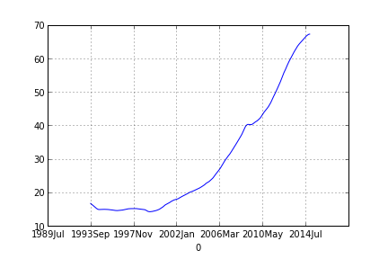
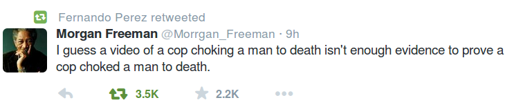
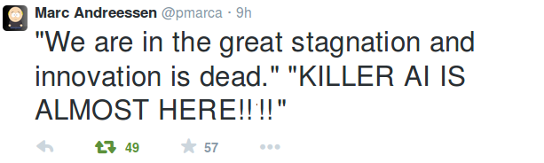

# Week 48

NYTimes

There are about 10 million prime-age men [25-54] who are not working.

Not bad

According to FRED, there are 51.282 million in this demographic,
working, and according to this, this group has, "39.9% (male
63,452,792/female 63,671,631) [in total 127123]". Then 63.452 - 51.282
= 12.170 million prime age men are unemployed. NYT's number is a lot
closer to the one we calculated.

In comparison FRED's own unemployment number here says 2.572
million. I think gov agencies are purposely playing with the
definition of unemployment so that unemployment numbers (hence rates)
come out looking lower (that's why we worked backwards from employment
numbers not trusting their unemployment numbers). But simple
arithmetic reveals what is going on. They do this for overall
unemployment numbers BTW. According to this, prime  age unemployed
overall is at 4.864 mil, employed are 95.684. When added up, their
numbers give 100.548 mil. But this demographic should have 127.123 mil
people in it! Where did the rest (27 million) go? Did they all find
jobs in Mars?

What they are doing is akin to adding up 3 with 1 and coming up with
10. Actually... scratch that. They're not even doing that. What they
are saying is "forget about the 10, forget about the 3. Just look at
1. It's such a low number isnt it!?".

---

Foreign Policy 

The U.S. government seems outraged that people are leaking classified
materials about its less attractive behavior. It certainly acts that
way: three years ago, after Chelsea Manning, an army private then
known as Bradley Manning, turned over hundreds of thousands of
classified cables to the anti-secrecy group WikiLeaks,
U.S. authorities imprisoned the soldier under conditions that the UN
special rapporteur on torture deemed cruel and inhumane. The Senate’s
top Republican, Mitch McConnell, appearing on Meet the Press shortly
thereafter, called WikiLeaks’ founder, Julian Assange, “a high-tech
terrorist.”

More recently, following the disclosures about U.S. spying programs by
Edward Snowden, a former National Security Agency analyst,
U.S. officials spent a great deal of diplomatic capital trying to
convince other countries to deny Snowden refuge [..]

The deeper threat that leakers such as Manning and Snowden pose is 
more subtle than a direct assault on U.S. national security: they 
undermine Washington’s ability to act hypocritically and get away with 
it.

Slam dunk

---

Comment

[Paraphrasing] Arabs messed up big time, Middle-East always in deep
shit, they should do some naval gazing.. Etc..etc..

Do that, but notice it is an unlucky geography

Starting from the pharaohs, then Rome and until / including Ottomans,
these people have been living under adverse conditions, blatant
barbarism for very long time. The discovery of oil in the region made
things worse - France, Britain then US basically caused a lot of mess
in the region. There are many examples of this, I'll give the main
ones.

Installing minority regimes in Syria, Lebanon, and Iraq: the idea was
that the rulers of these countries hailing from minorities themselves,
would always be scared and would depend on "outsiders" (France,
Britain) to stay in power. It worked. Scared ruler, pissed-off
street. Great dynamic right? The exact preconditions you need for
development (not).

Until he became the leader of his country, Saddam was a regular thug;
he was handpicked by US to become what he became. And he ruled his
coutry like a thug. Not much development, but he knew war, so when
mullahs came to power in Iran and executed all senior military
officers, Saddam thought "aha here's my chance" bcz their military was
gone, right, so aided (probably egged on as well) by US, he attacked
Iran. Mayhem, squared.

CIA toppled the democratically elected leader of Iran
(Mosaddeq). Which caused f--king mullahs to come to power in the first
place.

Kuwait: I am convinced Saddam was fooled by US officials and was told
"it's okay to attack this little country" and that US would support
Saddam on that. Saddam did invade but was (of course) left out there
by himself. His action furthermore legitimized the counter-attack on
his regime and the US military/industrial complex had a field
day. Great passing / pick-and-roll there between the underlings in US
gov and the top dogs. The top only sees guy invading, so he can stay
above the fray, give great speeches and order the military in, while
the underlings, unbeknownst to him, did the dirty work to get the guy
invade.

Then Iraq was invaded by US en masse under false pretenses. At this
point it was like, why the hell not?

Unconditional support of Israel caused mayhem on Egypt and Syria (who
were attacked preemptively by Israel).

Enough examples?

Actually it is a miracle the Middle East is not worse off
today. Having said that however, ppl in the region must work twice
hard because of all this bullshit, otherwise the conditions they find
themselves in will never change.

---

Commentators

Middle East is part of Europe

Maybe 

Some are trying to extend European cultural underpinnings to include
all of Middle East. I read couple articles to this effect. That's fine
as long as the narrative is that ME represents what Europe left
behind, which is war, conflict, authoritarinism i.e.  Rome whose
continuation is the "Roman" Catholic Church (I see the new gumbah in
there trying to improve things tho which is a good thing for sure). 

If the cultural mishmash goes too far, then things can get weird. I
mean, some mixes are just not possible. You can have pizza, you can
have chicken tikka masala, but you cant have chicken tikka pizza.

---

The Jerusalem Post

The cabinet voted in favor of the controversial Jewish state bill.

Ha ha..

So they did exactly the opposite of what we said here. Great job.

(Sarcasm comes through right?)

---

News

Taliban attacked a school in Peshawar

They must be scared

Afganistan and Pakistan have been working closer recently, which could
have scared Taliban. They are trying to warn Pakistan, it looks
like. I hope it backfires.

Oh, while we are on topic, let's not forget how Russians caused a mess
in Afganistan. It was because of the dumb-ass Soviets (Putin's
favorite empire in the world) attacking Afganistan this backward-ass
donkeyhumper peasant Islam was sponsored, and the mess grew and grew..

Good job Russian rulers.

---

Movie Quote

[From the movie Swordfish] Jefferson shot a man on White House lawn for treason.

True, but...

The man was found guily for treason, by the courts, so he was facing
the firing squad already, Jefferson only told the firing squad to take
a hike, and basically did their job. It's a little gangsta, but not
too much. He was enforcing the decision of the courts / the law after
all.

The way the movie Swordfish presents it however, kinda, sorta made it
sound like TJ just called some guy in da house and executing the man
on the spot (you getting up on my grill fool?). No.. Nothing like that
happened.

BTW this movie was probably bankrolled by neo-con "interests". It was
all about "doing what's necessary", and generally about "letting go",
"letting it rip".

---

Link

When OPEC announced on Thanksgiving Day that it would maintain oil
production at 30 million barrels per day, chaos broke out in the oil
market, and the price of oil around the globe spiraled into a terrific
plunge. The unity of OPEC, if there ever was such a thing, was in
tatters with Saudi oil minister smiling victoriously, and with a
steaming Venezuelan oil minister thinking of the turmoil his country
is facing [..]

During the closed-door meetings in Vienna, Saudi oil minister Ali
al-Naimi told OPEC members that OPEC had to combat the US fracking
boom. If OPEC cut output to raise the price of oil, it would lose
market share, he argued. The way to win would be to allow
overproduction to depress prices to the point where they would destroy
the profitability of North American producers [..]

Asked if this was a response to rising US production, OPEC Secretary
General Abdullah al-Badri essentially confirmed OPEC had entered the
oil war against the American shale revolution: “We answered,” he
said. “We keep the same production. There is an answer here.” [..]

Interesting

Personally I'd like to see frackers take a plunge, along with Putin's
petro-mafia. Overall tho the latest fall did not change the overall
pattern in oil prices. We are talking about a diminishing resource,
and overall price trend is up. Even frackers getting ..  fracked, is
part of Hubbard's model. I plotted a moving average of monthly oil
prices starting from May 1985,

```python
import pandas as pd
df = pd.read_csv('oilprice.csv', header=None, index_col=0)
pd.rolling_mean(df[1],100).plot()
```

That simple duuuude! The output



Whassup. 

---

Ian Hay

[Talking about modern/industrial war-making] It would be child’s play to shell the road behind the enemy’s trenches, crowded as it must be with ration wagons and water carts, into a bloodstained wiklerness … but on the whole there is silence. After all, if you prevent your enemy from drawing his rations, his remedy is simple: he will prevent you from drawing yours.

Brrr

Scary stuff.. This is how senseless second-wave wars had become. The military/industrial complex of both sides started wars, and they just kept on going, both sides locked into its continuation and neither taking steps to cause "finishing" damage to the other side as is seen from the example above which is quite ironic because that's supposed to be the aim of wars. This kind of war making at a certain level simply made wars for the sake of making them. Great example of mutually assured destruction (MAD) - in its active form.

Europe did not arrive at its present state by accident, some bitter lessons were learned the hard way, as seen above. That is also why victors of WWII, such as Russia, Britain, US have such a hard time today coming to terms with wars and/or military adventures.

Oren Etzioni

It’s time to intelligently discuss artificial intelligence. I am an AI
researcher and I’m not scared. Here’s why [..]. [A]s an active
researcher in the field for over 20 years, and now the CEO of the
Allen Institute for Artificial Intelligence, why am I not afraid?

The popular dystopian vision of AI is wrong for one simple reason: it
equates intelligence with autonomy. That is, it assumes a smart
computer will create its own goals, and have its own will, and will
use its faster processing abilities and deep databases to beat humans
at their own game. It assumes that with intelligence comes free will,
but I believe those two things are entirely different.

To say that AI will start doing what it wants for its own purposes is
like saying a calculator will start making its own calculations. A
calculator is a tool for humans to do math more quickly and accurately
than they could ever do by hand; similarly AI computers are tools for
us to perform tasks too difficult or expensive for us to do on our
own, such as analyzing large data sets, or keeping up to date on
medical research. Like calculators, AI tools require human input and
human directions.

Now, autonomous computer programs exist and some are scary - such as
viruses or cyber-weapons. But they are not intelligent. And most
intelligent software is highly specialized; the program that can beat
humans in narrow tasks, such as playing Jeopardy, has zero
autonomy. IBM’s Watson is not champing at the bit to take on Wheel of
Fortune next. Moreover, AI software is not conscious. As the
philosopher John Searle put it, “Watson doesn't know it won Jeopardy!”
[..]

So where does this confusion between autonomy and intelligence come
from?  From our fears of becoming irrelevant in the world. If AI (and
its cousin, automation) takes over our jobs, then what meaning (to say
nothing of income) will we have as a species? Since Mary Shelley’s
Frankenstein, we have been afraid of mechanical men, and according to
Isaac Asimov’s Robot novels, we will probably become even more afraid
as mechanical men become closer to us, a phenomenon he called the
Frankenstein Complex.

At the rise of every technology innovation, people have been
scared. From the weavers throwing their shoes in the mechanical looms
at the beginning of the industrial era to today’s fear of killer
robots, our response has been driven by not knowing what impact the
new technology will have on our sense of self and our livelihoods. And
when we don’t know, our fearful minds fill in the details.

Exactly

Now Etzioni is an active researcher. And by active I mean I should
have read about your work or heard about it / know you are in the
field. I know about Etzioni. A month ago I read one of his papers
about optimizing purchase time for airline tickets. He uses [geek] a
variation of reinforcement learning, time series analysis, and a rule
learner out of which he creates an ensemble [/geek]. I tried to learn
from this, mulled over it, so on.. So the guy is in there, doing
stuff. In comparison, one of the few AI researchers (?) talking about
the "AI calamity", Kurzweil, did some work, but I see nothing recent,
and things he's done compared to what is going on today, I am sorry to
say, is the equivalent of Pong. The rest seem to be from "shit can go
wrong" fields such as Physics.

A lot of people in fear do not seem to understand how much work it
takes to create a functioning AI / ML system. I can understand
outsiders who are wild-eyed about this stuff who have gross
expectations from it and the ML practitioners can derive an enjoyment
of sorts from that maybe because they were able to impress a lot of
people with what they created. But there are many details that would
impede Skynet, let alone an army of T1000 that can unequivically,
guaranteed kick your ass. Even for cases with specialized software,
i.e. Deep Blue beating Kasparov on chess, some details are not paid
attention to. Before the game DB had access all of Kasparov's previous
games, but Kasparov had none of DB's playing patterns. So even if Deep
Blue was playing against another AI, the game was not exactly fair. In
the context of an AI calamity scenario there will be many such details
(bugs so on) that'll make a much-feared widespread ass-kicking
impossible.

Guy

Innovation has slowed down [..]

Untrue

Innovation has sped up so insanely that people have lost the ability
to follow what is going on. 

The video card on your computer has brought the art of parallelism to
new heights. This was done because from start video card makers had to
worry about processing a lot of pixels at the same time, necessity
bred innovation, the current state-of-art is the end result. Now
seperate from this, some time ago someone had the brilliant idea to
submit regular computation tasks to the video card as if they are
graphical tasks. They would be exploiting the card's innate
parallelism this way because such capability is much higher than
compared to regular CPUs. Pure crazy. This technique became GPU
computing (as opposed to CPU computing), a lot of Deep Learning makes
use of this new type of processing actually, and the technique is
spreading. I recently saw the video card maker NVidia selling a
stand-alone card called Jetson which can be plugged into to a regular
computer. It has 192 GPU cores on it for the cost of 192 dollars.

Now in terms of the amount of innovation we are talking about moving
from black and white TV to color TV here. But did anyone take notice?
Not really. Even practitioners in the field took a collective "meh"
and moved on to crazier stuff.

Keith Wiley

[The movie] Interstellar might depict AI slavery

Dude

I was literally shaking my head in disbelief, I mean, so if future AI
is not depicted on one extreme, it has to be another extreme.. ? Bots
in Instellar were useful, helpful, were not T-1000 hooked-up to
Skynet, then logically it follows that they are slaves..(!) Isnt there
some sort of middle-ground?

---

#garner



---

#FreeLunchism

Duncan Watts is a researcher in Network Theory.

[[-]](https://youtu.be/Va5LDhIF9hI)

---

#andreessen #smorgasbord



---

