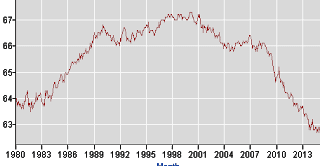
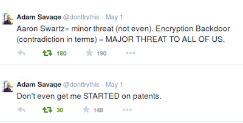

# Week 20

John McCain

[About the 2008 US Presidential election, on his choice of S. Palin,
paraphrasing] I cannot say it was the wrong decision to choose her as
my running mate. She energized the base, and we had an upward
momentum, then the 2008 financial crisis happened and ruined it for
us.

You were toast before then

Sarah Palin as VP candidate might have "energized the base", but
McCain campaign was a lost cause before that; it would have been with
or without Palin. The Time for Change model predicts a definite loss
for McCain (or any Republican) using June 2008 numbers -- popularity,
two term-ness, and gdp. Out of these, net popularity for the sitting
president, Bush, was first of all insanely bad, -37. This number in
fact is a record low for any post-WWII election. GDP was anemic sure,
at 1.4%, but no different from Obama's 4 years later. The point is,
the crisis had not peaked at this point, it would have done so later
in August. So if we can predict definite loss using precrisis numbers
then there was nothing McCain could have done. All Obama campaign had
to do was to associate McCain with Bush, and they did that, but
frankly they didn't have to try too hard on that either.

This also suggests all the "campaign wizardry" that is attributed to
the Bama campaign did not tip the balance to one way or another, as
well as the lofty rhetoric that promised "Big Change". Bama played to
the culture code, which for a president in US is MOSES, a person who
will lead people to the promised land, so forth. This message is on
code, but if you are Moses then ppl expect you to divide the effin Red
Sea you know what I mean? Bam fell short on that promise which hurt
his ability to govern effectively later.

Other patterns I noticed: players on both parties seem to know TFC
model, conciously or subconciousy.. The younger, "untried" candidates
seem to come out (or pushed forward by the Integrators) during these
times. Right now Reps have a certain amount of advantage for example,
and lo and behold, there is a stampede in there. People are stepping
on each other to be the Rep candidate; Rubio stepping on Bush who used
to be his mentor (Reps are pretty hierarchical usually, so this is
considered a major diss in the ranks), other younger blood left and
right, and all kinds of drama... It's fun to watch for sure though.

---

Link

[For UK] For all of the punditry around the [use of] social [media
before the] election there’s little evidence of much action from the
main players. Content from the two main political parties published on
social media has so far been less about providing a personal feel of
the candidates, or offering an informative or inspirational narrative
and more about point scoring.

It probably wouldn't make much difference

Elections are a blunt instrument, and people use rough data points to decide.

---

Lars Ulrich

[Drummer of Metallica, complaining about his band's music being
copied] Just because you are plumber, it doesn't mean you fix my effin
toilet for free.

Hah

Good one. But the plumber cannot copy his plumbing service, cannot be
in two places at the same time, so this is not a fair comparison. If
we had Matrix-like skill transfer program, for bike repair, for flying
a plane, or for plumbing, then that code could be copied, so
potentially in that case a plumber AI could fix your effin toilet for
free.

There is something else though.. I think Lars thinks he is better than
the plumber. He could make millions from concerts, other things
Metallica sells without selling records (which he could still do by
the way, through music services) I guess he is sad because he won't
make billions. The plumber does not have that choice, he is mired in
low tech, non-replicable service providing. My question is why should
Metallica be treated any different from the plumber? Same can be said
about being a stock trader, investor, etc.. It is simply a skill that
is no different from another. But one can be replicated, can snowball,
others can't.

---

NYT

While a clear improvement, the revised SAT remains problematic. It
will still emphasize speed — quick recall and time management — over
subject knowledge. Despite evidence that writing is the single most
important skill for success in college, the essay will be optional
[..] And the biggest problem is this: While the content will be new,
the underlying design will not change. The SAT will remain a
“norm-referenced” exam, designed primarily to rank students rather
than measure what they actually know.

It's so old tech

People cramming into some room for a predefined time, synchronized,
being asked the same questions with bazillion of others? Jeez.

---

Singapore's Prime Minister

I told the Founders Forum two weeks ago that the last computer program
I wrote was a Sudoku solver, written in C++ several years ago

Awesome dude

A prime minister who knows how to code! I was going to say he could be
the first in the world, but  Ozal of TR (PM during the 80s) beat him
to it. The world needs more such PMs!

---

Andrew Ng

[Ng is a deep-learning expert, co-founder of Coursera] Our education
system has succeeded so far in teaching generations to do different
routine tasks. So when tractors displaced farming labor we taught the
next generation to work in factories. But what we’ve never really been
good at is teaching a huge number of people to do non-routine creative
work.

[In response to question if he buys the argument that the future of labor is less in peril because automation will lower the cost of goods so you will only need to work 10-20 hours a week?]

I would have said zero hours. I see a minimum living wage as a
long-term solution, but I’m not sure that’s my favorite

It's not my favorite either

---

NYT

To give ordinary workers a real stake, [Professor Atkinson] calls for
a universal capital endowment for every adult — financed through a
substantial wealth transfer or estate tax — and a sovereign wealth
fund to invest in promising companies. And he argues for a government
bond that offers a real return — perhaps linked to the rise of average
household income — to evade the predatory fees that banks impose on
the middle class’s investments. Dreaming? Indeed, many of these ideas
may strike classic American economists as outdated lefty proposals
that already failed in the 1970s. But they look increasingly relevant
in what many are calling the Second Gilded Age.

Yes

A lot of things are coming together that create a new "low energy
position" for the new system. Let's take artists and music for
example; copying is too easy due to new tech, so it will happen. In
the meantime technology is creating joblessness that will only get
worse. For the former, the low energy position / solution is people
voluntarily "liking" artistic work in terms of micro payments, but
this will only work if they have "free money" to give (and an
electronic payment system such as Bitcoin). So both for joblessness
and voluntary artistic "likes" for art we need basic income. Since
copyright cannot be enforced, patents should not be either, and
patents are getting in the way of innovation that is hitting new
businesses more than old / big / entrenched businesses, another issue
directly related to inequality. Plus if we are going to sit back and
let the robots do all routine work for us, we cannot have pesky little
things called patents or copyright to get in the way of our
innovating. On and on it goes..

Question

But without patents country [blah] could not have developed the way it has!

That is not so clear-cut

From Hintjens, "In the mid-1800's, writers claimed that the industrial
progress of England and the United States was due to their patent
system. Other writers claimed that the progress of Germany and
Switzerland was due to their lack of any patent
system".  #ohnoyoudidnt

---

Martin Ford, Rise of the Robots

[C]onsider a thought experiment. Imagine that Earth is suddenly
invaded by a strange extraterrestrial species. As thousands of the
creatures stream off their massive spacecraft, humanity comes to
understand that the visitors have not come to conquer us, or to
extract our resources, or even to meet our leader. The aliens, it
turns out, have come to work [..]

Each [alien] is highly intelligent and capable of learning language,
solving problems, and even exhibiting creativity. However, the aliens
are driven by a single—and overwhelming—biological imperative:
fulfillment comes only from performing useful work [..].  Gradually,
the aliens integrate into our society and economy. They are eager to
work, and they demand no wages. Work, for the aliens, is its own
reward; indeed, it is the only reward they can conceive of. The sole
cost associated with their employment is the provision of some type of
food and water—and given this, they begin to reproduce rapidly.

Businesses of all sizes quickly begin to deploy the extraterrestrials
in a variety of roles. They start off in more routine, low-level jobs
but rapidly demonstrate the ability to take on more complex
work. Gradually, the aliens displace human workers. Even those
business owners who initially resist replacing people with aliens
eventually have little choice but to make the transition once their
competitors do so [..].

Among humans, unemployment begins to rise relentlessly while incomes
for those who still have jobs stagnate and even begin to fall as
competition for jobs increases [..]

[But a] small number of people—those who own a successful business
[..] have been doing extremely well as business profitability has
increased. Sales of luxury goods and services are booming. For the
rest, it’s the dollar store economy. As more people are unemployed, or
become fearful that they will soon lose their jobs, frugality becomes
tantamount to survival [..].

Soon, however, it becomes evident that those dramatic increases in
business earnings are unsustainable. The profits have come almost
entirely from cutting labor costs. Revenues are flat, and soon they
begin to fall. The aliens, of course, buy nothing. Human consumers
increasingly turn away from any purchase that is not absolutely
essential [..].

The alien invasion parable is admittedly extreme [..but this is the
key point:]

Every product and service produced by the economy ultimately gets
purchased (consumed) by someone. In economic terms, “demand” means a
desire or need for something, backed by the ability and willingness to
pay for it. There are only two entities that create final demand for
products and services: individual people and governments. Individual
consumer spending is typically at least two-thirds of GDP in the
United States and roughly 60 percent or more in most other developed
countries. The vast majority of individual consumers, of course, rely
on employment for nearly all of their income. Jobs are the primary
mechanism through which purchasing power is distributed.

To be sure, businesses also purchase things, but that is not final
demand. Businesses buy inputs that are used to produce something
else. They may also buy things to make investments that will enable
future production. However, if there is no demand for what the
business is producing, it will shut down and stop buying inputs. A
business may sell to another business; but somewhere down the line,
that chain has to end at a person (or a government) buying something
[..]

The essential point is that a worker is also a consumer (and may
support other consumers). These people drive final demand. When a
worker is replaced by a machine, that machine does not go out and
consume [..]

So if automation eliminates a substantial fraction of the jobs that
consumers rely on, or if wages are driven so low that very few people
have significant discretionary income, then it is difficult to see how
a modern mass-market economy could continue to thrive. Nearly all the
major industries that form the backbone of our economy (automobiles,
financial services, consumer electronics, telecommunications services,
health care, etc.) are geared toward markets consisting of many
millions of potential customers. Markets are driven not just by
aggregate dollars but also by unit demand. A single very wealthy
person may buy a very nice car, or perhaps even a dozen such cars. But
he or she is not going to buy thousands of automobiles [..].

In a mass-market economy, the distribution of purchasing power among
consumers matters a great deal. Extreme income concentration among a
tiny sliver of potential customers will ultimately threaten the
viability of the markets that support these industries.

Interesting

In the end, it might actually be businesses themselves that go to
governments and ask / beg them to initiate a basic income
program. Because without it, chances are high they will have very
limited earnings.

---

Ken Bain, What the Best College Teachers Do

Many teachers never raise questions; they simply give students
answers. If they do tackle intellectual problems, they often focus
only on their subject and the issues that animate the most
sophisticated scholarship in the field. In contrast, the best teachers
tend to embed the discipline’s issues in broader concerns, often
taking an interdisciplinary approach to problems. When Dudley
Herschbach teaches chemistry at Harvard, he does so with a combination
of science, history, and poetry, telling stories about human quests to
understand the mysteries of nature. Because he regards science as a
journey rather than a set of facts, he takes his students into the
historical struggle to fathom the universe. The lesson on polymers
becomes the story of how the development of nylons influenced the
outcome of World War II. He invokes the arts, using them to cap- ture
the emotional power and beauty with which the poet or the painter
stirs the imagination and wonder. He even asks his chemistry students
to write poetry while they struggle to comprehend the concepts and
ideas that scientists have developed [..].

Third, the natural critical learning environment also engages students
in some higher-order intellectual activity: encouraging them to
compare, apply, evaluate, analyze, and synthesize, but never only to
listen and remember. Often that means asking students to make and
defend judgments and then providing them with some basis for making
the decision. They might judge the argument they encounter on some
important question, decide when and how to use a certain method,
determine the implications of what they encounter, or make choices
between different methods of solving a problem. Or do all of
these. Robert Divine raises an important question about U.S. history,
helps students see that question in the context of larger issues,
shares with them briefly some of the ways that other scholars have
attempted to answer that question, then challenges the class to
evaluate the argument he would make. Donald Saari uses a combination
of stories and questions to challenge students to think critically
about calculus. “When I finish this process,” he explained, “I want
the students to feel like they have invented calculus and that only
some accident of birth kept them from beating Newton to the punch.”
 
In essence, he provokes them into inventing ways to find the area
under the curve, breaking the process into the smallest concepts (not
steps) and raising the questions that will Socratically pull them
through the most difficult moments. Unlike so many in his discipline,
he does not simply per- form calculus in front of the students;
rather, he raises the questions that will help them reason through the
process, to see the nature of the questions and to think about how to
answer them. “I want my students to construct their own
understanding,” he explains, “so they can tell a story about how to
solve the problem.”

Now that's teaching

Very cool. I remember reading the memoirs of a researcher who, in
school, watched (the famous physicist) Edward Teller give a
lecture. In the first lecture teachers usually talk about
administrative stuff right, the textbook, office hourse, etc. when a
student asks "Mr. Teller what is your office number?". Teller turns to
his TA, asks "what's your room number John?", he says "120", Teller
says "ah, divide that by 2, add 5 mine then mine must be 65". Then he
says "see, I can't remember but I can derive".

The author of the memoir says this comment really stuck with him, and
he tried to apply it all throughout his research career. Teaching
mathematics, or other subjects like this, through derivation is key;
it's necessary both for understanding and remembering. Starting from
simple principles students should be able to reach the formula the
same way the inventor created it; In teaching (as much as I am capable
of it) I try to think what it would take to invent X,Y,Z and try to
present that, in that order.

This is why it is painful to see when teachers take shortcuts. This
practice is rampant in statistics, because it's just data, and some
numbers right?  Slap a formula on top and you are done. So instructors
pull out formulas, magic numbers out of thin air with little or zero
explanation. For example the famous "magic number" 1.96 for confidence
intervals usually arrives out of nowhere. But this calculation is
based on two mathematical constructs [geek], first $P(z1 < Z < z2) =
1-\alpha 2)  second Z = (Xbar - \mu) / (\sigma - \sqrt{n})$ as n goes
to infinity, [/geek] the first being a simple statement of
probability, second is the central limit theorem. It is so central, it
was named the Central fricking Limit Theorem. Put the two together,
rearrange around $\mu$, and you get a confidence interval (for known
$\sigma$).

News

Unemployment is approaching 5%...

Not really

Here is the percentage of people working (16 or older) in relation to
population - called labor participation.  Taken from a Department of
Labor site;

"But isn't the reason for that fall because of baby boomers
retiring?". That doesn't explain the huge drop, which interestingly
started after 2001, plus, millenials surpassed the boomers in terms of
numbers, and millenials are young. So what's going on?

---

Comment

[Paraphrasing] Some academics in the International Relations field are
objecting against the "mathematicization" of their field, they don't
like methods such as rational choice, expected utility, and game
theory.

Too bad

This is a futile attempt.. They can object all they want, but every
scientific field no matter how "verbal" will have more math
incorporated into it one way or another, international relations
certainly, and even fields like history at some point. Otherwise all
their research is bunch of words that do not connect to each other in
a verifyable kind of way, worse, their theories will not gel with data
easily.

Oh and my favorite objection: "but you say rational choice but people
are not rational, so how can you even model them?". Because, somehow
in these people's minds, whenever there is math involved the subject
matter must be some kind of rational "machine", whatever that is.

However none of the methods outlined above make such a claim. What
these methods assume is that people's preference ordering is
consistent - that's it. An example: Let's say a certain dictator with
a certain funny mustache in history says: "I like the burn me some
Jews"... This is his preference. Then he says "you know what I'd like
more... to burn me some gypsies"...Another preference. Then "but
seriously, I reaally reaallly like to burn me some Fins now". Then,
for this person, in order for his preferences to be consistent,  the
dictator must like to burn Fins more than he likes to burn
Jews. That's all that is required. Well, this is one of the core
requirements, but if this and some others are  there, the game theory
math can take this and crank through its computations. The
computations would probably say "take out this f--er, now" but this is
another subject.

---

Question

Why we are on this, why didn't anyone try to take Hitler out?

They tried

In total 14 times. What more can a brother do?

---

Question

If JFK's assassination was not a government conspiracy, then why was
his assassin Oswald shot dead?

Well..

So JFK's assassination was not a conspiracy; but Oswald was killed to
make his assassination of the president look like a conspiracy. Weird
heh? Because if there is one thing worse than a president having been
killed by a conspiracy, it is that he wasn't. In that case The
Integrators would like a fool; hence the assassin was
assassinated. Forming a mystery around the government was more
preferable to having been implicated for a conspiracy.

But in reality Kennedy was an extremely bad president (an MBTI SP and
LtCB, a deadly combination it turned out), and he did enough stupid
shit to trigger such a response from a crazy extremist like Oswald
but, that was the entirety of it all. There it is - extremely banal
and boring.

---

Question

Any movie ideas?

Yes

Some scifi ideas - Now this is going to be providing fuel for the
AI-gone-wild camp, but here it goes: silicon is made from dirt right?
Well, there are a lot of excerpts in religious texts that "we" were
created from soil / earth. A movie can revolve around the fact that
religious texts were for the silicon people; a Morpheus like dude,
holding a religious text says "this wasn't really meant for us.. it
was meant for him" - camera cuts to the AI, WAAAA! [the same sound
after M. shows the battery to Neo]. Boom.

Another: we are in a game, and during your sleep (in the game) you
wake up in the "real" world, handling your chores, etc, then when you
go in the game, you usually don't remember "the dream" right? The real
world is crazy futuristic. When people die in the game, relatives
etc., they can join your game as watchers (a little cringey, and the
script can have a lot of fun with that), and whisper some help for
you. Maybe even effecting some change one way or another.

---

News

Pollsters failed to predict the UK election results.

Their sample must be biased

Calling people up and collecting answers is only one way of making
this prediction. I am sure other models could have done a better
job. I haven't applied Time for Change model for the UK election (and
it is not advisable to apply a model as-is, with the same variables,
from one country to the next [litegeek], if one chooses to however the
coefficients / weights of the variables should be recalculated as they
would now be based on different data points [/litegeek], but let's say
UK and US are similar in that they are both old democracies so the
variables are the same (not in value) for both countries;
then... Cameron was running for a second term, he gets no punishment
for two-term'ness for the incumbent. GDP growth, anemic, but there, at
least not negative after a huge crisis. Net approval, around -1
percent, you don't love him, you don't hate him - but not a Bush-low
which was -37 in 2008. In summary, UK electorate did not feel the need
for change. According to the TfC model the election is always about
the incumbent party.

---

Question

What do you mean with bias?

An example

During WWII, statistician Abraham Wald was asked to help the British
decide where to add armor to their bombers. The picture he looked at
was roughty like below, black parts are where the plane returning from
fights had the most bullet holes.

After looking at this, Wald suggested the military armor the white
sections, the parts with least bullet holes, because the data was
biased. He was only looking at the planes which returned, suggesting
the parts with bullet holes are where planes could afford to get hit
at.

---

Question

You say patent system does not work but I know examples X,Y,Z when it did!

It will work if people don't push it too hard

Patents are an example of a system that can function if it is not used
all that much. But when all actors in it are combative, trying to use
it, exploit it, and break it all at the same time, then we'll have
problems. Now there are too many  users of the system who are parsing
lines, meanings of patent descriptions, reading between the lines of
the texts, and some, ironically, are trying to be vague so the patent
can apply as broadly as possible. This is not an optimal setting.

And this is precisely what is happening today, as economies are
becoming more knowledge-based, more people with diverse interests are
applying for patents which is overwhelming the system. As every
software architect knows, there is a huge difference between a system
built for 100 users and one built for 100,000.  Increased load can
break a system in weird ways. "Bugs come out of the woodwork" would
say a senior architect friend of mine whenever one of his projects
started to conduct load testing (simulating a lot concurrent users on
a system). A system more suitable for the 21st century is
needed. "Better patent lawyers, better judges" won't fix the problem,
just like asking for "more and better teachers in classrooms" won't
fix the education problem. The purported solution is a practical
impossibility that suggests a new approach must look into the
structure of the system, not simply trying to potato-stamp the
existing order.

---

Fukuyama

[Political Order and Political Decay, pg. 523] The answer [to lack of
democracy in Nigeria] that scholars such as Richard Joseph have given
is that politics in Nigeria is what he labels “prebendal,” involving a
fatal mixture of rent seeking, clientelism, and ethnicity. Because of
oil, the state has ready access to a steady flow of resource rents,
which the elites have shared among themselves. While all poor
people—the 70 percent of the population below the poverty line—in
theory have a common interest in ending corruption and redistributing
those resources more fairly, they are divided into more than 250
ethnic and religious communities that do not want to work with one
another. Their ties are instead vertical, to clientelistic networks
controlled by the elites, who dole out just enough patronage and
subsidies to mobilize support at the next election. The system is
stable because members of the elite rent-seeking coalition realize
that using violence to grab a larger share of the total pie will hurt
everyone’s interests, including their own. The typical response to
violence like the armed attacks in the delta is a combination of
repression and increased subsidies to buy off discontent.

Bad

Good analysis though.. Fukuyama seems to be back-pedalling from that
End of History business after all, and now looking into state
dysfunction more closely. As a note, F. was one of the cadre of "90s
thinkers" who claimed potato stamping of the existing order everywhere
/ globalization would fix it all. You thought you was gonna have all
miles and smiles..! Well...that didn't turn out exactly as planned; We
are back in the business of thinking for ourselves, looking at the
status quo more closely.

---

B. Mesquita, A. Smith

[Paraphrasing] There is positive correlation between a leaning toward
autocracy and size of ethnic blocks in W (winning coalition).

W for Win 

BBM's theory talks about two numeric parameters W (winning coalition)
and S (selectorate) instead of talking democracy directly which he
claims models state behaviour more closely. In this paper they made a
new addition, "size of __ blocks in W" for ethnic, religious, etc
blocks that can be present in W. They found positive correlation
between size of ethnic bloc in W and leaning toward authocracy. This
seems to confirm the case of Nigeria (coincidentally one of the
countries BBM uses in his data as well). Turkey's experience would
agree; in the past ~30 years there's always been an artificially high
representation of ethnic nationalists / Ottomanists / borderline
racist people in the government (bcz of the 1980 fascist coup) - which
IMO hampered the country's transition to full democracy.

Note: we mentioned before in his earlier work BBM had rough
calculations for W,S deriving it from other variables; in this recent
research they asked experts from the countries for more accurate W,S.

---

Question

Do you have a favorite Arnold movie scene?

Yes

It is [Party Pooper](https://www.youtube.com/watch?v=rQqiuynMwCQ)

---

Link

In a week when Florida students were logging on to another round of
standardized tests, one of the stars of Mythbusters on the Discovery
Channel clearly touched a nerve.

"If you want the kids' test scores up, bring back band and bring back
shop and get kids actually learning stuff instead of teaching them how
to take a test," TV personality Adam Savage said in an interview with
the Tampa Bay Times.

Savage, who works with partner Jamie Hyneman on the science-based hit
show, was promoting their live performance coming April 23 to Tampa's
Straz Center, and his comment exploded on Twitter. A Times tweet of
his quote drew more than 245 retweets within 24 hours, plus hundreds
of favorites and comments on the value of teaching problem-solving and
creativity.

The reaction seemed to underscore not just the public's exasperation
over testing but the frustrations of science, art and music teachers
who need expensive materials or who see their subjects de-emphasized
because so much time is needed to get ready for tests.

Savage said STEM, the acronym for science, technology, engineering and
math, should be STEAM "because you need art in there to complete an
education."

After getting his start in special effects, he and Hyneman have turned
Mythbusters into Discovery's most popular show by blowing things up
and building crazy gadgets that use scientific methods to prove or
debunk rumors and myths.

Savage said he is excited about the growth of robotics competitions,
the makers movement of do-it-yourselfers and a variety of people from
diverse backgrounds "getting interested in science by getting your
hands dirty."

Agree

---

Twitter User

[O]dd that dystopia assumes govt is most technologically advanced
group in society when in reality they are the opposite

Hah

---

[US Navy](https://blog.usni.org/posts/2014/04/07/fuel-from-the-sea)

Navy researchers at the U.S. Naval Research Laboratory (NRL),
Materials Science and Technology Division, demonstrate
proof-of-concept of novel NRL technologies developed for the recovery
of carbon dioxide (CO2) and hydrogen (H2) from seawater and conversion
to a liquid hydrocarbon fuel [..].

The predicted cost of jet fuel using these technologies is in the
range of $3-$6 per gallon, and with sufficient funding and
partnerships, this approach could be commercially viable within the
next seven to ten years. Pursuing remote land-based options would be
the first step towards a future sea-based solution [..].

Navy researchers demonstrate proof-of-concept in first flight of an
internal combustion powered model aircraft fueled by a novel
gas-to-liquid process that uses seawater as carbon feedstock.

---

#musicMfkaCanYouSingIT

---

Hintjens on Open Source

https://vimeo.com/68236487

---

Blow Sh*t Up with Arnold

It is for a benefit apparently; but hilarious all the same. 

---

---

So Disco \#gameOfThrones

---

