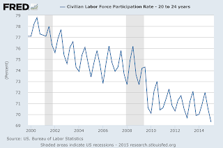
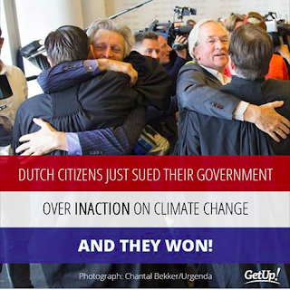
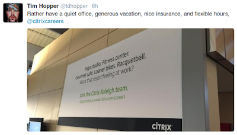
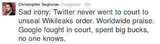

# Week 24

FT

Mr Kolton says that while there are five plausible candidates [from
the Republican party ..] all the contenders think 2016 is probably
their best chance. He says waiting until 2020 would be risky, as only
three incumbent presidents [..] have lost bids for a second term since
Herbert Hoover [..]

Party incumbency works better

Reps have a good chance this time (2016) but they will continue to
have an advantage for 2020 against a President Hillary Clinton. Here
is why: The model we shared previously looks at whether the incumbent
party has been in power for more than 2 terms. The older model checks
if there is an incumbent president in the race.

The modified model, let's call it TfC2, works better than the
original, TfC1. Here is the data for the TfC1. [geek] AIC on [this
data](prez_incumb.csv) gives 84.6, on the other, 73.4, lower being
better [/geek].

Example: TfC1 would say Bush I had an advantage in 1992, but TfC2 says
he had a disadvantage because his party had been in power for more
than two terms at that point. The fact that TfC2 performs better
suggests that its assumptions make more sense, people tend to throw
out the party in power (if there bigger advantages of course, they can
keep them as well).

Funny story about this data / model - I was googling for political
prediction models when I stumbled upon [this](tokdar-election.tar.gz)
piece of code on Github (coolest site ever!). I lifted the data from
there, then realized later this person, whoever s/he is, tweaked the
model / data from Abramowitz and made it better in the
process. Serenpitious Google discovery!

---

Question

Any other models for prez prediction?

Yes

I actually had been on the lookout for prez polsci models for a while;
Statistician Andrew Gelman has one in this book, I wrote to him about
it, he said the code was lost, then I googled and found a lecturer who
had code implementing Gelman's model. He said he lost his code as well
(dude!) and the page he listed it was literally gone, but I managed to
recover it from Google Cache. Major digital archeology there... Here's
that code - it does state level prediction and uses poll data (as well
as other variables) as its input. Gelman's model is more complicated
than TfC.

---

Book 

The “unibody process” [Apple uses for its recent computers] is a
blanket name for a number of machining operations. Machining in
general has long been time- and labor-intensive. It relies on big,
slow machines like drills and milling machines, but modern CNC
machines have greatly sped up and automated the process.

“Machining enables a level of precision that is just completely
unheard of in this industry,” said Jony [Ive].

How much of the process is automated is not clear, though at least
part of the assembly is done by robots. While most Apple products have
been assembled by hand by legions of workers, it appears the unibody
process may enable the company to shift toward automated assembly.

“There’s a lot of focus on robotics and robotic control,” said a
former mechanical engineer who worked as a liaison among ID, product
development and operations, and spent months in the factories. The
engineer declined to elaborate, citing confidentiality agreements, but
said that many of Apple’s products are now primarily made and finished
on CNC machines with robots moving parts between machining cycles.

“I have literally seen buildings where as far as the eye can see,
where you can see machines carving, mostly aluminum, dedicated
exclusively for Apple at Foxconn,” said Guatam Baksi, a product design
engineer at Apple from 2005 to 2010. “As far as the eye can see.”

Ha ha

For some reason an image from The Matrix popped in my head. This place
is like a .. Mac Matrix then? Or .. iMatrix?

More automation, good.

---

Question

What happened to Worf character in Star Trek?

He became less nationalist

Worf in ST TNG was a "Klingon nationalist" - he kept harping about
Klingons, he was "loud and proud", chest thumping so forth... But as
ST evolved, so did its writing; by the time ST Deep Space Nine
started, the character Worf, who was also in this show, realized he
wasn't exactly a Klingon anymore.  Then his brother Kern (one of my
most favorite ST characters) gets thrown out of the Klingon council,
he is so ashamed he wants to commit suicide. Worf arranges his memory
to be erased and asks a friend to take him to their house. Hilarous
stuff.

So actually the TV land, major scifi shows were already going
somewhere with this (less nationalism, little more realism), then 9/11
happened and fucked it all up. After this point scifi writing became
unhinged, that's how we ended up with shows like Lost which is mostly
about bunch of confused people running around like chicken with its
head cut off. Everyone is perplexed all the time, about something,
they are like "wow! dude, you came out from behind that bush, I didn't
see you there man! That was so mystifying!". So scifi went to the
other extreme. Very odd.

---

Comment

Youth unemployment is falling down

Incorrect

Labor force participation rate for age group 20-24 (shown as quarterly
average) says otherwise.

Participation (a.k.a. employment which is the opposite if
unemployment) is on the down trend since 2001. Technology is the
culprit.

Link: Making 9 Million Jobless Disappear

---

Question

But wouldn't the new sharing economy fix these issues?

There are no guarantees

A lot of advances need to line up until people can generate reliable
income in the new economy; and even then, there are no guarantees. We
all know "I'll sell my old shoes on eBay" argument won't fly, you'll
run out of shoes, then what? Another case, there are examples of an
Uber driver making $40,000/year driving people around,  great, but
then Uber is also looking into self-driving cars. "But then people can
become car mechanics for those automated Uber cars". Well, that's 1
mechanic servicing, say, 10 cars; what happens to the jobs of 9 other
Uber drivers who were displaced by technology?

Give people free money. Guy who thinks he is free market proponent
keeps harping "but that's a commie thing to do". Milton F**king
Friedman argued in favor of this solution, man.. Can you become more
free-market oriented than Milton F**king Friedman? You can't be.

TV is the new TV

Nice

I appreciate the defiant attitude.

---

News

Netflix viewing to surpass ABC, CBS, Fox and NBC by 2016.

.. but it is misplaced, I am afraid

---

Question

Why do people look at growth to judge a company's success? Can't they
make do with what they have?

It is a signal

Growth, if not phony, can indicate the company's structure for that
point in time is good - otherwise they would not have been able to
jump to that next phase, stretching themselves.

Starbucks grows, I see new stores in Germany, and you peer inside you
see why - free Wifi, good customer service.. Few years back they would
not accept ATM bank cards, I remember bitching about it to the
baristas a few times -surely others did as well-, then boom; SB
started accepting bank cards in a matter of weeks. There is another
coffee store chain here, Einstein Cafe, their Wifi is cumbersome to
use - hourly, u enter some user/pass combo, given to customers on a
paper card - they nag customers if they don't "buy anything" for a
long time, and they ask you to buy something for another hour of Net
use. And surprise - Einstein is not growing.

(I do like their rucola cheese baguette though... Mmmmm.. rucola cheese..)

---

Time-use surveys show that jobless prime-age people dedicate some of
the time once spent working to cleaning and childcare. But men in
particular devote most of their free time to leisure, the lion’s share
of which is spent watching television, browsing the Internet, and
sleeping [..]

Where are these "surveys"?

The author later makes some vague statements about basic income
possibly causing tax revenue loss for the government. If this said
"survey" is correct, it would have looked at jobless people, not at
subjects who were receiving basic income. There is a difference.

The effects of basic income was researched throughly, based on
experiments in Canada and US. The results are published by Hum, Derek,
and Simpson, Wayne. No adverse effects have been found in terms of
labor.

In other parts of the article the author contradicts himself - in one
paragraph he talks about "jobless watching TV" then he talks about
"having a job being necessary for dignity". So these jobless people
are watching bunch of TV, but are very sad about it? It makes no
sense.

The culture code for work in US is WHO YOU ARE, code for money is
PROOF (for having made it) [1]. So no matter what people are given, in
order to get a better status, exercise their identity, people will
work on something. The good part is they will be able to take more
risks because of the social net. We will have more entrepreneurs, not
less. Currently entrepreneurship in US is at 1 out of 10. This is
higher than Europe, sure, but why can't this number be 3 out of 10?
Why not 10 out of 10?

"But will they work on useful stuff?". Here is a counter-question: are
ppl working on useful stuff now? Should pleathora of statisticians,
machine learning experts focus on maximixing ad clicks on a fucking
web page or an app? There is an insane amount of talent wasted, right
now, on such projects.

Don't even get me started on falling birthrates, working women not
having enough children. When both or single parents are forced to work
full-time for a reasonable lifestyle, can they be blamed for having
less kids? Or no kids? It seems to me, what we propose is needed to
even maintain the genetic diversity of humanity. MBTI Guardians (%40
of the population) will always marry, they are not the focus here,
these are down-to-earth, by-the-book, logistics oriented folk, they'll
marry on time, settle down on time, have their 2.5 kids and their
house, and live happily everafter. The focus is on SP, NF, NT types
representing %60 of the population.

Closing note: I am sure there is a sweet spot of basic income level
that will cover the basics, food, shelter, healtcare, but it will
still compel people trying to get more money (because they'll want
PROOF). This is not rocket science. It is what needs to be done so
more people work on rocket science.

---

News

[Paraphrasing] The economy contracted in Q1 2015, reaching 3% GDP
growth seems unlikely.

Hmm

Our TfC prediction already took GDP growth 2% as 2016 prez prediction,
and Bam's net popularity at 0 -- now it is -3. But these are small
changes, GDP 2 or 3, net popularity 0 or -3, it doesn't change the
final prediction much. If net popularity was at Clinton levels, %19.5
in 2000, that would make a difference. But at least it is not at -37%,
that is, Bush territory. Hillary's predicted popular vote win  is
still between 43% and 52% (above %50 means sure win); she has brand
recognition on her side, she can win.

---

Comedian

Bitch is the new black.

Ha ha

This line was from 2008, but still good.  

---

The codes are from Clotaire Rapaille's research, this is hard-core
science, Rapaille has a process, the results are falsifiable, and used
by the researcher himself to make lots of $$$ in the private sector.

---

Person X should do Y

Not all X for all Y

People are different; character advice needs to be tailored for the
person. An advice could have been, for example, "be less selfish" - 
but there are ppl out there whose type is what we call More Me that
need to be more selfish. MM ppl have with a tendency to always stay
behind the curtain, help from a support position, to a degree where
they lose their identity. They need to assert themselves more. There
are others, such as the type High Horse (Putin's type) who must
support others, make it less about them, be less selfish.

---

Question

How similar are people? 

Mmm

Anonymous: "We are all snowflakes, special, unique".

Carl Jung: "We meet ourselves time and again in a thousand disguises
on the path of life".

Both of these statements are true. There are around 300 attributes we
were able to analyze out of which everyone has a bag of 10 to 20. One
person might have 10,20,30,.. another 5,15,25,30,.. The 30 is the
same, hence "meeting ourselves in a thousand disquises" but the
combination makes a person unique. Not many people carry the same
combo, even when they do, there are genetic, cultural, other aspects
that add to the differences.

But on general concerns, people act, in general, in a general kind of
way.

Question

Do you support the BDS movement that aims to boycott Israeli goods.

Yes

BDS strikes at the heart of the Palestenian/Israel issue; Israel is
technically in the Middle East, but it acts as though it isn't. Since
its inception Israel pushed people out of their homes, dealt with
their discontent militarily, and built walls around them. Now, when it
needs interaction it simply flies over these people to reach to sell /
buy from the outside world. Well, that needs to stop. Boycotting
Israeli goods is an effective way to do that.

To reiterate: we are for a one state solution in Palestine.

---

Google launches free streaming service, Play Music, in America

GOOG everywhere

If production these days is mostly about information, then whoever is
best at this game will beat others - unless there are
network-effect-barriers that can't be crossed,
i.e. Facebook. Streaming is all about information, and Google is
master at moving / storing / analyzing information. They have their
own DB product, their own app server infrastructure, plus there is
programming know-how, major analytics knowledge. With that kind of
basis, they can get into anything, really fast. No wonder Tim Cook is
scared.

I think Google should get into banking... Here is a field that is
nowadays almost entirely about information. Once there is that
backbone to financial system, and Android smartphones on the
front-end, all basis' would be covered.

---

Jeremy Rifkin, The Fourth Industrial Revolution, 2011

Fossil fuels—coal, oil, and natural gas—are elite energies for the
simple reason that they are found only in select places. They require
a significant military investment to secure their access and continual
geopolitical management to assure their availability. They also
require centralized, top-down command and control systems and massive
concentrations of capital to move them from underground to the end
users. The ability to concentrate capital—the essence of modern
capitalism—is critical to the effective performance of the system as a
whole. The centralized energy infrastructure, in turn, sets the
conditions for the rest of the economy, encouraging similar business
models across every sector [..]

Three of the four largest companies in the world today are oil
companies—Royal Dutch Shell, Exxon Mobil, and BP. Underneath these
giant energy companies are some five hundred global companies
representing every sector and industry—with a combined revenue of 22.5
trillion dollars, which is the equivalent of one-third of the world’s
62 trillion dol GDP—that are inseparably connected to and dependent on
fossil fuels for their very survival.

Jeez

This is an insane concentration of money.

I'd assume these people would want to keep this power. 

---

Jeremy Rifkin, The Fourth Industrial Revolution, 2011

I suspect at this juncture my American readers are asking, “What about
President Obama?” Obama is the man who most reflects, in the public
mind, the generational shift taking place in the world. The young
president has confessed that the most difficult thing he had to give
up on assuming high office was not his privacy but his precious
BlackBerry. He surely would be attracted to the idea of a distributed
and collaborative energy revolution patterned after the Internet
model—right?

Obama has made green energy a part of his economic recovery plan. But
when we look at the fine print, we see that his administration is even
more deeply committed to bringing back nuclear power, offshore oil
drilling, and experimental technologies to clean up coal emissions,
allowing for a vast expansion of coal-fired power plants. And even his
green economic recovery program is formulated more along the lines of
centralized management and distribution of renewable energies than a
distributed model, reflecting the top-down organizational thinking
that governed the [second wave ..]

[It appears that t]he US team is playing a different game
altogether—betting on the installation of giant, centralized wind and
solar parks in the midwestern and southwestern states. The idea is to
pass federal legislation that would mandate the creation of a super
high-voltage grid that could send the electricity generated in these
more sparsely populated regions back to customers in the more
populated eastern regions of the country. The cost for creating the
high-voltage grid would be spread among millions of electricity
customers.

This centralized approach to harnessing renewable energy and
distributing electricity has not gone over well with eastern governors
and power companies. In July 2010, eleven New England and mid-Atlantic
governors sent a letter to the US Senate’s majority leader, Harry
Reid, and minority leader, Mitch McConnell, opposing the national
electric transmission policy. The governors argue that centralizing
wind and solar energy generation in the western region of the country
“would harm regional efforts to promote local renewable energy
generation . . . and hamper efforts to create clean energy jobs in our
states.” The governors were particularly alarmed by the $160 billion
price tag to create a national transmission corridor from the West to
the East [..].

President Obama has been out on the political circuit talking up the
need to replace a half-century-old servomechanical power grid with a
digital, state-of-the-art smart grid and is pushing for thousands of
miles of new power lines to meet America’s future electricity
needs. But why would the president favor this centralized approach to
organizing renewable energy resources that are, by their nature,
broadly distributed and locally available?

Interesting

Has there been a change on this since 2011 I wonder? 

There is also an excerpt in the book on Hillary Clinton, suggesting
that she "gets it"  better.

---

A. Toffler, The Third Wave

Out of [a] driving need for the integration of Second Wave
civilization came the biggest coordinator of all—the integrational
engine of the system: big government. It is the system's hunger for
integration that explains the relentless rise of big government in
every Second Wave society.

Again and again political demagogues arose to call for smaller
government. Yet, once in office, the very same leaders expanded rather
than contracted the size of government. This contradiction between
rhetoric and real life becomes understandable the moment we recognize
that the transcendent aim of all Second Wave governments has been to
construct and maintain industrial civilization. Against this
commitment, all lesser differences faded. Parties and politicians
might squabble over other issues, but on this they were in tacit
agreement And big government was part of their unspoken program
regardless of the tune they sang, because industrial societies depend
on government to perform essential integrational tasks.

In the words of political columnist Clayton Fritchey, the United
States federal government never ceased to grow, even under three
recent Republican administrations.

Damn

---

That's in billions of dollars BTW, meaning that 2,400 number is 2,400
billion, which is, 2.4 trillion. This spending has gone through the
roof in a way that can't be explained through population
increase. It's interesting that instead of spending money on these
programs, simply giving the money out (at 2000 levels even) directly
to people of 100 million would mean 12K per person / per year.

The mind blowing number is this though; 22 million government workers
[see also FRED].

WSJ

Today’s open-office layouts or the obsession with meetings do not play
to introverts’ strengths

True

People are different. It's pointless to treat all employees the
same. One-size-fits-all is a result of industrial-era thinking.

---

[Gartner] One-third of jobs will be replaced by software, robots, and
smart machines by 2025 [Forbes] 63% of workers are "not engaged" at
their jobs, and 23% hate what they do.

Interesting

33% of jobs can be replaced, and 23% ppl hate what they do. I believe
there is an overlap between these segments.

---

Tech Guy

I quit the tech industry. This Friday, June 12, will be my last day at
Yelp [..] It’s nothing to do with Yelp specifically. I just don’t care
about Yelp’s problems, any more than I care about Uber’s problems or
Yo’s problems or anyone else’s problems. They’re interesting for a
while, but they’re also the same self-inflicted wounds everyone seems
to deal with — why is this slow? why is this broken? how can we keep
this old code limping along indefinitely without having to rewrite it?
how does this thing a former employee wrote even work? They’re cute
puzzles, and I can get into solving them for a while, but I don’t care
about them. Because they aren’t my problems; they were just dumped in
my lap, along with a canvas sack with a dollar sign on it.

Identification with the end goal is key

People like to feel that their contributions make a difference, in a
way that jives with them. The optimal setup for this would be many
small companies working on niche projects containing people who are
passionate about what they do, and massive tech companies who already
know how work at scale, and buy smaller companies strategically as
they need to. It would be better if the small goes down to the size of
person, who can work on his own or collaborate with others through
open source mechanisms, inside or outside the money system (or being
supplanted by the money system with a basic income). The rest is
fluff. It's the kind of stuff that noone wants to work on which means
that noone probably should.

---

Isaac Asimov

Both [Charles Darwin and Alfred Wallace] traveled to far places,
observing strange species of plants and animals and the manner in
which they varied from place to place. Both were keenly interested in
finding an explanation for this, and both failed until each happened
to read Malthus’s Essay on Population.

Both then saw how the notion of overpopulation and weeding out (which
Malthus had applied to human beings) would fit into the doctrine of
evolution by natural selection (if applied to species generally).

Obviously, then, what is needed is not only people with a good
background in a particular field, but also people capable of making a
connection between item 1 and item 2 which might not ordinarily seem
connected.

Undoubtedly in the first half of the 19th century, a great many
naturalists had studied the manner in which species were
differentiated among themselves. A great many people had read
Malthus. Perhaps some both studied species and read Malthus. But what
you needed was someone who studied species, read Malthus, and had the
ability to make a cross-connection [..]

But why didn’t [another person] think of it? The history of human
thought would make it seem that there is difficulty in thinking of an
idea even when all the facts are on the table. Making the
cross-connection requires a certain daring. It must, for any
cross-connection that does not require daring is performed at once by
many and develops not as a “new idea,” but as a mere “corollary of an
old idea.”

The Great Asimov

--

Isaac Asimov 

[On isolation and creativity] My feeling is that as far as creativity
is concerned, isolation is required. The creative person is, in any
case, continually working at it. His mind is shuffling his information
at all times, even when he is not conscious of it. (The famous example
of Kekule working out the structure of benzene in his sleep is
well-known.)

The presence of others can only inhibit this process, since creation
is embarrassing. For every new good idea you have, there are a
hundred, ten thousand foolish ones, which you naturally do not care to
display.

Nevertheless, a meeting of such people may be desirable for reasons
other than the act of creation itself. No two people exactly duplicate
each other’s mental stores of items [..]

It seems to me then that the purpose of cerebration sessions is not to
think up new ideas but to educate the participants in facts and
fact-combinations, in theories and vagrant thoughts.

But how to persuade creative people to do so? First and foremost,
there must be ease, relaxation, and a general sense of
permissiveness. The world in general disapproves of creativity, and to
be creative in public is particularly bad. Even to speculate in public
is rather worrisome. The individuals must, therefore, have the feeling
that the others won’t object [..]

If a single individual present has a much greater reputation than the
others, or is more articulate, or has a distinctly more commanding
personality, he may well take over the conference and reduce the rest
to little more than passive obedience. The individual may himself be
extremely useful, but he might as well be put to work solo, for he is
neutralizing the rest [..]

For best purposes, there should be a feeling of
informality. Joviality, the use of first names, joking, relaxed
kidding are, I think, of the essence—not in themselves, but because
they encourage a willingness to be involved in the folly of
creativeness. For this purpose I think a meeting in someone’s home or
over a dinner table at some restaurant is perhaps more useful than one
in a conference room.

Probably more inhibiting than anything else is a feeling of
responsibility. The great ideas of the ages have come from people who
weren’t paid to have great ideas, but were paid to be teachers or
patent clerks or petty officials, or were not paid at all. The great
ideas came as side issues.

To feel guilty because one has not earned one’s salary because one has
not had a great idea is the surest way, it seems to me, of making it
certain that no great idea will come in the next time either.

Yep

---

Larry Page

When I was younger and first started thinking about my future, I
decided to either become a professor or start a company. I felt that
either option would give me a lot of autonomy—the freedom to think
from first principles and real-world physics rather than having to
accept the prevailing “wisdom.”

As Eric and Jonathan explain in How Google Works, we’ve tried to apply
this autonomy of thought to almost everything we do at Google. It’s
been the driving force behind our greatest successes and some
impressive failures. In fact, starting from first principles was what
got Google going. One night I had a dream (literally) and woke up
thinking… what if you could download the whole Web and just keep the
links? So I grabbed a pen and scribbled down the details to figure out
whether it was really possible. The idea of building a search engine
wasn’t even on my radar at the time. It was only later that Sergey and
I realized ranking web pages by their links could generate much better
search results.

Gmail started out as a pipe dream too. “And when Andy Rubin started
Android a decade ago, most people thought aligning the mobile industry
around an open-source operating system was nuts.

Over time I’ve learned, surprisingly, that it’s tremendously hard to
get teams to be super ambitious. It turns out most people haven’t been
educated in this kind of moonshot thinking. They tend to assume that
things are impossible, rather than starting from real-world physics
and figuring out what’s actually possible. It’s why we’ve put so much
energy into hiring independent thinkers at Google, and setting big
goals. Because if you hire the right people and have big enough
dreams, you’ll usually get there. And even if you fail, you’ll
probably learn something important.

It’s also true that many companies get comfortable doing what they
have always done, with a few incremental changes. This kind of
incrementalism leads to irrelevance over time, especially in
technology, because change tends to be revolutionary not
evolutionary. So you need to force yourself to place big bets on the
future. It’s why we invest in areas that may seem wildly speculative,
such as self-driving cars or a balloon-powered Internet. “While it’s
hard to imagine now, when we started Google Maps, people thought that
our goal of mapping the entire world, including photographing every
street, would prove impossible. So if the past is any indicator of our
future, today’s big bets won’t seem so wild in a few years’ time.

---

Question

In the movie Swordfish you said Thomas Jefferson is made to look like
having shot someone on the White House lawn for treason. How?

Very expertly

The scene is like this: a rogue government puke (played by Travolta,
portrayed as some sort of international vigilante, doing "what's
right", making "though choices" as in bombing innocent civilians so
forth) was in bed with a rogue US senator, who was the agent's
patron. But the rogue agent caused some headaches for him, so the
senator wanted to take him out, the agent finds out, now wants to kill
the senator, in this scene he is about to shoot him. This is where he
says "TJ once shot a man on the White House lawn for treason", the
senator tries to reply in exasperation "now wait that's different",
before he has a chance to finish, agent shoots him dead.

Now the movie did not officially lie, but the way the conversation is
presented leaves the viewer thinking (who has no idea of this
historical event I am sure), TJ probably did, in a little different
way, but still, shot a man for treason, deciding on his own. Little
they know Jefferson was simply performing a firing squads' duties.

These neocons are sneaky. 

---

Twitter User

After so many attacks based on Islam shouldn't Islam the religion be
blamed now?

Well..

Muslims are tired having to apologize whenever a few idiots do
something stupid. Do Jews around the world have to apologize everytime
Israel's right-wing government engages in acts of terrorism against
Palestenians?

---

Twitter User

But Israel's government does not quote their religion while doing so,
but these [so called] Islamic guys quote their religion for these
actions.

Right

Because the guy who learned it through Islam for Dummies book is the
final authority on religion.

---

Question

Here Asimov talks about a big discovery such as natural selection. In
other posts you talk about "pathalogical incrementalism" and it is
something to be avoided. But what Asimov presents sounds like an
incremental thing.. What is the connection?

Aight

Here is the deal: the dirty little secret is, discoveries, new
products, etc. no matter how influential, or how big, or based on
incremental advances. Here is the distinquishing factor though: these
big findings are incremental in action / implementation, but
revolutionary in outcome.  Darwin reads Malthus, he researched
species' differentiation, connecting them might take a big leap in
terms of mental reorientation, but it is, semantically speaking, an
incremental leap in terms of information / knowledge.

So, in order to make big discoveries, find big products, you are
looking for some incremental advance in action (which they all are)
that will give you the maximum revolutionary output. That is the right
wording for it.

Self-driving cars: [geek] SLAM was solved probabilistically -the only
solution- [/geek], laser sensors were around, accurate GPS info for
street data was taken from Street View project, make some incremental
advances in all, combine them, you get the Google Car.

This is obviously extremely hard to do. For any domain there might be
hundreds of ideas that can be advanced and combined incrementally to
give that revolutionary output. If it was easy everyone would do it,
right? Creativity, willingness to look at things differently (so a
multitude of combos can be judged and tried), starting from first
principles [1] would be prerequisites IMO.

What we do not want is stuff that is both incremental in action, and
also incremental in output. That is what people usually mean when they
criticize "pathalogical incrementalism".

---

Starting from first principles is necessary bcz let's imagine for any
given subject there are hundreds of ideas that are in various stages
of advancement that form the information landscape of that
subject. But the end points of some these ideas / advancements may not
be in the right place, even based on what is currently known. They are
at where some idiot thought they should be. The inventor should be
able to sniff these out (because garbage in means garbage out), then,
if necessary, starting from first principles, brings the endpoint to
where it should be. Then, incrementally advancing that, combining it
with something else, he can create the new product / new idea.

---

The climate is changing, but not sure if humans cause it.

Very funny

Your pope is saying exactly the opposite boy. Why don't you pull ur
head out ur ass and listen to what he is saying? This guy ... this is
one sneaky motherlover.. He is sending "warm messages" to climate
change camp but at the same time he turns to the fossil fuel lobby and
says "I will let you do whatever you want, because, hell, we are not
the cause of global warming, are we?".

F\*\*in Jeb!

---

#yep

---

#Prexit?

Puerto Rico's governor, saying he needs to pull the island out of a
"death spiral," has concluded that the commonwealth cannot pay its
roughly $72 billion in debts, an admission that will probably have
wide-reaching financial repercussions.

The governor, Alejandro García Padilla, and senior members of his
staff said in an interview last week that they would probably seek
significant concessions from as many as all of the island's creditors,
which could include deferring some debt payments for as long as five
years or extending the timetable for repayment.

"The debt is not payable," Mr. García Padilla said. "There is no other
option. I would love to have an easier option. This is not politics,
this is math."

It is a startling admission from the governor of an island of 3.6
million people, which has piled on more municipal bond debt per capita
than any American state.

---

Among its many other benefits, EU membership and the euro is a
strategic asset for the Greek Integrators - it's one club which Turkey
is not member of, for example (this is part of an  extremely useless
and pointless rivalry IMHO, but it's there). Geostrategy is why people
who suggested Grexit when the Greek crisis started now did a
U-turn. Roubini did, and he justified himself by saying "the
Russian-uh bear-uh will get da Greeks-uh" -- in his Italian accent. So
strategery rather than economics is driving much of this stuff. If
seperation happens,  it would help to speed up the decision making
process, and stop the blame game as well.

I watched a Varoufakis speech at Brookings Insititute some time ago --
he was presented by Kemal Dervis, the TR economist who became finance
minister to solve his country's crisis in 2001. Later during Q&A he
told Varoufakis "I had your job", what he did not elaborate on was
that he was finance minister during a severe crisis just like the one
Varoufakis was battling with. But Dervis enjoyed certain advantages,
he was the first troubleshooter, not the second in the scene, TR was
not part of the Euro or any other restricting mechanism. Also Dervis
had worked at World Bank, knew the ropes well, so he analyzed locally,
decided locally, hooked up with his friends at the IMF and WB to
secure a loan, fixed the banking system, and it was done.

---

[[On Greece]](../../2015/06/on-greece.html)

---

This is great - decentralized app \#3W.

"Jott, a messaging app that works without a data plan or WiFi
connection, has caught on among junior high and high school students
[..] The reason? Teens who don’t have a data plan that will allow them
to text are using their iPods and iPads to message each other on a
closed network within a 100-foot area within school limits [..]

Text messages usually travel by way of your phone to the nearest cell
tower. Then they get routed to other cell towers to reach the person
you are texting. However, Jott can send messages from one device to
another without any cell service as long as those texting are within
close enough proximity to each other.

It does this by using something called a mesh network that operates on
Bluetooth low energy or using a router that can reach within 100 feet
of each user. It’s the same way FireChat, a group messaging app, does
this, but Jott can also message individuals within your network"

---

Xièxie nĭ Mr. Roboto

"Over the last decade, China has become, in the eyes of much of the
world, a job-eating monster, consuming entire industries with its
seemingly limitless supply of low-wage workers. But the reality is
that China is now shifting its appetite to robots, a transition that
will have significant consequences for China’s economy — and the
world’s.

In 2014, Chinese factories accounted for about a quarter of the global
ranks of industrial robots — a 54 percent increase over
2013. According to the International Federation of Robotics, it will
have more installed manufacturing robots than any other country by
2017"

---

---

I saw this at a bookstore in Berlin (there are still some left) - the
one in the right says "Encyclopedia Paranoica". And.. Zombie Survival
Guide? Who reads this stuff?

---
