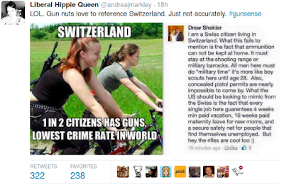
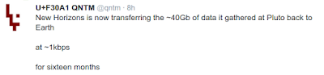
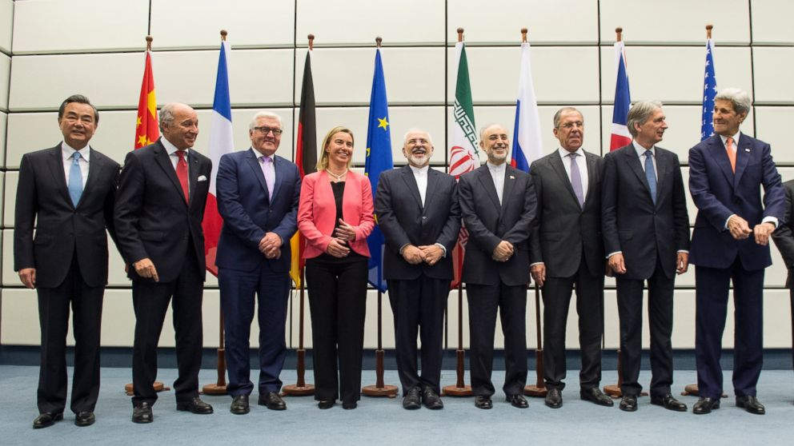
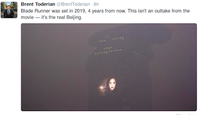

# Week 28

Rupert Murdoch

When will Donald Trump stop embarrassing himself and his friends?

Hilarious

For the record,  Rupert Murdoch is this guy

The paper he is holding is one of his, and the title reads "Abu's Been
Sleeping in My Bed".

---

John Markoff

There's this wonderful counter situation to the popular belief that
there will be no jobs. The last time someone wrote about this was in
1995 when a book titled The End of Work predicted this. The decade
after that, the US economy grew faster than the population for the
next decade. It's not clear to me at all that things are going to work
out the way they felt.

Errr

Wonderful counter-situation? Here is the funny thing about that: the
author Markoff refers to, Jeremy Rifkin, is not only patting himself
in the back these days, he is doing victory laps because of what he
wrote in that book was so extremely accurate. "Economy growing faster"
is no proof there isn't unemployment, new tech has displaced workers.

I'd expect better quality from Edge. This is complete junk.

---

Hillary Clinton

Enough renewables to power "every home in America".

Nice

We must wean off fossil fuels. This energy source encourages
centralized / concentrated power structures, endangers the
environment, and causes chaos in the Middle East.

---

But why can't there be debt relief for Greece now?

Timing seemed to be the issue 

Nearly every article I'd read on this subject would state somewhere in the text that "everyone knows there will be certain amount of debt relief at some point in the future" (let's not forget, there was already a debt relief shortly after the crisis started). The issue was when. IMO further relief, bring the debt down to, say 100 billion euros would be hard to sell at EU capitals, especially in Bundestag, so this issue was deferred. It seems relief would be easier to sell once Greece reformed and started to grow again. Then Syriza came in, EU wondered if  Tsipras was serious about reforms, then he goes and hires back the gov employees who were let go before his administration [1], then ...  your credibility as a reformer takes a hit at that point. It hardens "the other side" on other issues, bcz they don't see their counterpart at the same wavelength.

---

Question

So was Varoufakis wrong?

The deal on him..

.. is that his psychology was probably unsuited for his job. His
profile shows he is what we call a Mellow Meadow -- these people have
a subconcious feeling of having been wronged, they live in a
persistent state of a victim, and their growth path is in getting out
of this victimized feeling, and also, look at things conceptually. An
MM in the negative is a very confused person, always giving up, their
mind wondering from topic to topic, they have a hard time focusing,
there could even be substance abuse problems. Surely V is not entirely
at this negative extreme, this is a grown man, according to his
background he became an academic (a perfect job for an MM, it would
help to focus the mind), I am sure he grappled with hard things in
life, did not give up, etc.

But we are talking about mega scale issues here and not many people
are built to cope with this shit. The scrutiny, stress, responsibility
will pull a person's character apart in unseemly ways, and will expose
the tiniest crack in a man's demeanor. Even positives can start
working against you, i.e. an MM should not be giving up,
conceptualizing, but if this is done at the extreme, MM is always
fighting, for no reason, conceptualizing, but in the wrong direction.

---

Question

But people gave mandate to do ______

They didn't give mandate for shit

Time for Change model shows people vote based on 3 variables, always
judging the incumbent, not the new guy. This is very smart of them
actually -- they always vote on something they have the most
information on.  So no growth, no popularity, it's more likely the
incumbent is kicked to the curb. "Times are tough, get me whoever is
next" -- that is the general feeling.

The public does not vote on issues per se. In US Republicans usually
lower taxes, Democrats usually raise them - when one or the other is
elected, it is not a mandate to lower or raise taxes. It simply means
popularity, gdp growth, two terms variables were in the negative for
the incumbent party.

Let's restate the obvious here: the system is representative. People
do not meddle in governance, everyone has their job, and it works as
long as the rulers don't screw the pooch. If they don't, there aren't
too many surprises, everyone is happy. That also means rulers cannot
overburden people with unnecessary choices... Like "you choose if I
put a hat on, or not".. Or "should I say ___ to country X, or ___?" If
rulers frequently overburden their populace, that will work against
their popularity. They lose the office. If this happens all the time,
well then, we'll start thinking other ways to skin this cat - won't
we? 

---

[Researcher] Mogahed said it’s “kind of an obvious point” that [ISIS]
uses Islamic texts to justify its brutality. “But I want to answer a
slightly different question, which is: If Islam did not exist … would
a group like ISIS, with all the other realities as they are, exist
today and do the same things?”“My answer to that hypothetical question
is a resounding yes.” Discussing global terrorism at the Aspen Ideas
Festival, Mogahed, who formerly led research on Muslims with the
polling organization Gallup, said that extremist groups all over the
world commit the same kinds of violence using what she called “the
local social currency” to justify it. “That is sometimes
Christianity. That is sometimes Judaism. That is sometimes
Buddhism. And it is sometimes secular ideologies. So a world without
Islam would still have a group like ISIS—they would just be called
something else that may be less catchy.”

Exactly

---

Gallup 

The percentage of U.S. employees engaged in their jobs averaged 31.5%
in May. This reading is on par with 31.7% recorded in January, March
and April, but is the lowest monthly average for 2015.

So ~70% are not engaged at work

---

The Economix Blog

The libertarian economist David Friedman, son of Milton Friedman, and
Professor Zwolinski, the philosopher, have both expressed sympathy for
Paine’s idea that everyone today suffers from past injustices in terms
of property rights. A universal income might be an appropriate
reparations payment, they say.

Phew

This is some heavy stuff.. Here is the argument in Friedman's words:

[T]he existing state of the world is in part a result of past rights
violations. Land claims [..] in the real world run back to an initial
seizure by force. Similarly, claims to other forms of wealth must be
justified, in libertarian moral theory, by a chain of voluntary
transactions back to a first creator. In at least some cases that
chain is interrupted by involuntary transactions. Consider a house
built by slave labor. Is the legitimate owner the person with the
present title to it or the heir of the slaves forced to build it, or
is it perhaps partly the legitimate property of one and partly of the
other? What about property in other forms inherited through a chain
that leads back to a slave holding or slave trading ancestor who owed,
but never paid, compensation to his victims?  Oh BTW who is this
coming from? David F\*\*king Friedman. Who is the son of Milton F\*\*king
Friedman. Can anyone be more free-market oriented than these two guys?

---

Jeremy Rifkin, The Zero Marginal Cost Society

In 1995, I published a book [..] in which I made the argument that
“more sophisticated software technologies are going to bring
civilization ever closer to a near-workerless world.” The Economist
ran a cover story on the end of work in which the editors suggested
that we would have to see if my forecast will turn out to be
prescient. In the interim years, the projections I had made back in
1995 of IT-generated automation leading to technology displacement in
virtually every sector of the economy became a troubling reality,
leaving millions of people unemployed and underemployed across every
country in the world. If anything, my original forecast proved to be a
bit too conservative.

In 2013, in the United States, 21.9 million adults are unemployed,
underemployed, or discouraged and are no longer counted in the
official statistics. Worldwide, 25 percent of the adult workforce was
either unemployed, underemployed, or discouraged and no longer looking
for work in 2011. The International Labor Organization reports that
more than 202 million people will be without work in 2013. While there
are many reasons for the unemployment, economists are just now waking
up to the fact that technology displacement is a primary culprit. The
Economist, among others, revisited the issue of the end of work 16
years after I published the book, asking, “What happens . . . when
machines are smart enough to become workers? In other words, when
capital becomes labour.” [..]

It wasn’t that I was clairvoyant. The signs were everywhere, but in
the growth years, most economists were so attached to conventional
economic theory—that supply creates demand and that new technologies,
while disruptive, reduce costs, stimulate consumption, spur more
production, increase innovation, and open up opportunities for new
kinds of jobs—that my message fell largely on deaf ears. Now,
economists are taking notice. In the period of the Great Recession,
economists discovered that while millions of jobs were irreversibly
lost, productivity was reaching new peaks and output was accelerating
around the world, but with fewer workers at their stations. [..]

Between 2008 and 2012, while the Great Recession was bleeding workers,
industry was piling on new software and innovations to boost
productivity and keep profitable with smaller payrolls. The effect of
these efforts is striking. Mark J. Perry, a University of Michigan
economics professor and visiting scholar at the American Enterprise
Institute, a conservative think tank based in Washington, D.C., ran
the numbers. By the end of 2012, according to Perry, the U.S. economy
had made a complete recovery from the 2007–2009 recession, with a
gross domestic output of 13.6 trillion dollars (in 2005 dollars). That
was 2.2 percent higher, or 290 billion dollars more real output, than
in 2007, just before the recession, when the GDP was at 13.32 trillion
dollars. Perry observes that, while real output was 2.2 percent above
the recession level in 2007, industry churned out the increase in
goods and services with only 142.4 million workers in 2012—or 3.84
million fewer workers than in 2007. Perry’s conclusion: “The Great
Recession stimulated huge productivity and efficiency gains as
companies shed marginal workers and learned how to do ‘more with less
(fewer workers).

Although Perry and others are just now discovering the disquieting
relationship between increased productivity and fewer workers—again,
economists always believed in the past that increased productivity
drives growth in jobs—evidence of the disconnect was building for more
than 50 years [..].

We are just beginning to hear the rumble of what’s likely to become a
global policy debate on automation and the future of jobs. In part,
that discussion is starting to happen because of the jobless recovery
that followed the Great Recession. The disconnect between a rising GDP
and diminishing jobs is becoming so pronounced that it’s difficult to
continue to ignore it, although I’m still somewhat amazed at how few
economists, even at this stage, are willing to step forward and
finally acknowledge that the underlying assumption of classical
economic theory—that productivity creates more jobs than it
replaces—is no longer credible [..]

---

I'd like to tap Sarah Palin for a cabinet position

Yeeeaah

I bet you'd like to tap that.

I mean, her. For a position. Graaarh #doublefacepalm

---

Question

What does the slang u used ___ mean?

Apologies

There is a certain amount of slang in this blog, we have a very
diverse international readership here, but some of the stuff might be
unintelligeble.. Aber was meint er mit "Hizzie for the
Nizzie?". Sorry. A lot of this cannot be helped. Because it is
literally how I think. Cultural refs, soundbites flying around. Like,
I am watching a show where two friends are listening to fusion jazz
(naturally  it sounds like crap, seriously, it sounds like a form of
long-winded restricted farting) one of them says "what is this?",
"it's fusion", then the first guy says  "this is no fusion, it's
confusion!". "And that makes me remember the Bernie Mac joke "this
food ain't no Cajun! It's Caucasian!". It's an endless
cycle. #facepalm

---

Why do military spending cuts for Greece never seem to come to focus?
Does that have something to do with Germany selling all that weaponary
to Greeks?

Funny you say that

Cannot speak to the pre-crisis events, but now the reason Tippy Tippy
Tsipras cannot make those cuts is because he went into coalition with
Nazis - the Greek ones, because these clowns were "anti-austerity",
and Tippy Tippy Tsipras wanted to "strengthen his hand" for the
upcoming negotiations. The only minor nuisance about the situation was
that, well these clowns are Nazis who like their military toys, that's
how we end up with the current bizarre situation where a leftist
government cannot even cut unnecessary defense spending.

---

\#thegipper \#reagan \#gorbachev

Saw this at a bookstore in Berlin today. A piece of history etched in stone

---

\#switzerland

---

Saw this at a cafe today, photo shows a Tsipras pouting.

---

Bernie Sanders on Obamacare.. what he says amounts to an attack on
Hillary from the left. He calls Obamacare "a Romney style plan"
labeling it un-Democrat in the process -- he is good, Bamacare was in
fact based on Mitt's model, but Mitt said repeatedly the same ideas
are not suitable at national level. Anyway - but he is correct in
stating Obamacare is overengineered pile of crap [paraphrasing] and
the public would be better served with a single-payer system, like the
one Canada.

---

#nonetflix #nearpluto

---

Congrats to all involved. A great milestone.

---

Food Waste: Last Week Tonight with John Oliver

[[-]](https://youtu.be/i8xwLWb0lLY)

---

#beijing #smog

---

#newhorizons

On the left: our best image of Pluto in May. On the right: our current
best picture of Pluto.

---