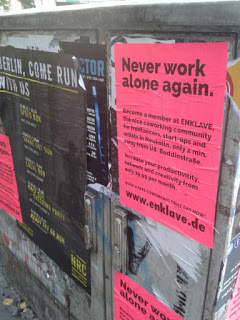
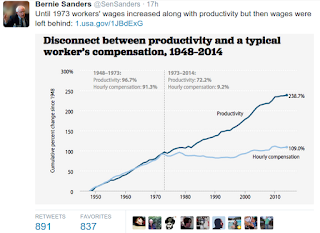
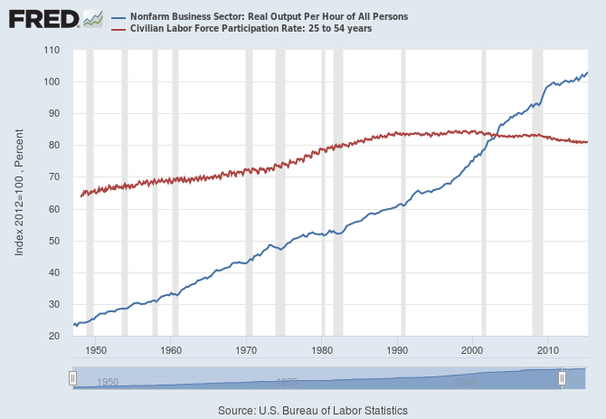

# Week 36

At nearly 4 million words, the U.S. tax law is so thick and
complicated that businesses and individuals spend more than 6 billion
hours a year complying with filing requirements, according to a report
Wednesday by an independent government watchdog. That's the equivalent
of 3 million people working full-time, year-round.  Someone printed
the entire tax code once (I believe it is R. Paul in that picture),

Look at the size of that thing. This is insanity, right? 

---

This is an image of a street in the Syrian city Homs before and after the war:

Wikipedia: "Homs is one of many cities in Syria where large
anti-government demonstrations have been held, part of the wider
Syrian civil war. It has been referred to as the "Capital of the
revolution." Thousands to tens of thousands gathered in the city's
main square on 17–18 April 2011 in a sit-in protesting the government
of current president Bashar al-Assad. At least 62 people were killed
by government security forces in armed clashes against local
anti-government militants".

Then one thing led to another, and the second picture above is the
final result.. The question is, is this a normal response befitting an
anti-government demonstration? Actually the reason of the
disproportionate blowback is clear: a minority sect was in power in
Syria who were scared of losing that power. Two-party-with-quotes
approach would have had two parties comprised of  70% Sunnis, 20%
Alewites, 10% Christians, so when one of them regularly gets the fuck
out (a great thing) noone is scared. Minorities are courted, everyone
has a say one way or the other. A small sect in power, be it a
minority as in Syria, or religious fanatics as in Iran, or nationalist
/ jingoists as in Russia is unacceptable.

---

Two words, said Gurley: “Anxiety relief. Humans love it when you
remove [anxiety].”

“When [Uber CEO] Travis [Kalanick] started Uber, he insisted there not
be a [option for a tip built into the app]. He didn’t want the user
experience to include this anxious moment of, ‘What should [the tip]
be?'”

---

Saw this yesterday. 3W economy does not require people go to work -
the work comes to us. New age collaboration doesn't have to be in
perfect sync either, it can happen over intermittent lines, and tools,
through people who are whereever.

Co-working spaces are popping up all over the place, there is one on
the street I live on. Amazon has Pop-up Lofts in NY, London, Berlin,
where anyone can work, and get cloud service support from their tech
people if necessary.

---

---

A Sanders tweet percolated up to my feed,

Just for kicks I did labor force participation and productivity through FRED,

---
