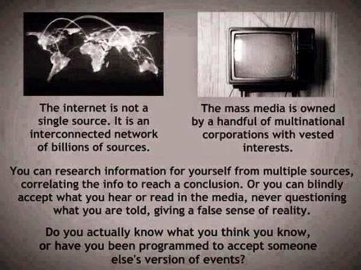
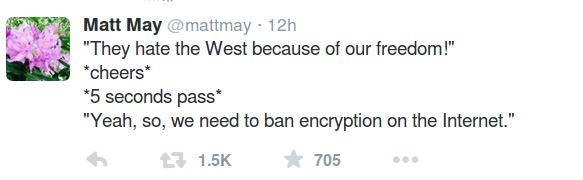

# Week 4

Russ Roberts

[Paraphrasing, in interview with T. Piketty] You complain about
inequality but the economy, "the pie" is so much bigger now, and there
are more ppl, that is why the top is getting more of the share (it
seems) bcz of that bigger pie [..]

Errr

They kept going back and forth on this, Roberts kept saying "more
people, bigger pie", and Piketty kept saying "we cant have the amount
of inequality we have right now".

What Roberts actually meant with his comments was this; "yes the
median income might have fallen down, but the economy is feeding so
many more people", i.e. "the economy became bigger, but the population
increased much faster, so everyone's share is smaller". Then I
thought, I cant believe Roberts said this, he made basically a commie
argument. His position is "person X, dont you worry, you are making
less, but in total, the economy is feeding so many more like you now,
you should feel better about that".

But.. why should that person care, especially in an economy centered
around individual? Should person X get get that warm and fuzzy feeling
that there are many others who are in the same position? It's
ludicrous. Especially coming from a "market-oriented" liberterian like
Roberts. Less money in the hands of the "many" means less spending to
go around.

Few solutions to this problem (there is one, I hope everyone
agrees). 1) New e-currency, like Bitcoin [1], can be developed that
allows personal mining that'll last indefinitely; everyone "makes"
their own money. At certain intervals the system can even start a
"taxing round" which shifts money from rich to the poor. Government,
if it wants, can be involved to identify who the real people in the
system are, so the system (its users) can direct it to real people (or
invdividuals themselves keep track of this).

Alternatively the system can have a built-in mechanism that reverses the exponential effect of wealth, money held by small holders is multiplied by a certain constant to bridge the gap between insanely rich and poor. 

Or, basic income must be considered.

BTW, I see some criticism (a notable one from America) on basic income
on the grounds that;

It’s tremendously important for people to work not just because that’s
how they get their money, but also because it’s one of the principal
ways they get many other important things: self-worth [..] engagement
[..]  Nice words, but the authors of this passage must be careful,
because the culture code for work in America is WHO YOU ARE. People
derive an identity from work, which is a completely different issue
than the one we are discussing here.

Codes came below intellect (and stronger), even when ppl think they
are thinking rationally, this stuff can sneak in and distort
things... So watch out.

---

Maybe the lowest hanging fruit is the implementation of
instantenous conversion from bank accounts to Bitcoin and vica versa;
because electronic payments need to come into play somehow, status quo
is a major pain in the ass. Credit cars are not secure, there are
limits to ATM card payments, and banks are not always open. I need to
be able to point to a QR code and be able to pay, from my bank account
instantenously.

---

Bill Donohue, Leader of the Catholic League

Stephane Charbonnier, the paper’s publisher, was killed today in the
slaughter. It is too bad that he didn’t understand the role he played
in his tragic death [..]  Had he not been so narcissistic, he may
still be alive.

So .. he had it coming? 

---

Times Higher Education

Dutch universities have vowed not to soften their groundbreaking
demands for publishers to permit all papers published by their
academics to be made open access for no extra charge [..]

Gerard Meijer, president of Radboud University and one of the lead
negotiators for the Dutch universities, said that in addition to
preserving access to their subscription journals, the universities
wanted publishers to permit all future articles whose corresponding
author has a Dutch affiliation to be published on an open access basis
for no extra charge. He said universities were also unwilling to
tolerate any more above-inflation price rises [..].

Professor Meijer insisted that Dutch universities were determined not
to bend.

“We are willing to pay publishers for the work they do, but Elsevier’s
profit margin is approaching 40 per cent, and universities have to do
the [editing] work and pay for it. We aren’t going to accept it any
longer. I think from the fact that Elsevier is not willing to move
much, they simply still don’t believe it. Well, they got us wrong,” he
said.

Go Dutch

---

A Tweet

No shit

---

Nature

[Paraphrasing] First new antibiotic in 30 years discovered, even
better, it is unlikely that bacteria will become resistant to it.

Awesome

Drug resistant superbugs, bad. New antibiotic that can kill them, good.

---

Comment

New educational technique tries to encourage in-class collaboration [..]

That's just one method out of many

Here's a Drucker post on how one learns. People who learn by by
talking, listening might benefit from in-class collaboration, others
such as readers, writers, doers might not. There are introverts,
extroverts. STPs, NTs, NFs. Also, collaboration might take many forms,
in-your-face-one-on-one-talk-your-ear-off kind, or offline, async
(post a question to Stack Exchange wait for answer, async). Which one?

---

Angry Math Blog

[Paraphrasing] Displeased with Udacity statistics class (taught by S. Thrun) 

Goal #1: Quality

S. Thrun might be a good teacher for self-driving cars, but apparently
not for statistics. Goal of online learning should be connecting rock
star teacher with students (For statistics that teacher is Joe
Blitzstein of Harvard).

---

Bill O'Reilly

With Hillary you get Bill. And Bill knows what’s going on.

HaHa

The ultimate compliment a politician can get must be getting kudos
from an earlier enemy. But I dont think even Bill is up-to-date with
today's issues. Even during his time the suspension of Glass-Seagall
law took place which was one of the key ingredients for 2008 financial
crisis. That was his mistake.

Watering down GS might not have caused the financial crisis, but
reportedly it made it worse.

Maybe Hillary is in better shape, but our pref is still Gore. INTJ,
hi-tech, environmentalist credentials are beyond doubt, bitchslapped
NSA at the right time.

---

Forbes

[Paraph] Glass-Seagall did not effect 2008 crisis at all.

Mmm

How did US banks end up with all these toxic assets then?

---

UK ex-spy chief

We have to monitor innocent people to ferret out terror

Do you? 

The recent attackers in Paris were known to French police. They'd been
in and out of jail, and I am sure similar pattern occurs a lot with
other attacks. And the pool of people who can pull off such an attack
cannot be that large. Why not monitor these people better instead of
following anyone and everyone?

Unless.. the security apparatus in all countries is using any and
every single event to justify their demand to get more access into
people's daily lives, even using bizarre unrelated events such as
N. Korea's hacking into Sony for US.

---

Link

[Paraphrasing] Bitcoin had some emotional highs, but beyond the ups
and downs, it is here to stay.

Great

---

Link

A senior judge has recommended the introduction of digital
technologies such as video and online filing to bring the criminal
courts into the 21st century [..]

In his recommendations, Leveson, president of the Queen’s Bench,
explained: "Rather than seeking to bolt procedures onto a system
initially designed for the 19th century (as has been the practice for
the last 50 years), I have tried to identify ways in which our current
procedures can be adapted to make the best use of the skills,
resources, IT and systems available.”

Leveson added that criminal justice system currently relies on a
combination of long-standing manual processes and aging computer
systems. He suggests that the courts need better, quicker and cheaper
ways of creating, filing and distributing documents, as well as more
flexible ways of communication.

No objections

---

Ernest Davis (following a link posted by Yann LeCun)

[Criticizing the book Superintelligence by Bostrom] assumption [is]
that intelligence is a potentially infinite quantity with a
well-defined, one-dimensional value. Bostrom writes differential
equations for intelligence, and characterizes their
solutions. Certainly, if you asked Bostrom about this, he would say
that this is a simplifying assumption made for the sake of making the
analysis concrete. The problem is, that if you look at the argument
carefully, it depends rather strongly on this idealization, and if you
loosen the idealization, important parts of the argument become
significantly weaker, such as Bostrom’s expectation that the progress
from human intelligence to superhuman intelligence will occur quickly.

Of course, there are quantities associated with intelligence that do
correspond to this description: The speed of processing, the size of
the brain, the size of memory of various kinds. But we do not know the
relation of these to intelligence in a qualitative sense. We do not
know the relation in brain size to intelligence across animals,
because we have no useful measure or even definition of intelligence
across animals. And these quantities certainly do not seem to be
particularly related to differences in intelligence between
people. Bostrom, quoting Eliezer Yudkowsky, points out that the
difference between Einstein and the village idiot is tiny as compared
to the difference between man and mouse; which is true and
important. But that in itself does not justify his conclusion that in
the development of AI’s it will take much longer to get from mouse to
man than from average man to Einstein. For one thing, we know less
about those cognitive processes that made Einstein exceptional, than
about the cognitive processes that are common to all people, because
they are much rarer. Bostrom claims that once you have a machine with
the intelligence of a man, you can get a superintelligence just by
making the thing faster and bigger. However, all that running faster
does is to save you time. If you have two machines A and B and B runs
ten times as fast as A, then A can do anything that B can do if you’re
willing to wait ten times as long.

Thumbs up

---

WSJ

Over the past decade, smartphones have radically changed many aspects
of our everyday lives, from banking to shopping to
entertainment. Medicine is next. With innovative digital technologies,
cloud computing and machine learning, the medicalized smartphone is
going to upend every aspect of health care. And the end result will be
that you, the patient, are about to take center stage for the first
time [..]

It isn’t just hospitals’ rooms that are on their way out; so are their
labs. Smartphone attachments will soon enable you to perform an array
of routine lab tests via your phone. Blood electrolytes; liver, kidney
and thyroid function [..]

Meanwhile, nearly all sophisticated medical imaging devices are being
miniaturized: Hand-held ultrasound devices are already available, and
some medical schools have begun issuing them in the place of the
old-school stethoscope. Hand-held MRI (magnetic resonance imaging)
machines aren’t far behind, and engineers at UCLA have come up with a
smartphone-sized device that can generate X-rays. It won’t be long
before you can take a smartphone X-ray selfie if you’re worried that
you might have broken a bone.

X-ray selfie!

Cool. 1 more ex of moving away from industrial era specialization to
general availability of software-driven services due to easy
tranmission and processing of knowledge.

I have to add though even in the previous era, most diagnosis could
have been performed through self-help manuals, easy-to-understand
decision trees prepared by the best in the field; with intermittent
lab tests (left to market forces to compete on) whose output could be
fed in to these self-diagnosis decisions.

This did not happen. The 2W system made a concious choice to offer
healthcare through this collection of "many", these average
specialists whose jobs would later turn into professions. But average
is average; as a result the system still cannot get a lot of the
basics right, and it cannot extend top quality to everyone. I was once
prescribed penicilin and it turned out I had an allergy to the shit.
With decision trees (now software), that would be the first question
to check: DO YOU HAVE A PENICILIN ALLERGY YES|NO? Go to lab have test
#23423 performed. Check the appropiate box.

This issue keeps coming up over and over again. Instead of propogating
the bland, the subpar, just so some people have "jobs", 3W will allow
access to the best, for everyone. Then everyone works for fun (like I
do now); and there is basic income. More productivity, more
happiness. Boom.

---

News

White House announced the government wants offer free Community College.

Obamapay

Bad idea.. Let's say you want to learn data science, in which Linear
Algebra is an important subject. MIT has video courses taught by
Gilbert Strang who happens to be one of the best teachers in the world
in this area. A student can simply watch his courses online.

Why would anyone go to a "free" community college to learn sub-par
linear algebra from some schmuck who can never have the grasp on the
subject as Strang does? Who thinks up this shit? I guess if you design
Obamacare, this is the next logical stupid idea.

---

There's also the annoying fact that individual mandate is
unconstitutional -I dont care what SC says, this is a body, after all,
who "elected" Dubya as president-.

---

Dean Baker

[T]he level of confusion in public discussions of the economy is truly
astounding. The people extolling the virtues of the economy today were
too blind to see the $8 trillion housing bubble that had been driving
the economy before the downturn. Most economic experts just say what
other economic experts say; they are not capable of independently
assessing the economy [..]

Public discourse on the economy seems unaware of some basic
facts. First and foremost, capitalist economies generally grow. It
makes no more sense to celebrate the fact that the economy is larger
in 2015 than in 2014 than it does to celebrate that your ten-year old
kid is taller than when she was five. Growth is the norm, the relevant
question is the rate of growth, and by this measure there is little to
be happy about.

Second, the stock market is not a measure of economic success. It is a
measure of how much wealth the people who own stock have. If the stock
market rises rapidly because the economy is growing, and profits and
stock prices are growing along with it, then this is further
confirmation of a strong economy. However if the stock market rises
because there has been a redistribution from wages to profits, as has
in fact been the case, this is hardly reason for the bulk of the
population, who hold little or no stock, to celebrate.    

A third point is that most workers are unlikely to see wage growth
until the labor market has far less unemployment than at present. If
the economy continues to add 240,000 jobs a month, we may be at this
point somewhere in 2016, but we aren’t there now and we will almost
certainly not be there any time in 2015. While the unemployment rate
has fallen most of the way back to its pre-recession level, this is
largely because millions of unemployed workers have dropped out of the
labor force and are no longer counted as unemployed. Contrary to what
is often claimed, this is not a story of aging baby boomers retiring.

Yes

The unemploy. numbers need to be reverse-engineered from employment
#'s; the ones government releases are unreliable.

---

Financial Times

[About Tony Judt] A former kibbutznik of the left who had served in
the Israel Defence Forces during the Six day war,  Judt had long since
repudiated both his Zionism and his Marxism. In the aftermath of 9/11,
in particular, no issue was more toxic in New York intellectual life
than Israel, none more inescapable for someone of Judt’s background
and temperament. He once told an interviewer of his “mischievous
disposition” and his fondness for sticking his head above the parapet;
but in this case there was his sense of moral obligation as well. His
writings made him for a time a hate figure for American Zionist
groups. His sin was to have pointed out that the burden of
responsibility rested with those with power, hence with Israelis more
than Palestinians, and with Washington politicians more than with
either.

He was not dewy-eyed about the Palestinian leadership, whose
shortcomings he recognised, but his real contempt was reserved for
Ariel Sharon, Benjamin Netanyahu and all those who were driving Israel
deeper and deeper into isolation. He was deeply concerned, too, about
the power of the pro-Israel lobby, and despaired of any enduring
solution in the Middle East so long as American foreign policy was
held hostage by it. In October 2003, a time when discussion of these
issues in the US was especially fraught, he got into trouble for
saying the two-state solution was finished; today it is hard to see
what the fuss was about, unless it was simply about silencing any
mainstream criticism of official Israeli policy.

Beyond its influence (or lack of it) on Israel, there was the broader
question of the changing role of the US in the world more
generally. Judt was not hostile to the idea of American power — he was
scathing and amusing about that form of French cultural anxiety that
often expressed itself as anti-Americanism — but he despaired of the
direction US foreign policy had taken under George W Bush:
unilateralist, hectoring, destructive of international institutions
that represented in his view the only chance, however limited, for
collective action among nations. In his book Postwar (2005), he
presented Europe as a less muscle-bound alternative, more concerned
about social equity and cohesion.

I like this guy

He is smart.. and I believe the technical term for such people
is.. "self-hating Jew". That's what Israeli rightwingers keep calling
them, right?

---

The Guardian

Given world events over the past decade or so, the most obvious
explanation [for C. Hebdo shooting] is also the most plausible: the
fate of Muslims in foreign conflicts played a role in radicalising
these young men.  Working-class Parisians don’t go to Yemen for
military training on a whim. Since their teens these young men have
been raised on a nightly diet of illegal wars, torture and civilian
massacres in the Gulf and the Middle East in which the victims have
usually been Muslim.

In a court deposition in 2007, Chérif Kouachi, the younger of the
brothers affiliated with al-Qaida who shot the journalists at Charlie
Hebdo, was explicit about this. “I got this idea when I saw the
injustices shown by television on what was going on over there. I am
speaking about the torture that the Americans have inflicted on the
Iraqis.” [..] These grievances are real even if attempts to square
them with the killers’ actions make your head hurt. France opposed the
Iraq war; Isis and al-Qaida have been sworn enemies and both have
massacred substantial numbers of Muslims. Not only is the morality
bankrupt, but the logic is warped.

It's a big mess all around

In a way this latest attack is a left-over from Bush era; these ppl
seem to have been pushed over the edge after Abu Gharib. At the same
time, crime is a crime. Fight against ISIS, their supporters,
symphatizers and the likes needs to go on unabated. This peasant shit
cannot become the norm.

---

News

85 richest people on the planet have the same wealth as the poorest
50% (3.5 billion people).

Damn

These numbers get more comical each time..Now we are comparing a
limited headcount to entire percentages.. Isnt that crazy?

---

News

A new computer algorithm can play one of the most popular variants of
poker essentially perfectly. Its creators say that it is virtually
“incapable of losing against any opponent in a fair game”. [This]
variant of poker, called heads-up limit hold’em (HULHE), can be
considered solved. The algorithm is described in a paper in Science.

The strategy the authors have computed is so close to perfect “as to
render pointless further work on this game”, says Eric Jackson, a
computer-poker researcher [..] As part of its developing strategy, the
computer learned to inject a certain dose of bluffing into its
plays. Although bluffing seems like a very human, psychological
element of the game, it is in fact part of game theory — and,
typically, of computer poker. “Bluffing falls out of the mathematics
of the game,” says Bowling, and you can calculate how often you should
bluff to obtain best results.

Of course, no poker algorithm can be mathematically guaranteed to win
every game, because the game involves a large element of chance based
on the hand you’re dealt. But Bowling and his colleagues have
demonstrated that their algorithm always wins in the long run.

---

News

Fox News issued an unusual on-air apology on Saturday night for having
allowed its anchors and guests to repeat the false claim that there
are Muslim-only “no-go zones” in European countries like England and
France that are not under the control of the state and are ruled
according to Shariah law.

Unfair and unbalanced

---

Link

[This is a link we shared before, about AI slavery in movie
Interstellar] In an episode of Star Trek The Next Generation titled
The Measure of a Man, the [..] android named Data [...] is ordered by
Star Fleet to report for reverse-engineering so that more androids may
be built. Data's legal advocate, captain Picard, is unsure how to
defend Data on legal grounds. Data is admittedly the direct product of
human invention [.. h]is rights are questionable at best.

It's just a show

This author is in the opposite end of the "singularity debate"; If an
AI is not a Terminator, it has to be a slave. He uses a Trek episode
to support his argument.

But TV shows are dramas, and have logical inconsistencies (yes, even
Trek has them). How appropiate is it to use them for debates like
this? For example, from other episodes in ST TNG we know Data
"chooses" to join Starfleet, he is apparently sentient enough for
that. But then just for the purposes of The Measure of a Man, the
backstory changes (or is ignored), just a little bit, so the show
starts as though Data is the property of Starfleet. This had to be
done otherwise the rest of the drama would not work.

In 80s soap operas, when the writers wanted to make drastic changes in
a show, they would have the main actor wake up in the beginning of,
like, season 3, and have him say "Oh man, I dreamt the whole thing!",
by which it was meant entire f..king season 2; So everything that
happened in that season could be written off and the writers could
start over. Trek isnt that bad, but there are still inconsistencies.

---

News

Google Glass sales discontinued

Good

GG designers needs to lose that black thingy in the upper-right side
of glass, it makes the wearer look like a contract killer sent from
22nd century to the present. And once the "other" person realizes that
the glass they are being watched through is Google Glass, they
immediately think "Google is watching me" (which is why the gadget has
been banned in some SF bars). A gadget like this must look exactly
like a glass, otherwise, the scheme does not work. Now this maybe
impossible in terms of materials engineering, I dont know; but I am
telling you, this gadget has an image problem.

---

http://www.whitehouse.gov/sites/default/files/microsites/ostp/pcast-nitrd-report-2010.pdf

The algorithms that we use today for speech recognition, for natural
language translation, for chess playing, for logistics planning, have
evolved remarkably in the past decade. It’s difficult to quantify the
improvement, though, because it is as much in the realm of quality as
of execution time.

In the field of numerical algorithms, however, the improvement can be
quantified. Here is just one example, provided by Professor Martin
Grötschel of [KZZI] Berlin. Grötschel, an expert in optimization,
observes that a benchmark production planning model solved using
linear programming would have taken 82 years to solve in 1988, using
the computers and the linear programming algorithms of the
day. Fifteen years later – in 2003 – this same model could be solved
in roughly 1 minute, an improvement by a factor of roughly 43
million. Of this, a factor of roughly 1,000 was due to increased
processor speed, whereas a factor of roughly 43,000 was due to
improvements in algorithms!

Jeez

But how could that be? Innovation is dead (!)

---

News

[Another Uber PR f..k-up]

Tech is making deeper inroads into social life

Ordering stuff online and having them delivered to people's doorstep
is one thing; inserting yourself in the middle of much richer human
interaction is another. Transportation, offered by the people, for the
people is that kind of a "busier" and richer interaction IMO. Some of
the blame for the most recent PR fubar can be laid on the Uber's chief
executive, due to his particular "style", but mostly the issue is the
new business / social environment Uber finds itself in. AirBnb is
having similar experiences (social, legal, etc). This is good! Tech is
inserting itself more and more into social realm.

---

News

French cartoon magazine was targeted for publishing cartoons of
prophet Mohammad.

It is ironic

It's a known historical fact that Mohammed did not want his pictures,
likeness to be portrayed in any shape of form -- bcz he did not want
these images to be worshipped (his new "way" was about tearing down
idols u see). Now, in the mind of some, the absence of pictures are
becoming a source of worship and ironically becoming another form of
idol, then he becomes deity by omission, in a way like god, not
described, painted, represented in any shape of form. I dont think
this is what he had intended.

It should be fine to draw Mohammed now, in today's world no single
image can become "the truth" anyway, we are not living in modern
times, where single channel, single description, single explanation
ruled above all else. The preoccupation of some Muslims on such stupid
matters on the other hand, has a lot to do with the fact that they
still did not shake off their cultural tie to centralized,
concentrated Roman / Ottoman barbarism where the former's connection
to Catholic Church plagues it even today, and the latter (along with
the former) where meant for peasant population and meant to rule over
donkeys not people. This is the backdrop that organizations such as
ISIS find their adherents.

---

News

Cut off from the Internet, young Cubans have quietly linked thousands
of computers into a hidden network that stretches miles across Havana,
letting them chat with friends, play games and download hit movies in
a mini-replica of the online world that most can't access [..]

[They] have covertly engineered a partial solution by pooling funds to
create a private network of more than 9,000 computers with small,
inexpensive but powerful hidden Wi-Fi antennas and Ethernet cables
strung over streets and rooftops spanning the entire city.

All it takes is one satellite hook-up to punch through

.. then you are on the Internet. Another sign of the spread of tech
and how unstoppable it is. At the very least these people have a fast
way of communicating with eachother.

---

News

The actor tweeted a message to Tsipras that concluded with “Good luck”
in Greek. Alexis Tsipras responded “Thank you Dr. - See more at:
http://greece.greekreporter.com/2015/01/26/dr-house-congratulates-tsipras-for-greek-election-win/#sthash.GnWviCYe.dpuf
The actor [Hugh Laurie a.k.a Dr. House] tweeted a message to [newly
elected Greek leader] Tsipras that concluded with “Good luck” in
Greek. Alexis Tsipras responded "Thank you Dr."

Hah

This is very interesting; Our profiling shows Tsipras' type is Just Do
It Nike Man. The Achilles heel for these people (oh that's so Greek!)
is waiting for more and more and more information before doing
anything, and because of this waiting, in the negative, they lock-up,
unable to go one way or another. Their path of development is diving
right in, taking action without waiting for complete information. This
is not to say collecting information is bad in general / for others,
what we mean is that for these people the threshold seems to be so
high that causes them to go inert. Their battle is overcoming this.

Dr. House tweet is funny because it makes sense a JDINM type would
like a show like House; Dr. House is the ultimate diagnostician, he
knows a lot, is very smart, but there are always uncertainties, but
these never seem to be stop him. He pushes, he prods, sometimes he
takes action to reveal some tidbit of info that leads him to the
correct diagnosis.

Anyway; what does a Syriza election mean for Greeks and austerity? Who
knows... I remember a Nouriel "Dr. Doom" Roubini interview where he
said maybe Greeks should leave the Euro reinstating the Drachma,
weakening it so they can export and rebuild the country's
competitiveness. Maybe that's the way for them. (Roubini is called
Dr. Doom because he was one of the few predicting the 2008
crisis. Then later, when he was bullish on the economy at one point,
he said "maybe now they'll call me Dr. Boom". This guy... )

---

---

♫ ♬Wake up in the morning ♫
♬ take a money shower ♫
♬Ba-Bad Boy money (Uh-huh)
Martin and Will (That's right)♫
♬ My face good money, they should put me on the bill (C'mon)
Gettin with model chicks ♫
♬ throwin' minks on the toddlers (You know it)♫
♬ NASDAQ money ♫
♬ Dow Jones Combs (C'mon man)

---

Money and Honeys

“By partnering with Ingenico Group, worldwide leader in seamless
payment, Paymium reaches a new milestone in the development of
Bitcoin. We now allow any European merchant to simply accept payments
using the Bitcoin network without risk, since transactions collected
in bitcoins are immediately converted to Euros.”-Gonzague Grandval,
Paymium co-founder.

The partnership will now open up the ability to accept bitcoins for
Ingenico’s large merchant base. Europe has been one of the hottest
bitcoin markets but wide bitcoin adoption has been missing. This new
partnership will allow merchants all over Europe to accept bitcoin
without having to worry about the volatility or integrating new POS
system.

Merchants will now be able to enjoy the usual marketing bonus from
accepting bitcoin and the loyal customer base that follows. Other
benefits of accepting include lower transaction fees and no
chargebacks (and thus a huge reduction of fraud).

“We are very pleased to partner with Paymium to enrich our dedicated
Business Applications Marketplace”-Michel Léger, EVP Global Sales and
Marketing at Ingenico Group.“This allows us to bring more value to
merchants through our terminals, enabling them to offer their
customers a new consumer experience.”

Ingenico is one of the largest payment processors in Europe. The
company has installed over 2.2 million POS terminals and has processed
over 3.5 billion euros worth of merchant transactions. The company
also operates outside Europe, providing its services to over 120
countries.

---

Strogatz is one of the best teachers in the world on nonlinear
dynamics & chaos theory and he decided to "flip" his class. What is
flipping? Another class has the description,

Math 1241 will use an “inverted” (or flipped) format for class
instruction. The lecture material will be posted online in the form of
videos and text that will be watched and read at home. Given that you
will be expected to spend significant time outside of class with the
lecture material, there will be less homework assigned than in a
typical math course. Instead, much of the “homework” will be done in
class, where you will work on problems and projects in groups.  This
approach can scale too; Theoretically Strogatz isnt needed to flip his
lecture, others can flip his courses for him (his video lectures have
been on Youtube for some time). In beneficial to have Strogatz around
to answer questions obviously, but if enough knowledge-base builds
around a course, there'll be enough people / material to answer
questions. Certification: star teacher approves other teachers, who
can approve more, on it goes, and anyone in this chain can assign
fail/pass grades to anyone. Your pass grade can always carry your
distance to "the grandmaster"; "I have Strogatz-3 for nonlinear
dynamics, and Strang-2 for linear algebra" meaning the chain for this
class certification is 3 levels removed from the big honcho. With 6
hops you can reach a lot of people on the planet (which is very funny
because this happens to be the subject of another famous Strogatz
paper).

---

haha. I dont think Google is the new Microsoft, but the rest is
A+. And.. Microsoft itself does so many other things nowadays.. like
gaming. So maybe Microsoft is the new ... Atari? Hey, why stop at 90s,
we could go back to 80s!.

"The 90s are back. They’re back in fashion, they’re back in music, and
they are most certainly back in technology. In a way this makes sense;
the top end of the Millennial generation was just entering high school
in the 90s, and now they’re into the workplace and armed with spending
power, so it’s easy to appeal directly to their nostalgia. Look,
here’s Salt-n-Pepa shilling for Geico!

But um, hey everybody: the 90s were a decade of excess and mistakes
and excessive mistakes. The rollicking good times of the 90s ended
with the dot-com collapse of the early 2000s, the memories of which
continue to shape the industry today [..]

Just think about it for a minute. Of course Facebook is the new
AOL. Facebook is the beginning and the end of the internet for a huge
number of normal people, a combination of primary service provider
(user profiles, messaging, photo sharing) and 90s-style portal to the
wider web. Facebook has its own IM platform, Messenger, just like AOL
had AOL Instant Messenger. Then it went and bought WhatsApp, the
messaging platform more popular internationally, just like AOL bought
ICQ [..]

And Facebook's core business of selling ads into the News Feed is the
same combination of incredibly vulnerable and apocalypse-proof as
AOL's dial-up business: it will continue minting money for as long as
the parents and grandparents of the world start their day with
Facebook, and it will stop growing the second all of their kids move
on to something better [..]

Apple is the new Sony [..]

Qualcomm is the new Intel [..]"

---

---
