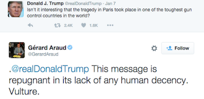

# Week 44

After more than a week of local and international condemnation, Prime
Minister Benjamin Netanyahu of Israel issued a statement on Friday
retracting his accusation that it was a Palestinian cleric who gave
Hitler the idea of annihilating Europe’s Jews during World War II.

That wasn't too hard now was it?

Dumb-ass.

---

Gun nut

Gun ownership is like owning a car; We need cars, but once in a while
you might run into someone and kill them. Do we ban cars because of a
few accidents?

Ha ha

Good one. But I believe the analogy is incorrect. A better analogy
would be owning a tank, not a car. This owner (of the friggin tank)
insists on driving it on a regular road with "normal" cars and
passengers. The tank might come in handy of course, say, while a
person is out of his home someone quickly built a wall around it (hey
things happen), and when dude comes back, he can't get into his own
home. A travesty. But since he owns a tank, he can roll right through
the wall - with his friggin tank. Or, maybe while on the road a car is
coming at you with intense speed with the intension of crashing in to
you; the tank owner can simply fire at this car, blowing it up from a
distance, before the impending crash.

Then, continuing with the analogy, what the rest of the populace is
simply asking is "does anyone truly need a friggin tank to get to
point A from point B"? Because as a side effect of driving a tank on
the regular road with normal cars and passengers, the tank runs over
cars, people, more often than usual because some being scared like a
little bitch, they insist a regular car will not protect them, they
need a friggin tank.

---

With every new piece of information that has come to light about the
perpetrators of the Paris attacks, it has become clearer that the
intelligence services in France and Belgium knew about their jihadi
backgrounds. Several had dossiers identifying them as radicals. At
least five had travelled to fight in Syria and returned to homes in
France or Belgium.

There

---

Link

The director of the CIA has criticised “hand-wringing” over the role
of spy agencies in hunting terrorists and called for legal constraints
on surveillance to be reviewed in the wake of last week’s Paris
attacks.

See above

The agencies have everything they need to stop attacks.. and they
don't have to wait until the day-of to take care of business u know
what I mean?

If by surveillance, dude means bulk collection of data without
warrant, that's a no go. Yes agency employees have a lot of fun with
that kind of system by passing around intercepted naked pictures of
regular people amongst themselves while having a gas at their expense,
but I don't think it is serving the public in any other (!) meaningful
way.

---

Glenn Greenwald

[B]laming technology companies [for efforts that make "surveillance"
"harder"] is a tactic to shift the blame away from government
shortcomings.

Exactly

---

But since the Renaissance at least, many of our most fundamental
assumptions about power, citizenship, responsibility, political
violence, empire, luxury, beauty, and even humour, have been formed,
and tested, in dialogue with the Romans and their writing.

Partly true 

---

Ian Morris  

Historians normally trace the roots of the rebirth back to the twelfth
century, when northern Italy’s cities [..] began wondering how to
govern themselves as independent republics, and increasingly concluded
that they could find answers in classical Roman literature. By the
fourteenth century, when climate change, famine, and disease
undermined so many old certainties, some intellectuals expanded their
interpretation of the ancient classics into a general vision of social
rebirth.

Antiquity, these scholars started claiming, was a foreign
country. Ancient Rome had been a land of extraordinary wisdom and
virtue, but barbarous “Middle Ages” had intervened between then and
modern times, corrupting everything. The only way forward for Italy’s
newly freed city-states, intellectuals suggested, was by looking
backward: they must build a bridge to the past so that the wisdom of
the ancients could be born again and humanity perfected.

Scholarship and art would be the bridge. By scouring monasteries for
lost manuscripts and learning Latin as thoroughly as the Romans
themselves, scholars could think as the Romans had thought and speak
as they had spoken; whereupon true humanists (as the born-again called
themselves) would recapture the wisdom of the ancients. Similarly, by
poking around Roman ruins, architects could learn to re-create the
physical world of antiquity, building churches and palaces that would
shape lives of the highest virtue. Painters and musicians, who had no
Roman relics to study, made their best guesses about ancient models,
and rulers, eager to be seen to be perfecting the world, hired
humanists as advisers, commissioned artists to immortalize them, and
collected Roman antiquities.

The odd thing about the Renaissance was that this apparently
reactionary struggle to re-create antiquity in fact produced a wildly
untraditional culture of invention and open-ended inquiry. There
certainly were conservative voices, banishing some of the more radical
thinkers (such as Machiavelli) to drain the bitter cup of exile and
intimidating others (such as Galileo) into silence, but they barely
blunted the thrust of new ideas.

The payoff was phenomenal. By linking every branch of scholarship,
art, and crafts to every other and evaluating them all in the light of
antiquity, “Renaissance men” such as Michelangelo revolutionized them
all at once. Some of these amazing characters, such as Leon Battista
Alberti, theorized as brilliantly as they created, and the greatest,
such as Leonardo da Vinci, excelled at everything from portraiture to
mathematics. Their creative minds moved effortlessly between studios
and the corridors of power, taking time off from theorizing to lead
armies, hold office, and advise rulers. (In addition to writing The
Prince, Machiavelli also penned the finest comedies of his age.)
Visitors and emigrants spread the new ideas from the Renaissance’s
epicenter at Florence as far as Portugal, Poland, and England, where
distinct local renaissances blossomed (Why The West Rules - For Now,
pg. 883).

That's better

So Renaissance thinkers thought they were "learning from" that era,
but they were actually creating something completely new. This is a
case of let's-go-back-to-the-thing-before-the-thing mentality (which
reminds me of this scene from Analyze This dunno why); whatever
historical situation these people were in (the thing before) had run
its course, so thinkers created this mythical place in their heads 
(the thing before the thing) and tried to "learn" from it. Except
there was nothing to learn from. Romans were barbarians, just like
Byzantium, Ottomans after them, or now, ISIS.

We can see the traces of this type of thinking in nationalists in
Russia, or Egypt, whenever people try to create a myth out of a block
of history and worship it.

"But isn't such delusion useful?" one might ask, it helped the
Renaissance after all. Maybe. But there is no rule that says every
Renaissance has to be the same, no?  I prefer the current crop of
thinkers in their respective lands pulling their heads out of their
respective ... sands and start thinking for themselves, for the right
reasons.

---

[After the Paris attack, some p]eople seem concerned to make sure that
Islam gets its full share of the blame, so we get the unedifying
circus of neocons invoking God as much as the killers. “Well, Isis say
they’re motivated by God.” Yes, and people who have sex with their
pets say they’re motivated by love, but most of us don’t really
believe them.

ROFL

---

News

Final Myanmar results show Aung San Suu Kyi's party won 77% of seats 

Not surprising

The results in immature democracies are always like this - it's either
90% for the dictators, or 70-80% for the first genuine party.  TR has
been through this many years ago. I wish Myanmar luck.

Question

How can parties-with-quotas system be implemented?

An idea..

The existing parliamentary systems around the world are a middle
ground between the wants of a party and the wants of the electorate,
at regional level. Internal party politics decides on candidates who
are both 1) compatible with their  party politics, and 2) have a
chance to win at a certain region. As far as mass politics is
concerned, this is not such a bad system.

Before our final destination direct democracy, though, if we want a
system that is still elite-oriented, has stability, representative and
will work everywhere (areas that are unstable, have long-running
ethnic, religious divisions) we can simply swap the idea of region
with the idea of "declared identity".

First, an electronic registry is built that allows citizens to declare
their political identity. Someone might chose that identity to be gay,
someone else liberal, someone else conservative, or Shite,
atheist. Then, let's say 6 months before an election, a snapshot of
the existing identity allocations are tallied up - i.e. 30%
conservative, 30% liberal, etc..

There are only two parties. For a parliament of, i.e. 300 members,
each party appoints candidates internally according to the
allocations; 30% of 300 = 90 liberal candidates, same for liberal, 90
ppl, then maybe 10 gay, etc, from each party. Parties also assign a
rank to each candidate within each identity group.

Primaries: each party holds "identity group primaries" where every
identity group can downvote any candidate put forth by either
party. Let's say even 20% of nays would be enough to knock out any
candidate from any party's list. This way only genuine representative
for each identity blocks are represented in each party.

During the election day the voters would naturally try to strike a
balance between the candidates they see from each party that fits
their identity best, and also try to judge the greater party's
merits. So they cast their vote - party A or party B.

After the election, all votes are counted, say 60% for party A, 40%
for party B. Then top 60% of 90 liberal candidates, of 90 conservative
candidates, etc. go to the parliament from party A.  40% of each
allocation goes to parliament from party B.

This way the make-up of the parliament reflects the identity
allocations exactly. Both within each party, and in the entire
parliament overall.

People would have a strong incentive to declare their identity
correctly, since the allocations would effect the make-up of each
party, as well as the parliament.

The word "registry" might irk some, maybe ppl would not like the
government to know they are gay, or Shite, or atheist, whatever. These
are implementation details - allocation records could be based on
pseudoanonymous identifiers, which can somehow be tied to an
individual through an encryption mechanism, that allows the election
commitee to ensure everyone votes only once, and the person voting is
elligable, but the government cannot tie an individual to an identity
directly... There are ways to implement this. 

---

Comment

Success is so important. 

To whom? 

I'd suggest everyone who likes to give such wide-ranging self-help
suggestions to filter it through their personal make-up first. I was
reading an interview with the famous actor Ethan Hawke once; he was
asked about success, he was irked by the question because he cared so
little about it, at least about the way it is traditionally
defined. So I profiled the man, turns out Hawke is an High Horse
. Same type as Putin :) albeit Hawke is more in the positive.

We covered this type before: Their life journey is about seeing the
equality in men, experimenting with unorthodox ideas. Others in this
group are Elon Musk, Thomas Friedman, Marc Andreessen, to name a
few. In the negative they want to be at the center stage, all the
time, with morons clapping all around them, for all they do,  they
want to bask in this glory, bathe in this shit. What they need to do
however is support others to gain their success. Hawke for example,
seems to have formed a symbiotic relationship with a director Richard
Linklater (very good, less me, more us) and together they've done some
freaky-ass unorthodox movies, even one, Boyhood, that many years to
complete, showing its actors age inside the movie! I bet Hawke loved
that, that is a HH being in the positive. Big time.

Andressen is the best example of supporting others - his investment
firm AFAIK takes great care to coach, nurture the start-ups they take
under their wing.

Of course, the positives take a while to develop since they revolve
around the weakest parts of a man's psyche; for example Leave the
Child Behind types must take responsibility, manage things better, but
the "positive negative" of this type is becoming controlling intead of
managing. For HH, they need to deal with unorthodox ideas, but things
can get superfreaky, or freaky for the sake of being freaky to the
point it becomes mindless, inane non-sense. But they will, as each
type does, get feedback from others on that stuff immediately.

---

---

"If the zombie horror genre teaches us anything, it is never to
celebrate too soon. Beware the hubris of a character who walks from
the graveyard victorious, failing to anticipate an undead hand pushing
up through the soil. And so it was with defeat of the Cyber
Intelligence Sharing and Protection Act, or CISPA — a surveillance
bill introduced under the pretext of cybersecurity, which died in the
Senate in 2012. [..]Last week the Republican-controlled Senate passed
CISA by a vote of 74-21. CISPA had failed in a Democratic
Senate. [..]Like CISPA, CISA claims to protect against cyberattacks by
enhancing information sharing between private corporations and federal
government agencies. CISA supposedly protects individuals’ privacy
more than CISPA would have, because the data sharing goes via the
Department of Homeland Security, not directly to the National Security
Agency. But it is not remotely clear that DHS will scrub private
information before sharing data with other agencies, or even that it
would have time to do so — near-real-time sharing with the NSA is
written into the legislation. DHS itself admitted that CISA can’t and
won’t protect user privacy"

[[-]](https://theintercept.com/2015/11/03/lesson-of-cisa-success-or-how-to-fight-a-zombie/)

---

Araud is the Ambassador of France to the United States BTW.

---

At best the gov might have, in part, thought up this internment
business in order to protect Japanese Americans from potential hate
attacks... but imprisonment is imprisonment. It sucks. The society
would have managed without it, and be better for it at the end.

"On Wednesday, David Bowers, the mayor of Roanoke, VA., piled onto the
backlash against Syrian refugees led by state governors, in the wake
of last week's terrorist attacks in Paris that killed 129
people. Mayor Bowers requested that all local agencies "suspend and
delay any further Syrian refugee assistance until these serious
hostilities and atrocities end...and normalcy is restored." Then he
attempted to draw this historical parallel:

"I'm reminded that President Franklin D. Roosevelt felt compelled to
sequester Japanese foreign nationals after the bombing of Pearl
Harbor, and it appears that the threat of harm to America from ISIS is
just as real and serious as that from our enemies then".

Within hours, Bowers's statement drew fierce criticism [..] And then
actor and social media sensation George Takei weighed in. The Star
Trek cast member has long been outspoken about his family's history
inside American-held Japanese internment camps, a story chronicled in
his Broadway musical, Allegiance.

From Takei [..]: "

Mayor Bowers, there are a few key points of history you seem to have
missed:

1) The internment (not a "sequester") was not of Japanese "foreign
nationals," but of Japanese Americans, two-thirds of whom were U.S.  
citizens. I was one of them, and my family and I spent 4 years in
prison camps because we happened to look like the people who bombed
Pearl Harbor. It is my life’s mission to never let such a thing happen
again in America.

2) There never was any proven incident of espionage or sabotage from
the suspected "enemies" then, just as there has been no act of
terrorism from any of the 1,854 Syrian refugees the US already has
accepted. We were judged based on who we looked like, and that is
about as un-American as it gets.

3) If you are attempting to compare the actual threat of harm from the
120,000 of us who were interned then to the Syrian situation now, the
simple answer is this: There was no threat. We loved America. We were
decent, honest, hard-working folks. Tens of thousands of lives were
ruined, over nothing.

Mayor Bowers, one of the reasons I am telling our story on Broadway
eight times a week in Allegiance is because of people like you. You
who hold a position of authority and power, but you demonstrably have
failed to learn the most basic of American civics or history
lessons. So Mayor Bowers, I am officially inviting you to come see our
show, as my personal guest. Perhaps you, too, will come away with more
compassion and understanding.

-- George Takei""

---

Since 1973 no change eh? Very interesting that year: 1973. 

BTW the title of the book is a jab utilizing Popper's falsifiability
dictum, according to Woit SS theory does not propose anything
falsifiable therefore is  dubious in terms of science.

Changing the model to go to whatever direction that makes it prettier
and better fit - this is an odd form of theoretical overfitting it
seems to me; overfitting is well known in statistics, you keep adding
more knobs, more flexibility to the model until it "explains" the data
perfectly, but it's ability to predict suffers as a result.

[[-]](../../2015/11/not-even-wrong-woit.html)

---
